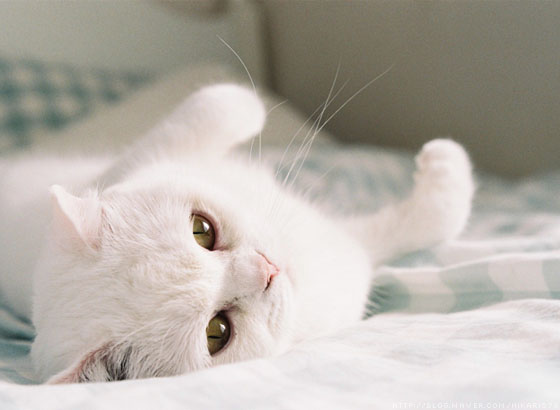
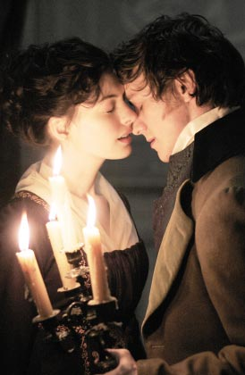
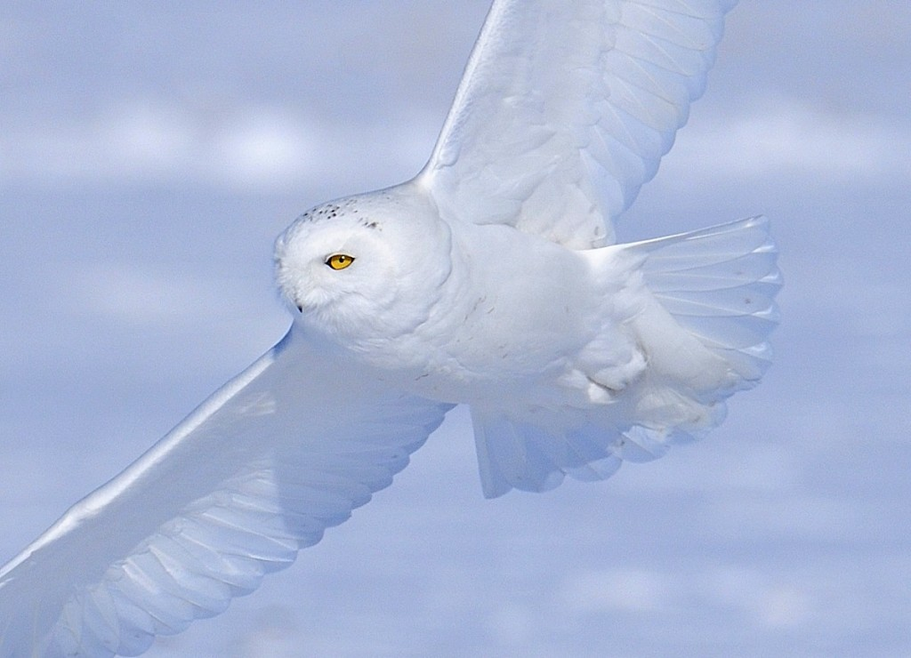

# 后现代的白雪公主

**有时候，我想我可以再肥胖一些，我可以再丑陋一些，我可以再蛮横无理一些，我可以再自取其辱一些。在这个暂时我剥离不出的男权世界里，绝不做白雪公主，绝不等待救赎和重生，那些不过是编排好的阴谋，千百年男人们统治世界的窃窃私语。**

### 

### 

# 后现代的白雪公主

### 

## 文 / 周小天（北京大学）

### 

### 

“她的出发点是，她有一种内心的伤痛，但只是承认它的存在是不够的，她必须做点什么才能改变它。”

——奥尔多·西泽丁

### 

今日我们迫于某种压力而不得不谈论一种诡异的权力，一种我们在出生时便被剥夺的权力，一种在进化论角度宣告我们退出种群基因库的权力，一种不能通过努力换来的权力。 一种成为女人的权力。获得它的条件是，远在我们出生之前已经被盖棺定论的女人的模样：漂亮的，温柔的。 有许许多多人说我们太斤斤计较了，他们从没这样感觉到，那是因为，这是一种微观权力，在人群中“当你别扭的时候”，就是它在运作之时。而此时你毫无办法，因为它没有声音没有影像没有一丝一毫存在的证据，它是经常撞上却不可谈论的。 根据流行的记忆理论，它，有些感觉，记在你的细胞里，就算你已忘却，就算你的大脑已死机，它还在啮咬着你的能力。 

### 

**一、因为，关于温柔，我们不是天生的表演者。** 我们不能扮演任何一种性别。为什么有一个电影叫《成为简·奥斯丁》，为什么她成为简·奥斯丁就要规规矩矩回到乡下，告别私奔的辉煌，守着小阁楼、父母、教堂和几头圈养的猪，为什么她不是她而要成为她？难道，当且仅当她符合男性社会对“简·奥斯丁”的想象时，她才是她？ 

### 

### 

### 

多么智慧的我们，人类，发明了符号，我们在符号里长大，符号是我们认路的一种方式，于是噩梦开始了。 童年时，有一天，我们都发现，母亲的榜样作用失去了，叛逆开始了，无形象吸纳也开始了。于是生活中，表演开始了。符号，男性权力世界智慧的风向标，勒在我们每一寸肌骨上。 建构女权主义者多萝根的调查显示，女性在15岁后会性别掩饰，而20岁后则会出现大比例的装傻的行为。哦，他们说，在这个世界里，一个女人是不可以太聪明的。 在他们/你们的微观权力弥散的空气里，每个赤诚的、不会表演的女人都没有好下场的。 公平吗？ 而公平和公正不是一个概念，公正是对进化规则的精深的了解和维护，而公平则同时需要估计“正常型”和突变型的逻辑。 好吧，我在叫嚣着公平，但其实我有私心的，作为个注定在男性权力世界里没有好下场的人，我要反抗。但我凭什么这么要求你们呢？ 科索沃贫民遭到屠杀与欧洲人有什么关系？南非饥渴而死的儿童和常春藤联盟的学生有什么关系？世界上超过1/2遭到男性世界歧视与污蔑的女人没见过阳光与你有什么关系？ 疲惫的好莱坞，扭伤脚踝的蓬皮杜，拉伤肚皮的宝莱坞，我们不会表演，我们不愿表演，我们不知道我们为什么要在男性权力世界里表演成为他们想象中的女人，于是连人道主义都嫌弃我们。 

### 

### 

嫌弃我们，有些真诚，有些宿命，有些值钱。 

### 

**二、因为，对于漂亮，我们天生大声说“不”。** 一颗硕大的冰河世纪松果，悬浮在每次午夜梦回，我们不要当那只松鼠，在这种永不消退的炎寒里，饿饿肚子又何妨？ 话说伟大的中国共产党废止了裹小脚的习俗，但小脚还是在裹着，还有各种各样的美体纤体健体，各种各样的手术秘笈小贴士。我眼见着重工业时代呼啸而过，抚着遇罗克《出身论》难眠的夜晚，捧着徐迟《哥德巴赫猜想》明媚的下午，忽然换成了广告与商业爆炒的肢体。新的商业时代，肢解着焦虑感，而当一个原本就不好说的感觉再被细分时，它会变得更加不可判断真伪。于是，在广告与媒体的悉心照料下，一个个女人会误以为，自己焦虑的是失去美，失去社交、失去爱、失去机会、失去进化，总之失去好多好多原来有没有还不一定的东西。 针对自身的欲望，如何表达自我呢？谁说残害自己的身体是美？ 什么是悦己？悦己的时候悦的真的是自己吗？还是沦入了男性世界精心设计的可怖控制？ 在这场控制，始作俑者是第一个为女人提供猛犸肉的男人，它的帮凶是古往今来许许多多的有食物男人和吃到食物的女人，当然，你，此刻的读者，八成，包括你。 我们已经呼喊良久，在这场妹妹杀死姐姐的游戏中，如何避免被物化、被贴标签，避免“被看”，如何避免别人把恐惧加诸我们，还有如何喝退基因的本能？从这场自我“心甘情愿”落入的可怖控制中剥离出来。 我用的是剥离，组织剥离，眼科剪一抖，视野一片猩红。这是我们真正的焦虑。 传说，性解放给了女人说“不”的自由。此刻，我保证，这不是传言，而是事实，让女人在基因层面摆脱男性的牢笼；但它太过鲜血淋漓，以至于向来反对两害相权择其轻的我们，同意但绝不推荐。 

#### 

#### 

此刻，我无可奈何的发现，只要世界有一双男性的眼睛，这场妹妹杀死姐姐的游戏就不会结束。我们不要各做退让，我们只能要价值观的彻底颠覆。 是的，我就在说，漂亮是一个大谎言。而我们在这个谎言里吃着不同的苦。听信这个谎言的，和反抗这个谎言的，都在吃着苦。既得利益的男人女人鄙视我们吧，快点！你们不知道，我们吃了多少亏；可是不能数，一数便显得我们小肚鸡肠自作多情斤斤计较锱铢必较睚眦必报， 我们喊着“不”出生，从幼儿园阿姨到面试官，从邻居叔叔到法官，我们只是一团灰蒙蒙的影子，连一碗面牛肉都会比有些人少几块，连摔倒了都没有人扶，连梦都不能做，连影子都不愿意做我们的影子。我们，丑陋的女人，肥胖的女人，臃肿的女人，畸形的女人，我们。 

### 

**三、结语** 我看到这个世界，是一个热闹的宗教仪式的扩大化，它的神灵是许许多多男人，莫名其妙的男人，不明所以的男人。所谓“帝王恣睢，众人不齿而乐谈”，就是这样的男人。 而女人，莫名其妙的，不明所以的，经历一个漫长痛苦的成人自虐仪式，把自己表演成修饰成待价而沽的后现代白雪公主。 为什么？ 有时候，我想我可以再肥胖一些，我可以再丑陋一些，我可以再蛮横无理一些，我可以再自取其辱一些。在这个暂时我剥离不出的男权世界里，绝不做白雪公主，绝不等待救赎和重生，那些不过是编排好的阴谋，千百年男人们统治世界的窃窃私语。 

### 

“凡是不经我们努力得来的，我们一概都不要。”

——遇罗克

#### 

他因此罹难。我们，注定没有好下场的我们，早背过《陈涉世家》，“等死，死国可乎？” 我有丑陋的脸，肥胖的身，笨拙的动作，我是格林童话里脸上滴下毒液发出霉味的老太婆，可是，记好，我有一个国王的心和胃。 

### 

### 

（编辑：管思聪）

### 

### 
