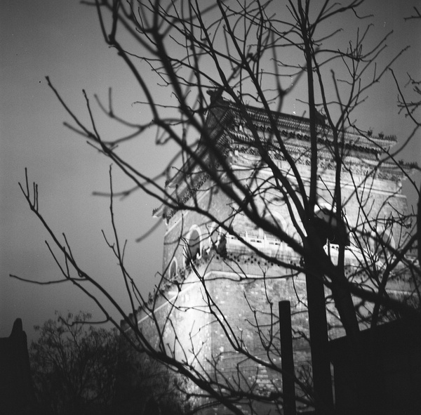
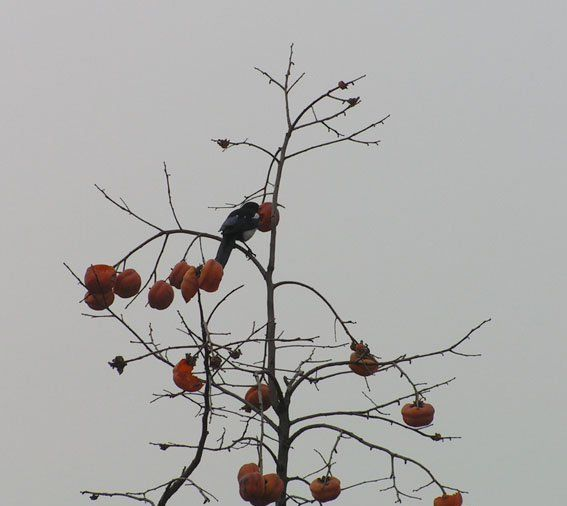
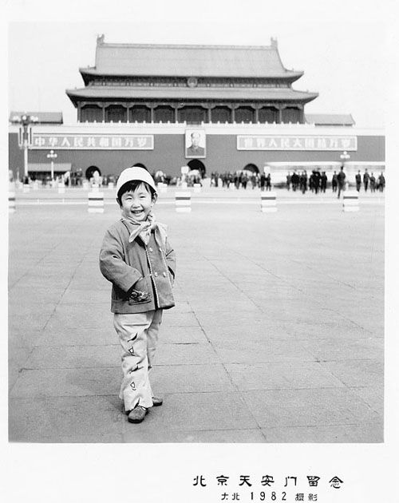

# 和青春有关的日子

**这个世上本有太多的不公平和不透明。唯一的区别是，那是否结结实实的砸在自己的脑袋上。我有很多身份——旁观者，见证者，发生者，受害者，施虐者。有些人会为类似的故事发声，有人的故事不够有趣，也有的故事会上演罗生门，所以我们的真实都是故事。被社会淡忘和不值一晒的故事。所以石头说，我不急于了解你，或许有天你的过去会给我小惊喜。**

### 

### 

# 和青春有关的日子

### 

## 文 / 苏荣坤（Academy of Art University）

### 

### 

郁冬唱过一首《北京的冬天》，每当听见这样的民谣总是会牵唤出好多的回忆，那些真实所见和臆造的想象，都是关于一个时代的质感。很难去进行描述是怎样的触觉，从什刹海的结冰的湖面，还是东四十条灰色僵冷的建筑中有那么一抹孤郁的朱红。北风哗哗的刮过，天寒地冻，空气没有水分，呼出的鼻息白扑扑的散了，望着干脆光秃的枝桠，嘴唇干燥像被腌制过而缺失水分。 

### 

### 

每每人们总是喟叹好时光的早逝，俄罗斯的白银时代只能通过后世的文本解读进行招魂，法国自五月风暴后，在地铁上炫耀性阅读福柯书籍的年轻人也垂垂暮矣。红棉木吉他，军绿棉袄，棕色绒面的耳罩，地下室用铝锅煮的烂熟大白菜，还有朗声诵读的诗歌。我试图从这些细节中去还原八十年代的北京青年人，一个专属的布尔乔亚时代。 那时候郁冬留着长发，从清华退学。窦唯还很消瘦，没有发明那些意识流动的单字，画着很纯真的素描。刘索拉也没去过格林威治村，还不会即兴演奏室内乐。如今功成名就的中年出版人也执着的写着诗歌，像簇拥神灵般对大师致敬。他们精神丰硕充盈，扎堆的奔赴颐和园北漂群落。理想主义的熠熠光芒笼罩着那些穿喇叭裤卡其衣的年轻人。 北京冬天是个好荒凉的季节。在东棉花胡同里看见倚墙而靠的自行车，还有槐树上棱棱落落的霜枝，心下就忍不住伤感起来。好似所有罅隙被吹开，掩藏深处的秘密都被曝尸于广袤的荒原里四分五裂无所安身。 那个冬天我和胎胎住在民大里面的一个平房里，一居的房间有一半的空间都是摆放的书。三个橡木制的书架，前前后后都垒满书，并列在一起像个错综的阵法。居住的环境并不好，所幸有独立的厕所，虽然马桶没有盖，洗澡的时候在小小的厕所里总是冷的直打哆嗦。因为水汽潮湿，刷了石灰的水泥墙上总是容易起泡然后塌掉小一片的墙皮。旁边的邻居弄了一个藩篱，在小院子里悬挂着大大小小的风干的水葫芦。毗邻太近，墙体不隔音，他们总嫌我们午夜喧哗。 民大西门向左转，有一条小巷，我们常在那里吃重庆麻辣串。有家并不大的店面，是杨丽萍开的民族服饰店，我很是不厌其烦的进去看那些手工刺绣和色彩斑斓的扎染图案。尽管我负担不起标签上咤舌的数字。这样的街巷，充满了俗世的烟火气息，在纷杂的卷帘门塑料招牌间，还会有隐然发现的惊喜，如同生活的本质。 起床在冬天的早晨对于我而言显得额外艰难。那个十一月天空也是灰蒙的，我和胎胎却因为陪同某回京UCLA的教授一起去了清陵。那时我尚不知清陵居然这么远，居然到了河北的境地。早上还摸着乍起的天光起来，胎胎一直埋怨我出门前要折腾好久，怎好意思让人家教授在宾馆那里等人。那时候也真是年少，只觉得那样一个学术权威，需得卑微觐见。一路上都是长者，在饭局中我又好像被打回了孩童模样，与他们的成人圈毫无交集，维系着噤声不语的状态。胎胎倒是百无禁忌，张口就好多段子，不时还调侃一个好似葛优的男人和不吱声的我。 大抵是从那时开始对人的看法复杂了起来。矗于身前的神坛，偶像式的人物，也大多有不为人知的秘闻。我好似一下子从古希腊民主思想站立到诡辩论的一边。某主编某教授某才俊，在光鲜的背后，也少不得沾上必须缄默的阴影。成人世界，有太多的规则，不可言说却又彼此心知肚明。太多的身形都纷纷倒塌，幻灭般，等我再回首望去，早也没了执念。 那趟的清陵之行，云波诡谲，氛围极其暧昧。我只模糊记得在大片荒凉土地上，古老陵寝的神道上巨大的石雕被风雨侵蚀。旷达的山脉吹起酸漠的风，无声的注视演尽哀荣的人类。丘土旁边的荒地现在已经开垦成农田，一个满脸皱纹的老太太裹着藏青色头巾坐在靠路边的田里，摆了一小方柿子在面前叫卖。天气清寒，那些柿子橘澄澄的表面结了层霜。 

### 

### 

我在北京的时候皮肤总是很不好。想必是南方人，习惯了潮湿，无论用多少面膜或者精华，在北京冬天的干冷还是烈烈的焦晒里，都是如淮北枳。泡沫隔离都无法安抚摇摇欲坠的皮屑，那些沟壑像真印证了人世沧桑。我晓得那些爱都会随着生命消逝而逐渐死去，每一次新陈代谢，每一次的微小惊动。我不想死。 有某些夏日是鲜翠辛辣的。在清华园，畅春园，有好几次在破晓的时候被人骑着单车载过。那像是电影胶片里的场景，路边的早点摊刚出来，弄出了第一批煎饼果子，热腾腾的冒着香味。十八英里这是一家北大旁KTV的名字，一个通宵唱下来早已筋疲力尽。青灰色的天，在路上就变了脸。远古的太阳照下来，行道树静谧无声的在吞吐采纳。好像我们唱了一宿是为了第一缕阳光撒在脸上。为了迎接一场重生。 我有过那么一阵让文艺青年都会艳羡的日子。和CC在五道口Propaganda舞池里面乱舞，和莲子打扮成大蜜儿范儿去海淀公园还有新豪运看各种乐队live，去二手家具市场淘沙发床然后坐在卡车的后面一路唱着歌回家。中戏的黑匣子剧场，工体的酒吧，北大的百年讲堂，大山子的798，央美的美术馆，广院的西街，还有很多因为没钱吃饭而去蹭的饭局，许多在午夜里泛着脏脏的路灯不知名的马路牙子。 在北京的记忆占用了我青春期的很大部分的躁动。这个城市里没有我的过去，所有的一切都是崭新的，一无所有并且肆无忌惮。我在最暴烈最柔软的年月里，遇见过各色的人，他们真诚，传奇，不靠谱，热血，世故，虚伪，善良，颓靡，不知所措。我也曾很认真自以为是的谈过几场恋爱，也虚与委蛇应付过脸面上需要打交道的人们。 在早先的时光里，我太忙着使劲，每一根血管和神经都涌动着荷尔蒙。忙着在理想和现实的对抗中来不及去辩驳和申诉，我没有着一点的笔墨去说那些人潮来来往往，是怎样一个饱和度浓重的故事。一度想发愿在二十岁的时候，我可以去写关于个体城市记忆，和文化脉络的故事。但那些人儿都消逝的太早，轻飘飘的在空中打了个转，发出几不可闻的声音就再也没有任何交集。 

### 

### 

我一直都在。当和你们交恶，当和你们爱恋，当和你们一起鼓劲合作，但你们都消失不见的时候。于是我想选择噤声不言。晚年的宋美龄拒绝写任何个人传记，张学良，蒋介石，她的姐妹亲属都依次离她而去。她只是作为一个历史的存在，背负着沉重的记忆孤独的活着。在这后来，我觉得这些情感的碰撞，和自身下意识的反应是多么的不足为道。它们应该像一种味道，甜的，涩的，滑过味蕾之后就吞咽了进去。我们只能无条件选择接受和消化。 这个世上本有太多的不公平和不透明。唯一的区别是，那是否结结实实的砸在自己的脑袋上。我有很多身份——旁观者，见证者，发生者，受害者，施虐者。有些人会为类似的故事发声，有人的故事不够有趣，也有的故事会上演罗生门，所以我们的真实都是故事。被社会淡忘和不值一晒的故事。所以石头说，我不急于了解你，或许有天你的过去会给我小惊喜。 我不再悔恨在二十岁前没有写一本小说出来。曾经在高中时候一起合作过的写手，在经济危机下都作鸟兽状。混乐队身上有很多刺青的A朵嫁了人，张荣传炒房成功有了千万资产，做了广告公司，生了一对双胞胎儿子，音符也嫁了人，前几天还生了女儿。这滚滚洪流多骇人的平凡。 没有人可以优雅的老去。纵然，纵然历史都是些闪闪发亮或者黯淡无光的尘埃。 在这千丝万缕的人际关系中，每个人其实又是一座孤岛和独立星系。那些幽深而最彷徨的领域，是再亲密的人都无法涉足的地方。我爱过你们这些男人和女人，可最永恒的方式我至今才知道是慈悲的抚摸和观望。 我感谢那些能让我能用心经营的朋友和恋人。他们能让我并不随着老去而变得淡漠，并不因为见了太多的黑暗和不平，从而灰心颓丧。他们能让某个时刻，变得有温度，令我依旧紧张，依旧热泪盈眶。 

### 

### 

（采编：安镜轩 责编：刘一舟）

### 

### 
