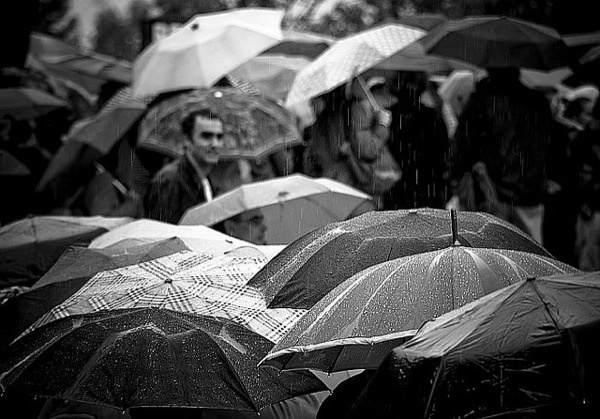
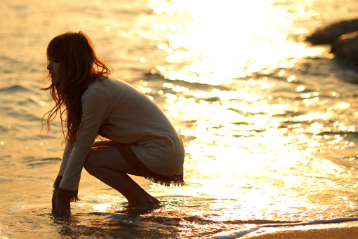

# 在路上

**“我们一生唯一可以肯定的事，就是我们肯定都将死去。所有人都有一个相同的目的地，然而每个人的使命却各不相同。不同的使命注定了我们各自有不同的道路，所以别人走阳关道的时候不要羡慕、嫉妒、恨，自己走独木桥的时候也无须自卑、抱怨、悔。心中谨记，别人走错路的时候可能会冲撞到自己，自己走错路的时候一定会冲撞到别人。”**

### 

### 

# 在路上

### 

## 文/钟起鹏（中国人民大学）

### 

### 

这些年，一直在路上。 从最开始的懵懂无知，到年少多梦，到迷茫困顿，到柳暗花明，再到梦想实现或失却，最后心平气和地看着身前身后的风尘滚滚，流逝的是岁月，丈量的是生命，停不下的是脚步匆匆。 懵懂无知的时候，不知道自己要去哪里，也不知道该走什么路，甚至都不去想这些令人头痛的问题。每一个人都是这样，自己不想成为也不愿成为一个异数。没有欲望，没有念想，可以没有娱乐，可以没有快乐，这样也就不必有悲伤。 我能想到的关于自由的完整定义，就是自己一个人跑到老家后面黄脑山山顶，挑选一片径大叶宽的茅草叶，举过头顶，水平地轻轻地往前一送，茅草叶就飞起来；我把自己想象成这片茅草叶，飞过一个又一个山头，跃过一颗又一颗的杉树松树，掠过高排水库波粼万千的水面，越过山口参天的大樟树大枫树，拂过老家的房顶，然后飘过沙排段连片连片的梯田，最后落到某一丘水草丰美的稻田里。 我所感知的关于孤独的合理诠释，正如十岁的我每日在黑夜中独自行走在回家的路上，因为无聊抑或是恐惧，唱着彼时流行的港台情歌，天地万物于我俱寂；或者静静地感知黑夜，青蛙、蟋蟀、萤火虫、蛇、生长的禾苗、潺潺的流水、满天的繁星……到家之后，我一个人待在空荡荡的大房子里，开着电视或关着灯，窥探自己疯长的内心。我正视了这种经历带给我的心理损伤，然而我更清楚地知道，我人生中所有的坦荡和淡然，都始于那几年黑夜中的独自行走。 

 我那时感知的孤独是一个人的独立存在，而尚不懂得——我们活在这个世界上，哪怕两个人或很多人在一起，也无法完全排遣我们内心的孤独感和被抛弃感。在越是人多的场合比如千万人的广场和街头，这种孤独感和被抛弃感会越强烈。而且这种孤独感和被抛弃感并不关乎我们是不是一个内心有安全感的人，它们是完全的两回事儿，然而恰恰这一点很容易被别人甚至我们自己误解。 我们内心最初的渴望和梦想源自于我们知晓了外面世界（包括他人世界）的存在。不管通过什么途径，不管它新不新奇精不精彩，我们以为的外面世界就是很新奇很精彩。这是一个非常好的原始信念，这个好不在于后来现实无情地嘲弄我们的天真并生动地教育了我们，好就好在它给了我们一个前行的方向和动力。这个时候我们就会想自己要去哪里，知道自己要去到哪里。 不管是谁、出于什么理由，可能都有这些路数：长大了想当科学家、工程师、教师、警察、官员、飞行员、火车司机……抑或是建一所大房子，娶邻家的姐姐或妹妹；或者做过丑小鸭变白天鹅、野鸡变凤凰的白雪公主梦……不管怎样，它们最后都落实到了考试要门门优秀，上最好的初中、高中，考名牌大学这些细节上。如果我们今天过得很好或者还凑合，那么我们理应感到庆幸，因为这至少说明我们曾经或者已经、正在或者即将无比接近我们的梦想。 如果你相信，我愿意告诉你，我的梦想，若论缘由是十二岁那一年，我遇到一个公主一般的女孩子。她问我，你觉得“接天莲叶无穷碧，映日荷花别样红”这句诗怎么样？我的浅薄无识和疏漏无知，隔绝了使我能够站在她面前谈吐自如的自信和勇气。很多年，我努力使自己成为一个优秀而有涵养的男孩子，殊不知昔日使她对我另眼相看的，可能恰恰是我最初不事雕琢的朴实。我们一生中可能很少把事情弄到“画虎不成反类犬”的糟糕境地，失之东隅收之桑榆。我以前也讲过，很多时候，他人只是无意间为我们开了一扇又一扇门，而我们四处闲逛，发现了一个个新奇精彩的世界。最后，我们甚至会因为沉湎其中而忘记为我们开启幸运之门的贵人，以及我们走进那些原本陌生的世界的初衷。 这几年，儿时的玩伴嫁人的嫁人，娶妻的娶妻，生子的生子，初中走得近的几个同学也为人父母，高中同学聚会人数总是凑不齐。想想我们一路走到今天，真的是千军万马过独木桥，我们越走越远，身边的同伴越来越少。我们不得不正视这样的事实——有些路必须我们独自一人走过，有些人只能陪伴我们一程或几程，没有人能够一直陪伴左右。 这个时候再去审视彼时的孤独感，发现其实孤独也不失为一种很好的东西，至少它一直与我们灰暗的青春岁月作伴。“天地虽大，无一可载我之物；众生虽广，无一可立我之人”，这种孤独感不是每个人都能体会和享有。多数时候，我们为之纠结的是浮浅的空虚和寂寞，而非内心的孤独。习惯了佩戴面具的我们，甚至已经无法坦然地面对自己，直面自己内心深处的真实感受。一方面我们总是以为卸下伪装对自己而言过于残忍，另一方面我们从未停止抱怨这个世界太虚伪。 

 不知道从哪一刻开始，父母引以为傲的小机灵小神童再也没有了往日的“小宇宙”，我们开始把事情弄糟。钢琴能过八级，可始终离真正的舞台很远；学习很好很努力，考上好大学却无法踏进自己梦寐以求的那所大学的校门；就算一战成翘楚，考上了自己梦寐以求的大学，可是不知道为什么生活总是有那么多的不如意，好像身边的同学还不是很喜欢自己；找的工作大家都羡慕，可是自己总觉得不是那么靠谱……走着走着，发现自己走的路已经偏离了目的地，背离了初衷，不知道自己会去到哪里。即便没有偏离目的地，但是我们走过的地方，却没有我们脑海中设想过勾画过千万遍的风景。理想很丰满，现实很骨感。这种现实的挫败感甚至可以具体到一勺池还没有家里的池塘大，北京可以整个冬天都不下雪，公主坟是一个地名，地铁不是只在地下其实也可以在地上……这TMD都是什么乱七八糟的玩意儿，世界如此美妙，我却如此暴躁。 五年前，我说人生最大的愿望就是拣一块干净的草地，在温暖的冬日阳光里静静地死去。但是转年我就用“怕死鬼”的笔名写了篇颇得赏识的屁文《怕死》，都说天堂很好可是谁都不愿意去。再后来我告诉人们，其实我最大的愿望就是下辈子做一头猪，于是某人让我提前到这辈子就实现了愿望。这个世界每天每时每刻都在改变，我们将去哪里总是充满不确定性，能确定的是我们去过哪里。至于我们要去哪里想去哪里，那是个人意志，于天地则为浮云。 年少的时候，我们总是纠缠于不知道自己要去哪里、该去哪里、将去哪里，殊不知较此更重要的是我们能去哪里而又去了哪里。我们抱怨这个抱怨那个，以为自己很重要，却不去想我们存在的意义。我们本可以活在一个不抱怨的世界，说到底，人生旅途只有一个目的地，殊途同归。我们一生唯一可以肯定的事，就是我们肯定都将死去。所有人都有一个相同的目的地，然而每个人的使命却各不相同。不同的使命注定了我们各自有不同的道路，所以别人走阳关道的时候不要羡慕、嫉妒、恨，自己走独木桥的时候也无须自卑、抱怨、悔。心中谨记，别人走错路的时候可能会冲撞到自己，自己走错路的时候一定会冲撞到别人。 就算青史留名，追其究竟也不过一场往事。这个世界上没有最好的路，只有适合自己的路。走过的路，如果尚不至于一失足成千古恨，即便是错了，也要坦然地接受这就是自己的路。因为适合自己的路，一定不是全都正确的路，就像人生一定无法永远正确一样。如此说来，人生的旅途中，彼此冲撞可能在所难免。可是一个人老是莽莽撞撞，终归有悖常理，不可法也。我们多数人都将度过无大功亦无大过的平淡一生，然而死水微澜，就不必纠结于到底是风动、幡动还是心动了吧。 我们可能要面对一个又一个十字路口，但是人生不是选择题，只有有限的选项，非此即彼。我们最后都将面临相同的归宿即死亡，但是人生也不是证明题或演算题，步骤可以不同却只能有一个结论或一个结果。抛开我们的终极归宿不论，人生是一道论述题，我们能做的，不过是努力地自圆其说，使其内涵更加丰富；人生还是一道开放性试题，我们可以尝试走自己的道路，甚至走从来没有人走过的道路，探寻自己感兴趣的结论。 

 前日我挽着心爱的女孩行走在大街上，天空下着淅沥小雨。我们讲起旅途的事，她问我，家里到北京那么远，坐火车硬座岂不是很累？我对她讲，其实也不是很累，坐硬座可以接触到各种各样的人，浮生百态，非常有意思。她微笑着继续问道，那你是不是像佛主一样看着他们？我没有回答她，只是看着她，看着氤氲夜色中的路灯光打在她年轻的脸上，映衬出她那雀跃无邪而又不失沉稳淡然的表情。我就这样看着她，情绪慢慢晕染开来。那一刻我心里想的是，这样的女子，只怕佛主见了也要动凡心。 钟打油有诗云：人生行路如修行，修行之道在修心。世间必有两全法，不负如来不负卿。 

### 

### 

(编辑：黄理罡)

### 

### 
