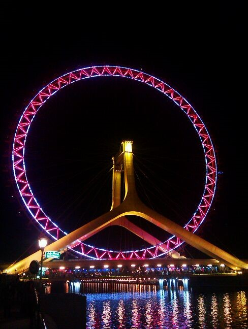
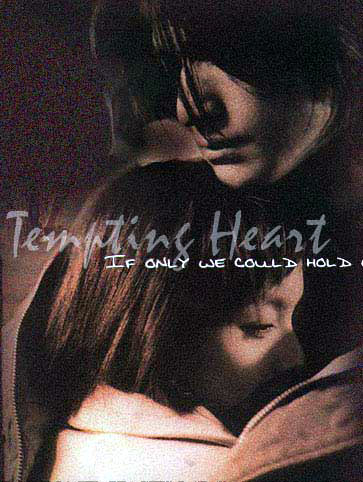

# 好久不见

**“你在第几节车厢？”“怎么了.......4........”“看到我了吗？”**

**“.......没有”..................................“看到了!”** **车刷的驶过我的身边，我们的相互注视也许不足1秒，但足以抚平一切。**

### 

### 

#  好久不见

### 

## 文 / 若果（海关学院）

### 

### 

那一刻我知道我必须全力奔跑、奔跑……

当我终于踏上你的城市，一切是那么陌生却又似曾相识。我默念着，我来看你了。一千多公里和十四个小时疲劳与此时依旧的坚定突然让我明白了意志力的强大，认准的事就要去做，为了这些我什么都能忍。 “我来到你的城市，走过你来时的路”。凌晨,空荡荡的街道让我感到北方城市难得的灵动。没错，因为有水，蜿蜒的海河如同你眼眸中的那一缕诗意。这样一座饱含韵味的城市也许再适合不过你了，所以你一直说你很幸福。是不是水的灵气让这两座城市如此相似。天津、上海。以至于后来我站在海河旁时蓦然开始怀疑我是不是在上海的外滩。 好久不见，一年了吧。我们相识有多少个一年了？却还记得那个艳阳明媚的夏天，第一次遇见。现在回想起那段日子，脑海中浮现的大多是阳光绽放的夏天，所有人都穿着一样的蓝白校服，但我却能一眼分辨出操场边散步的你。 就这么毕业两年，一年未见。 一年，足以让实验中学校园中花开花落，足以让实验再经历一次悲欢离合，却不足以让实验记住那年我们的青春。也许他记录了我们的档案、成绩，然而我们的快乐却注定被他遗忘。美好的，需要自己去珍存，没有人会替你记录。 一年，足以让乌鲁木齐许许多多怀怀揣梦想的孩子奔向上海，也足以让许许多多满怀憧憬的孩子奔向天津，却不足以让你我回到那年的乌鲁木齐。热烈的、疯狂的十七八岁是用来祭奠与怀念的，没有谁能帮你回去。 将来的将来，“为何我们还是要奔向各自的幸福和遗憾中老去……” 一年未见，再见不如初见。你的眼中多出了的是一份睿智，往深处看透出的是你现在的幸福和快乐，再往深处才看到的才是你不忍提及的过去和无奈的坚持，可是呢？然后呢？曾经最了解你的人却也看不出更深处的是什么了。人生若只如初见，就不用看到那种无奈、坚持。人生若只如初见，就不用尽力去猜测你的眼中还藏着什么。人生若只如初见，就不会再见，不会再见面，也不会接着再再见、再也不见。 见面了，与从容与自如相对比的是一支又一支的吞云吐雾。此时此刻的放下和一年前的决绝就像绝佳的对仗。工整、切合。却有不同的心境，同样的默契。就静静的坐着，寒暄。 只想安安静静地走进你的校园，看看你生活的地方，想像你学习、生活的样子，而我知道这仅仅是想像。走过每条小路，你是否也曾在此驻足？踏进校园的时候我明白了，我早已经不在你的生活中。坐在长椅上，期待你忽然从转角出现，却终未能如愿...... 天津之眼，直到深夜我也未坐上它俯视你的城市。只是远远的看着，那是属于你的美好了，我只要远远驻足、静静的聆听就好。你说我挺怀旧，我说：呵呵，是啊。年少爱追梦，为了一句诺言，为了了却心愿，我终于到了这座城市，当我发现所有的一切都成为回不去的曾经时，我能怎么样，想怎么样？高飞的孔明灯，能否告诉我？别再沉溺于这段年少纯真中了，珍藏----也许这就是最好的结果了。立在河边的我可能真的没必要去揣测你为何留下来，为何迟迟未去北京，不惑不也是一种幸福吗？ 

### 

### 

那天，绝对是我生命中值得纪念的一天。一件事后自己都无法相信的事，让我相信奇迹就在我们身边，电影不只在荧幕中。带着五味杂陈的心情我走向火车站，或许就在那一刻我还不懂我来的意义是什么，然而你提醒了我。 

### ** **

**15:25 ****距离天津站****800m**** ** 接到你的电话 “在哪？” “离火车站还有一段距离” “啊？这样啊，我马上要去北京了，3点35开车，你要快点我们还能见一面” “哦，那你先走吧，别等我了” “好吧，一路顺风！” “谢谢” 挂掉电话，把背包扔给小一，开始奔跑........ 

### ** **

**距离天津站** 700m 奔跑. 600m 奔跑. 500m 奔跑.400m 奔跑.300m 奔跑.200m 奔跑. 100m凭着最后一丝力气加速奔跑. 那一刻我知道我必须全力奔跑、奔跑…… 

### ** **

**15:29 ****天津站候车厅**** ** 电话响起...... “还有6分钟就开车了，我得走了。” “恩，好的。去北京好好玩吧！你在几号检票口？” “16号” 挂掉电话，继续奔跑。 那一刻我知道我必须全力奔跑、奔跑…… 

### ** **

**15:31 ****天津站****16****号检票口** 已经空荡的检票口.......那一刻的失落感可能是从未有过的。 好吧，我决定了，再难我也要试一试。 “检票员，您好！我不是这趟车的乘客，但是我想进去看个人，行吗？” “对不起，不行。这是规定！” “您让我进去吧，求您了。” “不行” “我真的只能求您了，我今天就回上海了，错过这次我怕再也不敢再去见她了。XXXX.......XXXXX(算是一些只属于我和检票员所知道的话吧) ”或许再过华丽的语言也比不上一个真诚的眼神。 “嗯.......好...吧，我相信你，但你一定不能做让我倒霉的事情。” 鞠躬，没有一句其他的话。或许这是一个小小的奇迹，我独自进入了空无一人的通道。 

### ** **

**15:33****天津站城际列车旁** 只有我一个人伫立，空荡荡的。一扇扇车窗的寻找，完全没有感受到自己的疯狂正在被那么多人注视。 车已经缓缓启动，顾不了了，拿起电话。 “你在第几节车厢？” “怎么了.......4........" “看到我了吗？” “.......没有”..................................“看到了!” 车刷的驶过我的身边，我们的相互注视也许不足1秒，但足以抚平一切。 电话那头你哭了 “再见！” “再见！” 这是你之后写下的话：当城际从你身边驰过，我才真正明白，自己真正错过了、失去了这辈子除了家人最爱我的人。我不回头，不论前面的路还有没有更爱我的人，我都要走下去。虽然，这么久第一次因你而哭...（放心，旁边的韶华说：没关系，我有纸巾！）肩并肩，愿上海也是晴天！ 肩并肩，上海也会是晴天。 我慢慢懂得，青春就是你应当敢爱，为了诺言再难再累都要忍下去实现它；青春就是要敢于奔跑，敢于做疯狂的事情；青春就离不开这种伤痛，虽然我明知道对于未来的日子，这些并不算什么；青春就是不能忘怀，一段记忆中最美好的时光。 

### 

### 

但长大了就要懂事了，爱情不是全部，我们依然有亲人、朋友，有太多人值得我们付出同样分量的爱；或许现在的我真是少年不知愁滋味，以为这是一道迈不过的坎，或许我应当开始懂得，人的责任有多重，年少的我有更重要的事情去做、去努力，你可以缅怀一段纯洁的爱情，但你不能沉溺于儿女私情，大丈夫应坦荡立于世间，岂可过分的受此牵绊？ 谢谢你让我懂得了这么多，我相信上海一定会是晴天，放心！ 青春再也回不去，记忆中总是带着一丝酸楚，那个你一直无法释怀的人终究还是离你而去了；一年前是我的决绝，让你我今天如此隔着车窗，然而你我却都默契的认为那并没有错，感谢你的理解，也感谢自己终究还是懂事了；将来的某天可能我不会再这样疯狂，义无反顾，我却庆幸留给你这样一个我，一段炽烈纯真的爱情；明天的我们都还记得我们年轻时的摸样，又有什么结局比这更好，“因为爱情不会轻易悲伤，所以一切都是幸福的摸样”。 到了这里一切都应该结束，没有结局的故事才容易被人所记住。 谨以此纪念回不去的曾经。 

### 

### 

（采编：吴志伟 责编：刘一舟）

### 

### 
