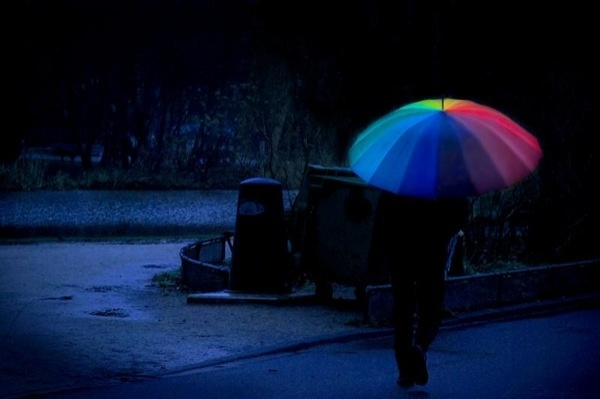

# 孩子，你那儿一切都好吗？

编者按：你是否也如我一样，觉得自己与父母渐行渐远？你是否也如我一样，认为父母的认知太过肤浅？你是否也如我一样，想不明白为什么“父母皆祸害”？读《北斗》的你我，大抵都是自命成熟的群体，可是，我们到底有没有足够的耐心和勇气去了解父母，面对他们在时代发展中“无所适从”的父母心呢？ 

### 

### 

# 孩子，你那儿一切都好吗？

### 

## 文/张书迎 （睢宁高级中学教师）

### 

### 

孩子，昨夜我又梦到了你！你咚咚地敲开门，爽朗地笑着：“爸、妈，我回来了！” 从你踏入大学校园的那天起，我就知道，你已离开家的暖巢，挣脱父母的羽翼，从此，我们将聚少离多！ 无数的日子，我思念你，牵挂你，可是我没给你写一封信，就是电话也很少打，只在心里写了一封封内容相同的家书。因为，我怕我们的思念和牵挂，搅乱你的心潮，分散你的精力，影响你的学习。可是无数次，我还是忍不住地问：孩子，你在那儿一切都好吗？ 

 很少离家的你，第一次风尘仆仆，到千里之外的异地读书，吃惯了咸辣的家乡菜，能习惯南方甜淡的口味吗？听说大学食堂做有不同地方风味的饭菜，你的学校食堂也如此吗？如果不是，你也要尽可能地多吃些，人是铁，饭是钢啊！听说一些大学生喜欢睡懒觉，起来才起来洗洗漱漱，早饭顾不上吃就匆匆忙忙去上课这个习惯不好呢！不吃好早餐，怎能有精神上好课？ 在家时，夜里你常会蹬掉被子，你妈妈不知道给你拾过多少次。父母不在你的身边，跟你的同学说说，他们如果看到，让他们帮你重新盖好被子——当然，你对他们也要这样。在家靠父母，出外靠朋友，在校还不靠同学？！ 说到同学，我想起了家乡的一句民谣：一辈同学三辈亲，三辈同学进老林（坟墓）。从古至今，人们都非常重视同学这份情谊呢！所以，你要和你的同学搞好团结，有了困难大家互相帮助。地面脏了，你抢着打扫打扫，桌子乱了，你赶紧收拾收拾；水瓶没水了，你麻利地去打来。力气用不完，友情价无限，不要斤斤计较那点力气，那点小钱！ 现在你的学习成绩怎样？在班里还能名列前茅吗？能拿到奖学金当然最好，——我不是看重那点钱，那是你学习优异的证明，是你将来打开就业之门的锁钥啊！但我也知道，大学是藏龙卧虎的地方，周围的同学都是如你一样的人中龙凤，所以，如果你经过自己的努力，还是落后于别人，我不怪你，因为你已经尽力，我只要你问心无愧！也许学习更多的时候，是要只管耕耘，不问收获！ 寒假里，我过去的一个学生受不住心里过于沉重的压抑，向我吐露了折磨他许久的愧疚和不安：由于挂科太多，他可能拿不到学位证书！孩子，这正是每个家长最担心的啊！我们不是家境富裕的家庭，我们花出的每一元钱都要精打细算，当你接过父母每一笔血汗钱之后，你怎好不负责任地回报父母不及格的成绩呢？所以，你一定要刻苦地学习啊，不要挂科，这是我对你最低最起码的要求！ 大一时你曾说想买电脑，我没有答应，不是我吝惜那点钱，而是听说一些大学生有了电脑更多的不是用来学习，而是用在了打游戏、看电影、聊天交友……我知道，网络是好东西，有新鲜的资讯，有广博的知识，可是我也知道，它也有足够多的其它东西轻易地扰乱你还不够沉静、成熟的心境，它是一把双刃剑！在众多好玩甚至是陷阱的诱惑面前，还缺乏自制力的你啊，能够约束自己只用它在对你的成长有益之处吗？如果却是学习必需，你告诉我，即便借挪，我们也会给你买。 听说有的同学在大学谈了女朋友，你知道作为家长听到这消息是什么感受吗？其实，我们并不会像你们想象的那样坚决制止，用一把无情剑斩断你们的交往。我们甚至会有隐隐的甜蜜和喜悦：孩子真的长大了，开始考虑自己的终身大事了，这不是每个家长所期待的吗？！可是，我们也有深深的忧虑和担心，你会不会因此沉溺于花前月下而影响学习？会不会因此大把大把地花钱致手头拮据，而克扣自己的一日三餐？学习成绩下降，身体健康受损，这是我们最担心的啊！审视一下你们的爱情吧，有没有思想感情的交流？有没有学习上的相互鼓励和帮助？倘若只是沉迷于吃喝穿戴以及玩乐的爱情，不是真正的爱情，或许那只是消磨寂寞的玩伴，甚至有心无意的利用——找一个慷慨的提款机！ 如果你们的感情是认真负责的，如果你能处理好和学习之间的关系，那么，我们不反对你们的交往。但是，我们要提醒你，这事只能限于你们感情的交流、学习的互助和生活的关爱，而对传闻中的大学生同居将坚决地反对！因为，尽管你们已到法定结婚年龄，但你们思想上还不成熟，经济上还没独立，你们还有更重要的学习任务要完成，你们要对己、对对方负责，对双方的家庭负责！贪图一时的欢愉而过早地同居，很可能会害人害己！由于传统观念和生理特点，对女孩子的伤害尤其巨大，你既然爱对方，就不可伤害她！爱情的果实，只有在新婚之夜品尝，才会甜美幸福无比！ 看过一篇大学生写的文章，大意是从现在算起，即便他的妈妈能活到100岁，他和母亲在有生之年也只能相见150次。当时看到这里我很感动，他能想到这些，一定是个孝顺的孩子。其实，在父母的心里，你能不能常常陪伴在父母身旁并不重要，好男儿志在四方，只要你能找个好的工作，有个幸福的家，能够心里有我们，我们就心满意足了！你知道吗？你在父亲节给我发的短信“父亲节快乐！”，就让我高兴了好多天，直到现在我还舍不得删除；你在母亲节打给你母亲的电话，让她热泪盈眶。因为曾有段时间，你的电话或短信，不是要钱就是要东西。只要你心里有我们，即便没见到你，我们也已经感到很高兴和幸福！ 

 纸短话长，字少情深，这是我第一次跟你说这么的话，可是我仍然有许多的期望、许多的担心，送你《哈姆莱特》中的一段台词吧，这是波洛涅斯在送他的儿子出外求学时的嘱咐，就用它作为我这次对你最后的叮咛吧： 不要想到什么就说什么，凡事需三思而后行。 对人要和气，可是不要过分狎昵。 相知有素的朋友，应该用钢圈箍在你的灵魂上，可是不要对每一个泛泛的新知滥施你的交情。 留心避免和人争吵，可是万一争端已起，就应该让对方知道你不是可以轻侮的。倾听每一个人的意见，可是只对少数人发表你的意见；接收每一个人的批评，可是保留你自己的判断。 据你的财力购置贵重的衣服，可是不要炫新立异，必须富丽而不浮艳，因为服装往往可以表现人格。 不要向人告贷，也不要借钱给人（在深知对方为人的情况下还是应该借的，人是需要相互帮助的——楼主注）；因为债款放了出去，往往不但丢了本钱，而且还失去了朋友；向人告贷的结果，容易养成因循懒惰的习惯。 尤其要紧的，你必须对自己忠实，正像有了白昼才有黑夜一样，对自己忠实，才不会对别人欺诈。 

### 

### 

（责编：项栋梁）

### 

### 
