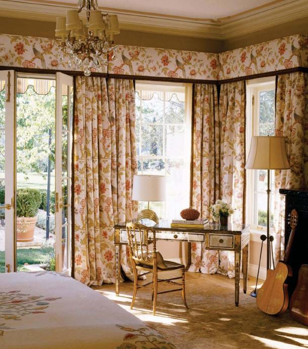
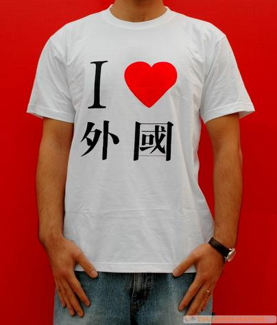

# 对美国，不能只是简单地说爱还是不爱吧

**“尤其是在咬牙考过了托福，忐忑地过了签证，兴奋地收拾行李，只身一人登上赴美的飞机时，没有家人，没有亲爱的在身边的时候，对美国，一个你为此学了10多年英语的国家，你朝思暮想的自由国土，你已经没有选择说爱还是不爱了。”**

** **

** **

** **

# 对美国，不能只是简单地说爱还是不爱吧

## 文 / 婕（北京语言大学）

 首先承认我并不是一个懒人。我很勤奋地写私人日记记录我的美国生活。很多次尝试着在校内上抒发一些小女人情怀，每次完成之后我还是咬咬牙决定存到私人博客里然后加密。恩，我不适合当特工的老婆，因为有时候我只是很单纯地想晒晒幸福。任何有形的东西在黑暗里捂得太久了都会发霉，更何况是幸福这种精神上的，摸不到嗅不着，只能一厢情愿默默意淫的东西。尽管全世界都知道有多幸福，但是全世界都不能阻止它悄悄地覆上青苔。但是，这可能不被允许。我也会尝试地理解一下特工的心情。 在这边，我过得很好，物质上的。精神上的可能还缺点什么。 

 秋天终于来了。美国的性感果然比较赤裸裸。这里的树们不过一周就几乎全裸了，北京的树还是比较保守的，扭扭捏捏得持续一个月才敢展示裸躯。终于不用在咬牙切齿中在睡前用北语冰冰的自来水洗手洗脚。打开水龙头，哗哗的热水就出来了。 也不用担心秋风萧瑟中提着小澡篮去澡堂。冷的时候，不用开暖气也不会死，勤快的话就进去洗手间冲一个桑拿澡就足够暖一夜的了。 不用担心没有带钥匙出门，不用担心和北语的阿姨争得面红耳赤或者装惨卖乖然后借钥匙。拿上你的id card，到前台登记一下，公共钥匙你可以暂时用一天。 不用在楼管大妈一脸蔑视的表情中去抢一楼的微波炉热东西，不用担心在宿舍煮火锅引来楼管大妈的追杀。只要想吃东西，拿上万能的id card借把厨房钥匙，随时拿锅到专门给学生提供的厨房，只要烟雾不要太大，不触到ssmoke detector和sprinkle,楼管无权干涉你在厨房的所作所为。 图书馆借书的上限是每个人50本，一个月期限。学校图书馆没有的书，上网预约，过几天就会从别的图书馆邮寄过来，几乎都是免费的。可以在图书馆里随意用电脑，网速不是一般地快，绝对不是过时的烂机。还有自助的扫描仪复印机打印机，只要放钱就能用，不过比中国贵多了倒是真的。很多学生都是人手一台打印机放在宿舍。 说到宿舍里面，微波炉，吹风机，卷发棒，小冰箱一起用的功率也不会把电网弄瘫痪。都是中央空调，冬巨暖夏巨凉。可惜这边什么都是自动化，新鲜空气都是墙角的ventilation送进来的。窗户是用来逃生和看风景用的，只能开一个小洞。家家户户都是百叶窗，学GRE的小孩们终于知道为什么熟词僻义blind在考试中这么重要了吧。 不小心在食堂拉了钱包，钱包会原封不动地停留在你呆过的地方，或者是等着去前台失物认领就好，不用为卡里的钱和证件干着急。 不小心用手机下载了20刀的软件，打个服务电话给AT&T，解释完原因，业务员直接帮你把软件退订了然后把20刀退到你手机里，还自动为你设置下次下载软件需输入密码的业务。我真是不敢想象曾经在中国移动的压迫下办了多少不愿意办的业务然后经历重重关卡才退订成功。 

 你们无法想象不到雅诗兰黛的眼霜和倩碧黄油便宜到什么程度，MACY'S居然还提供商品半年内无条件全额退款，楼管都是兼职residential assistant的学生，只有楼长是唯一一个50岁以上的老太太，超级无敌慈祥。教授或者advisor的门上总是贴满了可爱的装饰物，办公桌上除了书本和文件就是明星海报和温馨的家人照片。 我不巧来到一个小镇，人口不多，无敌的中国学生留学军团可能占了四分之一了吧。没有MALL，只有一些零散的小店，基本能满足吃喝。民风比较淳朴，大家生活都很闲适。崩溃的是没有公共交通去市区，我又没拿驾照，得租cab或者是让熟人才能进城去。不会开车在美国来说就等于残废。不过也好，心静，空着等汲取知识来填满。美国人都很不错，只要你的话多的话，他们都回用热情来回报。 美国人最喜欢和外国人寒暄的话就是do u like it(Murray/America)?这个真的很难回答。我喜欢这里的环境，绿化很好，人很好，气候很舒服。但是我总要以well来开启这段对话。对我来说，对美国不能只是简单地说爱还是不爱。其实我既不爱也不恨。可是，鱼和熊掌不可兼得。如果让我就这样一个人呆在美国，呆上一辈子，我不要；如果是有家人陪着我，我当然很乐意，两辈子地乐意呆这。然而前提是，我的家人不可能过来，所以我不可能一直呆这，呆一年已经是我的极限了。虽然在这里的生活很自在，所谓的享有充分人权我算是深有体会。我不能自相矛盾地要求自己爱这个地方但是却不愿意呆在这个地方，不爱这个地方但是喜欢这个地方的生活方式，所以，我选择中庸。不能用爱或者不爱就概括了这一切。 很多事情，直到我踏上了这个领土，才完完全全地明白了。还没出国却准备出国的同学，请考虑清楚你究竟追求的是什么。选择留学没有你想的那么美好。真正在这生活了一阵子后你才知道是什么感觉。物质上一点都不痛苦，因为可以享受国外名牌超低折扣的快感。精神上，熬上一年绝对是以N次方的速度升华。 寂寞催人老。当你面对4个月一个学期四门课12个学分每门课程两个考试一个小论文一个大论文的摧残时，当你面对美国电影里的party animal然后你不得不为学业奋战在图书馆时，当你一个人指手画脚用尽各种身体语言来和超市营业员解释“我想买一个抱枕”的时候，当你已经习以为常看着身边的一对一对擦肩而过时，当你看twilight不会再哭的一塌糊涂然后彻夜未眠的时候，恭喜你，你老了，你历练了，你升华了。 

  尤其是在咬牙考过了托福，忐忑地过了签证，兴奋地收拾行李，只身一人登上赴美的飞机时，没有家人，没有亲爱的在身边的时候，对美国，一个你为此学了10多年英语的国家，你朝思暮想的自由国土，你已经没有选择说爱还是不爱了。
