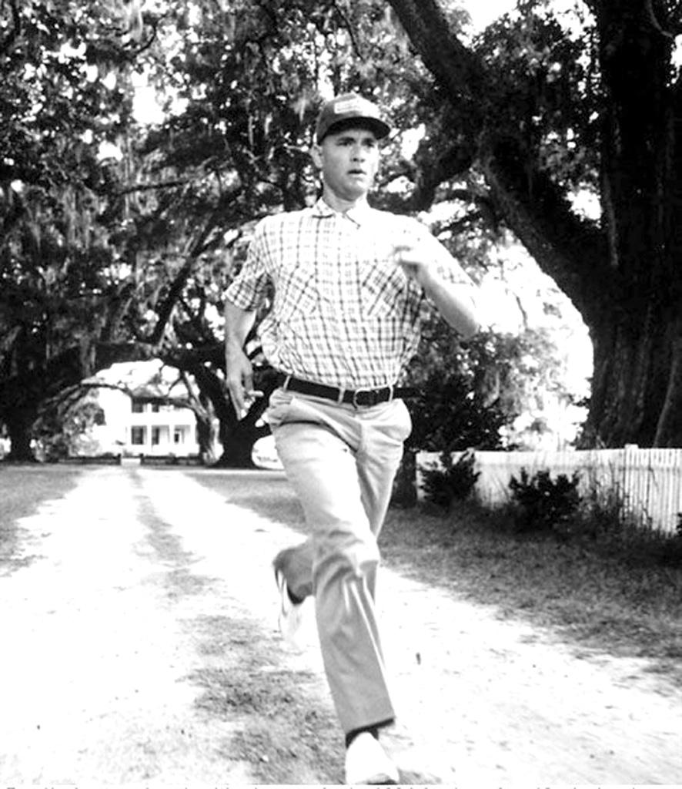
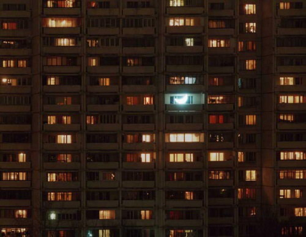
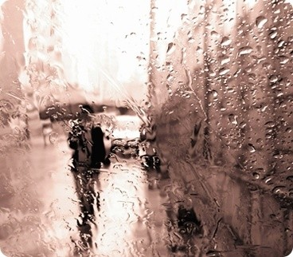

# 年轻时免不了一场颠沛流亡

**“每次回到家里，初三天，紧绷的神经仍旧紧绷，要一周左右，才完全散淡下来，彻底放空自己。十天半个月，你觉得舒服无比。而半个月之后，你开始觉得无聊。是的，不好意思，父母相伴，但是你仍旧觉得无聊。你开始想念大城市的烟尘车声人际纷争，那起码是一个鲜活的世界。不要不承认，就像食肉动物，无法再食草一样。每一个出走的人，都以为自己随时可以回家。而这正是人生的悲剧：其实，家，在你转身离开的那个瞬间，已经永远无法抵达。”**

# 年轻时免不了一场颠沛流亡

## 文 / 李维恩

### 1

前一日和自己的外教聊天，最不可避免的话题就是关于美国和中国的异同。 这个美国人直白问我：“你爱不爱美国？” 出于礼貌，我应该迅速回答我爱美国，就像他对中国流露出的兴趣一样。 尽管我时常做梦都想去那里，可是我还是想了好一阵子。 说句实话，如果能周游世界，我开出的目的地前十位都不会是美国。 美国在我印象中，是《American Beauty》，光线充足，物质充裕，然而，乏味。 美国就像是四十五天速成的肉鸡一样，廉价而强壮。当然美国是多彩的，那种混杂的多彩，我不以为是丰富。 可是，对于一个爱看电影的人来说，美国是无法回避的。 谁能不看美国电影，谁又能不爱美国电影？只要你对善良，对爱，对激情，对正义，对传奇这些在现代社会中好像消失了的东西能够共鸣，那你就是好莱坞的臣民。你就会被 《阿甘正传》、《奔向骄阳》、《卡萨布兰卡》、《肖申克的救赎》所征服，会欢喜流泪，会被里面叫做“美国精神”的东西感动。 

 这种美国精神，接近卡通，非常浪漫，激扬生命，比单纯的口号好一点。 那些现实的疾苦和艰难，在精美的光影之间，在明星的大特写之下，消失殆尽，没有存身之处。 就像在正午的日光下，我们看不见光柱中滚动的细微粒子，便以为这世间没有灰尘。 我还记得高二考政治，有一题是辨析：人生来平等。政治这种东西，我不到最后关头决不去背，即便到了最后关头也不背，想当然尔。于是我拿着当年杰弗逊起草《独立宣言》的热情，洋洋洒洒写了一大篇。出考场看答案才知道错了，白白丢人。 我的错在于，美国精神也是有政治前提的。 政治不是诗，不是浪漫。 政治是对错，也不全是对错。 政治口号往往是区分善恶，可政治不分善恶。 后来我读《心灵史》，将这样的话默默抄在笔记上： “他否定什么乾隆盛世。他为我树立了以人的心灵自由为唯一判别准则的，审视历史的标准。经济不等于时代。经济统计数字的表象，使学者变成病人，使书籍传播肤浅，使艺术丧失灵魂。经济使男子失去血性，使女人失去魅力。我的判断是忠于心灵获得的感受，就是肯定人民，人道，人心的盛世。” 有时候我觉得，抛开理智，仅仅是为了另一个人，仅仅是想经历另一种人生，我也爱美国，爱一个虚幻的电影里的NEVER LAND。 

### 2

在UIC的生活很新鲜，总在不自觉地碰见形形色色的人，听他们说着深深浅浅的话。 但最开心的其实还是面对电脑的时候，因为我等的人在网上，能和我说话。疲倦和睡意都一扫而光，在一天中最安静的时候，我们谈话。任何事都谈，没有任何界限。 这是我能体会到的最广大的宽容和自由。我们是恋人，是朋友，是最苛刻和最怜悯的人。在交谈中，情感和经历都联成一片。不是端端正正对着无声无息电脑，而感觉是促膝并肩地交谈。 有时候，交谈，是一种很大的慰藉和温暖。 如果真的有一个人，愿意认真听你说的话，肯与你分享那些幸运或不幸的遭遇。 这时才觉得，距离也就不那么重要了。 有一天我很有感慨地告诉她，我觉得漂泊异地的人都挺不容易的。 她觉得这是一句玩笑话，没有当真。 其实仔细想想，为什么我们要不停地从一个地方辗转到另一个地方去，从一个国家奔波到另一个国家？ 没有人强迫你去大城市，没有人强迫你一定要离开中国，没有人强迫你做逆流而上的大马哈鱼。 你之所以留在一个压力巨大、生存沉重、无比奋力也几乎泯然众生的地域里，只是因为你愿意。 因为你接受了这个地方的规则，那些严酷得近乎伦理的规则。 因为你青春正盛，觉得你很大，家乡已经容不下你，必须到一个大的世界里去硬碰硬。 因为你不要安稳，要兴奋。 因为你不要舒服，要剧烈。 因为你要一个像万花筒一样，永远神奇莫测，每一次都不一样的世界。 故乡，其实此时已经是一个永远也回不去的地方。 因为，你的心已经变了。 每次回到家里，初三天，紧绷的神经仍旧紧绷，要一周左右，才完全散淡下来，彻底放空自己。十天半个月，你觉得舒服无比。而半个月之后，你开始觉得无聊。 是的，不好意思，父母相伴，但是你仍旧觉得无聊。 

 你开始想念大城市的烟尘车声人际纷争，那起码是一个鲜活的世界。不要不承认，就像食肉动物，无法再食草一样。每一个出走的人，都以为自己随时可以回家。而这正是人生的悲剧：其实，家，在你转身离开的那个瞬间，已经永远无法抵达。 而更大的悲剧，我想在于，我们的父母其实无法进入我们将来有能力构造的世界。 这座盛大的城市，对他们来说，未必比得上门口有条杨柳拂面的小河。 以及，我们将来的孩子们，那逆流而上的大马哈鱼的后代，他们更加无从想象，那么一个遥远的小城---哪怕在我们无比怀念的口吻里，仍旧是他们越来越美好却不真实的伊甸园。 我们遥望着下游日益孱弱的父母，我们奋力挽着同在上游的同辈。 是的，我们可以安慰自己，如果没有我们前赴后继的滋养，不会有这一个日新月异的世界。但这也仅仅是一种得不到答案的安慰。 所以我感慨漂泊者大多可怜，却无以言说。 你看，那群大马哈鱼为什么而游？ 我想，是因为永远无法实现的渴望。 

### 3

世界就是这样，年轻时免不了一场颠沛流亡。 在年轻的时候 ，我们总会有被世界离弃的感觉。孤独、寂寞，或是其他莫名的情绪充斥着，无药可救般让人消极的感觉，懵懵懂懂的对未来、对生活甚至对世界感到模糊 。 仔细看看你身边的人，有的人坚定着信念朝梦想前进，有的则不断试探着迷茫的前进。还有一部分人则一直停留在那里忘却生活也被生活忘却。 其实我们的生命就是这样，一天一天的转动过去。秒针，分针，时针，拖着虚影转动成无数密密麻麻的日子，最终汇聚成时间的长河。变成我们所生活的庞大的时代。 而我，和我们，都是其中，最最渺小微茫的一部分。 我们永远在崇拜那些闪闪发亮的人，我们永远觉得他们像是神柢一样的存在。他们用强大而无可抗拒的魅力和力量，改变着世界。但是我们永远不知道，他们曾付出了什么样的代价，去换来了闪亮的人生。 尽管如此，年轻的我们为什么总能一次次找到令自己信仰的东西、令自己信仰的？为什么即便有再多的抱怨，也很难直接地放弃一个理想，放弃一个人？ 就好比Moreau, Gustave的画作，不同的人看后也有不同的评价。 “把世界理解为一种痛苦的解释，由对这样一个痛苦世界的正当性的探讨以及如何摆脱这个痛苦世界，即对‘永恒化’和‘世界美化’的探索所规定的。” “在生命里寻找一种意义吗?那只有欢乐。” “又是那个老题目：生命的不可解性与它的永恒神秘性。” “如果将来等待我们的只是，一个由无尽的白天和黑夜组成的数目，我们也就已经是我们将成为的过去。” “死亡只存在于那些认为那是死亡的人心里。” “神的事情，人所能知道的，原显明在人心里，因为神已经给我们显明，自从造天地以来，神的永能和神性是明明可知的，虽是眼不能见，但藉所造之物，就可以晓得，叫人无可推诿。” 这是大有学问又得到神最多启示的使徒保罗说的名句，或许这就是最好的答案。 伤害有时候也不见得是件天大坏事，问题是看你有没有勇气在承受过后依然坚强的走下去。生活就像一场战争，只有经历遍体鳞伤却依然活着的人才会成为真正的强者。有人品尝到了最后的喜怒哀乐，有人成为了冰冷的墓碑。 所有人，所有辛苦忍耐，想要的也不过只是，不再形单影只、不再奔走他乡、不再无所依傍、不再苦于思量。 或许有一天我们回过头来看看自己曾经的人生时，也无法得到什么整齐划一的答案。 每个人都不一样，你最深爱的人也必定和你不一样。 而我们所选择的人生也必定不同，它是关于一季青春，一场生死，一段宿命，一个时代，一个信仰。 我唯一幸运的是，在年轻时能有人在精神上陪自己一起颠沛流亡。 这就足够了。 有时候阳光很好， 有时候阳光很暗， 可这就是生活。 有的梦想很小， 有的梦想很大。 但它总能带你走到更远的地方。 有时梦想很近， 有时梦想很远， 可总有一天，梦想会成真。 

2010/9/8
