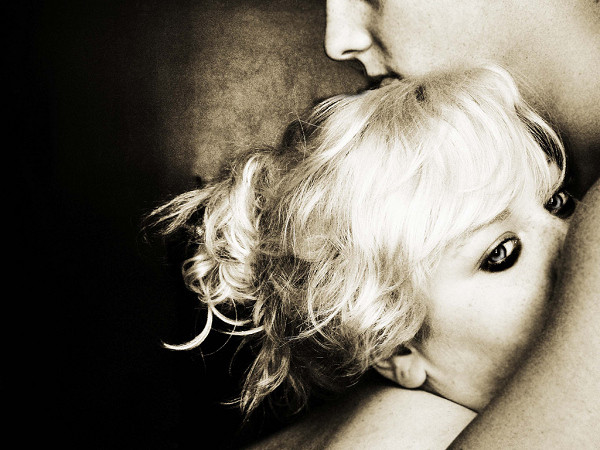

# 我喜欢的姑娘是A cup

**“ 我喜欢的姑娘就是A cup。她每天都开开心心的，没男人时独立自强，有男人的时候也千娇百媚。这样的姑娘从来都是抬头挺胸，玲珑透出的曲线，格外好看。这样的姑娘，没有漂亮的脸蛋，但就是有内涵。她明白，姑娘们，腿型不是问题，脸蛋也不是问题，罩杯更不是问题，女性的美是女性自己做主。管它什么cup，我们的cup，我们自己做主。”**

# 我喜欢的姑娘是A cup

## 文/朱大贶（华中科技大学）

豆瓣上一个帖子，叫，你们不能体会女朋友是A cup的感受，这种感觉会把你们逼成GAY的。看完后我大笑不止，这年头的男人在女人的器官和形体上，总有说不完的抱怨。不过我也挺同情LZ，毕竟如果身边躺着的姑娘真是一马平川，前胸和后背无差别的话，做起事来也不太给力。可这年头，胸的大小也怨不得姑娘，男人总喜欢瘦姑娘，可是长得又瘦胸又大的姑娘，除了日本某些电影明星，还能有多少满足这个要求呢。类似于把睡着的女朋友翻个面再摸一次的笑话层出不穷，不仅道出了A cup 姑娘男友的辛酸，也顺便催生出一句，“我随我爸”的名言。

许多少男应该都曾怀揣着这样一个梦想：夜深人静的时候可以安稳的将脸埋在身旁女人高耸的双乳之间，就算被闷死也能落下个做鬼也风流。当然，我们都懂，梦想之所以为梦想就在于它只是一个梦好的梦，绮丽的想。现实有的时候就特别残酷，只要这世界上有A cup的姑娘存在，就有一部分少男的梦想会要落空。女朋友是A，别谈埋首其间了，一个手掌落在两胸之间都能贴合得没有缝隙的痛苦，总会需要一些勇敢的人去承受。有的男人屈服于女友的淫威，一边说没事，就算A也喜欢，一边在某些女友不在身边的日子，看着电脑里面A打头的日本教育片时，望乳兴叹，眼泪涕泗流。有一妞儿特别强悍，面对男友用儿时的梦想抱怨她的Acup时，很无辜的说，我屁股上有点肉，要不，你凑合？

我特别喜欢这样的姑娘，从来不以自己的A cup不欢乐。罩杯这种事情，我没有多大研究。充其量在上大学后和室友讨论过什么样的胸型最美，据说科学研究，不穿文胸时，自然下垂呈水滴状的半球形胸型最美。当时我就纳闷了，为什么对于女性的身体总会有那么多的标准要求，诸如美腿，美臀，美胸。从齐梁宫体诗开始，女性就作为男性的审美对象在诗歌中出现，大量淫靡冶艳的诗歌对女性身体形态进行修饰，女性如玩物一样置于男性话语之下。男人认为女人怎样算美，才是真的美。楚王好细腰，于是一时御厨减餐，美女争相节食以求一幸。中国女人总是卑微的生活在男性的审美之中，作为审美对象拼命地迎合讨好男人的喜好。唐人喜胖于是女子珠圆玉润，宋人好瘦于是女子弱柳拂墙，美作为女子个人的追求，而美女作为男子的普遍追求使整个社会对美的追求成为一种大众化趋向。每个时代有每个时代的美，而不合时宜的人，如唐代的瘦子宋代的胖子，就算无史料记载，按照一般推测，也可以想象出必定不少人为此郁郁寡欢。

女人追求美是天性，男人追求女人的美也是天性。天性即生而既成的东西，无法强求和改变，如果真碰上不爱美的女人和不喜美人的男人，要么是审美出了问题，要么就是假道学。美的东西放在眼里看着都是舒服的，当然，审美作为一种大众活动，适可而止才是刚刚好，如果追求成了苛求，则无疑演化成一种摧残。维多利亚时代的束胸衣，中国女人的三寸金莲，这些建立在损伤肉体基础上的美的追求，无一不体现出女性屈服于男性审美而产生的一种奴性心理进而引发的自我悲剧。

在我看来，身材相貌这种爹妈给的东西，除了依靠棒子国那些神乎其神的变人技术，改造一番真是颇有难度，耗钱又耗力。总有姐妹大放豪言说要减下多少斤肉，要怎样迅速美白，现在的女人，为让自己变美，总是能特别勇敢地对自己下狠手，各种各样的纠型方法，市面上的美容杂志，减肥丰胸产品永远都不缺市场。但有时候，女人做这些事情，总会出现一些吃力不讨好的事，在如今审美日益畸形化的今天，许多女人为了美丽付出了难以言说的代价。女明星如果不承认自己整了容，总会有狗仔队天天撅着屁股找证据，如果承认了自己整容，一说到谁谁谁很美，无外乎都是嗤之以鼻，切，整过的。男人的口味也大抵如此，碰上大度一点的还好，上辈子做了缺德事遇上个小气的才是个悲剧。相处的时候嫌你不好看带出去丢人，整好看了他自己又别扭了，天天觉得自己像是睡了一个二手的处女，分手的时候还要说，怕将来小孩不好看。遇到这样的男人，甩了也没什么可惜的，棒子国美人金XX的丑娃娃，十几年后摇身一变，照样出落成一枝花。为了男人而让自己更美，这样的追求，从起始就充满心酸，那些变美的代价究竟有多少付出的必要呢？我们欣赏美女，却总是忽视这些美女生成的代价，天生丽质的不算，后天经过非人折磨的，表面光鲜，可光鲜了几十年后依旧逃不掉人老珠黄的命运，而年轻时为美所付出的代价，总会像烙印跟随她们一辈子。整容手术的后遗症就不必多说，丰胸这种对下一代母乳喂养不负责任的行为也不必深谈，但说那些几年不吃一顿饱饭的姑娘，我想着都为你们流一把辛酸泪。

女人如此追求美，症结何在？为己悦者容。有姑娘节食，问其原因，娇羞半天来一句，他喜欢瘦一点的。男人各有所好，环肥燕瘦选择多多，而女人就像被钉在这些框架中一样，男人喜欢怎样的，女人就变成什么样子的。有些姑娘表面上大义凛然，嚷嚷着爱美不美，我长啥样啥样，然后私底下看着心爱的男生搂着别的漂亮姑娘，一边哭号一边捶墙（笔者正是如此）。男人有所好所以女人自有所求，冬天的美腿丝袜，夏天的深V短裙，女人一边解放自己一边又将自己更深的锁到男人的世界里。美得虚荣，大抵不过是对男人施与爱情的一种可怜乞求罢了。

当然，并不是所有姑娘都是如此。大千世界必然会存在一些有个性的姑娘，这些姑娘就算是A cup也会为自己有cup而自豪。她们也喜欢男人，但绝不会因为男人的追求而苛求自己。我生平最痛恨那些D cup的姑娘吼着要丰胸，90斤不到的姑娘喊着要减肥。这些人要么是信心膨胀要炫耀，要么就是闲着没事儿找抽。ABCD各有各的美，何必因为别人觉得哪种更好看，而去为这些难以改变的事情自卑呢。生活还是简单一点比较好，女人的cup是女人自己的事，男人的手只是一个衡量工具，他们爱摸不摸，不摸就摸自个儿去。

我喜欢的姑娘就是A cup。她每天都开开心心的，没男人时独立自强，有男人的时候也千娇百媚。这样的姑娘从来都是抬头挺胸，玲珑乳透出的曲线，格外好看。这样的姑娘，没有漂亮的脸蛋，但就是有内涵，她明白，姑娘们，腿型不是问题，脸蛋也不是问题，罩杯更不是问题，女姓的美是女性自己做主。管它什么cup，我们的cup，我们自己做主。
