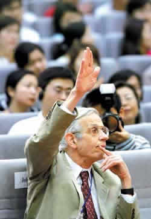
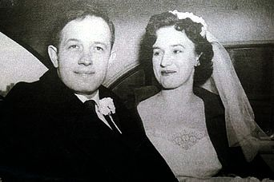
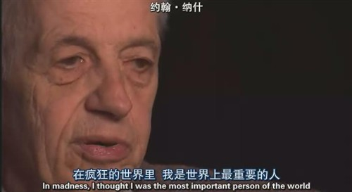
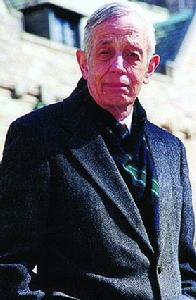
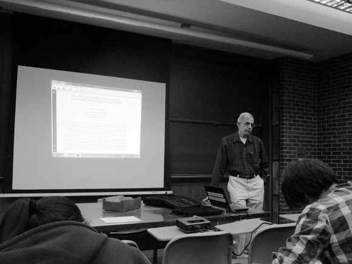

# 我所认识的约翰•纳什

**我想告诉你，《美丽心灵》里那让人动容的授笔仪式完全是导演的杜撰，可是，那个傍晚，在数学楼顶层排着队等着和纳什教授合影或谈话的年轻人们，他们的结结巴巴、推三搡四，难道不比那个子虚乌有的授笔仪式更让人感慨？“纳什教授，我真的——我觉得——你真伟大！”**  

# 我所认识的约翰•纳什

## 文 / 沈诞琦（普林斯顿大学）

 

诺贝尔经济学奖得主，数学教授约翰•纳什是当今最著名的几个疯子之一，他疯狂离奇的经历被改编成电影《美丽心灵》后，在世界各地广为传诵。约翰•纳什共入过两次精神病院，1959年在波士顿附近的麦克林医院（McLean Hospital），1961年在普林斯顿附近的特伦顿精神病院（Trenton Psychiatric Hospital）。两次入院之间他异想天开地从麻省理工辞了职，提取了所有养老金，宣布他要去欧洲旅行。1959年七月，纳什的航班在巴黎着陆，他看到整座城市充斥着抗议核军备竞赛的游行、罢工、爆炸。直到他终于被遣送回美国前，有九个月的时间，纳什在欧洲各大城市游荡，到处都像巴黎那样满是冷战意识下的喧嚣与骚动，北约与华约的黑影不分伯仲地徘徊在欧洲大陆。这九个月极富隐喻的游荡不禁让人联想起虚构世界里流浪四方的英雄们：杜拉斯念念不忘的恒河边上的女乞丐，乔伊斯笔下用一天游历都柏林的布鲁姆先生，当然还有荷马歌咏的花十年时间返家的奥德修斯。这些虚构的英雄和纳什一样，用肢体漫无重点的游荡企图达到某种精神目标。纳什在欧洲目睹的种种疯狂世景让我好奇：一个刚出精神病院的精神分裂症患者如何去面对一个比精神病院更加疯狂的的宏观世界，尤其是这个宏观世界言之凿凿地标榜自己是“正常”的、“理性”的。这个问题也可以反过来问：措手不及的现代性和后现代性究竟让人类变得更理性冷酷还是更激烈狂热？现代人究竟还有没有资格将一部分同类隔离起来，宣判道：“你疯了，你不要靠近我们”，即使疯与不疯的界限已经成为了强权的体现？约翰•纳什的一生或许能作为这个问题的答案。

我必须写写我所认识的约翰•纳什，可我难以下笔。一个开头就是一个定义、一个基调，而约翰•纳什恰恰是难以定义的。在普林斯顿的四年我有多次机缘认识他，“认识”，却不“了解”，每一次认识总是推翻前次刚形成的定见。事到如今，这些复杂的事实和感触，层层重叠在一起，我只能指着他叹息：“看啊，这人……”所有的赞美、怜悯、嘲讽，看啊。

#### 一

那就看吧，看看这人。不过他老了，我入学那年他已经八十岁了，不常在校园里走动了。我是在大一的尾声才第一次见到了约翰•纳什，在那之前倒是经常见到他的儿子。大一时我在工科图书馆找了个闲职，清晨和半夜在图书馆里坐上两三小时，扫扫借书者的条形码。这种时段的图书馆总是很冷清，同学们要么还未起床要么已经休息，倒是几个住在附近的疯子和傻子，雷打不动，图书馆一开门就来，捣鼓些疯疯癫癫的事情，直到半夜你在他耳边三请五请才走。我记得其中一个总穿着宽松的毛衣、一脸络腮胡子的胖子，在电脑前一坐就是七八个小时，他大概得了某种极严重的癫痫，每过几十分钟会突然克制不住地呻吟起来，鼻子翕动着，脚扭动着，这么大声发作约半分钟，他又像没事人似的全好了。他的体内养着一头难以控制的野兽，隔段时间就得大声嚷嚷自己的存在。我开始觉得很恐怖，直到某天，同在图书馆工作的学长告诉我，那个疯胖子是维基百科的正式编辑，每天在电脑前审订无数词条，我才对他肃然起敬起来。时间一长，对经常光顾图书馆的疯子的种种狂状熟视无睹，渐渐少了害怕，多了亲近，在深夜听见癫痫病人梦呓般的呻吟，恍惚像母亲口中的摇篮曲。

这些图书馆疯子中有一个，四五十岁了，头发胡子又长又脏，坑坑洼洼。他总是穿一件普林斯顿的套头衫，两腿大开地躺倒在椅子上，手里一本厚厚的书，经常是不打开的，就放在手上，醒着的时候眼睛直直地看着前方，睡着的时候就仰着头像死去了一样。其他的疯子我还常常看见他们清醒时正常的表情，只有这个疯子，他虽然很安静，但总是陷在极端迷茫烦扰的状态。他经常呆若木鸡地坐上好久，然后蓦然剧烈地摆动脖子和臂膀，眉毛鼻子紧紧拧在一起，嘴里大口大口喘气，像是正在经历极大的苦痛。某一天，他正如此发作着，学长指着他说，“喏，这是约翰•纳什的儿子。”“什么！”我大吃一惊，“他儿子不是哈佛毕业生么？”“那是《美丽心灵》编出来的。精神病是遗传病。”学长冷笑着说。那次残酷的邂逅是我第一次得以把《美丽心灵》与真实的约翰•纳什区分开。后来我还有几次从数学系的同学那儿听说约翰•纳什儿子的疯狂事迹。据说，他儿子常常呆在数学楼的公共休息室，在黑板上写满离奇疯癫的公式，其中一个广为流传的公式是这样的： 

1=水星

1+1=金星

1+1+1=木星

如此种种，直到他把自己所知的星星都写完，甚至连“英仙座”、“大熊座”都有。

得知他儿子真实情况不久，我终于见到了约翰•纳什本人。大一末的某天偶尔在路上走，迎面走过来两个老人，男的高大而干枯，女的矮胖而臃肿，他们穿着正装，大约要参加什么仪式。我认出了男人是纳什，很兴奋地推推边上同行的朋友。他说，“早看到啦。”我又问边上的女人是谁，“还有谁？当然是他老婆。”我心里又吃了一惊，这形象与詹妮弗•康纳利饰演的美丽妻子实在相差太大。朋友看我怔怔的，便半是劝慰半是嘲讽，“年轻的时候大约挺漂亮的，现在老了嘛。说起来，《美丽心灵》里讲得他们如何神仙眷侣，其实他疯了不久后她就要要求离婚，这么多年他们住在一幢房子里，只是同住人的关系，直到2001年拍了电影，他们才又复婚。”两位老人从我们身边走过，步履蹒跚，一声不吭，他们间是那么疏离，既像是陌生人的疏离，又像是熟识无睹太多年的疏离。《美丽心灵》在我心中营造的那个关于爱的奇迹的泡沫就这么被戳破了，我只看到一个寻常老人的卑琐晚境。

#### 二

所幸大部分普通人还是被电影的泡沫鼓舞着，一提起纳什总想到《美丽心灵》；就像许多学者被博弈论的泡沫鼓舞着，想方设法在自己的研究里加点博弈论赶时髦。这些年博弈论在各类学科前沿炙手可热，我在普林斯顿的许多课堂上听到纳什的名字，越是那些像是离博弈论差之千里的领域，譬如生物、比较文学、历史，越是有学者绞尽脑汁想和博弈论攀上些亲戚。在那些讲座里，纳什的名字总是和“纳什均衡”等同起来。只有一次，我在截然不同的语境中听教授说起纳什。那是一节异常心理学讲座，“今天我想跟大家谈一个有趣的精神分裂症病例，病例的主人公是著名的纳什教授。”心理学教授搬出一座庞大的老式录像带播放器，在投影仪上给我们放了一段访谈，我还清楚地记得访谈中旁白的第一句话：“约翰•纳什曾患有严重的精神分裂症，可他坚称他的疾病是全靠意志力治愈的。”

约翰•纳什曾患有严重的精神分裂症，可他坚称他的疾病是全靠意志力治愈的，他痛恨精神病院、痛恨药物，至今说起他妻子将他强行送入精神病院的情形，他都一脸心悸。他共有两次入院经历，第一次入院在专治上层阶级的麦克林医院，那里的医生把精神分裂症当作心理疾病，成天做心理咨询，询问童年经历。他的同事唐纳德•纽曼（Donald Newman）去看他，纳什说：“唐纳德，如果我不变得正常，他们是不会让我出去的。可是，我从来没有正常过啊……”第二次入院在特伦顿精神病院。访谈人和他故地重访，纳什站在草坪上，凝视着巍巍耸立的暗淡的建筑，拒绝再靠近半步。“他们给你打针，让你变得像动物一样，好让他们像动物一样待你。”在这里，他被迫接受了如今已被西方医学界停用的胰岛素昏迷治疗：大剂量注射胰岛素，让精神病人陷入昏迷状态。而病人清醒时，也状如行尸走肉。他开始只吃素食，以此抗议医院的治疗，当然没人把这当回事情。在长时间胰岛素昏迷治疗后，他终于“变正常”了，他生平从没有如此谦逊有礼。同事妻子回忆说：“他看起来乖得就像刚被人打了一顿。”

半年后，谦逊有礼的约翰•纳什终于从特伦敦精神病院出院。他换下肮脏的病患服，交出自己的号码（半年来他没有名字，只有这个数字标识），他踉跄地走出医院，做的第一件事就是去找童年好友，“和我讲讲我们一起玩的事情吧。那个治疗把我的童年记忆给抹掉了。”

如果回归理性仅意味着对社会标准的驯服、意味着丧失记忆，治愈还有多少价值？尤其是对于纳什这样一个把数学视作“唯一重要的事情”的天才。纳什教授心中最纯粹的数学不是理智，而是灵感。理智不过是沟通这种灵感的手段，而若重获理智也意味着灵感丧失，他情愿放弃理智。一个朋友在他住院时去看望他：“你发疯的时候声称外星人和你说话。可是你这样一个理性的数学家，怎么可能相信外星人这种无稽之谈？”纳什回答说，“数学的创见同外星人一样进到我的脑子里，我相信外星人存在，就像我相信数学。”他在笔记本上写道：“理性的思维阻隔了人与宇宙的亲近。( Rational thoughts impose a limit on a person’s relation to the cosmos) ”

从特伦敦精神病院出院不久，纳什拒绝接受任何药物治疗，因为治疗让他感觉迟钝，不能想数学。他过去的同事在普林斯顿大学给他安排了一个研究员的闲职。于是学生们常常看到一个穿着红跑鞋的中年人形容枯槁地在校园里游荡，在整块黑板上写下不合逻辑的公式，拿着几百张前夜刚演算好的数学公式出现在某教授的办公室，他有了个绰号，“数学楼幽灵”，很少人知道这个疯子到底是谁。

而在七八十年代，他周围的亲友开始注意到，纳什渐渐不疯了。他的眼神变清澈了，他的行为有了逻辑。“那么，不靠治疗，你是如何康复的呢？”访谈人问他。“只要我想。有一天，我开始想变得理性起来。”从那天起，他和他幻听到的声音开始辩论，驳倒那些声音，“以理性分辨非理性，以常识分辨错觉。(I reasoned myself out of the unreasonable; I became disillusioned of my illusions.)”

“只要我想。”在纳什这个个案里，疯狂与理智似乎变成了一个自由意志的选择。我甚至不再相信他真正疯过；或许，他理性地选择了疯癫，又疯癫地回归了理性。如此看来，《美丽心灵》是A Beautiful Mind的严重误译，应作《美丽的头脑》或《美丽的智性》更符合真实。Mind固然有头脑和心灵的两重释义，而在纳什从疯癫重获理智的历程，我们看到的是过人的意志和理性压制着疯狂的心灵。或者，说得更准确一些：从七八十年代的某一天起，他有意识地选择将一部分的疯狂运用在数学的灵感上，而将剩余的疯狂用理性囚禁起来。

访谈的录像带放完了，异常心理学的教授说：“纳什不借助药物治疗而康复的案例引起了许多精神病学家的兴趣。他们研究他的生活起居和周边环境，希望他的病例有推广价值。不过在我看来，真正治好纳什的也许不是他过人的智力和意志力，而是荣誉。七八十年代，博弈论在经济学上飞速发展，纳什声名渐隆。1994年他夺得诺贝尔经济学奖后，一夜间开朗了许多，简直变了一个人。领奖后他在街上散步，常常有陌生人向他致敬，‘纳什教授，祝贺你。’”心理学教授的这番评论并非无稽之谈。纳什发疯之时，自恃甚高的他正苦苦追求数学界最高的菲尔兹奖而不得。倘若他能及时得到菲尔兹奖，也许就不会在失落和压力下发狂了。更进一步讲：荣誉降低了社会标准的尺度，在荣誉的光环下什么都变美了、变正义了。狂乱的行为在正常人身上被贬斥为“发疯”，在诺贝尔奖得主身上便被赞美成“特立独行”。那么，有没有可能纳什教授的疯癫并没有被治愈，倒是普罗大众治愈了他们审定疯癫的标准呢？

#### 三

那就讲讲我所经历的一则纳什和普罗大众间的故事，讲讲学术声誉在这座慢条斯理的大学城里扮演着什么角色。大二春天我阴差阳错地当选了普林斯顿数学俱乐部的主席，从此和一帮超级古怪的数学天才成了朋友。这个俱乐部除了定期请教授讲话、周末玩玩需要耗费过多智力的桌面游戏，一年也就搞三次大活动：夏天派队去参加国际大学生数学奥林匹克、秋天组织面向高中生的普林斯顿数学竞赛、春天组织数学教授和本科学生同乐的正式聚餐。我新官上任没几天，就要搞正式聚餐，怕来的人少场面不好看，就向前任主席请教。他说：“请教授是很容易的，你电子邮件群发所有数学教授，便完事了。至于请学生，你就在海报上写，‘想见见约翰•纳什的真身吗？来参加数学俱乐部的聚餐吧！’保准无数人跑过来看热闹。”我照办了，果然很快就有许多同学报名，也有不少教授表示会参加，只是从未收到约翰•纳什的回复。

聚餐那天是五月的第二个周末，我们包下了数学楼最高层的大厅，放上十几个圆桌。赴宴的学生还一个未到，我们正在摆放器皿和食物，就看到电梯门一开，出来三个人，正是约翰•纳什还有他的妻儿。我慌慌张张地去迎接他，“纳什教授，你来大家会很高兴的，聚餐还没正式开始，你不如先坐这桌。”

“你是发邮件的沈小姐？”他这么问道。

“是，是我发的邮件，我叫Lily。”我这么答道。

“沈小姐，你好。”他仿佛没听见我的答话，“约翰•康威会来吗？我听说他会来。”

“康威教授的确回复说会来，他还说他要为聚餐致辞呢。”

聚餐不久就开始了，康威教授没有到，我打电话去他家，他妻子说，“太不好意思了，他彻底把这事忘了。”于是康威教授不会来了，更别指望他致辞。那些回复说一定会来的教授，也有一大半没有出席。“沈小姐，约翰•康威会来吗？聚餐已经开始半小时了。”纳什教授又问我。我说，不会了，他忘记了这事。“是吗。”纳什有些失落，于是我也有些失落，不过同学们倒都不怎么在乎，个个欢欣万分，“不是有纳什在嘛！”大家的眼睛都向着纳什坐的那桌张望，有不少人在去拿吃食时故意走远路，从纳什身边经过，腼腆地打个招呼：“纳什教授好。”高年级的学生向一年级新生介绍，“那是纳什，那是他老婆，那是他儿子。”炫耀着自己见多识广。只是没有一个人，敢在纳什一家坐的一桌坐下来。相比之下，其他教授身边围着学生和同事，大家言笑晏晏。我动员我认识的朋友，“你们情愿这么多人挤在这桌，去纳什那桌不是更好么？想想看，以后可以跟人吹，我和纳什吃过饭……”朋友们有些跃跃欲试，却都开玩笑似地互相抬杠，你推我我推你，谁都没有换位子。这么拖拉了几次，聚餐快结束了，纳什那桌仍然只坐着他和他的家人，剩下七个位子孤零零地空着。他的儿子趴在桌子上，机械地捶着自己的脑袋，他的妻子一言不发地板着脸，叉着手端坐在那里，而纳什默默地极缓慢的吃着一片肉。我看着这番孤独凄凉的景象，自责却无计可施。

正在这时候，一个大一的女孩子走到纳什面前，结结巴巴地说：“纳什教授，我能和你合影吗？我真的——我觉得——你真伟大！”纳什愣了愣，点点头。她站在约翰•纳什身后，甜甜地合了影，然后拿着相机，奔向自己的朋友，又是笑呀又是嚷呀，像是刚做了件顶了不起的事情。大家受了感召，纷纷站起来，走向约翰•纳什，自觉排起了队，有的手里拿着相机，“教授，能和您合影吗？”有的手上什么都没有，那是真正对数学有激情的孩子，想听纳什讲讲博弈论和纳什嵌入定理。突然，和我同桌的大四数学系毕业生也站了起来，他平日里总一副愤世嫉俗、据傲不羁的姿态，这时他手里竟然也有个照相机，他自嘲似地为自己辩解，“他妈的我在数学系混了四年，天天被恶心证明题虐，到头来连张他妈的纳什合影都没有，说出去不要他妈的笑死人了？”

我想告诉你，那个晚春的傍晚所有男生都穿着衬衫和西裤，所有女生都穿着花裙子。我想告诉你，数学楼是全校最高的建筑，数学楼最高层的大厅360度都是没有间隔的观景玻璃。透过玻璃看出校园美如画：卡耐基湖畔荡独木舟的游人正在悠悠地往回划，研究生院的塔楼下几只大肥鹅笨头笨脑地在聊天，教堂和美术馆前还有很多人在拍照，而布莱尔拱门下晒日光浴的孩子们恐怕已经觉得凉了，收起毯子准备回家，至于那些遍布校园角角落落的几千只灰色和黑色的松鼠们呢，他们恐怕又在忙活着筹备寒冬的一场盛宴，或许能从这个食堂偷一只甜甜圈，从那个寝室偷一块巧克力……我们排着队等着和纳什拍照，顺便透过观景玻璃张望着校园的一草一木，而夕阳也张望着我们，大家的脸上身上都覆盖着玫瑰色的光晕。我想告诉你，《美丽心灵》里那让人动容的授笔仪式完全是导演的杜撰，可是，那个傍晚，在数学楼顶层排着队等着和纳什教授合影或谈话的年轻人们，他们的结结巴巴、推三搡四，难道不比那个子虚乌有的授笔仪式更让人感慨？“纳什教授，我真的——我觉得——你真伟大！”

纳什教授已经从疯癫康复了；或者说，自诺贝尔奖和《美丽心灵》后，不再有人觉得他的不正常是件非纠正不可的事情。而他还是孤独的，学生们不敢和他讲话，更别提和他一桌吃饭。但是，那个晚春时节为纳什排起的长长队伍，还有诸多类似于这样的温暖的轶事，大概就足够支撑着他保持淡泊平和，度过自己的晚年。

#### 四

最后，我还想讲讲纳什教授疯癫的起源。纳什生来便是个古怪傲慢的人，数学天才多如此，这本不足为奇。那么，一个本性古怪的人如何突然被亲友认为“在发疯”呢？三十岁的某天起，他突然声称共产主义者和反共主义者是一伙的，他们全是“阴谋家”；他称艾森豪威尔和梵蒂冈教皇对他没有丝毫同情；中东的动乱让他深感不安，他打匿名电话给亲友，说世界末日到了。“这些想法在表面上不是理性的，但它们有可能发生。(These thoughts on the surface are not rational, but there could be a situation.)”他后来解释道。1959年在欧洲游荡的九个月里，他数次去当地政府求助，希望放弃美国国籍；他到了日内瓦，因为这座城市以对难民友好著称，他向瑞士人说，“美国的体制是根本上错误的”，没人相信他。他被送上飞机遣返回国，事后他自称：他被送上了一艘船，像奴隶一样被链条锁着。

冷战的铁幕终于落下了，纳什被亲友们认定的疯言乱语如今看来几乎是先知的预言。纳什的恐惧不单单是个体的体验，而是那个时代集体潜意识里的恐惧。而纳什被斥责为疯癫，被强行打胰岛素进入昏迷状态，难道不是那个时代的极权主义对于个人良知的迫害吗？我注视着纳什像奴隶一样被锁链束缚着的船只。当这艘愚人船在汪洋上恣意漂泊，米歇尔•福柯正在自己的毕业论文《疯癫与文明》中为它赋予深刻的哲学意义。如果疯子不仅仅是疯子，而是揭露了这个社会根本弊病的智者，他们只能被送上愚人船，顺水漂向不可知的远方。古老的河流赋予了愚人船神秘性，疯子被神圣化地隔离起来，作为社会制度的祭品杀一儆百。我想我恐怕已经扯得太远了，虽然我不得不说，1962年起至今，约翰•纳什教授定居在普林斯顿附近，每天到学校上班。如果普林斯顿这所大学对纳什教授的康复有何功劳，那就是它固有的包容和自由拒绝把疯子送进愚人船。疯子们像鬼魂一样地游荡在校园里，而人们仍然尊重体谅。他们自由进出公共图书馆，发病时喊出骇人的响声，却还有人告诉你：“别打扰他，这个疯子是维基百科的编辑……”

上周二，约翰•纳什教授在我所选的博弈论课上做客座演讲。“我想讲讲纳什均衡的历史。”四十分钟里，他一直在讲他所写的几篇论文，太深奥了，恐怕学生中没一个能听懂。可是这不妨碍整个教室坐满了听众，不但有选这门课的学生，还有闻讯而来的旁听者。

向约翰•纳什教授致敬。

约翰•纳什在4月12日的博弈论课上做客座演讲

（采编：崔飘扬 责编：管思聪）
