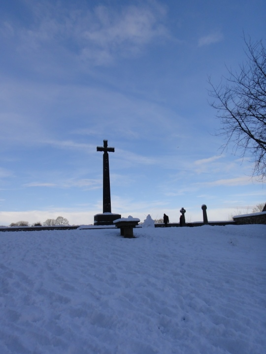
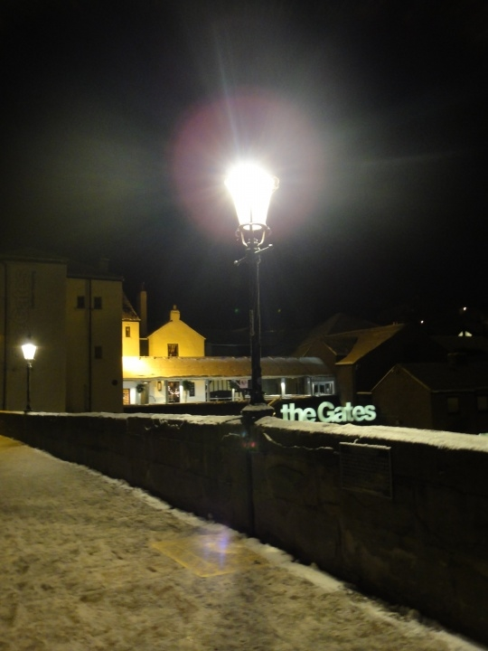

# 杜伦：神性与欲望

**“真正的精华总是存在于亲历者的记忆里，正如有些感受终将留在心中，难以对外人言说。”** ** ** ** **

# 杜伦：神性与欲望

## 文/陈萱（纽卡斯尔大学）

“若我是个诗人，一定要死在这里”，Ivong在杜伦的河边感慨道。而我突然想穿越回五百年前，做一个大教堂里的朝圣者。

——题记

昨天看到杨舒然的校内相册，惊叹雪后的杜伦美得如同人间仙境，便萌生了去赏雪的冲动，恰逢11.27是我们班文学女青年Ivong的生日，她说想去杜伦放松一天，于是我立即买了和她同行的大巴票。我本意是坐火车，但她已经先我一步买了汽车票，后来误了汽车又改火车回来的事实证明坐大巴去杜伦绝对是一个非常不靠谱的选择……（貌似杜伦没有长途汽车站，回程大巴只能在公交站接人，今天下雪它又来晚了，所以我们还没来的及上车它就走了……） 早八点半出发冒着风雪连跑带走一路赶到车站，晚上十点终于从杜伦回到家，脚趾头都快冻得麻木，大风雪吹得头疼，羽绒服的拉链还坏了，这趟赏雪的旅程可真是一波三折，毫不轻松。浪漫主义者从来都不是好当的。 与我居住的地方——高度现代化的工业城市纽卡斯尔相比，杜伦保留了更多的中世纪风情。刚查了一下手机日历上的二十四节气，发现两周前第一次去的时候刚立冬不久，阳光明媚，山清水秀，这次则是小雪之后，河山如洗，银装素裹。 近日来浮躁得很，很久没有好好读一本专业之外的书了，中文生涩到了写起游记都词穷的地步，连中文句式都受到了英语结构的影响，不知是不是因为老在做翻译作业的缘故。这两年看多了欧洲的大街小巷，早已没有了当初的兴奋感觉，但杜伦仍旧是特别的，一如那碧蓝的天空、澄澈的河水和随处可见的烛光晚餐，总能叫游客为之心神荡漾。 

 大巴抵达杜伦还不到十点，我们循着河堤拾级而下，眼前的景象真叫人神清气爽——如Ivong所说，如果不是那满树的积雪，还真像是闯入了另一个季节。这不像是冬天，倒像是冰雪消融的初春了。波光粼粼的河上有一只天鹅孤独地在水面停泊，哦不，那边还有另一只，或许是它的伴侣呢。 “若我是个诗人，一定要死在这里”，Ivong感慨道。她总是一个人走在前面，保持着一种若有所思的沉默。是的，杜伦的确是一个适合艺术家和朝圣者的地方，不知二者能否兼得。 绕河堤走了一圈，我们沿着山坡走向教堂。这教堂似乎有千百年历史，内外皆蔚为壮观，阳光透过彩绘玻璃照在一排排摆放着圣经的座椅上，我随手拿起一本翻了翻，原来不是圣经，而是唱诗用的歌谱。大教堂里面有一个小小的展览，那些水彩画乍一看似乎是业余爱好者所做，水平不算专业却很用心，还有几首别致的诗歌，风格有些哥特。仔细一看介绍，原来这竟然都是出自被关押的犯人之手！一首诗写作者在梦中的花园与故去的母亲重逢，一首写作者内心的忏悔，字里行间的感情如此真挚，让人为之动容。虽然我不信基督，但在这里我真正感受到了这种宗教情怀——博爱与宽容。在中国我只见过监狱里的少年犯到中小学进行声泪俱下的忏悔演说，讲完了再由狱卒装进笼子一样的车里押回去，这么循环往复地“走穴”，我真怀疑他们那些眼泪是不是已经流于对党国模式化的感激涕零。哪个人不曾犯错，只是命运对我们更为眷顾，这样的我们又有什么资格去欣赏别人的忏悔呢？ 从教堂内侧门出，眼前便是天井院，大雪纷纷落下，透过古老的窗棂，只见白茫茫的院子中间那口黑色的棺木，不知安眠着哪位先贤的魂灵。每每惊异于欧洲人可以这样视生死为平常，至少我是不可想象每天散步都会路过一个个墓穴的。或许他们才真的拥有我们民族早已丢失的从容。 在教堂咖啡厅吃过午餐后，雪停了，我又到教堂旁边拍了几张雪景。那片空地上竖着一个高耸的十字架，旁边有一个小木屋，让人不由地醉心于这洁白而静谧的神圣。 

 教堂的书店里有很多版本的圣经，装帧那叫个精美，叫囊中羞涩的我垂涎不已。附近就是杜伦大学图书馆，居然不用任何学生卡和会员卡就轻而易举地进入了。后来发现不仅是大学的图书馆，市立图书馆也是畅通无阻。后者藏书更为丰富，甚至有好几柜英译的日本漫画和整整一书架的吸血鬼小说。高度发达的资本主义国家比我们先进太多，也人性化太多。想想过去在北京常去的国家图书馆，不仅禁止未成年人办卡，更把没有图书证的人拒之门外，而且进门必须存包。连借书都要分三六九等，本科生可以看什么，研究生可以外借什么，某个级别的干部有什么权限……连文化都沾染了等级的气息！更让我不理解的是，那时身边许多同学去国图只是为了在连热水器都没有的大教室上自习（一天要交两块钱座位费），而不是去看书（这可真是中国特色）。相比之下英国的图书馆就像一个休闲娱乐的场所，办证不用交钱，看书不用办证，有舒适的沙发，还有设备可以免费听音乐，更有许多儿童读物供孩子们翻阅。 下午三点雪下得很大，我和Ivong本来想去博物馆，却被冷风吹了回来，于是在图书馆慵懒地翻了一个多小时的书。我随手拿了一本小说the bad girl，似乎是拉美文学，很有趣很唯美，头几页写主人公与一位智利少女的甜蜜恋情，让困倦的我想起许多往事。于是随后半天都在无处释放的情欲中沉沦，直到误车…… 从图书馆出来天色已经暗了，我们来到一家意大利咖啡厅稍作休息。这家店真的很有feel，服务员为我们点燃了桌上玻璃瓶中的蜡烛，空气中便又多了一份摇曳的暧昧情调。于是和Ivong说我想起了前男友，她说那么便给我讲讲你的故事。我说我今天已经讲了许多，不如你来讲吧。她却反复说自己没什么故事，因此继续若有所思的沉默。不记得有多久没有感受过这样的浪漫了。上一次在烛光下用晚餐，似乎是08年秋天，那谁在我对面若无其事地玩手机，他矜持的微笑仍保持着完美的弧度，而我则早已泣不成声。 于是我不由想起下午路过的内衣店。这次分手以后我没有添置过新的内衣，一是因为内衣已经太多，二是觉得除了男人谁会在意你里面穿什么。那内衣店里除了女性内衣，居然还有SM用品，这可是我第一次见到真的，可谓大开眼界了（女人到底更喜欢心理上折磨她们的男人，还是肉体上征服她们的呢？倘若一个彬彬有礼却冷热无常，一个简单粗暴却又体贴温柔；前者是灵魂的撕扯，后者是世俗的激情……）刚掏出手机要拍就被店员告知不能照相，让我不由地有些尴尬，而一转身就看到一排不同材质的dildo。这里果然是西欧。 晚餐在意大利餐厅。上次是白天来的，印象中这里十分朴素，这回却让我怀疑是不是走错了地方。这夜晚，too romantic! 因为刚才在那家意大利咖啡厅吃了美味的烤蘑菇和蒜蓉面包，我便只要了一份清淡的蔬菜沙拉和一杯玫瑰酒。沙拉还算新鲜，红酒却显得有些劣质，只剩下酒精的味道。佐餐的音乐优雅而怀旧，真的太适合调情了。于是便对Ivong说，若我在杜伦有一个恋人，今晚就留下不走。 

 出来不到七点，天却黑的像深夜，桥那边的古堡在黑暗中明灭可见，然而我的卡片机无论如何也表现不出那份神秘感，拍出来的夜景怎么看怎么庸俗。算了，真正的精华总是存在于亲历者的记忆里，正如有些感受终将留在心中，难以对外人言说。
