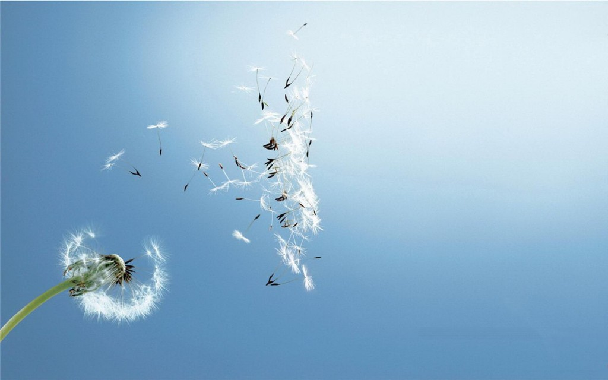
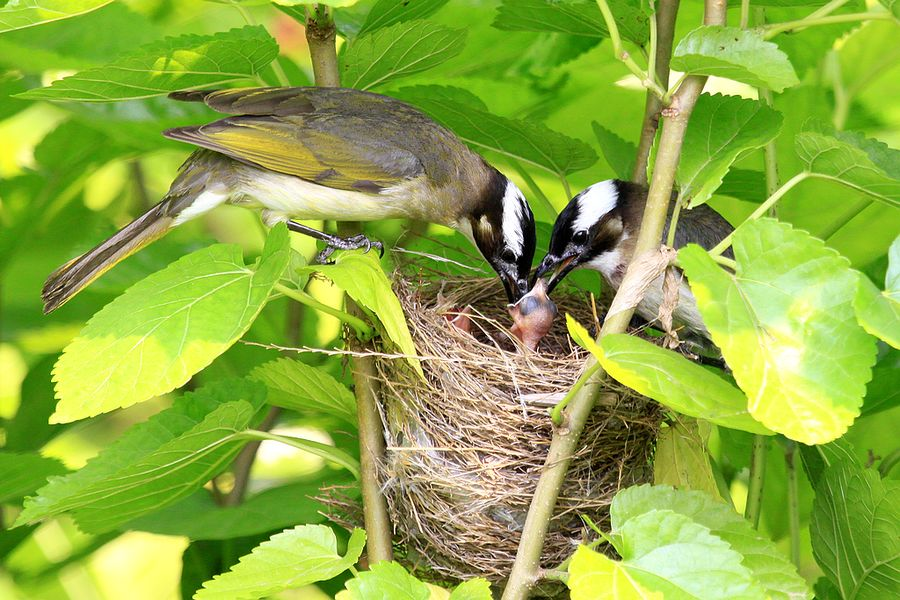

# 没有什么人生是不完整的

**我常常焦躁，因为还有那么多的书没有能够悉心阅读，深刻体味，还有那么多的相识没有触碰过他故意隐藏起来的心底，还有那么多的不曾相识，没备好勇气去敲响他密林中的门扉。还没有真正紧锣密鼓地往前赶，只为了有一天在夕阳下的吊床上吱吱嘎嘎地摇晃出我一生可以讲的故事。我是梦想家，并因此而脆弱。我是实干家，并因此而鲁莽。我跌跌撞撞，有时候会闭上眼睛躺在一个人的怀里，把身心都荡涤抚慰，但还没待眼睛完全挣开，又会有一处新鲜扯住我的衣角，让我赶紧去听去看。**  

# 没有什么人生是不完整的

## 文 / 魏舒（南京大学）

  中午和妈妈视频的时候，妈妈说昨天爷爷已经几乎没什么意识了，可今天却忽然能叫出每个人的名字，和每个人握手。听到这，我真难过。妈妈说，她对着爷爷耳边问：小魏舒现在在国外，马上就要回来了，你等一等她，好吗？爷爷对她摆了摆手，说：我知道，可等不了了，我也不能等了呀…… 看了无数的旅行博客，也认识了很多天性狂野的游侠，于是心里也在默默盘算着下一次旅行应该往哪里走。耶路撒冷，阿根廷还是越南。而人类的智慧渐渐超越了地球设下的界限，也许再下一次的旅行，会希望去一次远望过去荒凉冷艳的月球，也许在那里能看到另一种生机。 

 因为速度越来越快，于是总有一些人说，如果不去这里，我就会觉得人生好不完整。又有一些人嘲笑着，呀，你连巴黎都没去过啊，那你真是白过了。而一直都有很多人，他们一生都只是留在了自己的小村庄，低着头默默走，耗了一辈子也没有弄明白人生玄妙几许，比如，我的爷爷奶奶，外公外婆。奶奶在两个月前去世了，而现在爷爷也已经走到了生命的最后。隔代的老人就这样一个个走远了，爷爷是最后一个。他们的人生就是和左邻右舍话话家常，就是争吵，烦躁，疲惫，素朴的礼尚往来，就是对孩子的不知所措的爱和控制，就是悠闲和认命。站在另一群人身边，他们的生活也许比空白还要单薄，总是岌岌可危，常常差一点就走进了黑暗。可是，当我回忆起我爷爷奶奶的时候，总是只有几句话浮到嘴边，就再也没有什么可说了，我爷爷早上六点起来为病床上的奶奶做饭的时候，我没有机会看到，奶奶因为爷爷暴戾的性格而在70多岁也依然决意自杀最后还是捡回了一条命，我也无从了解。我对于他们生活细微之处的无知无能并不能够抹去他们生活中丰富的细节。在风浪过后，他们平平静静地要去往另一个国度，开始新的生活，也许，逝者重生之后会往完全相反的方向走，一辈子面朝黄土的开始背上行囊走向远方，而一辈子漂泊在外的最终决定要留在家和爱人的身边。革命者不再掷臂高呼，而看透一切决定只做一名庸庸碌碌的顺民，而小老百姓心中的英雄之梦却渐渐编织了起来，最终成了一张抛向天空的铁网，落下来，成为一顶金光熠熠的王冠。每失去一位亲人，我都希望能够捡起他们丢在地上，埋在土里的梦，带着这种使命，走。 我常常焦躁，因为还有那么多的书没有能够悉心阅读，深刻体味，还有那么多的相识没有触碰过他故意隐藏起来的心底，还有那么多的不曾相识，没备好勇气去敲响他密林中的门扉。还没有真正紧锣密鼓地往前赶，只为了有一天在夕阳下的吊床上吱吱嘎嘎地摇晃出我一生可以讲的故事。我是梦想家，并因此而脆弱。我是实干家，并因此而鲁莽。我跌跌撞撞，有时候会闭上眼睛躺在一个人的怀里，把身心都荡涤抚慰，但还没待眼睛完全挣开，又会有一处新鲜扯住我的衣角，让我赶紧去听去看。 可是啊，焦躁又有什么用呢，我读了几本书，我爱过几个人，我踏过多少土地，能够决定我人生完整的程度吗，当然不能，每个人的人生都自成一个圆。“悲欣交集”，就是完整人生，眼角还悬着昨夜没有干的泪痕，一大早起来，就又被浓郁的阳光和鸟鸣给唤醒，于是嘴角的笑又重新归来，旅途中惊魂甫定，却远远看到了橘黄色的只有家才有的颜色，就像一杯伏特加下肚，有个人递来了一杯暖暖的草莓汁。风浪之后，总会有片刻的温暖交替。当嘉兴兄的电脑处在半昏迷的状态的时候，他心焦地说好想写一篇博客啊，我这才发现，写博客也是一种存在方式，是一种毫无功利心的依恋，是对于奔走轮回的一种交待。而Honzo唯一的舅舅在年轻的时候爱上了一位女毒枭，疯狂追随，为她不惜性命，而到了中年之后，最终在加拿大娶了一位温良贤淑的护士小姐做妻子。他在阳光下曝晒，冰风冻雨中赤裸的身体终究埋进了柔软之中。我的朋友Annick是一位出生在Reunion的白人，去年刚刚因为乳腺癌切除了一对乳房，她说：“我不知道它们（癌细胞）什么时候再来，会在哪个部位。 所以我要抓紧时间旅行，读书，探索这个世界。”而我一位过世多年的表姐夫，40岁的时候得知自己已经肝癌晚期的时候，也是坚持在疼痛并不很剧烈的时候，带着自己的小女儿出去旅行，拍照。那个时候我还小，并不明白死亡逼着我们用各种各样的方式去完满自己的人生，而总悲观地想，会不会有一天到了我，我发现什么都来不及了，连再见都来不及说了。事实上，在人第一次有了死亡意识之后，便已经又一把无形的鞭子会抽下来，让我们赶紧地以任何一种方式往前走，划出自己的圆。而索尔仁尼琴的这句话正好就是与之对应的真理——宇宙中有多少生物，就有多少中心。我们每个人都是宇宙的中心。 你的卑微并不能把你代表的那个中心掩盖。 于是，很少有人在提到普鲁斯特的时候，会说他后半生过得很没意思，也很少有人在说到得道高僧的时候，会为他这辈子没吃过几块肉，没和几个女人上过床而为他遗憾。因此，当我们把一种残缺变成一种无意识，并因此而创作出美与力量时，便能够获得一种脱俗的完满。 我愿做一个好女人，抚慰你一生。我愿做个好人，用我的一生抚慰你们。 

 附：如果你看了本文后有什么感悟想和作者交流，欢迎联系作者邮箱weishuchine@gmail.com  

（采编：陈锴 责编：陈锴）

 
