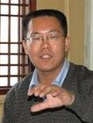
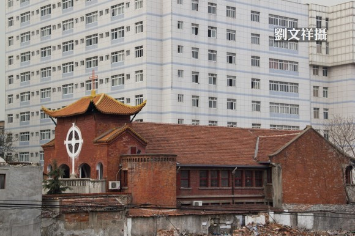
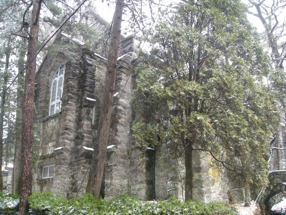
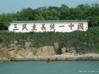
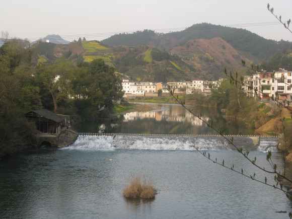
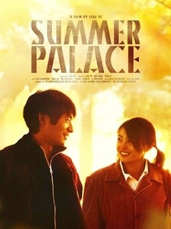

# 蓝色的召唤

**自由不是梦想，自由是每个人内心的力量。** **对于那些不能在十字架下祷告的弟兄姊妹，不会沦丧的是心中的信仰。越是受苦，越是有福，赞美诗是用灵魂来唱。** **对于那些不能在阳光下与家人团聚的朋友，不会消逝的是对自由的追求。自由，弥散在空气的每一个角落，等待着你去呼吸。** ibeidou.org ibeidou.org

# 蓝色的召唤

ibeidou.org

## 文 / 元淦恭（中国人民大学）

ibeidou.org ibeidou.org 第一次看到海，是在从黄埔去罗湖的汽车上，在深圳栽植着棕榈树的滨海大道上。我瞥了一眼南海。远处的山，属于香港，在五星红旗飘扬的九百六十万平方公里土地上，那是唯一一片拥有有限的言论自由的地方。 到了香港，住在香港科技大学，那是个在香港临海边缘的地方。每天早上起来，就可以看到香港山峦起伏背后温柔而坚韧的海岸线。 远处的海渐渐模糊，而海的味道伴着青山的芬芳，沁入我的心中。 那是蓝色的召唤。 到中文大学的时候，专门去了图书馆，翻开那些在中国内地看不到的书刊和杂志，看那些从未看过的照片，我感动，也震撼。 ibeidou.org

ibeidou.org 我看到了二十多年前贴在人民大学校园里的大字报，政治经济学老师曾无数次提起过，我却没有机会看到它们真实的样子。 我看到了我出生前几个月成都人民南路广场的人潮，我知道，父亲也曾经在那里看热闹。 那是一段隐忍不言的伤，既属于官，又属于民。伤口见不到光，在广袤的土地上渐渐化脓。只有香港，每年有一天，会点起蜡烛，告白这个民族的未曾忘记。 维多利亚公园，靠近维多利亚港湾。这个民族，在这离海不远的地方，袒露历史的伤口。 记忆，没有被抹掉。可是时间的老人，谁也战胜不了。 北京终于渐渐热了，又开始想起那个熟悉的词汇，叫做“春夏之交”。 可是这个春夏之交的末尾，再也不会有一个叫司徒华的老人，站出来。 教师、律师和牧师 有一次，一个朋友对我说，一个杰出的社会活动家，大多来源于教师、律师或牧师。这一点都不错，对于这片土地而言，或许这是三个最神圣的职业。 那位叫司徒华的社会活动家，也是老师出身的，不是么？在这片土地上，奔走呼号的人，也有好多都是老师。 这些老师的名字，我们很熟悉。他们在课堂上挥斥方遒，他们在课堂上肆无忌惮。譬如贺卫方，他曾经在课堂上讲起那夜发生的事，情绪激动得无法控制。譬如萧瀚，他曾经在课堂上对学生宣扬，逃课是自由的象征。譬如许志永，他已经不是一个靠言语讲课的人，而成了一个用生命历程来教公民课的先锋。 ibeidou.org

ibeidou.org 这些老师们被谈话，被会商，被停课。可是，他们依然如故。 他们知道他们脚下的这片土地需要启蒙，他们知道那些听他们讲课的学生，需要面对真实的勇气，需要面对危险的担当。因为这是一个中国人无法选择的命运。 有一个叫郝劲松的律师，一直打那些看似被旁人看来“毫无结果”的官司，却往往出乎意料地告赢。他成了公民维权一个温和和坚毅的象征。因为他知道，公民对于权力应该有怎样的态度。他最出名的一句话，是面对女记者柴静的时候说的。柴静问她，你靠什么赢得尊重？他说，靠为我的权利所做的斗争。 这片古老的土地上，律师是个新生的职业。1957年，从事这个职业的几千人，无一例外通通打成右派，他们中间的绝大多数没有等到改正，没有等到重操旧业的那一天。后来，这个国家恢复了律师的职业，恢复了律师的辩护，可是他们却依然生活在重重危机之中。有的人，成了权力的附庸，在这个不公正的司法体制里，过着“闷声发大财”的生活。有的专门做商事官司，远离是是非非，也过上体面的日子，至于对于司法体制的理想，也被他们放在心底。 ibeidou.org

ibeidou.org 然而，这个国家却总有一些不一样的人，有一些与众不同的法律工作者。譬如滕彪，他本来是书斋里的人，却走进了这个荆棘丛生的社会，今天，他失踪了。又比如说倪玉兰，她原本是美丽的，却最后变成今天的模样，现在她也不见了。 去年10月，有一个人放鞭炮，然后进去了。有朋友透过滕彪打听他的消息。现在，滕彪自己也没了消息。 说到黑人民权运动，人们都会想到马丁.路德.金牧师，他说过，当一个人不为公义挺身而出的时候，他已经死去。提到波兰的民主化，许多人首先想到的并不是瓦文萨，而是教皇保罗二世。 这是信仰的力量。 谁还记得，1966年到1976年，在这个国家，一切宗教信仰都被彻底禁止，除了对一个人疯狂的崇拜。 西藏的第二号宗教领袖班禅被投入监狱，而那些持守真道的基督徒，更多地用鲜血和生命做了信仰的见证。 王明道、吴维尊，这些是中国牧师最常举出的例子。 数百年来，在一个敌基督的环境，为了让上帝得着祂的羔羊，有许多外国传教士永远葬身在暴力之下。几十年前，面对一个敌基督的政权，大多数信徒最终选择集体性背主，上帝却还是“为自己留下了七千人”。 至今，这个国家的牧师们，依然盼望着，守望着。 ibeidou.org

#### 没有十字架的教堂

这个国家如此之大，却没有一间合法的地方教会。有一个叫做“三自”的组织，在宗教局的领导下，统管着这个国家的基督新教信仰。许多希望持守真道的地方教会，最后为了活动的方便，还是挂靠在“三自”门下，成了半官方半家庭式的。 可是，还是有一些教徒在政府面前，表现出他们的决绝。 在西南的成都，有一间叫做“秋雨之福”的家庭教会，甫建就要求在民政部门登记注册。他们没有更高的政治主张和要求，他们只希望《中华人民共和国宪法》里关于宗教信仰的部分，不是“一纸空文”。 这样的教会其实不止一间，他们中运气好的，买到了自己的住所，并且悬挂起圣洁的十字架。他们中，运气不好的，买下了聚集点却被拖延给钥匙，聚会地点不得不一变再变。 于是，在这个国家出现了“户外敬拜”。 成都的府河之滨，北京的海淀公园，都有了唱诗班的歌声。这是没有十字架的教堂，没有有形的建筑，却依然可以见证虔诚的信仰。 祷告者相信，他们站在神一边。上帝与他们同在。 前一段时间，看到武汉朋友拍的照片，不胜唏嘘。 ibeidou.org

ibeidou.org 汉正街具有中式风格的救世堂，就要拆了。这个国家所有光鲜美丽的教堂，都是属于天主教爱国会和基督教“三自”运动的“两会”的。即使非信仰者不相信那是神所驻留的地方，文化的瑰宝，也不应该如此被破坏。 那个还没信主的朋友，在自己拍的照片下面说，感谢那些为他们拍摄提供帮助的教职人员，如果有上帝的话，愿上帝保佑他们。 记得在庐山上看到的那个最美的教堂，曾经变成中共高官跳舞的所在。原本神圣的宗教场所，也成了世俗的狂欢之地。那正是在1959年，那个教会被逼迫的年代，也是这个民族历史上最悲惨的年代。 ibeidou.org

ibeidou.org 近千万平方公里的土地上，已经饿殍遍野。敌基督的人，肆无忌惮地向神示威。 ibeidou.org

#### 山雨欲来

昨天和一些朋友吃饭，讲起他们的生活。 有人在滕彪废除死刑的工作室工作，他们的领导，已经消失了好久。在这样的情况下，每一个工作者反而更需要坚守岗位。公民，需要展示他们的力量。强有力的组织，不会因一个人的离开而变得一盘散沙。 许志永创建的“公盟”依然举步维艰，在北京城里搬家搬了好多次。有人说，现在是山雨欲来。不知道什么时候，就会有更猛烈的暴风雨，降临在这个脆弱和坚韧的维权组织身上。 公民维权的路，似乎越走越窄。 这几个月来，好多令人惴惴不安的消息。刚开始是觉得莫名其妙，后来是觉得已经没有力气再去愤怒。 原来“特立独行”都可以成为一种罪名。 想当年小岗村的十八户村民按手印的时候，是不是“特立独行”呢？想当年向阳乡的领导决定取消公社的时候，是不是也可以查查他们的“经济问题”呢？ 一个把“改革创新”作为时代精神的国家，却不允许民众“特立独行”，成了莫名的讽刺。 ibeidou.org

#### 另一种生活

公民，依然富有希望地生活。 有在敏感的组织工作的朋友，面临各种各样的威胁，不胜其扰。可是我们却看到他看球，他娱乐，他饭醉，他听歌。每一天的生活五彩斑斓，他已经战胜了恐惧。 有人会写影评，写书评，也带一点自己的私货。电影学院有个叫崔卫平的教授，不就是这样的人吗？她其实是很文艺的，她其实是很哲学的，当然，她也翻译哈维尔。 有个儿子叫做王书亚的教会长老，也写了好多年的影评。每一次不忘记发出温暖的呼召和邀请。我始终记得，他写过的那句话：如果他的道路，与这不和平的世界背道而驰；那么他追求的和平，也就是世界的和平。” 诺贝尔和平奖，从来不是颁给囚徒的。获奖的囚徒，必然是心灵上的自由人。 有的人，身体是自由的，心灵是不自由的。 另一种人，即使死去，他的灵魂也是自由的。 如果你有朋友和你不能再见，请不要悲伤。因为我们的信念始终与他们同在。我们喝酒，我们聚会，我们歌唱，我们献花。 高墙里的囚室，很多也会有一扇窗。 中国的野百合，并不是没有春天。 
    
    ibeidou.org

#### 厦门岛

想去厦门岛，和朋友们心心念念的厦门大学。 厦大，刚刚九十岁了。 有人说，北大和她所在的城市激烈对立，而厦大和她所在的城市相得益彰。海风吹拂的厦大，和海浪滋养的鹭岛，混在那纯正地道的闽南口音里，变成一曲自由的交响。 人们没忘记，2007年，PX散步的时候，这里的市民力量。 每次去南方，就学会不悲伤。因为大江大海，给予了南方人，对于未来无畏的希望。 我曾路过南方集团的总部，广州城里，那几栋建筑并不显眼。一次又一次的整肃，一个又一个的离开，可是她的核心理念依然如故。中国的进步追求者，不是剥洋葱头，剥到最里面没有心。你要么把他们连根拔起，要么让他们星火燎原。 那个不关心政治的广州，真的很可爱。你可以用迎客松屏蔽信号，却不能用枪炮掰弯良知。 自由，在榕树下生根发芽。理想，在凤凰花开的路口扎根。 对面就是金门，同一个福建省，两个福建省政府，两面“国旗”，挂在这并不远的海域对面，“三民主义统一中国”和“一国两制统一中国”的口号遥遥对峙。而今，意识形态已经消解，隔阂却还是去不掉。差距不只是经济，不只是政治，不只是文化，还是生活方式。 ibeidou.org

ibeidou.org 市政府地下开放给小商小贩，那是真正的“民国”。用高墙阻断“党”和“人民”，那并不是真正的“共和”。 ibeidou.org

#### 汽笛声声

武汉每天醒来，在轮渡的汽笛声里。 这样的轮渡已经开了百年，从帝制时代，到共和时代。只是一百年前的枪声，一百年后成绝响。 这个城市曾经是近代化的先行者，如今已不再是昔日那么抢眼。只有过早摊依旧如故，只有热干面和豆皮，承载了改朝换代也不能改变的城市性格。 长江汉水，静静拥抱着这个城市。滚滚东逝水，诉不尽这座城的光荣和苦痛。 她流到下游，遇见秦淮河。上溯十几华里，便是“桨声灯影”。 风雨石头城里，人们却记得那句诗：“商女不知亡国恨，隔江犹唱后庭花”，胭脂粉的金陵，充满了凄美的味道。 八十年前栽植起的法国梧桐，挡了地铁道。虽然有不舍，虽然有不满，可是南京人还是只能徒呼奈何。 那被称为“台城”的明城墙，墙外烟柳倒影在玄武湖里，鸡鸣寺边的花，正是竞相开放的时候。 天行有常，不为尧存，不为桀亡。 长江的轮船，便是最好的见证。它们一艘艘从下游到上游，从上游到下游，它们在重庆的朝天门停留，它们在武汉的江汉关起锚，它们在南京的下关卸货。它们，永远在路上。 它们和它们身边的城市一样，变与不变。 江风夺不走船员呼吸的自由。 ibeidou.org

#### 他们是同学

去深圳，曾经是一种时髦。因为在特区，最不讲政治。 一个上市公司的高管回学校参加校友会，非常积极参与组织，言谈间透露出领导气质。他开口第一句竟是，我曾是“高自联”的常委。都是三四十岁，甚至四五十岁的人了，听到这个名词，大家笑而不语。 他的同班同学去了深圳，开始做生意。他后来便到了他同学的公司。政治上“失足”的他，在那年本来是不得志的。离开西北到深圳闯荡，最终有了自己的一片天空。 经商对于他们而言，意味着什么，我有点知道，我很想知道，我又不太知道。 国美董事局的新主席张大中，原来拥有自己的“大中电器”，那个公司创办的一千块钱，是他母亲王佩英冤案的赔偿金。他后来出人头地，只是为了告慰自己的母亲。 他去年高调地纪念她母亲九十五周岁的诞辰，刘少奇的女儿也有赶来参加。他母亲坚持刘少奇是对的，毛泽东是错的，最终付出生命的代价，最后却以这样的形式得到报偿。 好多朋友都准备要创业了，我其实还是很欣慰的。 我始终相信，商业是改变世界的力量，经济是成就独立人格的基础。我们需要教师，我们需要律师，我们需要牧师。 我们还需要创业者。 创业，不是为了“闷声发大财”，而是为了“自食其力”。你可以在体制内过得安稳，你也可以卖炸鸡，开桌游吧。人生是属于你自己的，听从内心的召唤，比什么都重要。 ibeidou.org

#### 呼吸自由的空气

自由不是梦想，自由是每个人内心的力量。 对于那些不能在十字架下祷告的弟兄姊妹，不会沦丧的是心中的信仰。越是受苦，越是有福，赞美诗是用灵魂来唱。 对于那些不能在阳光下与家人团聚的朋友，不会消逝的是对自由的追求。自由，弥散在空气的每一个角落，等待着你去呼吸。 我想起了那些小村庄，想起他们的生活。 譬如歙县的昌溪古村，他们聚族而居，居于公路的尽头，清澈见底的昌溪河淙淙流过，村子里一派宁静和安详。我投宿到一家户里，小孩子很聪明，做了各种自制的电子玩具，还说去曲阜的时候买了一本《论语》故事。孩子只有十岁，家教却很不错。“几百年人家无非积善，第一等好事只是读书”，几百年了，徽州都是这样的。 ibeidou.org

ibeidou.org 或许有一天，家庭教会可以建教堂。或许有一天，“特定独行者”不再孤单。或许有一天，网络上没有敏感词。或许有一天，NGO不必再遮遮掩掩。 其实那天也应该是平静的。基督徒依然带着喜乐去祷告，藏传佛教的寺院里依然有序地转经。 每一个田园诗般的村落，依旧日出而作。每一户打麻将的人家，每天晚上依然“碰”“杠”“胡”。 疯狂的岁月早就过去了。当年打麻将在四川是赌博，没人敢平时打麻将，只有办丧事的时候“丧火麻将”是没有人追究的。于是好多人就等着别人家办丧事，好有三天自在安稳的麻将打。 今天，你打小麻将。十天十夜都没有人管。 这个社会毕竟是进步了。 最近在成都，很多人莫名其妙地没了踪迹，有人感叹“忍看朋辈成新囚”。 可是这座城里的人们，还是在火锅店里流连，在小吃摊前驻足，在酒吧街里沉醉，在麻将馆里自在。 府河南河温柔地环抱着这个温和的城市。我也像流水一样温和地看待。我们没有什么值得恐惧的，他们在里面的也没有。成都的朋友们可以自在地享受油菜花香的春天，因为他们的春天其实不会太远。 在涮一片牛肉的谈笑间，或许他们就出来了。 冬天来了，春天还会远吗？ 9号的晚上，人大有两个教室在放电影。 一部是中国电影《颐和园》，另一部是德国电影《窃听风暴》。 ibeidou.org

ibeidou.org 这便是自由的缝隙。  ibeidou.org ibeidou.org

（采编：管思聪 责编：管思聪）

ibeidou.org ibeidou.org 
