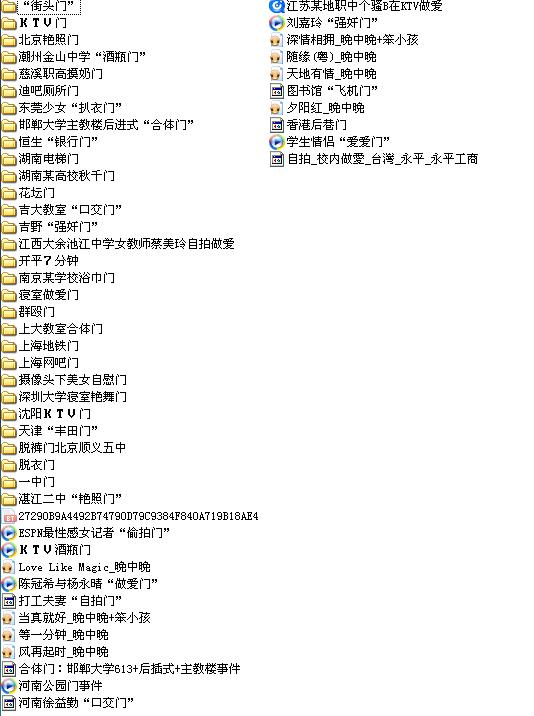

# 让伪工科男去死

**“工科男没有七情六欲么？当然有，但是那句描述牛逼顿的话怎么说的来着，“发现自然界的真理带来的快感远比性爱销魂和持久的多...”所以能打动工科男的人，即使画不出心形的那个二元函数，也必然不是低俗无趣的姑娘。”**

# 让伪工科男去死

##  文 / 刘悦（中国海洋大学）

 如今装文青的人很多，是因为入门起点很低，看几本书几部电影介绍再从豆瓣混一星期就可以出师成艺术家了，还有各种装X指南...随着文艺青年名声渐臭，他们又装起了工科生...回想起自己和其他一些工科男们的生活经历，特写出来，希望群众们明辨是非... 那些只知道二次方程的解是2a分之负b加减根号b方减4ac的男生不是工科男，他得知道二阶微分方程有特征根和拉氏变换两种解法，并说的出孰优孰劣； 那些罗列的出Java C# VB名词的男生不是工科男，他得知道如何用C描述一个中断函数，并且拿中断函数TX、RX实现串口通信； 那些只会拿牛顿被苹果砸中发现万有引力当成作文例子的男生不是工科男，他得会用微积分通过角动量守恒和开普勒第三定律推倒出平方反比律，最好还是在向量形式下。 那些只会拿free gate甚至百度个在线代理糊弄女生声称自己也会翻墙的男生，他们不是工科男，工科男大都拿google提供的API自己架VPN，然后下个GFW List当白名单，从此twitter facebook一律自动翻墙，其余网站自动不翻墙，省去切换烦恼还稳定。 那种没事给你贫360怎么被腾讯欺负了的，绝对不是工科男。他们不出声是因为工科男不怎么用360那种小白软件。其实他们有部分人不爱装杀软，反正从win98到win NT到win2000到win me到winxp早就安装过无数遍，坏了ghost就是。当然他们用vista和win 7的也不多因为太花哨，相当一部分人用Linux...还有些人数十年来对DOS的命令符提示界面情有独钟... 工科男一般不用迅雷狗狗一类工具找电影，也不大上优酷土豆——flv格式清晰度太低。每次看到海大8301教室放200Mb的rmvb电影我都特别淡定不了，你Y这么大屏幕，不能找个清晰点的么。还带着什么“伊甸园BT下载，仅供学习使用，请于24小时后删除……” 

 工科男实在，长期的数理推导训练他们有一就是一； 工科男讲求原则，就像编写程序一定要按语法书写，有错误不debug就坚决不让你编译； 工科男大都热情，他们有一肚子的知识和本领想和你分享，如果你信得过他，他不光能给你换灯泡还可以帮你们宿舍偷电。 工科男脾气懂的等待和坚持，因为在每次探索每个实验中他早历遍了失败和孤独； 工科男也许很羞涩不懂言语，但是他们思路很简单，就是对你好不是速度推倒； 工科男也很浪漫，我看过那篇日志“一生都等为我手绘这个函数的人”，笛卡尔的故事。真把哥感动了，那个心形的二元函数，不是很浪漫么； 工科男那里当然也有AV，甚至他们可能就是某情色大站的斑竹，试想如果工科男不压片、分流、出种子，那些小白们上哪里下XX呢...放心他们心态好的很，思维简单的比无码还清晰。也许他们只是喜欢网站被墙掉后如何通过动态链接继续维护的乐趣，他们心中，与GFW斗，其乐无穷。 真正的工科男安稳的很，光棍节对他们没什么不同，还是宿舍、实验室、食堂三点一线的生活。看到给挫男织毛衣的女生也许会叹息一声，不过还是会加紧步伐，买设备的钱还得去报销呢，去晚财务处就下班了，那帮混蛋可不像工科男一样工作起来没日没夜。工科男没有七情六欲么？当然有，但是那句描述牛逼顿的话怎么说的来着，“发现自然界的真理带来的快感远比性爱销魂和持久的多...”所以能打动工科男的人，即使画不出心形的那个二元函数，也必然不是低俗无趣的姑娘。 更重要的一点，学习工科只是真正工科男的必要不充分条件。也就是并不是所有工科学生都是真正的工科男，至于如何辨别真伪，您得返回文章开头来看了。
