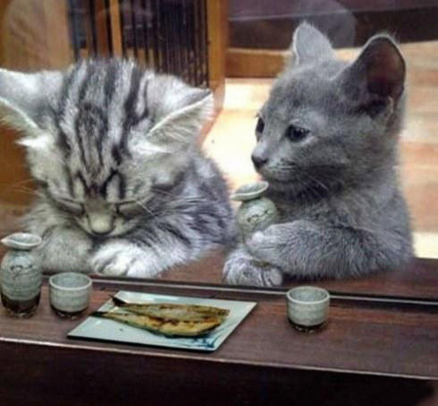

# 长恨此身非我有，何时忘却营营？

**我可以忍受为了写东西呆咖啡馆里一个星期不洗澡，三天三夜不睡觉，我可以忍受身上的钱只有六十块，跟女生吃饭发现钱不够，押上学生证，我可以为了学术梦想放弃工作，只身一人，漂泊江湖，我可以忍受因为立志学术与文学，被女人骂“你就这点钱，找鸡都不够”，我可以忍受一切贫穷寒冷皮肉之苦，但我无法忍受这几个字。** ** **

****

** **

# 长恨此身非我有，何时忘却营营？

## 文 / 张亮（北京大学）

 我从前有一个女朋友，在电话对我哭诉说，明天就去辞职，绝对不在银行里干了，再不用面对无数猪头一样想揩你油水的客户，不用喝无数喝不完的酒，不用对领导们四面八方，铺天盖地的骚扰短信兵来将挡水来土掩。我问她，那你辞职以后想干什么，她喃喃自语：“当一个乡村女教师。”第二天我给她电话，问她辞职以后的感觉咋样，她淡淡道：“正上班呢，忙着，回头再跟你说。”我问你不辞职了？她笑道，辞职了，谁给我饭吃，谁养我的车，谁供我的房子？我的父母怎么办？”她的意思，自己的事情，不全是由自己的脑袋决定的。 我从前有一个堂弟，当然现在他也是我的堂弟，有一天晚上跟我玩电玩，边玩边说，他不想参加高考了。我问为什么，他说，有一个问题他思考了很久。我问什么问题。他正儿八经道：“人类对于地球是有价值的吗？除了让环境恶化，让地球充满同类的自相残杀，让地球加速自然进程的灭亡，它有什么价值？如果说医生对病人的价值是治好病人的病，教师对学生的价值是教学生知识，棺材铺老板对死人的价值是帮它找到住处，那么人类对地球的价值则只有毁灭。所以，我怀疑我是否应该作为人类的一份子，活着，并祸害人类。我想我也许会活不到参加高考的那一天了。”一年以后，我在北京接到他的电话：“哥，我考到成都了，跟你当年一个学校。”我笑他，当初不是说不参加高考吗？他小声说，本来有一次想要死的，手机响了，是一个好同学的短信：“XXX，去玩魔兽世界吗？”瞬间，千辛万苦下定的决心灰飞烟灭，一溜烟冲向网吧，仿佛那身体不属于自己。 我外公还在时，一直在写入党申请书，从刚解放那一年一直写到六十岁退休，整整三十年。到他六十岁那年，组织上终于批准，经研究决定，对他解放前参加三清团的个人历史认定有误，他是一个好同志，他可以入党了。本来，他应该欢天喜地，和年轻人一起参加入党仪式，时刻准备着，喜极而泣，但那时，他站在贴满颜真卿、柳公权、王羲之、苏黄米蔡字帖的屋子里，四面墙壁上都是他三十年来临摹的各体书法，他长叹一声，罢了，从此不再参加什么仪式，专心临摹古人们的字到死。我想，他那一声长叹就是身心的解脱吧。 于是，列夫。托尔斯泰离家出走，一个人死在无名小火车站时，临终遗言是：“死亡，多么值得赞美的死亡，解脱了，终于解脱了。”然而，解脱于我而言，却也是奢求，从前，我写过一本小说，叫《田文亮的奇异生活》，八万字发乎内心，半个月内一气呵成。出版社的编辑看了很喜欢，要我跟他签合同。那是我第一次签出书的合同，和每一个第一次做父亲，第一次生孩子的母亲一样忐忑无助。当我签完合同，等待印刷的前两天，编辑突然对我说，要把书的名字改成《北大，给我一个姑娘》。我说绝对不可以，他说合同上白纸黑字，“本书的署名权由出版方享有。” 我的处女作贞操就这么被夺去，从此，我想过不再写小说。但某一天夜晚，当我坐在一个叫斯多格书乡的地方品咖啡，清风徐来，吹响铜质风铃，舒伯特大提琴奏鸣曲穿过耳膜，阵阵鸟语花香越过竹帘，无数往事，无限江山，浮上心头，我不由得打开电脑，再一次敲响键盘。 前几个月，我的小说已经完工，上一个星期，编辑告诉我，结尾不和谐，需要彻底修改，以符合伟大祖国和谐社会的要求。我淡淡道，那请您帮我改吧，他笑道，杀人放火的事儿我可不干。他的意思是要我自宫。 终于，我又要逼自己亲痛仇快一把，恰在此时，一位北大的同学在我的豆瓣上留言：“人家冯唐的书叫《十八岁，给我一个姑娘》，你丫也好意思只改两个字。”我可以忍受为了写东西呆咖啡馆里一个星期不洗澡，三天三夜不睡觉，我可以忍受身上的钱只有六十块，跟女生吃饭发现钱不够，押上学生证，我可以为了学术梦想放弃工作，只身一人，漂泊江湖，我可以忍受因为立志学术与文学，被女人骂“你就这点钱，找鸡都不够”，我可以忍受一切贫穷寒冷皮肉之苦，但我无法忍受这几个字。那瞬间，我突然想起卢梭的名言：“人生而自由，无往不在枷锁中。”一见到纸张笔墨，键盘和文字，就让我快乐，就让我飞升，顾不得我兄弟的告诫：“身为一个非著名写手，你的宿命，不是被强奸，就是被阉割。” 从前有一个非著名写手，他也早告诉过我，人的一生，就是一个缓慢被骟的过程，他的第一本小说在香港出版，名不见经传，被出版商活生生改成《王二风流史》，多年以后，当他死去，人们只记得《黄金时代》，而记不得什么《王二风流史》。王二还告诉我说，他其实一直不想写小说，但最后，他还是写了。他也不想再四十五岁死去，但他死去了，他更料不到身前寂寞，死后哀荣，但事情就这么发生了。我想，有朝一日，若是能够亲眼见到他，和他同喝一壶二锅头，一定要敬他一杯酒，对他道一句：“长恨此身非我有，何时忘却营营。” 

