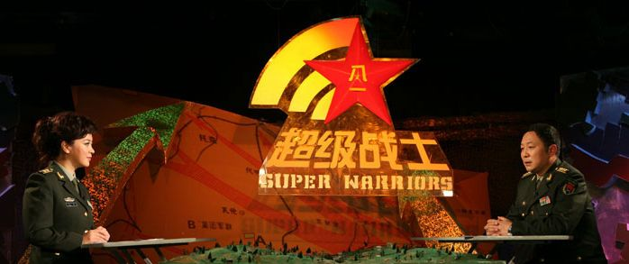
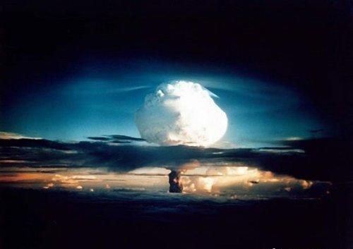

# 跨越边界的第一步

**你们倘若攻台，从来就不是正义之师，是你们自己建构的中国民族主义(而且是坚决拥护共产党某些既得利益者的中国民族主义)让你们的侵略行动看来合理，而这样的一场战争对台湾人来说却是生死挣扎存亡的大事。 ** **这样的困局如何可能解决呢？看着诸位中国网友，我常常感到心灰意冷，更遑论那些「留岛不留人」的激进愤青了。 **

### 

### 

# 跨越边界的第一步

### 

## 文 / 匿名台湾网友

### 

### 

「﹝齐宣王﹞曰：『德何如？则可以王矣？』﹝孟子﹞曰：『保民而王，莫之能御也。』﹝齐宣王﹞曰：『若寡人者，可以保民乎哉？』﹝孟子﹞曰：『可。』﹝齐宣王﹞曰：『何由之吾可也？』﹝孟子﹞曰：『臣闻之胡龁曰，王坐于堂上，有牵牛而过堂下者，王见之，曰：『何牛之？』对曰：『将以衅钟。』王曰：『舍之！吾不忍其斛觫，若无罪而就死地。』对曰：『然则废衅钟舆？』曰：「何可废也？以羊易之！」 从前我们研究所社会学的课提及「我群」与「他者」的概念时，我就不禁联想到上面这则典籍的原文，这则故事很有趣，孟子常常急切地为了推行仁政，给予战国时代那些国王们过多的鼓励，这其实很像老师在鼓励学生要认真求学一样，然而我常想当时的那些君王可能也常把孟子当作耍猴戏看吧？ 为什么这段小故事适合来说明「我群」与「他者」的概念呢？ 被牵过堂下的牛儿原本是要被宰杀来祭祀的，它所表现出来的「斛觫」模样，让齐宣王起了恻隐之心，而认为它「若无罪而就死地」，牛儿的可怜颤抖模样激发了齐王的仁心，然而看到故事最后却让人深觉莞尔。齐王说：「何可废也？以羊易之！」 那头小羊，或许正高兴在羊圈里跟同伴玩儿呢？但是在这样一来一往的应答当中，却决定了它「衅钟而死」的命运，我们或许可以来猜猜这个故事的「潜文本」是什么？那头小羊再次地经​​过堂下，也跟牛儿一样「斛觫」的时候，齐王可能正在睡大头觉呢？它遥遥望见那炙热日头严晒下的「刑场」，察觉到自己的生命很快就将划上休止符了。 

### 

### 

### 

牛儿其实就是「我群」的写照，羊儿就是「他者」的注脚。在「我群」之间「爱与理解」「有机会」可以相互流动，同理与同情心「有较多的机会」可以建构。然而「他者」往往是没有脸的人们，他们跟那些瞬间大量被扑杀的蚁类没有多大的差异。我们与他者之间，不但常常没有多大的机会可以「相互理解相互同情」，即便真的有机会可以互相交流，「非我族类，其心必异」，一道早已被形塑的藩篱早已横亘在彼此中间了，一些刻板的想像与自觉或不自觉的污蔑早已蠢蠢欲动了。 这就是一道时而清晰可见时而模糊不清的边界线。 「我群」与「他者」跟「共同体」及「认同」是一整组的概念，这其中的关系错综复杂，许多优秀学者皆早有论之者，我不想再重复他们的论点。我只想问几个简单的问题： 1.为什么「我们」总是可以对「他们」残忍？ 2.人们碍于生命的空间与时间的有限性，没有足够的机会与所有的「他人」同情共感，相互理解，这种先天上的限制可以作为一种宿命论的合理化理由吗？人是否可能「超越」这种先天的限制呢？如果可能，用什么工具来「超越」？ 优秀的学者们告诉我们，近代民族国家的形成，它渐次僭越了过往许多庞大「想像共同体」(安德森语)的地位，小至亲族认同，大至宗教神明的地位。 (当然在现实状况下它们是共存的，只是民族国家，现代主权国家成为了最大的想像共同体的单位，而传统的认同力量被削弱)而自二次大战后第三世界民族国家的崛起迄今，虽然有些学者认为民族国家将成为明日黄花，然而从现在在联合国里头仍然是一堆民族国家的情况来看，似乎还得需要很久的时间，它的地位才有可能式微。 我尝试思索第一个问题。是从前阵子看到网友在谈台湾若遭受攻击，将反击毁灭三峡大坝，促成中国长江流域不可想像的人命与财产损失的偶发事件有感。 一个「死伤数字」往往是「去脉络化」的。它不让你深刻地感到什么情感与爱的流动，它只是个冷冰冰的数字，而也唯有战争、天灾中殉难的死尸与破败的人为建筑才能唤起人们对那个黑白世界中的「同情共感」 ，人感知到别人「死亡的事实及过程」，而激起一种内发的「切肤之痛」，旁观他人的痛苦时，它也同时产生一种避免自己也变成如此的拉力。然而这是存在于「有机会」感知别人痛苦的时刻，正因为「死尸」早已失去控诉的能力(他的尸体与别人观看的过程成为控诉的本身)，而屠戮只会引来更大的屠戮，直到一方完全没有抵抗能力或是被完全消灭为止。 当前中国与台湾不对称的军事力量，台湾军队只能苦求一种「有效吓阻」，正如蜜蜂螫人之后就随时准备走赴黄泉。如果尝试用一种冰冷而静酷的军武迷的口气来说话，那便是：「中国军队只要有机会能够瞬间有效地拿下台湾，并且有效阻挡美日介入台海战事，那么中国军队没有理由不这么做。」 不管是中国那些愤青们或者愿意理解与思考台湾人想法的中国网友，我身为一个台湾人，当然期待愿意理解台湾人想法的人多些，愤青少些，然而真正兵戎相见的时刻，许许多多人可能都将只会是一个「死伤的数字」而已。 

### 

### 

### 

中国网友一直不愿也总是模糊焦点的就是─自台湾国民党时代到现在民进党执政的对台武力恫赫的这种「先行暴力」，它不爱理性思考，它也不屑所谓的「同情共感」，这个根本上的矛盾在于一种中国式的逻辑─基于无可质疑与批判的中国民族主义，我们必须用攻打台湾来表达我们拥护中国民族主义的立场，而没有察觉到这样的中国民族主义立场，根本上是以共产党的既得利益者们的利益为出发点的。 这便是中国网友论述的一个很根本却一直不愿面对与思索的问题与罩门。 老子第六十九章有云： 用兵有言﹕「吾不敢为主而为客，不敢进寸而退尺。」是谓行无行，攘无臂​​，扔无敌，执无兵。祸莫大于轻敌，轻敌几丧吾宝。故抗兵相加，哀者胜矣。 擅自发动战争无疑是人类的公敌，最该死的是残害别人的性命却用一些无耻的理由来合理化之，这就是赤裸裸的邪恶霸权。二战纳粹用民族优越来屠戮犹太人，现在你们可以借以屠戮我们与我们所爱的人和爱我们的人的理由，竟然是一个「不成为共识的『共产党式的中国民族主义』」，这种不建立在思辩与协商的「共识」无条件地必须且应该，暴力地优位于台湾人的自主意识。老子对战争的看法从来就是一种被动的、制裁暴力的立场，并且认为胜利了必须当作丧事来办理，以爱和关怀来结束战争。老子他认为不求战也不怯战，并且认为用爱与悲痛来作为战争的救赎。 一种「单方面并且不可质疑与批判的」中国民族主义立场，正是台海问题当中最为邪恶的核心价值。然而这却是肇基于一种「凝聚中国民族主义」，强化我群的迫切需要，因为「台湾他者」是促成「中国我群」团结的重要力量，而这只不过是中美日争霸的第一个理由罢了。 你们倘若攻台，从来就不是正义之师，是你们自己建构的中国民族主义(而且是坚决拥护共产党某些既得利益者的中国民族主义)让你们的侵略行动看来合理，而这样的一场战争对台湾人来说却是生死挣扎存亡的大事。 这样的困局如何可能解决呢？看着诸位中国网友，我常常感到心灰意冷，更遑论那些「留岛不留人」的激进愤青了。 

### 

### 

爱与死其实是一体两面的，爱因死而生。毁灭或破损的事物总是看起来特别像它原来那样。从一个角度看，爱跟毁灭是相提相生的，我群的相爱合理化了他群的死灭，从另外一个角度来看，爱与痛心(台语的爱心曰痛心，这是很适切的一个辞汇)却又有可能能止战与消战，并且为我群与他者之间搭起桥梁。纵然这样的论述在社会学尤其是某些巨型理论中看来根本就是唯心主义的痴人说梦。 然而，我仍然期待着，偶尔对中国网友「痴人说梦」一下，说不定某些人能懂我们台湾人在说些什么。 或许，或许吧。道德劝说，似乎永远只能是弱者对强者的论述罢了。期待着，期待着，某些中国网友真的能懂。 

### 【附】

首届海峡寻新香港论坛（STHK）于4月1日在香港大学召开！ STHK为您倾情奉献兩岸民眾心聲！ 期望与您一同探讨台海问题！ 4月4日至6日，4场专题演讲，十数位学者专家！ 我们期待您的到来！ STHK官方网站：[http://www.straittalkhk.org](http://www.straittalkhk.org)

### 

### 

（采编：陈轩 责编：陈轩）

### 

### 
