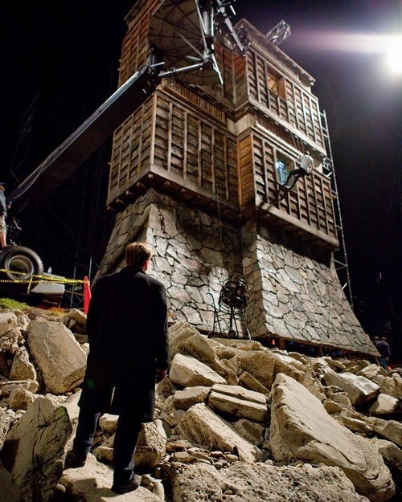
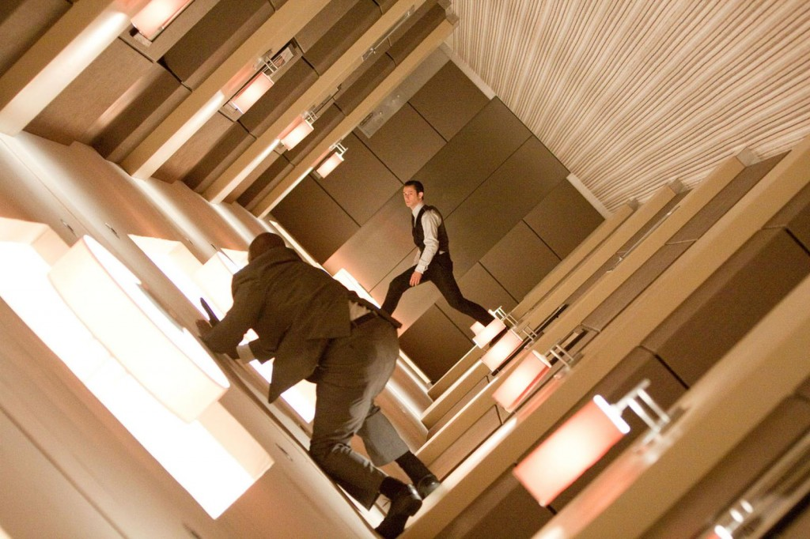

# 《盗梦空间（Inception）》：一场很酷的催眠治疗

**到底何者为梦，何者为现实？一旦人们执著于这样的问题，他们最后必然会掉入梦中而不是回到现实：梦太美好了，太无所不能了，而现实中他们必须承认自己是一个普通人而不是“超人”；即使在有陀螺的情况下，他们依然可能选择忽视它，而这正是现代文明社会中神经症的一种起源。** ** **

# 《盗梦空间（Inception）》：一场很酷的催眠治疗

## 文/乔淼 （北京师范大学）

 Inception和Extraction，影片《盗梦空间》里最重要的两个词。在Webster College Dictionary里，两个词有一个共同的意思“起源，开端（Origin）”，前者还有“取得学位”之义（在学校修成了正果，该“开始”工作了）。若如此，将片名翻译为“盗梦”，恐怕是不足涵盖其中深层意味的。 影片的主线剧情我以为并不复杂，大体上是平铺直叙、逐层演进的。可以分为四个段落：（1）Cobb和同事对斋藤（Saito，中文字幕里翻译成了“齐藤”）进行Extraction，即盗取对方的想法，结果失败。（2）Saito反过来雇佣Cobb，提出Inception的任务，即要给对方“植入”一个想法；Cobb召集团队成员，并作准备。（3）执行Inception的任务，过程很动作，很暴力，也很酷，是影片的高潮部分。以及（4）Cobb在潜意识的最深层解决了Mal的问题，并找到斋藤，回到现实中，回到他的家里。过程中夹杂交代主人公Cobb和妻子Mal的故事，以为背景的补充。只是因为加入了“梦”作为主题元素，才显得剧情复杂而交错。如此一来，对影片的理解，也就成了对“电影”这个现实成分的“解梦”。——当然，作为一种艺术形式，电影在某种程度上，确实是主创人员呈现给观众的一场大梦。假如要把这147分钟内的每个细节都分析出来，这部电影我需要再看几十遍，而且还得写成一本厚厚书。故这篇文章只是简其大略，其余则留给诸位自行体会。 

### ·意象分析：不是梦而是催眠

在影片中，导演设置了多达四层的梦的结构，也就是在梦中做梦，再做梦，再做梦。梦得越深，时间变得越慢，场景变得越不稳定。实际上，这与我们经历的梦的场景或结构并不一致，反而像深度催眠。首先，梦与现实的时间进程大约是一比一的关系，也就是说，梦中的一小时，在现实中也需要梦者一小时的有梦睡眠。而恰恰是在深度催眠中——即反复强化被催眠者的催眠状态，使其精神活动达到极深层次时——受术者会认为时间流逝的比率变大，当他以为过去了几个小时的时候，现实中的表针可能只走过了几分钟。其次，梦是很难像影片中所述的那样，被预先“设计”出来的，一个人也很难有意识地重复或延续一个特定的梦，两个人也很难“分享”一个相同的梦境（所以编剧只能借助于一种“共享梦”的技术，就是片中盗梦者手里的那个箱子，用类似血压计的仪器把几个人“连”在一起）。在催眠中，施术者对受术者进行的催眠引导则可以是“场景引入”，譬如，“想象一下，你现在正置身于XXXX的场景中……”，此时双方在某种程度上，确实会“共享”同样的梦象。再者，片中的药剂师所配的药，其中掺有“镇静剂（Sedative）”，其作用是抑制神经系统的活动性（近似于情报机关审问间谍时注射的药物），这正是催眠而不是“催梦”的特征。故而“盗梦”的过程，其实更像用催眠与暗示“诱使”对方交代秘密，而不是真的“盗走”了对方的“梦”。 有关梦的层次的设定进一步说明了这一问题。一般人的梦境是没有泾渭分明的层次的，只有一层。梦中意象所代表的心理内容的深度，是根据象征关系的隐晦程度来推断的。比如说，在梦中的保险柜里存着的东西，就比梦中书架上摆放的层次更深。让人在睡梦中再梦到做梦，这也很难。我自己曾经体验过“梦中有梦”，但是第二层的梦就很模糊，基本上记不清什么东西；反倒是第一层梦中的细节提示了我的某些深层的心理成分。在催眠中就不存在这种困难：催眠师可以根据治疗的需要，带领被催眠者不断向深层次进发。在这个过程中被催眠者的心理世界确实会像埋在地下的一座大楼，有许多层，每一层的内容都有不同；催眠师则像控制着一部电梯，可以随需要进入这个大楼的任何一层。 越往下走，就相当于进入潜意识越深，就越远离意识，从而梦中“有序”的、“可控制”的成分越少，就像Cobb在片中所说，“对方的潜意识会发出抵抗”。在小Fischer的梦象中（也就是盗梦者们“造”出的梦）中，“抵抗”不仅仅来自全副武装的“防御者”，也来自于梦境中的环境本身。 

 在第一层梦，也就是城市街道中，整个场景中下着大雨。片中交代是因为做梦的药剂师在现实中喝了很多香槟，尿急的结果。不过另一方面，雨也可以表示消极的情绪反应，特别是悲伤；雨越大表明悲伤的程度越高。小Fischer的父亲刚刚去世，这场雨同时也可以理解为他内心悲伤的体现。在斋藤中弹后，盗梦者们从街道逃进了一个监狱，与其说这是设计师Ariadne（无独有偶，这也是克里特王米诺斯的女儿的名字，正是她给忒修斯的线团帮助他逃出了关押米诺陶的迷宫，下文中我们还会讨论到她）的设计，不如说这是“梦的自我设计”，即它同时反映了Fischer心里的困惑感和Cobb的自责情绪（这个后面会讨论到），因为“监狱”正是“监禁”的象征。在第二层梦，也就是豪华酒店的场景中，酒店先是左右摇晃，随后整个场景都失去了重力。失去重力象征着“失控”。一方面，第一层梦中小Fischer防御者追击，造成盗梦者们的车子左右摇摆。另一方面，这也可能确实是小Fischer更深一层的情绪反应，也就是他极力希望控制自己的生活，希望它井然有序；这种压抑性的努力最终归于失败，体现为第三层梦中的大雪崩（象征着“崩溃”、爆发式的情绪表达）。同理，第三层梦中的“医院”，与其说是医院，不如说是军事要塞更贴切一些。类似的情况，比如与“黑衣人”枪战、被“保安”追击、和军队“打仗”，会发生在许多人的梦里，这类梦的主题通常都是“战斗”，而战斗的对手，就是做梦的你自己。 当然，在你我的梦里，经过特定的训练，我们可以在一定程度上主导梦的发展，类似于所谓的“潜意识防御”。片中有一个有趣的小细节，在监狱场景中，盗梦者们和防御者发生战斗。被认为“缺乏想象力”的Arthur用突击步枪与防御者对射，怎么打也打不中。这时候伪装专家走过来，拿出一把榴弹发射器，口称“做梦就要做得彻底一点”，然后一发榴弹将对手轰杀。这就是对梦的发展的“主导”。不过，假如我们受到某种心理问题的困扰而做了一个梦，无论我们怎么企图“主导”，都会发现梦的主题和结构是不可改变的，我们能改变的只有其中的细节：你就算拿大炮去轰，防御者也是杀不完的。 

### ·从治疗的角度理解：认识和领悟

盗梦者们的任务是要给小Fischer植入一个观念，这和心理治疗有某种程度的相似。心理治疗的其中一种基本思路正是了解对方，揭示出对方心中的一个不合理的观念，以一个比较合理的观念代替之，从而缓解或消除一种心理问题。这里的“揭示”和“替代”，依照疗法的不同，可以是意识层面的，也可以是潜意识层面的。后者就比较像盗梦者们所用的手段了。 根据Cobb的观点，每个人心里最深的秘密都藏在一个“保险箱”里，保险箱在片中不同人物的梦境里也反复出现。通常来说保险箱一旦在梦境中出现，必然具有治疗的意义：保险箱的象征是“锁死”和“深藏不露”，其中的内容一般是梦者不愿意给别人看的（甚至是自己也不想轻易看到的），带有某种压抑的成分，特别是对于那些梦者本人“忘掉了密码”“丢掉了钥匙”的保险箱。片中的小Fischer正是忘记了自己保险箱的密码——尽管这个“保险箱”的意象是Ariadne“设计”、Cobb“强加”于他的，但因为“保险箱”具有的共通的象征意义，它对于小Fischer本人来说就有了真实的含义——也就是说，他不知道自己内心真实的想法是什么。为了让他接近自己的“真实想法”，也就是盗梦者们设计好的、希望他获得的一个“合理观念”，在第一层梦境里，“找回密码”就成了盗梦者一行所要处理的重大问题。 为此，盗梦者中的伪造专家扮成家族企业中的老臣，与Cobb等人合演了一出苦肉计，以逼迫小Fischer去回忆一个事实上不存在的“密码”。盗梦者们逼问他：你就随口说出一个数字，靠直觉！小Fischer随口说了“528491”。随后，在第二层梦境中，这串数字变成了两个房间号“528”和“491”。待到第三层梦中，这个随口的数字真的成为了保险箱的正确密码。这固然是盗梦者们预先的安排，但我同时认为，保险箱里所藏的东西，与其说是盗梦者们希望小Fischer拥有的观念，不如说是他自己心里本来就潜藏的想法。也就是说，盗梦者所做的工作，事实上是“帮助”小Fischer领悟到他自己真实的愿望罢了。 那么，小Fischer领悟到的究竟是什么呢？在影片中的现实世界，他的父亲是绝对权威，即使命悬一线，老家臣仍然坚持要问他父亲的意见，而他似乎也对父亲表现出某种惧怕。在第一层梦境中，他在监狱里与冒牌老家臣谈话，认为父亲对自己不满是因为自己能力不如父亲强，这令盗梦者做出结论，“他和他父亲的关系比我们预想的更加糟糕”。第二段梦中的无重力失控和第三段梦中的雪崩，部分地反映了他被压抑的愤怒情绪，这种愤怒不可能来自于他父亲死亡这个事件，只可能是先前产生而无法表达的。相对地，儿子与父亲关系的异常，正是许多心理问题的深层来源。由此我们则不难理解权威父亲对他的影响。直到第三层梦境最后，小Fischer打开医院的保险库，重新看到弥留之际的父亲时，真相才完全大白：父亲对他的不满，是因为他企图成为另外一个父亲（即所谓的“过早认同”，丧失自我）。在现实中摆在父亲病床旁的照片成了最好的注脚：父亲所珍视的是那个童年时代的、手拿风车的儿子，而小Fischer实际上对这一点在潜意识上是明白的，只是在意识层面上他急于证明自己、急于成为父亲那样的人！因此，保险柜里的“真实想法”，也不是那份文字所写的遗嘱（这份遗嘱自然是盗梦者预先设计好、希望小Fischer拥有的观念），而是照片里的风车。玩具风车象征的是什么呢？是“自然”和“本来的状态”，也就是“成为自己而不是成为父亲”。换而言之，盗梦者们预期植入的观念，其实正是小Fischer压抑在内心最深处的“真实想法”。这么一来，他们先前所刻意做出的努力，事实上经由梦者本人的建构，成为了帮助梦者认识自我的一次治疗。这也就是Cobb所说的，“梦是自我建构的系统”，这与精神分析对梦的认识和解释，其实是相通的。 

### ·另一种治疗：完成心里的“未完成”

然而，影片中还有一个重要的线索没有出现，这就是Cobb心里的妻子Mal。 Mal在英语中是一个前缀，意思是“糟糕的”“不正常的”，譬如在malfunction，maladapted等词中的意义。也就是说，Mal这个人物，无论在影片的现实还是在影片里Cobb的梦境中，指代的都是一种“不正常的”东西。如果把“盗梦”理解为治疗，把Cobb比作心理医生，那么Mal就是Cobb心里的“未完成”；如果把Cobb理解为一般的普通人，Mal则是他心里的一个情结。 

 Mal和Cobb夫妻无疑是探索梦世界的先驱。他们俩深入到梦的第四层，也就是潜意识最深的地方——毋宁说是潜意识“象征化”的最深层次。人的潜意识可以分为个体潜意识和集体潜意识两部分。潜意识之上的意识，主要依赖于逻辑和抽象的思维表达；个体潜意识主要依靠“具象”的表达方式，也就是形象思维，就像梦的运作方式一样；再深一步，进入到集体无意识的时候，按照荣格的理论，其中将不存在具体的“意象”，而只有人类精神最深层次的“原型（Prototype）”。所谓的原型是没有具体形象的，它们只有结合个人的生活经验、进入个体潜意识，才会变成因人而异的具体形象。比如说，每一个男性心中的女性原型（Anima），在每个人的潜意识中都表现为不同的女性形象；但Anima本身，除了可以被描述为“男性心中理想的女性形象”之外，并不能被具象化。也就是说，集体无意识的表现形式，实质上是完全抽象，或者说没有一个确定形象的，就像阿米巴原虫一样，你无法确定它的形态究竟是什么（耶和华禁止雕刻和膜拜偶像，其意也就在此，因为“神”也是一个原型）。故此，Cobb夫妻所进入的梦的最深层之下的层次，也就是影片中所谓的“潜意识边缘（Limbo，意为被遗忘之地、中间状态，在罗马天主教中还指从天堂被遗弃的灵魂）”，我认为就是个体无意识和集体无意识的交接地带，那里没有形象化的内容，导演无法表达，只能以台词描述；而正因为没有形象、没有实体，时间会无限延长，以至于在梦中死去的斋藤在该处被困了几十年，变成了一个老人。 Mal和Cobb所进入的梦境，既可以说是深入到了潜意识的最深处，也可以说是进入到意识所能达到的最深处。人深入潜意识的层次越深，意识的控制就越弱，想要回来就越难，稍有不注意就可能丧失这部分意识的控制，完全掉进潜意识的状态，也就是“回不来了”（俗称的“走火入魔”）。也就是说，他们在梦境的最深处，实际上仅依赖于微弱的意识控制维系着与现实世界的联系。在这种情况下，影片交代人们会混淆现实和梦的关系，因为梦太过真实，会让人误以为现实才是梦，从而不愿醒来。应对这种混淆的办法是带一个“图腾”，即Cobb和Mal所用的那个陀螺：现实世界中，陀螺会倒下，而在梦里，陀螺会永远旋转下去。这就相当于人们常说的，“你掐我一下”，以便验证自己是不是在做梦。 这里就要提到梦和现实的关系了。梦和现实的关系，并不像“日有所思，夜有所梦”那么简单。梦不是现实的一个projection，或者说，人的心理并不是现实世界在人头脑中的主观映射、可以被客观世界完全左右，而是有其自在规律、不能被任意改变的“另外一个现实世界”，我们可以称其为“心理的现实”。这个心理的现实中所出现的存在物，其来源是外部客观现实中的事物和符号化的经验，但不能完全被人的意志所左右：意志是意识层面的活动，而心理结构的大部分归于潜意识层面。故而我们即使是在做梦，企图以自己的想象力来“造梦”，也不可能完全让它按自己的意志运转——就像影片中的设计师Ariandne，当她将梦的世界扭曲的过于离奇时，就会引发梦者的防御：这个世界对梦者来说太过古怪，以至于它“不像真的”，从而被梦者拒绝接受。梦中的陀螺之所以不倒，与其说是遵循“梦世界”中的“物理学规律”，倒不如说是遵循梦者Cobb和Mal内心的某种指令。 Mal在片中是一个有双重含义的角色，其一是现实中Cobb已死去的妻子，其二是Cobb心里的一个情结。她和Cobb进入个体潜意识的最深处，把她的陀螺锁进了保险箱。这意味着她放弃了（毋宁说压抑了）最后一点意识的控制，将梦和现实混淆了。由于Mal并没有“忘记”保险箱的密码，这意味着她实际上知道自己在做梦；既然如此，她不愿回到现实，就意味着对梦世界的沉溺和现实世界的逃避——她可以自行设计整个梦境的世界，可以做到接近于无所不能，在现实中则无法如此。她所建造的第四层的梦世界，无论是高楼大厦还是别墅，到处都被水浸泡；水通常象征着情绪或情感，而不受控制、到处都是的水则象征着“泛滥”或者“沉溺”，也就是某种不能自拔的意思。Cobb为了唤醒她，或者说拯救她，设计了一个场景，让两人在梦中一齐被火车碾死，从而“醒”过来。从心理治疗的角度来说，Cobb扮演了一个“拯救者”的角色，即在别人没有准备好面对（或者解决）一个问题时，自己越俎代庖、替对方做出决定。这样做的后果就是你自以为解决了对方的问题，但实际上只是消灭了它的表象，问题会以其他的方式（而且往往更加严重）重现。影片中交代了一个细节，就是Cobb拿走了Mal藏起来的陀螺，象征着Cobb在“拯救”妻子的同时，实际上将她的问题“据为己有”。后来Mal自杀之后，确实成了Cobb心里挥之不去的影子，可说是他咎由自取。 正因为Cobb心里有了Mal这么一个情结，他不能再设计自己要进入的梦境，因为随时都会冒出一个Mal——来自于他潜意识中强大的愧疚感——来坏他自己的事。现实当中，心理治疗师自己的情结，或称“未完成”，就是这样妨碍和干扰每一次治疗的：当治疗师遇到的某一个意象或符号触动了这个情结，就会有一些不属于正常治疗处理的情绪甚至指令冒出来。例如，一个自己家庭生活不睦、担心妻子背叛的男性治疗师，面对一个妻子出轨的男性来访者时，会突然愤怒地指责这位来访者“无能”“管不住老婆”；而实际上这正是他潜意识里想要谴责自己的内容。Mal的几次出现都是用武器杀人，比如用刀刺死Ariadne，用枪打死小Fischer等。这种很男性的攻击方式暗示“她”代表Cobb的一部分，杀人手段的毒辣则象征着这个情结力量的强大。当Ariadne闯入Cobb的梦境，在最高一层（意识层面）看到的是Cobb的愿望：想要回家和孩子们在一起。而在地下室（潜意识的最深处）找到的是Cobb目睹Mal自杀的酒店房间。也就是说，Cobb之所以有强烈的“回家”的愿望，其深层的动力仍然是为Mal的事进行赎罪；在赎罪完成之前，他在心里是“禁止”自己和孩子们团聚的：每一次梦中或回忆中出现他的孩子，孩子们都是背对父亲，这正是他内心冲突的体现；他一方面想要回家，另一方面又认为他伤害了孩子们的母亲，不配真正和孩子们在一起。这种纠结、复杂的情感反映出了Cobb这个角色的深度。甚至他在她没有“按照预期”出现时感到焦虑：第一层梦中突然出现在街头的火车，就是焦虑状态下的他“造”出来坏自己事的；这已经近似于超我的审查机制了。 故而，为了完成Interception的任务，Cobb必须将Mal这个情结完成。完成的方法就是回到潜意识的深处，回顾情结出现的时刻，面对它发生的真实原因。所以他必须在第三层梦中更进一步，回到他和Mal的第四层梦境。Ariadne在这里扮演了督导师的角色，她鼓励了Cobb，在关键时刻开枪打死了Mal，但并没有扮演“拯救者”、带领Cobb逃回现实中。她顺应Cobb的请求，自己先一步离开，而将“to be or not to be”的选择留给了他自己，这正是治疗师在现实中需要坚持的立场。最终Cobb不但找回了自己（从梦中醒来），而且还顺便找回了失落的斋藤，所有的人一齐在飞机上醒来，可以说是圆满的结局。只有在这个时候，当Cobb真正回到家中，孩子们才最后转过头来。从这个意义上说，他完成的任务，可以视作对自己的一次救赎。 

### ·尾声：其实是破执

影片开始于梦，在147分钟的催眠世界之后，以一个近似开放的场景结束。Cobb到底有没有回到现实呢？有人认为，影片中的现实世界仍然是一个梦，真正的现实还凌驾于其上。也有影评家认为，Cobb在每一个梦境的场景中他都戴着结婚戒指，而在清醒的场景中则没有。最后在转陀螺的时候，Cobb没有戴结婚戒指，所以他是回到了现实。我没有完全看清这个细节，不过我支持后一种推断。当梦太像现实，以至于与现实难以区分的时候，人们就会像庄周一样怀疑：到底何者为梦，何者为现实？一旦人们执著于这样的问题，他们最后必然会掉入梦中而不是回到现实：梦太美好了，太无所不能了，而现实中他们必须承认自己是一个普通人而不是“超人”；即使在有陀螺的情况下，他们依然可能选择忽视它，而这正是现代文明社会中神经症的一种起源。想要从这个梦里醒来，我们所要做的只有一件事，就是承认它是梦：看到陀螺旋转不停，就睁开眼睛；如果陀螺自己倒下，就打开屋门、回归社会。 

 许多心理的问题，正是来自对一个不可能有也不需要有答案的问题的答案的苦苦追求。当你不再想这个答案的时候，问题就不会再继续困扰你，生活也就可以有个新的起点。或可称此为心理学意义上的“破执”。 这大概是对“开端”一义的另外一种解释？如此一来，希望这部电影永远是一部曲，永远没有续集。 

2010-9-2至9-5于木铎园
