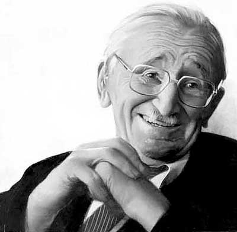
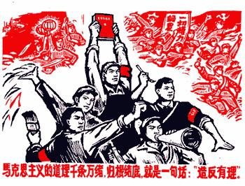
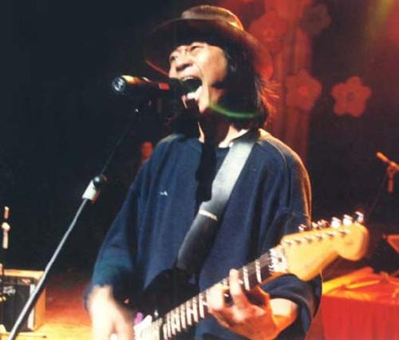

# 中国自由主义为什么如此保守?

自由不能靠别人施舍，而要靠自己去争取！

_ ――托克维尔 《论美国的民主》_

中国大陆的自由主义是如此保守，以至于我们反问自己，自由主义是不是保守的过于病态了。大陆的几个自由主义代表深受哈耶克的影响，推崇经验渐进，反对激进构建。他们提倡从中国的传统文化中挖掘出自由脉络来，期待自由主义与中国传统文化相融合的“中国自由主义”路径，以此来达到中国自由主义的昌盛长久。从台湾的殷海光，陈鼓应，到大陆的刘军宁，徐友渔，汪丁丁，邓正来，无一不是哈耶克的圣徒，似乎要到了谈自由必哈耶克的地步。我们不否认哈耶克是自由主义的伟大导师，可是我们是否真正思量了哈耶克就能给中国特色的大陆带来真正福音。

记得哈耶克先生撰文《我为什么不是一个保守主义者》，以此来回应那些指责他保守的人士。文章有写道：“保守的观点的一个基本特征是对变化的恐惧，对新事物怀有忧心忡忡的不信任。而自由主义的立场是建立在信心和勇气的基础上，基于有充分准备让变化沿着自己的道路发展，即使我们不能预见它将导向哪里。”哈耶克一方面充分强调传统，一方面又过渡信任原教旨的自由市场经济。他不是一个捍卫皇家贵族制度的保守主义者，他是一个自由主义者中的保守主义者。对于不是来自于传统的自由变革，他是发自内心的排斥，并毫不同情的批判，这就是他的理路。今天我到底要站出来说两句话，看看自由主义的保守者有什么病？

### 自由主义保守原因之一： 自由市场经济的功利化立场。

经济学在全世界大行其道，金钱，物质，商品，功利化，导致物欲横流，一切都用金钱效用来评价。人文学科堕落了，而经济学一支独秀，不管中国政府还是中国老百姓，都主动投怀送抱。特别是中国世故实用的传统文化，更是造就经济学的盛行，以至于自由市场经济几乎成了自由主义的代名词。在中国大陆其他人文学科黯淡无光，而经济学又几乎可以畅所欲言，经济学家成了家喻户晓的大明星，老百姓又可以通过谈论经济来表达自己的言说和不满，经济学成了时下的大教主。

毛左们一谈论自由主义，立即就是市场原教旨，他们远远不知道，自由市场经济只是自由主义的一个分支而已。自由主义是关于政治，经济，法律，新闻，历史等等的一个庞大人文体系。而经济学只是一门关于如何能够达到社会物质生产极大繁荣的学问。稳定和谐是经济学发展的前提，而革命反抗是经济学的大忌。经济学不关涉道德善恶，不关涉人伦好坏。经济学不问政府合法正当，它天性上就是拥护当下，倾向保守，它需要一个稳定的大环境来维持经济的运行。对曾在商业化和经济学上大放异彩的英国，他们为什么是保守主义的鼻祖，结果就不言自明了。

### 自由主义保守原因之二：反对革命，恐惧非传统变革。

一提起革命，共产党人必眉飞色舞，激情澎湃，他们要革命到底，要把全世界的反革命消灭干净。可是你要和保守者提出革命，他必仰天长叹，痛哭流涕，痛斥尔等乱臣贼子，狼子野心，辜鸿铭可算是此代表也。可别说革命，想改革都日渐艰难。中国的保守势力极其强大，当年台湾李敖和徐复观，胡秋原等保守派的论战，可窥其一般，而78年的改革开放，没有小平同志的豪迈气魄，恐怕保守势力更加盛行。 

中国大陆简直是保守主义的大酱缸，我们有一群拥护文革的毛左保守派，还有一群拥护传统儒家文化的保守派，更还有一群自由主义者的保守派，可见是保守太盛，改革太少。保守的自由主义对于批判革命不遗余力，他们对准的枪把子最集中的莫过于1789法国大革命，在他们眼里，血腥，恐怖，混乱，暴力简直成了法国大革命的代名词，可是我很少见他们批判英国内战及光荣革命以及美国的独立革命，可见革命在一些人眼里还是有不同标准的。最近的时候，我又看到有些保守人士对孙中山先生的辛亥革命颇有微词，原因是清末的立宪运动是中国达成宪政治国的最好时期，而一代又一代的暴力革命使宪政梦想遥遥无期。

可是，问题的是，保守能够达成宪政，保守就能有自由？英国的君主立宪和美国的1789年宪法是不是革命的结果。没有法国大革命以及拿破仑，欧洲的君主封建制度不可能这么快退出历史舞台，现代民主政治也不可能如此迅速的确立起来，而《人权宣言》的光辉，又是随便哪个文件能比拟的吗？法国大革命陷入恐慌状态，最重要罪魁是当时的君主国家英，西，普，奥，意多国联军的疯狂围剿，使革命成果危在旦夕。如果我们借此批判法国大革命，这跟人们借希特勒来批判民主，有区别嘛？再次，所有批判革命路线的人，不要先入为主的带有某种视觉来看待革命，这样是偏颇的。苏联共产党人定义法国大革命是资产阶级革命，是因为他们站在了无产阶级立场上。

革命本身没有错，革命成不成功在人，而一味的害怕革命，谴责革命是无知和无能的。革命向来是官逼民反，民不得不反，从没有人生下来就是暴徒。判断一个革命的好坏，只在于站在某种立场看他有没有达到你的目标，这种判断就是功利主义的。我们不是拥护革命，也不是宣扬革命，而是革命来了，大家坦然受之。革命一定是人们是可忍，孰不可忍的结果，社会上一定是出了大问题才有这样的结果。革命也是告诉那些为非作歹的统治者，人民百姓不是好欺负压迫的。保守不是不可以，但是不能一味保守，一味保守就是无能的幻想。皇恩浩荡可能会有自由，但是不一定都会。

###  自由主义保守原因之三：崇尚传统

传统是个大杂烩，四书五经是传统，三妻六妾裹脚布也是传统，法墨道佛是传统，鬼神迷信也是传统。我们要弄清它到底是个什么东西，一项传统的来源是专制统治的工具，还是迷信愚昧的心血来潮，是家族官僚的权威，还是地理环境的必然，而自由主义的保守者必定要从中寻找出自由因素来。而中国历朝历代大都是秦朝中央官僚制的复制，哪有什么自由的传统。焚书坑儒后，中国的知识分子就基本上阳寿已尽。从此以后会写字，会做文章的读书人成了专制统治的工具，忠君爱朝，封妻荫子，光宗耀祖是他们的梦想。哪来什么为知识而知识的知识分子，中国思想文化的繁荣程度历朝历代也超不过百家争鸣。

刘军宁先生说：“有监狱的地方就有自由。”可问题是进监狱的人士为了追寻自由进监狱还是鸡鸣狗盗进监狱。中国倒是有贞洁烈妇，可大都是贞节牌坊的殉道者，中国也有不屈的苏武文天祥，可是他们忠于皇帝的情感比自由更甚，我们也忘不了那些隐居的文人骚客，可是他们骨子里意淫的是修身齐家治国平天下。

中国文化传统就不是一个爱自由，争自由的传统，它是一个集体主义，家国主义的传统，在这种传统我们无需去找什么个性自由。传统是连续的，是骨子里人们一脉相承的，你也许可以找出几个反抗皇帝专制的例子，但那并不意味着就是一项传统。

哈耶克的传统路径是英美传统，他们有古希腊商业化传统，有神权世俗权分离传统，有《大宪章》《牛津条例》的传统，也有洛克，霍布斯，休谟，亚当斯密这样的传统思想家，哈耶克怎么会考虑中国的路径问题，他对西方传统的依赖倒成了一些追寻他的自由主义的普遍路径，哪个国家如果想走上自由主义道路，必定要去挖掘本国的传统，而不管这个国家有着什么样的传统，这就是标准的“哈耶克迷信”。而自由的传统在中国，需要拥护和创新。传统一开始并不是传统，只不过接受的人多了，效仿的人多了，流传的时间长了，就变成传统了。

中国自由主义怎么办？传统还是启蒙。

自由主义在西方经历文艺复兴，启蒙运动，市场经济才成为西方文明的主流，它的核心应该是人格，人权，人生。人格是意识到自己的纯洁灵魂，意识到生命的尊严，意识到自己的独立个体。这是文艺复兴所做的。而天赋人权，人皆生而平等，独立，自由，不受非法逮捕的权利，财产权，言论自由权，集会自由权是启蒙运动的功劳。而自由主义最伟大的地方让“自我”做主，为艺术而艺术，艺术才能永恒，为音乐而音乐，音乐才能动人，所以得科目都“自我”做主，使得所有的科目不必受其它的控制而伟大。而人生的意义也是在于幸福，而每个人的幸福是只有自己才能感知的。

所以我们要做的不是批判五四，而是继续五四的事业，继续启蒙。没有启蒙就没有人格的独立和觉醒，而独立人格精神是自由主义的根本。 今天在中国，很多人人云亦云学着西方学者来批判启蒙，岂不知人家已经启蒙了几百年，中国启蒙还处于开始，你就大喊反启蒙。就好像那些后现代的人文勇士们来批判中国在进行中的现代化一样。中国学者脱离现实环境，不关注当下，还喜欢凑热闹，赶时髦，这实在是当代中国知识分子之悲哀。

不管是邓晓芒老师的继鲁迅之后更深的启蒙，还是刘军宁先生提倡的中国需要一场文艺复兴运动，其勇气都是要创新的，而不是保守。自由主义在中国任重道远，没有激情，没有不懈的奋斗和一代又一代学人对于自由的信仰，中国的自由主义必走不长远，保守是没有希望的。
