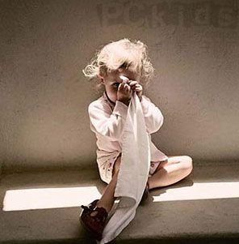

# 互联网:智识民主的幻象

**“互联网把获取信息及知识的藩篱碾碎了，但是人没有变，一个人是否具备开放包容的心态、持续不断的学习能力自我反思能力、接收新事物新观点的热情和好奇心，是否能够利用互联网进行有效的自我管理自我教育，这些是不确定的。”**

### 

### 

# 互联网：智识民主的幻象

### 

## 文/常远（北斗撰稿人）

### 

### 

一 2001 年夏天，父亲买了一台清华同方的电脑回家，小屏幕大机箱，冰蓝色，方方正正的摆在书房里，那是我们家第一台电脑。记得因为没有买联想，我还跟父亲闹了好一阵脾气。但清华同方很快就让我满意了，我们竟抽到本省唯一一个名额，免费去北京参加为期一周的清华夏令营，那是我第二次来北京。 那时的互联网对我来说意味着什么？是小企鹅滴答滴答的闪，是戴着耳机在聊天室里小心翼翼的问“喂你好，听得到吗？”，是绞尽脑汁想更酷一点的网名，是兴奋的给QQ上认识的笔友写信。但更多的，是单机版的三国群英传和大富翁。通过互联网学习知识？我可想不到那么多，还正捧着《萌芽》把《南方周末》剪得齐齐整整自以为有文化呢。 2010年天，此刻，我坐在北京的寓舍里，用已有6岁高龄的联想天逸笔记本读书打字胡说八道。如今的互联网对我来说意味着什么？是一天不上就浑身痒的SNS网络，是博客的言说与传播，是译言网、豆瓣网、中国选举与治理网、科学松鼠会、天益网、共识网、玩聚网、牛博网、FT中文网、Economist，是Twitter，是TED，是不可能看得完的国外大学公开课，是连岳、韩寒、庄雅婷、刘原、李海鹏、傅国涌、贺卫方、李承鹏、笑蜀、长平、李笑来、冯唐、野夫、许知远、狄马、梁文道、刘瑜、柴静的博客，是信息集成管理的利器Google Reader，是著名表演艺术家松岛枫老师、麻美老师、花井老师、波多野结衣老师最新作品的更新下载。 二 十年了。回头望望，互联网确实深刻改变了我们的生活。 如今我们可以上网聊天扯淡泡姑娘，可以联网对战玩游戏，可以让大把大把的银子流向淘宝网，可以下载音乐电影电子书籍，可以把不入传统媒体眼的文章扔在博客上供网友拍砖喝彩，可以点开门户网站看几个笨女人搔首弄姿搏出位…………. 但更重要的是，我们通过互联网进行自我管理、自我教育。 互联网初兴起时，一堆记不得名字的未来学家社会学者跳出来说，互联网将带来知识的民主化。弗里德曼更是在06年就迫不及待的宣称：世界是平的。 

 想想的确如此，即使是三线城市中学毕业进入社会闯荡的年青人，也可以连上网线，阅读刘瑜、连岳、梁文道的博客，听Shelly Kagan，这个耶鲁大学哲学系的趣老头儿大谈何谓灵魂、如何看待死亡。甚至如果你稍微懂一点外语，就可以借助Lingoes或有道等软件在《纽约时报》《华尔街日报》《Economist》《金融时报》的网站上浏览第一手的英文资讯。身边没有浩博的大学图书馆，也想做学术研究？没问题，你在中国，可以下载到这个世界上绝大多数中文图书的电子版，而且只要不是太冷僻的门类，付费就能下载网路上的学术论文。 只要你愿意。 无论你现阶段受教育程度如何，不管你兜里有没有中国教育部颁发的鬼文凭，仅利用互联网所提供的资源，在自己感兴趣的领域钻研5-10年，毫无悬念的将成为“一定范围内”的权威和专家。 只要你愿意。 抛开智力水平、知识吸收能力的差别不谈（虽然必须承认它的存在），至少在接触知识、信息的渠道及门槛上，你已经跟连岳、韩寒们相差无几了。 互联网蕴藏着无限的可能，知识是平的。 是这样么？ 三 今年3月份在老罗英语上托福课，第一次从葛志福老师的课上得知，iTunes里的iTunes U可以免费下载国外大学的公开课程，他向大家热情的推荐，说自己看完耶鲁大学一门叫《死亡》的哲学课程后受益匪浅。很惭愧，那是我第一次知道OER这个概念。与此同时，哈佛大学的《公正：该如何做是好？》已经在网路上疯传。 到了6月初，一个朋友告诉我，电驴上可以下载到中文字幕的耶鲁大学公开课了，是“人人影视”字幕组做的。我听闻后立即跑去下载，我俩心里都很兴奋：有了越来越多的公开课，我们还需要出去留学吗？ 后来，后来，机制越来越成熟，越来越多的公开课程，越来越多的OER计划，时至今日，几乎无人不知“公开课”了。 前不久，我跟那个朋友聊天，提及公开课，我说已经看完了《死亡》和《博弈论》的一半课程，想跟他探讨探讨感受。而且，我看了公开课才最终坚定了出国的想法。让人吃惊的是，“我看了第一课后就再也没看过了”，他说。“不喜欢？”“不不，我很喜欢，感觉很有意思，当时特别兴奋，但之后确实就再也没看过了。”“太忙了没顾上？”“其实我这几个月挺闲的，我也不知道为什么没看。”“现在已经有几十种课程可以下载了”“我知道…” 我有些扫兴，不由得想起了另一件事。也是在许可老师的托福听力课上，我第一次看到了TED的视频，寡闻如我，终于接触到了这个“令人发指的好东西”。回到住处，患有不可治愈“分享症”的我就迫不及待的发视频给一个好朋友“强烈推荐”，他看了后大呼过瘾，我俩如发现了知识新大陆一样兴奋，而且TED还令人发指的提供多格式下载，而且而且，网上还可以找到多语言字幕。那家伙激动的跟我嚷嚷，“今后上网就指望它过了”。 10月，我看了Ken Robinson爵士在TED有关教育的演讲后感慨不已，分享到了校内博客上。他看到后说，时隔半年后，这是他看的第二个TED演讲。 ……………. 四 冗长的讲述。 这种别扭的感觉并不陌生。记得李笑来老师在《把时间当做朋友》一书中，曾说透了这个现象。无论多么好的方法，只有你亲自实践过才会有效果，不去尝试着做，任何好方法、好策略对于你个人而言，都是无意义的。 这是个如此简单的道理。一本好书，不去读，它对于你来说就永远只是“一本好书”而已；互联网上有丰富的信息和资源，不去使用，它们存在的意义于你而言就永远只是“丰富的信息和资源”罢了。 很多人热衷于搜集学者推荐的书单，很多人则喜欢让别人帮忙列书单，于是网络上流传着“香港中文大学给本科生推荐的86本书”“XX教授推荐阅读书目”“一生必读的100本书”等等帖子，分享的人通常喜欢加上一句评论勉励自己“一本一本的读”：） 一天天，一年年，书单依然是书单。阅读计划依然是阅读计划。 所以我始终认为，推荐书目是个伪命题。阅读是无法复制的个人体验，个体从每本书中获得的感悟、教益是不同的，完全不存在“必读书”这样的概念。更何况，把阅读当做习惯的人哪里还用他人推荐书单呢，早已饥不择食的扑了上去，抓起一本就读，甚至看见标题或作者顺眼就读，一开始可能会读到烂书，一本，两本，没关系，久而久之，你会找到自己的兴趣方向，开始有选择、有针对性的挑书来读，你会形成自己的知识构建体系，你会拥有独一无二的“书单”。 扯远了。上述这些都是不存在的，因为一个横亘的前提是，即使你知道了哪些书是“值得读”的，哪些书是学者教授们“强烈推荐”的，你真的就会去读吗？ 可以想象那种感觉。手里捧着各路高人神仙推荐的阅读书目表、香港中文大学清华大学“本科生必读通识书单”、“梁文道《开卷八分钟》推荐”，收藏夹里睡着耶鲁大学、哈佛大学的公开课程，忍不住有飘飘然之感，仿佛推开了一座典雅高贵图书馆的大门，看着里面古往今来人类浩瀚的文明列队向你致敬，即使是摩挲那些作者名和标题，也足以高潮迭起。 可是亲爱的，你不走进去，掀开一本书坐下来看，那个“图书馆”于你而言就永远只是一间房子，是石头和水泥。 不去倾听它们，跟它们对话，它们就不存在。 

 我常跟朋友抱怨，互联网启蒙十年了，为什么有些人的信息量和基本常识依旧匮乏得惊人？为什么依然有人纠缠于毛是不是英明领袖，大饥荒是天灾还是人祸，文革是否祸害千古这样的问题？只要他们愿意，互联网上的自由信息唾手可得，难道不是吗？ 是呵，“只要他们愿意”，原来我忽略了前提。互联网把获取信息及知识的藩篱碾碎了，但是人没有变，一个人是否具备开放包容的心态、持续不断的学习能力自我反思能力、接收新事物新观点的热情和好奇心，是否能够利用互联网进行有效的自我管理自我教育，这些是不确定的。 知识是平的，但智识不是。智识非但没有平等，反而有两极分化的趋势。于是我们终将看到这样的未来图景：有一些家伙，在互联网勃兴的浪潮中进行了有效的自我管理，持续不断的进行自我教育，被激发出了更多的智力潜能，变得更聪慧更通达更熟稔，他们开放、积极、精力充沛，他们反应敏捷视野开阔，他们借助互联网成为了更好的人，他们生活精彩内心自由。十年后，二十年后，你不得不一边看着同龄的他们在媒体专栏和出版物里说着你觉得“很有道理”的观点，一边在心里暗悔。虽然他们的父亲不叫李刚，电脑网速甚至比你的慢很多，虽然你比他们拥有更炫目的教育经历。 互联网带来智识的民主？幻象罢了。 

### 

### 

（采编：张韧刚 责编：项栋梁）

### 

### 
