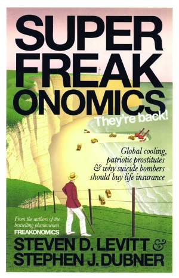
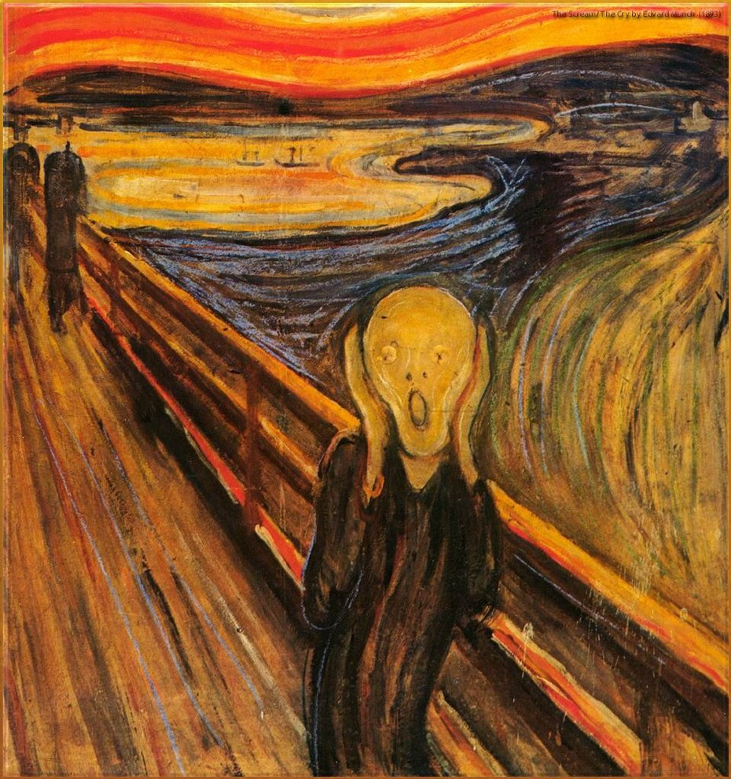

# 人类的“高贵”与人类的自负（兼《超爆魔鬼经济学》书评）

**“尽管存在着这样那样的自负，为自己营造出高“物”一等的幻境，但是人类也是同时能够意识到这点的物种。一个能够用（自己创造出来的）数理和逻辑来证明自己的傻逼的物种，无论如何，都值得我们给予足够的敬意。”**

# 

# 人类的“高贵”与人类的自负

# （兼《超爆魔鬼经济学》书评）

## 文 / 孟小你（中国科技大学） 

如果不考虑沃贡人和小熊星出版公司，人类就是我们已知的生物中唯一“自负”的物种，他们中的医生不爱在进行手术前洗手（注意，这是在巴斯德业已发现病菌是感染的元凶之后）、他们认为汽车的安全带使用起来十分麻烦（而且这还是在无礼地质疑司机的技术）、他们还觉得自己一定能够打败庄家或者市场（实际上真的能做到的人用半只手都数的出来，还不考虑小概率事件的必然性）。

但是人类又是如此自卑——尽管这些自卑感的源泉也是他们为了显示自己的独一无二所构筑出来的——认为自己应该为自己的行为背负上无尽的责任，从全球变暖到燃料危机再到贫穷饥饿和“逝去的田园时光”。人类社会中散布着这样一种倾向：人类本身的兴起对于地球造成了如此大的改变，或者是破坏，我们应该对这些现状负责。

当然，在这里我并不是要鼓吹对作为不负责任，毕竟就连兔子也会对自己的窝边草在意。我所真正好奇的是这种倾向背后所蕴含的这样一种思想：人类应该为自己的所作所为向某一种存在进行忏悔，而之所以要进行这样的忏悔，是因为人类的所作所为和影响有别于其他任何在地球上所曾经存在过的事物——与其他物种相比，人类具有一种特别的、独有的地位。

然而事实恐怕并非如你所想。就以几年来人们所最为关注的温室效应来说，人类活动所排放的二氧化碳只占全球总量的2%，其他的carbon dioxide则全部来自于自然现象。甚至就连二氧化碳本身也并非如宣传中所说的那样可恶——二氧化碳对总温室效应的贡献仅仅为五分之一不到（实际上，温室气体中的大头是水蒸气）；而那些“逝去的田园时光”……好吧，一个塞满了马粪的纽约，一个没有（尽管是许多污染来源的）石油副产物的日常生活，一片片没有施放化肥的农田——最后这个看起来似乎是三种景象中最美好也是最容易实现的。不过，很遗憾，哪怕全球有十分之一的农田这么照做，恐怕咱们就得把刘少奇从地下抬出来，让他再比五次手指头了。

令人略微感到惊讶的是，人类似乎无法从这个幻境中走出来。因为那个存在于想象中的地平线上的恶魔，他们创造出了混合动力汽车，哥本哈根气候大会（尽管为了召开这个大会本身所造成的碳排放足以抵得上好几个非洲国家一年的量)，还有，噢，最初的，戈尔的《难以忽视的真相》和诺贝尔和平奖（以及更早的《寂静的春天》！我有没有告诉过你，数百万的非洲孩子可能因为DDT的禁用被疟疾夺去生命？）。是的，人类在做着什么，人类在努力，人类在为自己的曾经犯下的过错向地球弥补！——正是这种小小的自我安慰和自鸣得意的心态，正是这种集合了“原罪”“忏悔”“救赎”三个概念于一体的心理，让人类沿着自己为自己铺好的路上继续往下走着。

而横亘在这条路前面的，也是我今天所最后要说的，就是道德。

不，没有人能够否认，道德是一种高尚的品格，道德是区别开化和原始的重要分野，道德是人类文明所独有（？）的存在。而在所有的道德中，最为人们所称道也是最为朴素的，毫无疑问是利他主义。

如前所述，在绝大多数时候，利他主义被视为人类所独有的品质，那些动物群类中所存在的所谓的“利他主义现象”则被看作是以种群衍续为目的而存在的基因和反射。遗憾的是，实证和数据可以证明，人类行为中表现出的利他主义似乎与动物们的条件反射并没有本质上的不同。通过研究行为背后的动机可以发现，人类并不如我们想象的那样真正“慷慨”：看望父母也许只是为了获得遗产，帮助乞丐只是为了避免自己的不快，而提倡助人为乐，只不过是整个社会购买的一种保险。

既然人类并不具有利他主义天性——在理所当然把那些对于整个族群和自己的预期利益而存在的行为（例如代际之间的抚养与赡养）排除在外之后——那么我们就再也没有理由把人类置于一个高于其他物种的地位，而因此阐发出的在人类社会中存在的种种道德——基于这些道德，我们一直把人类天性中某些最自然、最正常不过的部分贬低为最令人不齿的恶劣品格——也不应该再被视为理所当然。而那些试图对人类整体作出某种评价的行为：人类的行为应该基于一种先验或普适的准则，人类应该因自己的行为对整个地球负责，又或者，人类应该向某一个神或者某一种意识形态进行忏悔，都不过是人类对于自己创造出来的思想体系所进行的自我维护和自我陶醉。

这也是沃布希环·沃梅·哈耶克所说的“人类的自负”所在。

不过，在这篇书评的结尾，我还是不吝为人类给出他们应得的敬仰和赞赏：尽管存在着这样那样的自负，为自己营造出高“物”一等的幻境，但是人类也是同时能够意识到这点的物种。一个能够用（自己创造出来的）数理和逻辑来证明自己的傻逼的物种，无论如何，都值得我们给予足够的敬意。
