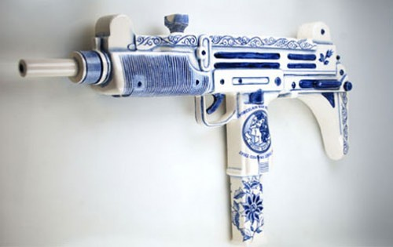

# 关于自由民主的一些问题

**美国确实支持过很多独裁者，毕竟大国的外交要考虑很多问题，当国家利益与公民理想发生冲突时，作出的选择并不能让所有人满意，美国对外确实有很多不明智的决策，然而，以此为理由来拒绝类似于美国国内的“自由”，那就是颠倒是非了——任何权力都可能超过界限，侵犯自由，人类已经找到控制国家内部强权的方法，只是在国际领域还没有建立这种机制，以国际领域缺乏权力制衡机制为由去拒绝国家内部的权力制衡，这不是可笑么？** ** **ibeidou.org

et

ibeidou.org 

# 关于自由民主的一些问题

ibeidou.org

## 文/徐宪（华中科技大学）

ibeidou.org ibeidou.org  这篇文章是为我的女朋友写的，因为之前我和她聊天有时会聊到这些话题，她和大多数普通人一样，对这方面了解较少，很多时候我缺乏耐心，甚至言辞激烈，还曾经因此惹恼过她，我答应过她要为她写些科普性质的东西，用这种方式来赔罪，下面这些问题是很多人都问到过的，我尽量用【通俗的说法】解释清楚。我认为这个科普工作会很有意义——特别是我每次在学校报亭看到别人翻《环球时报》这类东西的时候。 以下这些问题是很多网友曾经问到的，我做一点自己的解答，不够正确的地方大家可以指正。 ibeidou.org **Q：你们经常提到，你们的政治主张核心是“自由”，但是自由不是绝对的，绝对的自由不可能实现，而且有害，不是这样吗？应该用法律来限制自由才对。** A：这个问题之所以那么多人喜欢提，原因可能在于在中西方文化里，“自由”本身就有不同的内涵。在中国，很多人习惯把“逍遥法外”“无法无天”“毫无纪律”“自由散漫”“想做什么就做什么”当做“自由”——例如毛泽东的名篇《反对自由主义》。然而在西方，“自由”一词的意思却完全不是这样。西塞罗的说法是Libertas in legibus，就是说自由因法律而存在，这一类的论述有很多，简而言之，我们谈论政治时提及的“自由”，一大部分是指“消极自由”，简单地讲，就是说，“我不想做什么，政仐府就不能强迫我做什么”的意思。“法治”（the rule of law）的一个极其重要的含义就是通过法律来约束政府的权力，使政仐府不能随意强迫民众，侵犯自由。因此，我们谈论的“自由”，恰恰是与法治一致的。 另外，许多中国人习惯把“自由”当做洪水猛兽，但要知道，即便是在马克思的经典著作中，“自由”一词出现的频率也大于“民主”，而“民主”出现的频率也远高于“专政”。区别于我刚提到的“消极自由”，马克思所言的“自由”更接近“积极自由”。然而，可笑的是，“自由民主”这些马克思的口头禅都能成为删帖的敏感词，言仐论自由在哪里呢——说句题外话，但愿管理员能留下这篇文章作为行动反驳我这句话。 ibeidou.org **Q：嗯，我暂且同意你的观点，必须约束政府权力，来保护民众自由，所以我建议，恢复文革时期“大鸣大放大字报大辩论”的四大自由，靠人民大众来监督政府！这才是民主的体现！那你们为什么要否定文革，否定毛主席？** A：首先要指出，在政治学里面，“约束政仐府权力”有个专门的说法叫“宪政”，它的目标就叫“有限政府”。 靠人民群众来监督政府的说法，不少人都提过，然而这种说法现在看来却有很多破绽。首先，群众运动很容易忽视程序正义，一旦群情激奋，很容易产生“多数派暴政”的境况，一个例子就是苏格拉底之死，如果一定要承认文革也算“民主”，那么也要同时指出，这是一种靠依靠“多数派意志”侵犯“少数人自由”的“邪恶民主”。其次，即便是满足程序正义要求的“直接民主”，在政治实践中也不比成熟的“间接民主”先进到哪里去，希特勒一样是通过民主选举上台的，在我看来，无论是强调程序的“票选民主”还是那劣质得不一般的“大民仐主”“民主运动”，都离我们平常所说的“宪政民主”相距甚远。“反自由的民主”（法国大革仐命、所谓的“文革大民主”）在多数情况下要远远劣于“独裁下的自由”（拿破仑专政、改革开放后的中国在很多方面也远远比以前自由）。 我经常喜欢说的一种简要说法是：民仐主决定权力来源——“谁统治我们”，宪政（姑且在这里简化为法治和分权制衡）决定权力界限——“统治者统治我到何程度，他能管我的什么”。一个真正自由开放的社会，官员应该只是社会中普通的工作者，那么“谁统治我们的问题”就不应该是至关重要的问题，相反，对于自由而言，“有限政府”才是至关重要的。 在和别人讨论“民仐主”的时候，请先确认，你们谈的是不是“宪政民主”或曰“自由民主”，否则很有可能是鸡同鸭讲。有种极端的说法是，民主就是要被阉割，不被阉割的民主不是好民仐主，这句话也有它道理所在。 至于毛泽东这个人，他的功过是非足以再写一篇长文，这里简要谈一下我个人对他 的看法。我承认他是一个很聪明很懂权谋的人，但他又不完全同于历史上那些凶残狡诈的君主——他既有秦始皇“一统天下”的霸道、“焚书坑儒”的凶狠、刘邦“不读书”的“无赖”——这些“君主”特征，可怕的是，他却又是一个极端的理想主义者，文革不仅仅是一次权争，更是他本人酝酿的一次大实验，或者可以说是毛左嘴中的“破除官僚体制”，亲自煽动“人民”造反，这时候，他更像一个疯狂的无政府主义者，一个彻头彻尾的“弑父者”——任何政府其实具有两面的属性，一面是以民选为特征的的那些普普通通的“公仆”，而另一些则是以制衡民意、教化民情的折衷设计（终身制的大法官可做一例），所谓的“父母官”。好的政仐府应该满足这两方面，在折衷过程中实现对权力的限制，若是一味迎合民意，则可能形成暴民政治，若是一味强调精英统治，则可能腐化衰朽，不顾民生疾苦。而毛泽东的想法则非常极端可怕，他蔑视宪法法律，蔑视一切规章制度，蔑视所有的传统，在他口中，只有“人民”才至高无上，哪怕是打砸抢烧、自相残杀、失去理性的“人民”，然而，当人人都像打了鸡血，痴迷于“克里斯马”的魅力，此时的“民意”又有何正义可言？ 毛的罪恶是毋庸置疑的，即使是官修党史，也不敢粉饰，也还是写上了“大跃进一年内有1000万人口减少”的结论，单从漠视人命这条来讲，毛已经是罪恶弥天了，反AB团、土改、反右、大跃进、文革。如果真要说他有什么贡献，那么我承认，他的诗词写的不错，可惜若是评价一个政治家，他就只是个彻底的败类。 或许有人会说，毛时期的成就为经济建设打下了基础，他建立了一个新国家。然而，土改中处决大量地主富农，强行剥夺其财产，这是立下了非常糟糕的先例——国家可以任意剥夺私人财产，这在长期来讲，对于经济造成的危害是非常致命的，这对经济造成的长期伤害远远不是那些工业化设施所能相提并论的，一直到几十年后的今天，即便物权法已经通过，强征地和强制拆迁的惨剧仍屡屡发生，这些都是毛时代的遗毒。今天使我们多数人收益的国家制度，其建立者应该是邓仐小平、胡耀仐邦等人，中国国家体制已经在大方向上上抛弃了毛的制度设计，因此，认为毛“建国有功”是非常可笑的。 ibeidou.org **3、Q：虽然你说了这么多，但我还是认为，中国人素质低，所以不适合搞民主。** A：“不适合搞民主”这种话听起来很模糊，如果是说，不适合马上开放直选，多党执政，那我可能部分是赞同的，我也不认为开放选举、多党制能立竿见影地解决什么实质问题。然而，温总理提出的“司法独立”能不能做到呢？言论自由能否进一步开放呢？那么多因言获罪的冤案能否得到公正的处理？这些细节的问题不能回避，细节比“民主”之类的口号重要。 而且像法治和分权制衡这些制度改进设计，并不需要很多基层民众的直接参与，何来“素质低影响政治改革”一说呢？十三亿国民，不论平均文化素质再低，按照代议制的原则，难道不能遴选出素质高，有担当的人么？再则，如果共产仐党员是真正的精英，那么扩大党内民主难道不能做到么？ 《新华日报》在1939年的一段话便挺有意思：“解放区的直选，是用各种豆子代表候选人, 在候选人背后的碗里面投豆子的，所有一切都公开在露天举行。现在的素质，比那时候好很多吧。他们以为中国实现民主政治，不是今天的事，而是若干年以后的事，他们希望中国人民知识与教育程度提高到欧美资产阶级民主国家那样，再来实现民主政治…正是在民主制度之下更容易教育和训练民众。”这不是我党在野时的言论么？我们知道，即便是西方偏保守的自由主义者如哈耶克，尽管对民主选举不怎么热心，但仍然强调，民主选举具有“和平地交接权力”和“教育民众”这两个作用，在自由的框架下，发扬民主，是可能提高人民素质的。 ibeidou.org **4、Q：民主自由有什么用？老百姓关心的是钱，是衣食住行，是生活水平！民主的印度怎么那么贫困呢？** A：“自由”的起源本身就是强调政府不能随意强迫民众了，不能巧取豪夺，横征暴敛。“无代表，不纳税”就是自由主义的口号，根据经济学中的拉姆齐法则，即便政府向企业收税，那税收也会由消费者分担一部分，换言之，人人都是纳税者，因此，自由就是与生活水平直接相关，政府不能抢劫私人财产，税收要取之于民用之于民，这些都是“自由”的内涵。自由既和经济发展水平有关，也与发展成果的分配有关——就前者而言，正是因为改革开放后的自由市场经济，中国的经济才开始腾飞；就后者而言，如果不能保证税收取之于民用之于民，保证资源按照市场来公平分配，那么，改革开放的受益很可能被权仐贵集团占有。 至于民主，它与经济发展可能不一定有那么直接的关系，按照著名经济学家罗伯特·巴罗所做的经济研究，法治对于对于经济增长的效果相当大，而民主与经济增长的关系则相当弱。 印度在独立以后，政治上是学习宪政民仐主，但是经济却是国家严格控制的计划经济——“尼赫鲁社会主义”，它的改革开放是从1991年才开始，在此之前经济自由极其匮乏，这恰好验证了，只有保证自由，才能更好地发展经济。 总的来说，我认为关注政治制度与具体的生活水平没有矛盾，每个人的生活都受到制度的影响，即使人们并没有意识到这一点。 ibeidou.org **5、Q：资本主义有资本主义的优点，但社会主义也有社会主义的长处，社会主义人民比较平等，资本主义社会贫富差距过大，这样不公平。所以不能一味说社会主义不好？** A：先说贫富差距的问题，中国大陆的基尼系数超过0.4，在全世界范围来看算比较高的水平，从这个角度来看，中国看不出什么“社会主义”的影子。在中国改革开放后，朝鲜政仐府就指责中国实行了“修正主义”，而自己才是正统的社会主义。然而，金家穷奢极欲、父子相传，难道这就是“社会主义”么？ 事实上，“社会主义”是一个相当模糊的概念，没有什么公认的评判标准，真正在世界上较有影响力的社会主义是欧洲的社会主义（或言社会民主主义），政治主张主要是，对富人收取更高的税收补贴穷人，提高福利。尽管他们的税收也很高，但毕竟是取之于民，用之于民，受到严格的监管。虽然我个人并不喜欢这种制度，但是还是得承认，“取之于民，用之于民”的高税收不管怎么说都要比“取之于民，用之于官”的高税收要好些。 在这个“主义”越来越泛滥的年代，最好多谈些问题，少谈些“主义”，不要用意识形态扣帽子的方式讨论，不要整天想着“资本主义国家亡我之心不死”。 ibeidou.org **6、Q：美国支持了那么多独裁者，这就是“自由的美国”么？** A：说一个国家是“自由”的，它的主要含义是对内政府权力受限制，而就对外来说，国际领域并没有那么完善的权力制衡机制，因此这并不是一个方面的问题。任何国家的政策自然是以国家利益为先，尽管有时候理想主义也会占上风，但是更多的时候，一个民主的国家应该代表自己选民的利益，而非将其他国家的制度作为最重要的考虑。美国确实支持过很多独裁者，毕竟大国的外交要考虑很多问题，当国家利益与公民理想发生冲突时，作出的选择并不能让所有人满意，美国对外确实有很多不明智的决策，然而，以此为理由来拒绝类似于美国国内的“自由”，那就是颠倒是非了——任何权力都可能超过界限，侵犯自由，人类已经找到控制国家内部强权的方法，只是在国际领域还没有建立这种机制，以国际领域缺乏权力制衡机制为由去拒绝国家内部的权力制衡，这不是可笑么？ ibeidou.org ibeidou.org

（采编：陈轩；责编：陈轩）

ibeidou.org ibeidou.org
