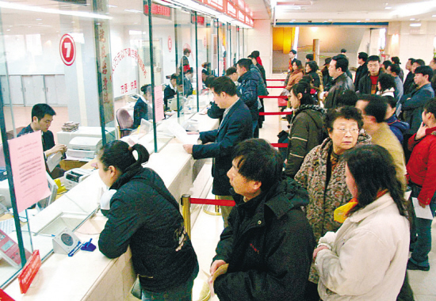

# 农行当做怎样的商业银行

**“一个国家，即使每种产品都比另一国家的生产效率高，也该拣最具有优势的去生产，而不是大包大揽，这是最原始朴素而基本的经济学原理——比较优势理论，它对于商业银行同样有普适性。农业银行有着遍布城乡的网点，那些“对大范围、大数额、多样化的资金流动有需求的大客户”才是合适的服务对象，这也正是农行的比较优势所在。”**

# 农行当做怎样的商业银行

## 文/Simba（ 山东经济学院）

 七月份入行，八月下旬开始临柜，一晃我已经当了三个多月的综合柜员。一个星期的“学徒期”过了之后，每天的业务量就开始稳步攀升，从最初的一百八九，到现在动辄二百二三，峰值将近二百六，以八小时工作时间平均下来，不到三分钟就要完成一笔业务，要说不忙不累，还真不是实话。窗口外只有排队长短之别，基本上没有断过人，倒不会因此而抱怨什么，年轻人学学业务受点历练再应该不过了，刷新了纪录、传票不缺附件、成功营销一种产品都是足以让人获得成就感的事，但若说每天的工作心情都十分舒畅，那便又是撒谎了。 我曾在芦台贴吧里看到一条网友的回复，她说一想到要去银行取钱就会发愁，因为又要去排长队了。这话的确适用于芦台街里的几家国有商业银行。农行在芦台镇（宁河县政府驻地）内有七八家网点，商业道支行与震新分理处相距不超过400米，这个镇面积不大人口不多，夸张点讲五步一行十步一所，可银行仍然人满为患。我的经济学直觉告诉我，供不应求一定是因为定价太低，通俗点说，农行的门槛太低了。 

每个月总有两波取款潮，一是养老金的发放、一是低保的发放。对象人群时间成本都很低，他们跨进银行的大门，享受银行的服务，基本上是无须付出什么代价的——反正闲着也是闲着。因此常常见到有人不放心工资呆在工资折里，每月一开支就把钱倒进自己另开的折子里，也因此常常见到有后知后觉的大爷大妈在调息很久之后，为了那一年多出来的20多块钱利息而折腾存单。 每个月总有两种人固定来存款，一是按月期交保险的、一是存电费的。这些人来存款往往都是无奈之举，保险公司和电力公司把业务外包给了银行，自己当起了甩手掌柜。后来大概客户们对保险公司不满了吧，保险公司开始派专人代理交保险，一个人手拿二十几个存折，在银行窗口一站就是半个小时，让柜员好一阵手忙脚乱，让后面排队的人唏嘘不已。 当然还有保险公司1元开个人结算账户，开户是个耗费时间的麻烦事，代理开户是件更加麻烦的事，而那每次一到账就被划扣走的保险费，给银行带来的收益，真的足以弥补银行为此付出的成本么？不说时间什么的无形成本，难道存折就没有工本费么？ 解决这一问题的办法就是提高金融服务价格，让它更加商业化，让老百姓“去不起”中国农业银行——试问世界上有几家五百强的企业门槛是如此之低的？ 去年我参加天津农行招聘第一轮面试时，抽到的题目是给奥运门票定价，我的出发点就是价格歧视、随行就市。价格高与不高，高得合不合理，跟大众购买力没有一毛钱关系——不是说我买得起，它就是合理的；我买不起，它就是狗屁。经济学看价格，从来都是由供求着眼，供不应求是因为价格太低、供过于求是因为价格太高，除此无它。 泛泛地谈论平等的概念、顾客是上帝的箴言最是百无一用。人是有血有肉的动物，不是冷冰冰的机器，他们会对激励做出反应，不是说一个人进入了服务行业，他就成了天下“上帝”的奴仆，他和窗外的“上帝”没有本质上的区别。郭德纲的衣食父母论可能更加贴切，我为顾客服务，不是因为我天生欠你，而是因为你为我的服务支付了适当的价格，作为对价，我对你承担责任、提供服务。开设VIP窗口显然是一种价格歧视，但歧视地不彻底，VIP开得不够多，普通口开得不够少！ 我说农行要为富人开，和任志强讲要为富人盖房子一样，大概要被人骂。被人骂不讲政治，被人骂不讲垄断。下面我就要从政治的角度讲讲为什么农行要大包大揽，为什么我又要对这种行政垄断抱以深切的同情。 

金融行业，经营货币的行业，从来都被大众认为是“太重要”的行业，太重要了就不能交给自私的私人，而只能由国家来垄断，这个观点是被大多数人支持的。但是垄断带来高价格，支持垄断的人对此又不满了，开始呼吁垄断下的价格管制。价格管制，学过一点经济学的同学同事都应该知道，不分市场形态地无效率。通货膨胀来了，学校管制了食堂饭菜的价格，管不了的是，馒头比以前小了一半，饭菜分量越发不足了；政府补贴粮企管制价格，管不了的是做面粉时的用的优质小麦减少了。强制压低了银行的门槛，管住了价格，管不了的是，国有银行的服务越来越差，谈到这一点，好多皱了半天眉头的读者一定要深表赞同了。OK，服务不是差么，再来管规范化服务。但管得了服务，哪里能管得了效益？强制是什么都能办得到，唯一办不到的就是把人的最大潜能发挥出来。当后面有一堆拿着养老金折子的人对你指指点点时，很多人宁可不要绩效工资，也懒得往外推产品。听多了在国有银行和客户打架被开除去了股份制反而成服务明星的故事了。这就是行政垄断值得同情之处，李子旸先生说得好“由于封闭了市场，更丰富更优异的产品和服务没有机会出现”，这才是最大的损失。 一个国家，即使每种产品都比另一国家的生产效率高，也该拣最具有优势的去生产，而不是大包大揽，这是最原始朴素而基本的经济学原理——比较优势理论，它对于商业银行同样有普适性。农业银行有着遍布城乡的网点，那些“对大范围、大数额、多样化的资金流动有需求的大客户”才是合适的服务对象，这也正是农行的比较优势所在。普通储户失去了得到金融服务的机会？非也，被矫正的价格，会倒逼管制的放松、倒逼出一个市场，因为有些区域性银行的比较优势正在于此。 把VIP口和普通口个数掉个个，VIP以计价发工资，普通口以业务量考核。这是我没有听众的对策。 让我欣慰的是，信用社（农商行）门口挂出了条幅“农商银行办理电费代收代扣，服务万家”。
