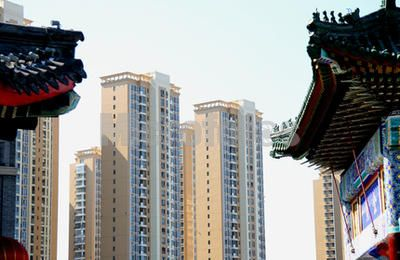
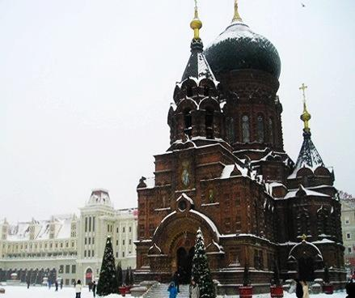
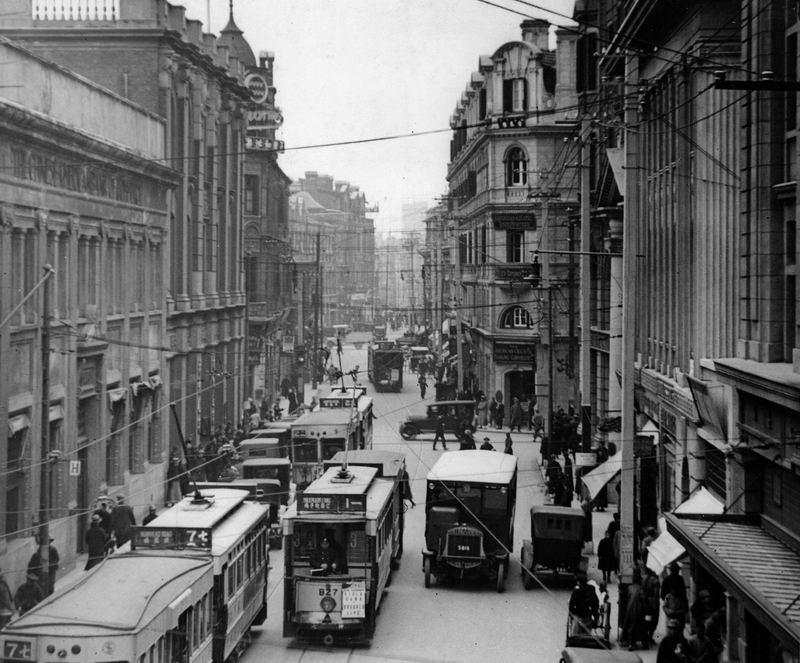
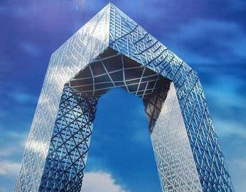

# 华风欲绿神州地

**“多年后的今天，当年留在中国大地上的这些美丽的建筑，无论其当年有过怎样的争议，今天无人能否认她们的美。她们把中国建筑的美丽元素赋予砖石和钢筋混凝土，在民族文化濒临破碎的时代重整旗鼓，一度为苦难中的民族吹来一股来自自身的厚重而又清新的春风，重新将民族形式自豪地展现于世人面前。”**

# 华风欲绿神州地

# ——浅谈近代中国民族形式建筑

## 文 / 刘文祥（武汉大学）

中国是世界四大文明古国之一 。在悠久灿烂的中华文化中，中国建筑可谓一朵奇葩。自远古肇始直至晚清，中国建筑始终独立发展，自成体系。其以独具特色的材料、结构和装饰体系，形成了特有的建筑风格，不惟中国本土，更深深影响了周边的朝鲜、日本、东南亚等地，共同构成了东亚的中华建筑文明圈。然而鸦片战争以后，西方文化开始猛烈冲击中国本土。西方建筑也在这股浪潮中迅速地登陆中国。在一次又一次屈辱的失败面前，中国的文化自信力在清末民初达到空前低潮，全面崇洋之风从上至下弥漫全国，以至于中国传统建筑走到这时，几乎是突然一下失去了生命力，变得不知所措，并且一时间几乎被国人抛弃。 尽管如此，中国传统建筑语汇并不可能彻底解体与死亡。不可否认的是，独特的中国民族形式建筑，显然始终具有有别于西洋建筑的美感。在近代中国，当闭关锁国的沉闷空气被开窗通风之时，中国人正怀着极大的猎奇心理，观察和模仿着西洋文明。而与此同时，大量来到中国的外国人，也很快开始关注起中国传统建筑。 

 用砖混结构甚至钢筋混凝土结构、钢结构等新材料、新结构来建造中国民族形式建筑，这种建筑思潮、趋向最初并非是中国建筑师自觉的民族意识使然，而恰恰出自外国人之手，具体说来最早是由外国教会在中国的教堂建筑中开始实践的。比如建于1907年的北京南沟沿救主堂，在一个典型拉丁十字布局中，使用了中国传统的屋顶、亭和塔，是中式教堂建筑最早的一批代表之一。在中国独有的文化背景以及近代中国特殊的历史情境下，教堂建筑中最早出现中国传统建筑复兴趋势，有其必然的因素。由于中国传统文化根深蒂固，外国教会势力要想渗入中国并扎根，必须要在形式上采取一些变通。除了出于融入地方文化，更好地扩大宗教影响力的目的外，教会建筑最早在中国自发采用中国传统民族形式，更有改善外国宗教形象，在近代民族矛盾尖锐的情况下缓和西方教会与中国人民矛盾的考虑，这一点在义和团运动之后尤为突出。 义和团运动以后，教会在中国的建筑活动进入了一个新阶段。义和团对教会的猛烈冲击使得教会开始重新认识他们的中国政策，并决心在中国大举兴办教育等公共事业，此后教会大学如雨后春笋般在中国兴起。这时的教会学校开始大规模兴建中国形式建筑，如岭南大学、金陵大学、金陵女子大学、燕京大学、辅仁大学、文华大学、华西协和大学等等，其校舍建筑均采用中国民族建筑形式。之前的教堂建筑毕竟是比较孤立的，而且宗教建筑的性质本身，限制了其影响力。而此时开始大量出现的中国形式的学校、医院等建筑，其公共建筑的性质决定了其影响较之教堂而言要深远广大得多，也更易为中国普通大众所接受。 以上这些教堂、教会大学建筑，并非由政府倡导建设，其建筑风格是教会自主的选择，而非是应政府要求而为之。教会建筑由于属于民间性质，受财力限制，在体量上、规模上相对比较小巧。而由于教会的中国形式建筑是一种自主选择，因而建筑设计上灵活多变，富于创造，不拘一格，并且善于吸收地域文化的养分，比如安庆天主堂，其南立面具有浓郁的徽派建筑色彩；华西协和大学校舍则充满了四川地域建筑风格。但另一方面，由于教会毕竟对中国传统文化理解较为肤浅，设计的建筑往往把握了形式而没有把握住精神实质，所以在对于中国建筑的驾驭上欠些功力，很多时候看起来有些不伦不类，拼凑、堆砌的感觉比较重。比如北京南沟沿救主堂、安庆天主堂等民族形式教堂，典型反映了一个近代大多数中国民族形式教堂的通病：即中国古代建筑是横向展开的，山墙不开门，也少有装饰，门窗和主要装饰都在檐墙。而西方建筑则刚好相反，主体建筑纵向伸展，山墙开门并作为正立面。这样一来在一个中国建筑的形式下安排欧洲教堂的功能，如果教堂设计者坚持不愿意放弃拉丁十字、巴西利卡等欧洲教堂建筑的基本形式的话，那么这一矛盾就不可调和。安庆天主堂入口立面从整体形势看是一面山墙，而且上部也仿照徽派建筑做成了伸出屋顶的风火山墙形式，但其下却又按照徽派民居外围墙开门的样子来设入口，这样一来上下两部分就明显脱节了。设计者强行把两个不在同一方向同一墙面上的建筑形式堆砌到这个入口上，或许还自以为很巧妙地解决了难题，事实上收到的效果并不能令人满意。将中国建筑的语汇强行塞入欧洲建筑的框架中，必然就会产生削足适履的奇怪感觉。 

 如果说晚清以至北洋时代的教会中式建筑是近代中国建筑史上的第一次民族形式建筑复兴运动的话，那么30年代国民政府发起和主导的“中国固有之形式”运动，则可谓第二次民族形式建筑复兴浪潮。 30年代对于中国建筑来说，是一个风云激荡的时代。一方面在世界大潮中，中国建筑仍在持续向现代主义过渡，但另一方面，所谓的“中国固有之形式”，却也在中国大地上掀起了一股民族主义浪潮，尤其是在大型公共建筑中，基本上成为了主流。应该说，北伐后的国民党大业初定，大力推崇民族形式建筑具有某种必然性，这一点在中国近现代史上似乎是一条规律：无论执政者在意识形态上有多么遥远的差距，民族主义在他们建政之初都是一杆必然高举的大旗。即便是在30年代国内局势不稳，更有抗战迫近的局势下，以及五十年代初百废待兴，经济困难的背景中，民族形式都不约而同地被当政者青睐。究其原因，乃在于宫殿式的民族形式，可以充分凸显恢宏之气象，又富于强烈的民族主义宣示意味，这是新政权定鼎之初所最迫切想要表达的。 所以，统一之初的南京当局，就迫切而雄心勃勃地抛出了“首都计划”及其后的“大上海计划”、“天津特别市物质建设方案”等等。这几个计划在图纸上看，是颇为让人振奋的。其一扫这些城市原有的中国街区杂乱拥挤的旧城肌理，也不理会租界，而是计划在郊区从零开始建起一个井然有条、规划严谨的新区。而贯穿其中的建筑，但凡较为重要和突出的，几乎无一不是宫殿式民族形式建筑。虽然无论是首都计划中的中央行政区，还是大上海计划的江湾，在当时看来都显得过于偏僻了，以致造成了首都计划的流产，但当权者的浪漫主义情怀似乎还是很顽强的。大上海计划实施得更多一点，建成了许多行政、文教、体育建筑。首都计划的虽然流产，但南京的建设，其流行的建筑风格却也奉宫殿式民族形式为圣典。 这一时期的“中国固有之形式”运动，有其诸多值得肯定的地方。国民党建政后，一扫清季、北洋时代笼罩中国的崇洋心态和全盘西化、彻底毁弃国故的做法，重新举起了传统文化的大旗，“中国固有之形式”便是其在建筑领域的表现。从纠正片面全盘西化、民族自信力丧失的局面，挽救民族文化于分崩离析之命运的角度来说，是有巨大积极意义的。而这场运动在建筑领域对于中国传统建筑文化的承绍与发展，也作出了有益的探讨。与之前的教会中式建筑不同的是，国民政府主导建设的“中国固有之形式”建筑，多为中国成长起来的第一代民族建筑师的手笔。他们在国外接受了学院派严谨的建筑学训练，有扎实的西方建筑设计功底，同时对于中国传统文化又比较了解，因而设计出的建筑扎实稳重，大气端庄，相对于教会建筑而言要严谨得多。比如上海市政府，广州中山纪念堂、市府合署等建筑，构图严谨，比例协调，尺度和装饰细节严格遵循传统，在这些建筑上绝不会出现诸如斗拱随意设置于柱子两边这类在教会中式建筑中经常出现的明显不合中国建筑法式的错误。 然而，以上这些积极意义和成功之处，掩盖不了“中国固有之形式”运动存在的巨大问题。由于受官方“中国固有之形式”意识形态基调的束缚，“中国固有之形式”建筑往往显得形式僵化死板，缺乏生气，而且与地方建筑文化气氛脱节。国民党倡导的所谓“中国固有之形式”，其实是“北京故宫固有之形式”，即以明清北京皇家宫殿建筑为蓝本和范式。中国传统建筑文化博大精深，丰富多彩，不同历史时期，不同地域和民族创造的建筑文化各有特色，千差万别。而在国民党官方的主导下，所谓的“中国固有之形式”，几乎被简单等同于明清北京皇家宫殿建筑风格，于是乎我们看到从广州到上海，从南京到天津，地不分南北，到处是如出一辙的宫殿式大屋顶。以至于在上海，和豫园的江南风格老建筑相比，江湾的那些大屋顶，几乎和租界的洋房形成了“异曲同工之妙”：因为它们都与上海的本土文化缺乏联系，如同飞来一般。 

 同时，“中国固有之形式”建筑还存在着华而不实，铺张浪费的巨大问题。在30年代国家饱经战火摧残，国力贫弱的局面下，特别是中日关系日益紧张，战争阴云笼罩全国的情境下，大规模建设这样奢华浪费的大屋顶建筑，显然并不是明智之举，也难以长期维持。 而“中国固有之形式”运动最大的困境，其实是一个老问题，也是一个世界难题，即形式与功能，形式与材料的矛盾。旧的木结构民族形式建筑，如何以新的材料建设？又如何建起一个符合现代功能需要的建筑？在西方就存在类似的矛盾，中国之前的教会中式建筑也同样遇到了这样的问题。而在30年代“中国固有之形式”运动中，这一矛盾显得更加尖锐，而留给建筑师们解决这一问题的时间也并不充裕。所以“中国固有之形式”运动从一开始就面临着无法克服的矛盾：现代建筑的功能和材料要求建筑形式的现代化，而“中国固有之形式”的基调却又大大限制了其形式。这一矛盾，加上三十年代中国的内外形势，便最终决定了“中国固有之形式”运动偃旗息鼓的结局。 值得一提的是，在这场运动中，也出现了个别的颇具创造力的成功作品，在某种特殊条件下一定程度上很好地解决了这些问题，收到了良好的效果。“中国固有之形式”运动的起点在南京，终点也在南京，而这一头一尾两个个案——1929年建成的中山陵和1936年开工的国立中央博物院人文馆——虽然都是宫殿式大屋顶建筑，却在富于创造气息和返璞归真的气氛中收到了很好的效果，比之其他一些僵化古板，华而不实的大屋顶要生动得多。 随着“中国固有之形式”运动的深入推进，大型公共建筑出现了一些新动向，“新民族形式”建筑迅速兴起并受到青睐。南京外交部大楼、中央医院大楼、国民大会堂，上海中国银行总行等建筑，都是新民族形式的优秀代表。她们大都放弃了华而不实的大屋顶，在建筑结构和功能上遵循现代建筑的设计规律，布局更加合理，而民族形式主要表现在建筑细节的装饰上。“中国固有之形式”运动，从前期的宫殿式建筑发展到后期的“新民族形式”建筑，客观上国力的局限和战争的迫近是重要原因，但更重要的是建筑规律的理性回潮，以及民族形式现代化的探索进步。 当然，多年后的今天，当年留在中国大地上的这些美丽的建筑，无论其当年有过怎样的争议，今天无人能否认她们的美。她们把中国建筑的美丽元素赋予砖石和钢筋混凝土，在民族文化濒临破碎的时代重整旗鼓，一度为苦难中的民族吹来一股来自自身的厚重而又清新的春风，重新将民族形式自豪地展现于世人面前。今天面对中国无数让人无语的毫无美感的“方盒子”，以及大量光怪陆离的“巨蛋”、“大裤衩”等等，我们不能不产生感慨。 

