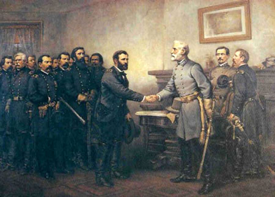
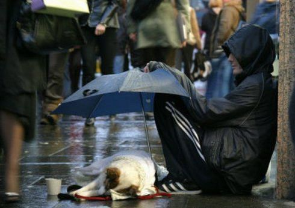
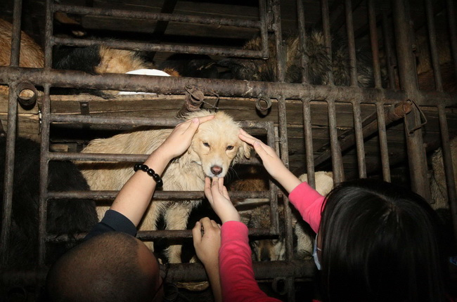

# 南北战争与动物保护主义

**反动物保护主义者和南方种植园奴隶主在与各自的对手争论时论证过程非常相似。南方奴隶主反对北方废奴的论点是奴隶是私有财产，废除奴隶制是对私有产权的侵犯，是违宪的。反动物保护主义者反对保护狗的论点是狗是私有财产，禁止吃狗肉是对私有产权的侵犯，是违宪的。**  

# 南北战争与动物保护主义

## 文 / 李晟

  乍一看，这两者好像八竿子打不着。但我发现两者有一个有趣的相似点，就是反动物保护主义者和南方种植园奴隶主在与各自的对手争论时论证过程非常相似。南方奴隶主反对北方废奴的论点是奴隶是私有财产，废除奴隶制是对私有产权的侵犯，是违宪的。反动物保护主义者反对保护狗的论点是狗是私有财产，禁止吃狗肉是对私有产权的侵犯，是违宪的。 动物保护主义者提出保护狗的问题和18世纪美国建国以来从反对奴隶制到反对种族隔离，有色人种（主要是黑人）人权的落实运动（应然到实然）在性质上并没有什麽不同。但问题在于黑人作为人是同一物种在终极价值观上容易达成共识。那句著名的口号“白色也是一种颜色”即是一证。而狗等动物是不同物种，它是被视为“地球公民”还是被视为“财产”这在终极价值观上的分歧一点也不比当年关于奴隶制存废的终极价值观分歧小。  反动保主义者反对保护作为私有财产的动物（狗），但赞同保护野生动物。其实是因为财产权的问题。野生动物不是私有财产，他们认为保护野生动物没有侵犯私有产权。而狗是私有财产，保护狗是侵犯了私有产权。 

#### 动物权利的来源（合法性）

如果将是否拥有争取权利的能力作为权利来源的话，狗在竞争中输给了人类，地球上已知物种在竞争中都输给了人类，但这意味着只有人类才有人权性质的“特权”，而其它物种都不配享有这一权利吗？如果是，那保护野生动物与此是矛盾的，因为无论是作为私有财产的动物（狗）还是野生动物，它们都不再具有类似“人身权”的“天赋权利”，所谓的“保护”成了伪问题，它的实质变成了已经被私人拥有的财产和尚未被私人拥有的财产。既然都是财产，那就只存在所有者如何处置的问题，财产自身没有任何权利，保护还是不保护其实就是所有者如何处理财产而已，这和当初将奴隶视为和车子、房子完全同样性质的“物”而不将其视为“人”不是极其相似吗？ 黑人在南北战争中是积极主动的争取自己的人权吗？在战争初期，尽管90%的南方白人青壮年赴前方打仗，但后方的400万黑奴并没有趁机造反起义，奴隶制经济照常运作。这场战争在初期是彻头彻尾的“白人战争”，跟黑人好像完全无关。现在护狗派与反护狗派吵得难分难解，彻头彻尾都是人与人之间争吵，狗完全没有参与。是何等相似。 

 那些辩称人有人权是因为人有争取维护自己权利的能力的人，高估了人的能力和承担自由的勇气，低估了人的局限和胆怯、服从的弱小。将能力作为人权的合法性来源，那人权就不是人人都拥有的必需品，而是部份人拥有的特权。近代人类为了将人权由部份人拥有的奢侈品推广为所有人都拥有的必需品，在理论上就辨析过人权的合法性来源，人权不是来源于维权的能力，而是其自身存在。在《辛德勒的名单》中，那些残疾人、老人在辛德勒眼中只是劳动力差的人，在他眼中他们仍然是人。他未因其能力低而否认其人权。但在国社党眼中，残疾人、老人都不是人，因为他们认为没有能力就没有人权。所以国社党可以毫不手软的进行屠杀，而辛德勒只是抱怨一句“怎么招这些人当工人”而仍然接受，这种行为上的不同可以说是源于终极价值观上的不同。狗以及其他物种即使在竞争中输给了人类，但它们仍然有权利，这权利来源于它们的存在。不管人类如何残忍对待狗，也不会发生狗“起义”反抗“人类暴政”的“人狗战争”。如果用这种竞争上的胜利来让“人类暴政”合理，人类损失的与其说是对动物的仁爱之心，不如说是对人权普世的合法性。或许动物保护主义者没有想得这么深入，但在自觉不自觉间，人类中有人去维护“天赋权利”。 

#### 动物权利与财产权悖论

动物保护主义者的尴尬在于既承认狗具有权利，又承认狗是财产。奴隶制问题的不同在于，要么承认奴隶有人权废奴，要么承认奴隶为财产维护奴隶制，这两者只能选择其一。要么全废，要么不废。不存在既有人权又是财产这种状态，这样是容易解决的。而如果将同样原则应用于狗，那么要么禁止一切伤害狗的行为，包括吃狗肉；要么允许吃狗肉，也允许其他任何处置狗（财产）的行为。虐狗者可以在道德上谴责，但在行为上却无法干涉，财产权成了虐狗者的免死金牌。欧美国家立法禁止吃狗肉，不是什麽“多数暴政”，将道德观念强加给人，而是在法律上的另一次“废奴”。或者像有人提出的，禁止吃狗肉属于违宪，是对私有产权的侵犯。感觉又回到了“斯科特案”⑴。毕竟狗和人是不同物种，两者在权利上不可能完全相同，如果狗有“人权”，且不说有人会不会感到被冒犯，“把我辈万物灵长与牲畜同列”？狗的权利还会进一步扩大，比如有富豪将巨额财产留给狗，比如有些人爱狗至极与狗结婚，狗和人一样拥有了财产权和法律婚姻。相比之下，吃狗肉的权利反倒显得不值一提了。另外，这种权利平等的范围也可能会扩大，既然不能吃狗肉，那为什麽可以吃牛肉、猪肉、羊肉……？到最后人类要么素食，要么饿死。难怪有人厌恶动物保护主义。这和当初南方蓄奴州维护奴隶制反感北方废奴是一样的。南北战争中南方并不是全然没理。说到底，在南方的终极价值观中是将奴隶视为财产而不是人，那么为了维护财产神圣不可侵犯而战有什麽不对的呢？南北战争是终极价值观分歧的较量，现在关于动物保护主义的分歧其实也是终极价值观的分歧。关于奴隶的终极价值观达成了共识，而关于狗的终极价值观要达成共识则困难的多。虽然提出了“地球公民”概念，但它能否像“人权”那样达成共识还是未知。 

#### 动物财产与一般财产的区分

南方奴隶主们为了维护财产权而不惜发起战争，但废除奴隶制并不像人们担忧的多米诺骨牌倒塌那样对财产权的侵犯无限扩大。它确实改变了财产的定义，奴隶不再被视为财产“物”。狗是财产不是人，它同时也有动物权利，这种双重性是与奴隶制的不同之处，奴隶被视为人而不是财产，但狗既被视为地球公民，又被视为财产。我将它定义为“动物财产”或者说“生命财产”，承认它是一种财产，但考虑到“地球公民”的特殊性，它不同于一般财产（拥有者具有绝对的支配处理权）。它的“地球公民”性质应立法承认并保护，即法理学上的法是发现的不是发明的，将这种财产从一般财产中区分开来。要么通过麻烦的国会立法提出宪法修正案，保护这种“地球公民权”，把它从一般性的动物保护法提升为宪法。当然，如果它实在不得人心，要么它无法通过，要么它就像禁酒令一样被废除。或者动物保护法面对违宪控告时，最高法院将这种“动物财产”概念区分开来，说明它与无生命财产的不同，并不违宪，以案例法的形式加以承认保护。至于“动物财产”具体激进到何种程度或保守到何种程度，则涉及如何解决悖论问题。 

#### 悖论与拮抗作用

狗的“地球公民权”不能被任意解释。这个问题是一个悖论。过于偏执，不管是偏向哪一方，最后的结果都会背离初衷，这是悖论的特点。人们遇到的很多问题，之所以争论不休，并不是什麽“公说公有理婆说婆有理”的相对主义，而是“物极则反”的悖论。人的本质是有道德性的，或者说是有绝对的价值尺度在的。相对主义的危害在于否认绝对价值尺度，即通俗讲的是非不分。为什麽坚持绝对主义往往被认为是制造灾难，而相对主义看起来似乎更“尊重人的选择”？归根到底是悖论在作怪，绝对价值是存在的，正如人们是有“善”“恶”的概念的，而悖论的“物极则反”特点使人们陷入了打破均衡“好心做坏事”的尴尬境地。因为追求绝对的善而往往导致绝对的恶，所以造成人类苦难的根源通常是人们错误造出的绝对价值的概念，于是人们转而需要求助相对主义。而实际上如果没有绝对的概念，相对是无处着力的、是巧妇难为无米之炊的。如果不先有“善”“恶”这两个绝对概念，哪里有“善恶”这一个相对概念？要劈柴，得先有柴，没有柴，拿什麽劈？“善”“恶”这两个绝对概念是共同出现的，但它们是绝对概念而不是相对概念。它们的意义是自我证明而不是藉助对方证明。“善的相对就是恶”“恶的相对就是善”这种逻辑上的循环论证是无效的，什麽也不能说明解释。在诡辩上常常使用这种手法，听起来什麽都说了，实际上什麽也没有说。人们不清楚自己的概念来源于绝对价值而掉入相对主义的陷阱，结果也并没有消除苦难。因为相对主义在为善辩护的同时也在为恶辩护。相对主义不能解释任何问题，但能敷衍任何问题。之所以澄清这个哲学性的问题，是为了驳斥人们用相对主义“主张保护的去保护”“反对保护得去反对”来敷衍终极价值观的分歧。 绝对价值是存在的，但因为悖论使其可以被接近，但永远无法达到。为了应对悖论，接近绝对正义，类比生理学上为了维持血糖稳定，胰岛素和胰高血糖素两种作用相反互相抵消的激素的拮抗，引入“拮抗作用”这个概念应用到社会学上。动物保护主义者为了保护狗的“地球公民权”而让狗免于受虐待，而反动物保护主义者为了保护财产权不被侵犯而维护人们吃狗肉的权利。通过这两派的拮抗作用让这个问题维持在一个合理可接受的稳态中。这样，既不会让动保主义侵犯产权而逼得所有人被迫吃素，也不会让反动保主义侵犯动物权利而纵容虐狗行为却不能干涉。双方拮抗的结果可能仍不能让人满意，但就规则而言，它提供了一个可能性，让人可以尽力去接近自己想要的结果而又不至于走火入魔走上反面。 在宪政国家所谓的政党政治，即多党自由竞选制，通常表现为两党或两派系；在学术上所谓学术自由，通常表现为两大流派，这在哲学、经济上比较明显。都可以看到拮抗作用的影子。中华文化中讲究“执两用中”也可以感受到这种思想。拮抗作用与相对主义不同，拮抗作用所要达到的结果是绝对价值尺度的而不是相对价值尺度的。换言之，双方虽然是对立的，但却是为了一个共识在努力。这样既避免了绝对主义的悖论困境，又避免了相对主义的虚无混沌。这样的内部对抗是有利于整体的，而不是有害于整体的内耗。不管是动保主义还是反动保主义，在终极价值观上是共识而不是分歧。这样争论才是有益的而不是无意义的。 

#### 现实价值

有人提出人权还未得到保障的情况下应该先人权后狗权。从实用和策略的角度讲这是正确的，事有轻重缓急，优先解决主要矛盾。从理论和原则的角度讲，人权、狗权并没有什麽先后顺序，如果我们有解决人权问题的自发冲动，那我们有什麽理由不去解决狗权问题？ 

#### 尾声

世界是人类行为的结果，而不是人类设计的结果。只有想出拓展资源、互相协作的人类才可能生存，这是我们社会化的基础，这也是我对人类抱有信心的原因，不管什么群体冒出多么神经病的恐怖组织，我总是相信只要他没有一下子把人类灭绝的能力，很快他就会灭绝。正如歌德在《浮士德》中所说：“善良的人纵使迷茫，最终也会找到一条道路”。  

### 【注】

⑴1857年斯科特诉桑弗特（Scott v. Sandford，1857）一案。在该案中，美国最高法院裁决黑奴不是美国公民，并以违宪为由废除了旨在限制奴隶制扩张的1820年《密苏里妥协案》。这个判决不仅从宪法高度维护了奴隶制，而且激化了本来已尖锐对立的南北争执，堵塞了以妥协手段解决南方奴隶制问题的道路，对南北战争的爆发起到了推波助澜的恶劣作用。  

（采编：李兰希 责编：管思聪）

