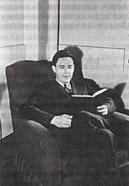
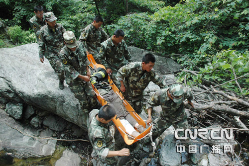

# 对于安徽记者新浪微博言论的再探问

**新闻工作者所做的工作实际上确是是组织作为原始资料的事实（fact），再现并且重构真实（reality），“还原场景”实际上就是利用事实（fact）来建构的真实（reality），但社会真实是无所谓“真”或者“假”的，因此它就无法运用自然科学所推崇的实证方法来加以验明。**

### 

### 

# 对于安徽记者新浪微博言论的再探问

### 

## 文 / 徐煜（复旦大学）

### 

### 

“黄山事件”中，有一位自称是来自于安徽电视台（AHTV）的记者（无法查正她到底是不是记者）“淡淡esse香”在其[新浪微博](http://is.gd/q1V742)上更新的几条内容引起了广泛的转载和热议。作为一名采访该事件的记者，她在微博上动情地说道（在此仅选择其中的两条）： ** 1、“下午，#[张宁海](http://t.sina.com.cn/k/%25E5%25BC%25A0%25E5%25AE%2581%25E6%25B5%25B7)#的遗体被搜寻出来，抬下山的时候，那18个复旦大学生，并不是像报纸写的那样痛哭流涕。他们很平静。甚至连我们的采访都是追着问的，他们说要回上海。一路跟到他们临行的车前，一个男学生过来说，不好意思，要上车了。接着，把车门重重地关上。那一刻，有些东西比天气还冷。黄山，下雨了。”** ** 2、“整理素材，难以入眠。输入#[张宁海](http://t.sina.com.cn/k/%25E5%25BC%25A0%25E5%25AE%2581%25E6%25B5%25B7)#这个名字，想看看能搜出什么结果？一个安徽的小伙子，为了搜救18名来黄山探险的复旦大学生，无辜地献出了自己的生命。可是，得到的是什么呢？下午采访时，复旦学生冷漠的样子让我心寒。他们甚至连张宁海的追悼会都没参加，就匆匆回去了。”** 如果我们分析这位记者整个的叙事结构的话，便可以将上述两条微博内容的关键词限定为“**平静**”与“**冷漠**”。在这位记者的叙事过程中，通过将媒体所呈现的“拟态世界”中“学生痛哭流涕”与她所见证的“真实世界”中的“**平静**”、张宁海献身的“无私”与复旦学生的“**冷漠**”加以对比来凸显出一种极为富有感召力的悲情瞬间。人心本无所谓“冷暖”之分，隐喻(metaphor)手法的运用，将人们所熟知的温度的冷热用来描绘复旦学生的“残酷”与“无情”。 

### 

### 

### 

传播学四大鼻祖之一的霍夫兰曾经做过一项“劝服研究”①，他发现“可信度”高的传播者（信源）传出的信息要比“可信度”低的更能改变人们的态度，而这里的“可信度”包含了以下三个因素：专门知识的把握，公正的态度，还有安全可靠的因素。与此对应的是，记者群体在公众的眼中被视为具有“提炼新闻真实、客观报道真相的社会守望者”的角色。在“记者”光环的围绕下,我们可以发现:网友留言所表达的意见倾向几乎均是以一种激烈的言辞，将矛头“一律”地指向了18名受困的复旦学生，悲叹于他们的麻木不仁，甚至上升到高等教育的失败与悲哀的层面上去。但假使换成是一位自称见证过这一场景的路人甲，而不是类似“记者”的人物发表这种言论的话，网友们的反应会如此地激烈么？ 从认识论的角度来说，胡塞尔的现象学理论似乎可以给予我们一些启迪。在他的现象学理论当中，移情法（Apperception）是在“我”的经验世界中架构出“他者”的一个重要的步骤，由此而架构出一个基于“互为主体际性（intersubjectivity）”的共同世界。胡塞尔认为，“自我”主要依靠于移情的方法，投入到“他者”的意识当中，试图借助于他人的观点来意识世界。正由于所有的网友都没有在场经历过记者所描绘的场景，所以网友均倾向于通过“可信度较高”的信源——“记者”，假借于她的经验性描述来体认出复旦学生内心的**情感**，而这样一种情感因素其实包含于狄尔泰②所说的基于一种“知、情、意”的人类所共有的**内知觉感受**的框架范围内。于是，网友便可以借助于自己“直接自明”的内知觉情感的经验理解（即我所体验到的世界）与记者所见的世界（具体体现在她整个叙事的文本当中）来编制出同一世界所呈现样态。 由此看来，简单化地怪罪于处于自由意见市场的网络暴民是如何的“非理性”是无助于认识这件事情的本质的。而在我看来，网民的问题并不是最主要的，他们只是一个化约论的传播效果模式中“刺激——反应”的受动方，而我们所要做的确是去要解构传播者——也就是这位“记者”她在“在此种环境，而不是那种环境中”所扮演的角色。 我们要关注的一个问题是：**这位记者在怎样的介质中扮演着她的角色？**这个介质不是传统的以报纸、杂志为代表的平面媒体，亦或是以满足阅听人多感官需求的视频媒体，而是微博客（MicroBlog）。使用过微博的人都很清楚地知道，一条微博客的内容最多只有140个字符，这种规模的传播容量就决定了信息的碎片化的性质，使得使用者很难在这个有限的空间内完整地表达出整个事情的来龙去脉。而这种背景的明确交代，其重要意义便在于帮助阅听人身处在一种语境（context）脉络的环境中来理解整个事件。这应该是一位受过基本新闻教育，或者是担当一线采编工作的记者所必备的常识，因为如果没有了这一环节作为参考，那么读者由于咨询的相对不充足，便会倾向于使用他们知觉的“联想轴”，将原本可能没有任何关联性的事物拼接在一起，以自己的诠释角度赋予他们一种与事实完全不同的意义。现在我们再回到这位安徽记者的第一则微博内容，她说道： **“下午，#[张宁海](http://t.sina.com.cn/k/%25E5%25BC%25A0%25E5%25AE%2581%25E6%25B5%25B7)#的遗体被搜寻出来，抬下山的时候，那18个复旦大学生，并不是像报纸写的那样痛哭流涕……甚至连我们的采访都是追着问的，他们说要回上海。一路跟到他们临行的车前，一个男学生过来说，不好意思，要上车了。接着，把车门重重地关上。那一刻，有些东西比天气还冷。”** 在此，我们可以参考2010年12月15日的《解放军报》的报道《[风雨黄山，22小时营救](http://is.gd/skzWRw)》来做一下简单的比较，这篇报道较为全面地解释了救援过程的全貌： **“12日22时许，接到公安部门情况通报后，武警安徽省总队黄山市支队立即启动应急预案，由支队长胡毅清率领23名官兵，迅速赶往事发地点……13日2时27分左右，确定了18名迷路大学生的位置……当天（13日）9时30分，支队官兵成功接应到了18名迷路大学生。一个小时后，他们将大学生安全送上车……简单啃几口面包后，官兵们再次踏上新的征程。这次，他们将要护送遇难民警遗体‘回家’……经过8个多小时的翻山越岭、跋山涉水，晚上20时，官兵们护卫着英雄回家，安息，长眠。”**

### 

### 

### 

该报道通过将搜救过程的几个可经观察和检验的经验**事实（facts）**予以集中的呈现，来帮助读者理清事件发展的脉络，因此我们也可以从中得出一些简单的推论：首先，张宁海的遗体被挖出来抬下山的时候，复旦的18位学生肯定“不在现场”，张宁海民警的死亡对他们来说早已经成为了一个已知的既定事实。而文本中给人的感觉是学生们似乎在见证了民警遗体被抬出的整个过程而显得无动于衷。其次，学生在黄山救援队是连夜护送下安全离开黄山，那么到了第二天的下午，这些学生的心理状况想必会是有波折的，在经历了化险为夷的大逃亡之后，身心俱疲的他们可能已经处在一种极度呆滞的状态中，他们的不哭泣就能代表是冷漠吗？又是哪门的人规定只有哭才能表示对于民警牺牲的敬意？因此，不能仅凭简单的哭与不哭这样的行为来判断复旦学生道德品质上的高劣，因为这种行为的发生是与当时的情境是分不开的，但是对此这位记者所给我们提供的信息却少之又少。另外还有一个值得探寻的问题是：当时的女记者是如何向学生“追问”的，这个“追问”的过程是否包含了逼迫？从她的论述来看，我推测她的问题可能包含了以下几个方面：“你们是否已经知道有一位参与救援你们的警官已经殉职了？他的尸体刚刚被其他队员搬出来，你能说说你现在的感觉是什么吗？”（当然这位记者是不是这样问的我就不清楚了，如果真是这么问，那么我只能说这个记者太过于残忍了）。那么在这种情况下，“**把车门重重地关上**”，以这种方式来拒绝这种提问也是合乎情理的，因为那时候他们对于该记者所采取的“冷漠”态度实质上可被看作是一种对于自我保护。当然，我无意为18位复旦学生来辩护什么，但是从这个角度来看，复旦学生的**冷漠**和**平静**是否有了另外一种全新的意义的解读？ 我们在回归到我们一开始所要关注的问题： **这位记者在怎样的介质中扮演着她的角色？**以上的分析已经解答了由于介质的特异性而导致的可能存在的意义的偏差，但它却忽视了一个该问题的基本假设：**谁又能说她在自己的新浪微博空间上只是扮演了一名记者的角色呢？** 按照新闻专业主义的角度来看，记者的新闻报道追求的是一种超越的客观性，而这种客观性的获得是通过将事实判断（fact）分离于价值判断（value）之外，以一种中立（neutral）的立场来反映真实（reality）而获得的。如果我们以这样一种新闻工作者所共同推崇的标杆来审视这位记者的微博内容的话，那么她所表达的并不是一则新闻，而仅仅是她自己简单的“意见表达”（如：“**那一刻，有些东西比天气还冷**”、“**复旦学生冷漠的样子让我心寒。**”）。遗憾的是，我没有能力查到这位记者的真名，亦无法拜读她的大作，但我相信的是，新闻专业主义的范式定会使她至少不会把带有明显倾向性的主观判断写进她的报道。新闻专业主义③根本不需要记者自身去做出哪怕一点点带有某种主观性的议论，因为在这种理念来看这一个步骤是多余的。因此，简单来说，网民们实际上是在把一个不是记者的“记者”当作记者和一个不是新闻的“新闻”当作新闻来进行膜拜。 应该说，以上的探讨是基于一种目前新闻工作者所认同的共同价值——“新闻专业主义”的维度来进行思考的，但这样的分析实际上还是未能够触及到问题的实质，因为“新闻专业主义”这个概念本身就存在着巨大的缺陷。那么，超越“新闻专业主义”对我们无形的禁锢才能帮助我们以一种全新的视野来洞察问题本身。在此，我以一位同学在网络日志上对于这位记者的叙述为例，这位同学这样评价道： “当事人私下告诉我的一个同事，当时一出山，立即十几台长枪短炮和一大群记者立即围住了他们提问，在回答了几个“敏感”（到底是什么问题，有待进一步考证。）的问题之后，他们不知再说些什么。这是一个急需被还原的**场景**，到底如何**证明**如安徽的某女记者在微博上说的，这十八个学生表现地‘冷漠’，这样的严厉的指责，需要**事实的论证**而不是主观的感受甚至妄加的批判。” 这位同学指出了这位记者在方法论上所存在的问题，他认为记者对学生下“冷漠”的评价似乎有欠妥当，他所提出的解决方法是：**呼吁这位记者通过“还原场景”的方法，通过“事实的论证”来“证明”此种观点。** 实际上，这体现了一种崇尚“实证主义”的新闻报道的模式（美国自1830年代便士报诞生以后便有了这种价值趋向，这与当时实证主义的兴起时分不开的），即以价值中立为原则，通过寻找一些可以被检证的、被观察的经验事实（fact）来证明某种因果性的存在（有A必然会导致有B），如果我们用胡适先生的话来套用的话，那就是：“大胆的假设，小心的论证。”因此，该同学认为该位记者问题的症结似乎便在于**她是给出了她的假设，而并没有运用经验事实来论证她的观点。**

### 

### 

### 

在这里有必要指出的是，**事实（fact）**并不等同于**真实（reality）**，而这是我们往往所容易混淆的，并误把它看做是一组内涵完全相同的概念。能够被称之为事实（fact）的东西是能够通过检证来区分“真、假”的，其所存在的数目也是相对有限的。比方说：我们可以通过大楼的监视器发现，在某时刻，某人走进了电梯，它就可以被看作是一个事实（它是物理事实，具有唯一性）。**但新闻工作者所做的工作实际上确是是组织作为原始资料的事实（fact），再现并且重构真实（reality），那么这位同学所说的“还原场景”实际上就是利用事实（fact）来建构的真实（reality），但社会真实是无所谓“真”或者“假”的，因此它就无法运用自然科学所推崇的实证方法来加以验明。**这位记者可以提供可能通过“还原场景”的方法来诠释为什么她认为这些同学是冷漠的，但这种方法只是用作为“解释”和“说明”，谈不上运用“事实的论证”来“证明”这个层次，要是真能够通过论证的手段来发现某种“规律性”的东西，我们也就早能够“未卜先知”所可能发生的后果了，张警察或许就不会牺牲了。 假使我们认定这位女记者在追问复旦学生的时候，有其他媒体的记者也在场，那么尽管他们报道中所截取的事实是相同的，但是他们最终所建构真实（以新闻报道为最终产物）绝不可能长得一模一样。在传播学界，框架理论（framing）⑤便是以此为基础，来探究媒介如何通过选择与重组的方法来建构社会真实的。从本质上来看，框架的形成（也是新闻形成的过程）实际上便涉及到了一个**意义的产制与建构（construction of meaning）**的过程，而衡量新闻作品的好坏的标准，**并不是比较谁引用了更多的事实，而是谁更好地在谨守事实的基础上，运用了这些事实产制或者建构出了别人所不具备的意义（meaning），因为意义的凸显是通过对比来实现的，而“你是谁”又是由“你不是谁”来决定的。**由此，新闻工作者不可避免地落入了“新闻专业主义”极力让他们所避免的“主观性诠释”的圈套。应该说，“新闻专业主义”的问题便在于它对“真实”的可靠性显得过于乐观，而很少考虑了认知的主观性。同时，在诠释学的角度来看，新闻专业主义所要求的客观报道简直就是天方夜谭，因为世界上只存在相互建构的意义本身，并不存在所谓的“纯客观”的研究。 总而言之，新闻报道中实证和诠释的运用实际上是互补的：因为世界上不可能只有“因”和“果”，它排除了不能重复发生的事情的可能性，也无法回答有关于意义的问题。实证的路径实际上相当于一种“写实主义”或者“实在主义”，而诠释的路径相当于一种“文学创作”，甚至可以说是“讲故事”（story-telling）的模式，确认经验事实的可靠性是由实证来完成的，而选择和组织事实则是交由诠释。而这位安徽女记者（姑且把她当作一个记者）的最大的问题便是在于**她并未负责任地认清、查证、梳理所有的经验事实，而直接交由选择的过程来编制出一套她自己的“社会真实”，作为它所得出的独断性结论的补充与说明。**

### 

### 

### 【注】

①详见词条[http://baike.baidu.com/view/594322.htm#4](http://baike.baidu.com/view/594322.htm#4)【说服研究】一项 ②狄尔泰，德国哲学家，历史学家，心理学家，社会学家。认为哲学的中心问题是生命。通过个人“生活的体验”(Erlebnis)和对生命同情的“理解”(Verstehen)，就可认识到文化或历史即生命的体现。强调和不同的生活类型(理性的、情感的、意志的)相应的是不同的宇宙观，不同的历史时期也有不同的宇宙观为其特征。他同时认为任何一种宇宙观都是相对的，这就是历史主义的要义。 ③新闻专业主义是美国政党报纸解体之后在新闻同行中发展起来的“公共服务”的一种信念，它最突出的特点，是相信可以从非党派、非团体的立场客观地报道新闻事实。新闻专业主义的目标是服务于全体人民，而不是某一利益团体。 ④实证主义（positivism）是强调感觉经验、排斥形而上学传统的西方哲学派别。又称实证哲学 ⑤框架理论详见[http://baike.baidu.com/view/1883721.htm](http://baike.baidu.com/view/1883721.htm)

### 

（编辑：管思聪）

### 

### 
