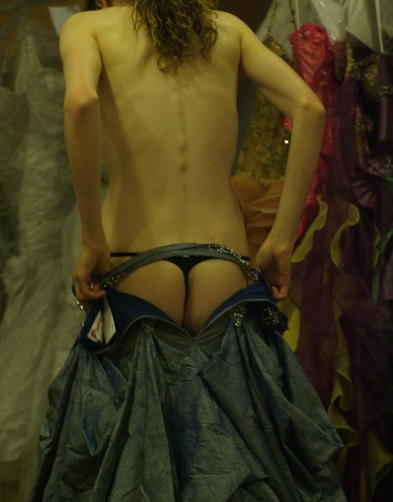
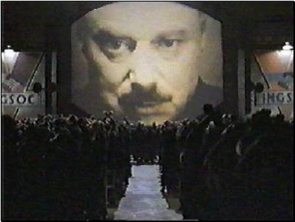
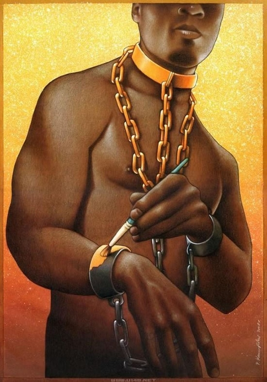

# 文化工业：反文化的胜利

**大众们不需要去思考，自有精明的书商会告诉你，你应该去买什么书。并且往往还要补充一句，如果你还没有读过，那你就落伍了。这种流氓似的垃圾文学灌输行为，暗中正是切合了资本的控制过程。资本已经成为了绝对的主人，对于消费者来说，他不仅被剥夺了想象力与自发性，还被迫，同时也享受着，在一堆垃圾中寻找“精神食粮”。**

### 

### 

# 文化工业：反文化的胜利

### 

### ——《文化工业：作为大众欺骗的启蒙》的一些读后思考

### 

## 文 / 杜慧颖（南京大学）

### 

### 

某天，下了课去图书馆报刊阅览室，我很自然地拿起一本《服饰与美容》。看着这本国内顶尖的时尚杂志里花花绿绿的时尚大片，瘦削的明星精致优雅气质不凡的大幅特写，一边幻想着自己有朝一日也能穿着Chanel，背着Hermes，着一双Ferragamo，戴一副Gucci墨镜，洒上Dior香水，用上La mer的护肤品。不，这不仅仅是幻想，是梦想，是理想。它给人一种人生的追求，敦促着你要孜孜不断地努力工作，为消费奢侈品而奋斗一生。没有最奢侈，只有更奢侈，这样人们就永远有着向前看的奋斗目标。而只有通过消费奢侈品，你才有一种胜利般喜悦，仿佛这样才不枉过此一生。 

### 

### 

### 

文化工业就这样渗入到我们日常生活的每一个细小的角落里。在令人舒服愉悦的潜移默化下，人们在被消费而不知。广大消费者们当真以为顾客就是上帝了。而可惜事实上，顾客不是上帝，不是文化产品的主体，而是客体。文化工业也不需要有文化，相反，它把高雅的艺术与低俗的乐趣撕碎了糅杂在一起，放到高压锅里熬成一锅气味浓郁的汤。搅一搅，看不见艺术，看不见思想，看不见情感。当文化工业说出文化这两个字的时候，它实际上恰恰是在与文化作对。它要消灭文化，并且取得了胜利。 这是文化工业的胜利，一场不可阻挡的胜利。 如今最受到年轻人们欢迎，或者简言之最红的作家是谁？韩寒和郭敬明。当然，光把郭敬明这名字放在韩寒的旁边，已经让我犯了恶心。但是我还是不得不承认这厮在年轻人中间的高人气。他（她？）代表了时下流行的一种文学风格。追求矫情的描写，浮夸的词藻，以及，很短的。每三两字。就一次的。断句。达到一种让读者们纷纷“45°角仰视天空迎风流泪”的效果。 文学一旦成为一种商品，那它的目的就不再是出于情感的激烈碰撞，而是以满足消费者的需求为写作的方向标。今天读者喜欢“轻阅读”，他们中意的读物既要看着不累，又要能够显示出他们的品位和身份，最好还要带有一点浪漫的情调。看着不累，不需要思考，如此阅读已然成为大众娱乐方式之一。点开读书网站，首当其冲的总是畅销书排名，印刷精美手感顺滑，最好还能带着插图的书籍总是蝉联冠军。大众们不需要去思考，自有精明的书商会告诉你，你应该去买什么书。并且往往还要补充一句，如果你还没有读过，那你就落伍了。这种流氓似的垃圾文学灌输行为，暗中正是切合了资本的控制过程。资本已经成为了绝对的主人，对于消费者来说，他不仅被剥夺了想象力与自发性，还被迫，同时也享受着，在一堆垃圾中寻找“精神食粮”。他们让消费者觉得自己的需求得到了极大的满足，然而这些虚假的需求实则是资本制造出来为了进行更大规模再生产的假象。它们不断许诺消费者以快乐、轻松，摆脱社会劳动带来的所有负面情绪，然而不仅这些承诺没有兑现过，还在不断欺骗消费者。实际上，这些许诺的快乐不过都是一种幻觉，一种摆脱了思考，摆脱了理智的纯粹幻觉，就好比吸食毒品所带来的快感一样。 

### 

 就是这样的字符堆砌——我都不好意思称之为文学——恰恰充斥着文化市场。这些文化工业所生产出来的“垃圾食品”，虽然看上去色泽精美，造型各异，但是“在文化工业的发展中不断由文化工业提供的新东西，仍然是永远雷同的伪装；时时处处，推陈出新的外衣套在一个骨架上，而这个骨架就像追求利润的动机本身一样，自从它第一次赢得了对于文化的统治权以来就没有什么改变。”[1]如今风靡的各种网络文学莫不如是。假如剥去它们华丽的外衣，甚至可能空荡荡什么都没有留下。这些华丽的文字商品，不断地吊起消费者的胃口，终究不过是对于人们所极力想要摆脱的充满压抑的世界的赞颂。而且就如你所知的那样，颂歌总是让人听来充满了盲目的激情，充满了从众的安全感。“笑声是我们无法逃避的权利的回声。而取乐则是一种很有疗效的沐浴疗法。快乐工业绝对不会不对此作出规定。它把笑声当成了施加在幸福上的欺骗工具……在每个文化工业产品里，文明所带来的持续否定作用再次显现出来，并强加给了受害者。为他们提供这些产品，就是剥夺这些产品。”[2]在小说里，人们获得了异于自身生活体验的快乐，并自然而然地将其同情为自身的快乐。在“悦读”的过程中，读者发掘出作者虚拟出来的幸福，将其收入口袋，成为自己的。 在这样的阅读中，消费者们不会去想到任何关于毒奶粉、躲猫猫、高房价，也不会去关心走出门的时候会不会碰见70码，而赵作海谭作人冯正虎倪玉兰对于他们来说更是另外一个星球上的人和事。他们只消逆来顺受，他们只消沉醉于郭敬明张悦然安妮宝贝之流为他们搭起的一座充满了矫情的文学天堂，那里有帅哥和美女间跌宕起伏荡气回肠的爱情故事，那就足够了。 那就足够了，“无知即力量” (Ignorance is power)[3]。 而另一位文学青年韩寒，则走的是完完全全另一条道路。他被奉为青年一代人的精神领袖，他的博客的浏览量世界第一。不管他说了什么，都像是给社会的一针兴奋剂。他在他的博客上嘲讽现实社会的种种不公，随即就会被竞相转载。无数网民都将时代的精神寄托于这个年仅27岁的赛车手身上。因为他的文字浅显易懂，用冷嘲热讽的方式表达出了他们的不满。此刻，韩寒成为了一个消费品，一个思想的消费品。谈论韩寒，热捧韩寒不仅不需要任何思想上的储备，更是一次对社会压榨下疲惫的心灵们的一场全方位的按摩。藉由韩寒之口，抒发了他们压抑许久却又捉摸不定的反抗的想法。他们选举出韩寒作为自己的意见发言人，而自己则省去了亲自思想的精力，用来更好地工作，来为他们所咒骂的事业添砖加瓦。 

### 

### 

### 

许知远在《庸众的胜利》中写到，“韩寒说出一些聪明话，时代神经就震颤不已，这是庸众的胜利或民族的失败。”[4]然而这不仅仅是庸众的胜利，这背后最大的得胜者则是文化工业。 其实韩寒只是说出了一些常识，然而这个举动就已经让整个青年一代人对他疯狂迷恋。文化工业将一个普通人捧成明星，成为“意见领袖”，这外表看来是宣扬一种反抗专制追求自由思想的个性，其实是一种流行性的虚假个性。“个性不过是普遍性的权利为偶然发生的细节印上的标签，只有这样，它才能接受这种权利。”[5]在宣扬个性化的过程中，个体渐渐失去了自己的个性，抛开自己的大脑，去追随有个性的领袖的大脑。尽管扛着个性、自由的旗号，也掩盖不了最终牺牲了个性和自由的事实。这种盲目的追随，渐渐形成了一个群体，他们将韩寒全权作为自己思想的代表。群体是不受理性推理的影响的，他们只能理解零碎的拼凑起来的观念。对于“提供给他们其他的各种意见、想法或者信念，他们或者一概拒绝，或者全盘接受，将其视为绝对谬误或者绝对真理。”[6]他们在追求个性的时候弃掉了自己的个性，他们在追求良知的时候扔掉了自己的头脑。他们已经不再是他们自己了。他们成为了群体中的一份子，带着一丝可怜的“归属感”，使劲将自己同化成普遍性。 这时人们就暴露出自己不讲道理的一面。他们丝毫容不下任何“异己思想”，对反对他们的声音来源群起攻之，不诛不快。现实的生活使得大众的日常生活充满了压抑，他们在为生活奔波的途中丧失了道德。遭受了委屈的人们只能通过愤怒、叫嚣和暴力的方式来维护自己内心留存下来的仅仅那么点良心。因而他们的内心很敏感。他们既容易被打动，也极容易被煽动。他们需要不思考，只管人云亦云亦步亦趋，只怕跟不上领袖的大脑。最终，可怜的追随者变成了和他们所反抗的垄断机制一样的“唯领袖”群体。 这些追随者们虽然比之前那伙人看到了更多的现实，然而他们却从不会思考为什么，也不会去想怎么办，因为在发泄了被压迫的不满情绪之后，他们将以更轻松、愉悦的心情投入到新一天的被剥削生活中去。而韩寒对于他们而言，不过是当他们精神受到伤害时，提供慰藉的港湾。这不能不说是可悲的，因为大众始终是“墙上的一块砖”。 如许知远说，“对于韩寒的热烈推崇，是整个社会拒绝付出代价的标志。当我们沉浸于只言片语的嘲讽时，一定误以为自己已消解了这可恶的权力体制，其实一点没变，嘲讽只是为上面裹了一层糖衣，但我们进行自我麻醉，还将此视作一次反抗。”[7] 韩寒的文字使大众得到了宣泄。大众通过他的文字消解了社会劳动中的不满和负面情绪，然后更好地继续投入到社会劳动中去。他本意应该帮助人们忘记屈从，然而到了最后，他却使得人们变得更加服服帖帖了。 

### 

### 

### 

在《文化工业：作为大众欺骗的启蒙》中，霍克海默和阿多诺断言，“不要指望观众能独立思考。”[8]假如人们一旦进行了反思，那这个结构就会即刻瓦解掉。文化工业将所有需要思考的逻辑联系全都切断了。 最后，我们已然被文化工业筑起的长城所包围了，乖乖举手投降吧。我们无路可逃。你问，那我们精神的希望要寄托于何处？什么，你说至少还有学术的象牙塔？哈，Too simple， sometimes naïve！学术已经成为了文化工业新纳的小妾了。高校是工厂，教授是熟练工，我们是学徒——论文在流水线上被生产出来。不需要严谨，我们领的是计件工资；不需要真诚，我们有的是造假；不需要思考，我们有的是抄袭。不，不能说是抄袭，那叫“学术失范”，那叫“引用不规范”。你看，埋头学术早就已经不合时宜了，在课题争夺战中厮杀才是康庄正道。当越来越多的学者成为了学术明星，如同娱乐业明星一样耀眼，振臂一呼，不管你真唱假唱都有群情激动的粉丝围绕。到这时才算得上是学术的成功。 到这时，文化工业的反文化战争，才是真正宣告获得了胜利。 

### 

### 【作者注】

文中的韩寒和郭敬明皆是一种象征，切勿纠缠本相。 

### 

### 【引用文献】

[1] 《文化工业再思考》 阿多诺著 高丙中译 [2] 《文化工业：作为大众欺骗的启蒙》霍克海默、阿多诺著 [3] 《1984》 乔治·奥威尔著 [4] 《庸众的胜利》 许知远著 [5] 《文化工业：作为大众欺骗的启蒙》 霍克海默、阿多诺著 [6] 《乌合之众》 勒庞著 [7] 《庸众的胜利》 许知远著 [8] 《文化工业：作为大众欺骗的启蒙》 霍克海默、阿多诺著 

### 

### 

（采稿：黄理罡 责编：黄理罡）

### 

### 
