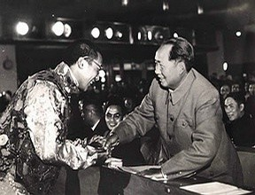
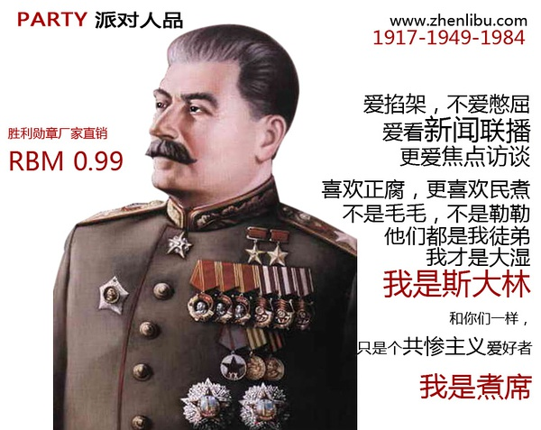
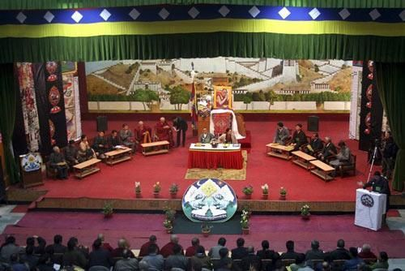

# 民族国家的穷途末路

**对某种文化/宗教/信念的忠诚是个人的选择，不是集体的选择，但是“民族”这一发明把个人绑架住了，祖先的身份成为了他们的债务，他们感到自己有必要对自己的身份保持忠诚。**

# 民族国家的穷途末路

## 文 / H.F.W

### 一 

在中文的环境里面因为熟悉了“民族“这个词语便不再觉得它是多么诡异，在步入近代之前，站在中原文化的立场上看只有夷夏之分，没有这个民族和那个民族的区别。跟很多人的感觉不一样的是，传统的夷夏之别根据不在血统，而在文明程度，董仲舒就讲过“王者爱及四夷”，“进于夷狄则夷狄之，进于中国则中国之“。所谓的“中国人”从人类学的角度上来看血统是复杂的，几乎所有东亚次大陆的先民都或先或后地有些分支加入了进来，把这些人称作是“汉族人”没有基因学的证据。广东福建的居民同北方居民的种族差异要大过东北的满汉蒙的差异，而他们都认为自己是汉族人，是因为世世代代接受了中国的某种正统思想。汉族与其说是一个民族，不如说是在文化的凝聚下一个想象的共同体，只是我们常常忘记了这一点。

文明是一个国家凝聚力的核心，这一点董仲舒和奥古斯丁达成了一个诡异的共识，在奥古斯丁的《上帝之城》就提出区分罗马人和野蛮人的标准是他们是否信仰上帝。实际上，先民的心态开放程度是我们这个时代远远不及的，他们已经解决了的理论问题，到了现在反而成了争议的一个重要话题。这里面的原因要从19世纪后半期以降中国的思想转变谈起。

作为现代含义的“民族”一词是19世纪末从日语中转引过来的，因为当时在信念和国体的双重崩溃的背景下，彼时的中国人需要寻找一个主体性的词汇来涵括自己所处的群体，所以“中华民族”这个词语本来是同日本民族欧美民族并列的，它所指涉的当然是中国文明共同体，民国之后又细分为汉满蒙藏回五大民族，对应西语中ethinicity一词。事情的转机出现在1949之后，斯大林的“民族论”开始影响中国，活生生地划出56个民族来，这56个民族的划分是很粗糙的，并非以血统为根据。

斯大林的民族是理论是1912年担任真理报编辑的时候，为了解决当时共产国际内部的“民族自决”理论问题而炮制出来的，后来苏维埃掌权，加上苏联放弃了世界革命的想法，对民族的性质和地位一再修改，后来成为在边境地区对当地土著民族分而治之的工具。这便形成了共产国家的“民族多样性“特色，要注意，多样的民族是人为划出来的。

我们把历史的视野放宽一点，会看见一个个部落和国家兴盛又衰落，有的永远从历史中消失了，但是那些人的后代都还在，他们构成了另外一个国家或者朝代的一部分，他们是没有义务和必要记住自己祖先属于什么部落或者“民族”的，对某种文化/宗教/信念的忠诚是个人的选择，不是集体的选择，但是“民族”这一发明把个人绑架住了，祖先的身份成为了他们的债务，他们感到自己有必要对自己的身份保持忠诚。这样一种忠诚对世界没有任何好处，只能制造无数的裂痕与灾难。如果人们都忘记了自己的民族身份，这个世界会美好的多。问题是：为什么我们要记住？或者是：谁想要我们记住？

上面这个问题我就不回答了，否则会有很多敏感词。美国七十年代民权运动之后，就有一种呼声，要求在各种登记表格上取消“种族”一栏，这个动议没有实施，因为一些政客要推行affirmative action，对少数族裔进行倾斜性补偿。Affirmative action是否是正当的，这是一个吵的沸反盈天的话题，我们不谈。因为一些少数族裔希望利用自己的身份获得差别待遇，所以他们支持进行种族区分，但是效果适得其反，这样的倾斜并没有让他们的生活变的更好，反而成了实现平等公民权的一大障碍。

以种族/民族区别进行差别对待从社会正义的角度上效果是很坏的，在天朝，因为对少数民族在计划生育/招考/工作上面的倾斜，导致了不少人不惜越过道德底线改动自己的民族，而少数民族本身并没有因此而得到什么好处（看看他们的现状）。支持这个政策的人，没有意识到，这一政策其实是对少数民族的歧视和侮辱。解决所谓“民族”问题的出路，首先要消除对他们的歧视，倾斜政策本身就是歧视。一个人是否认为自己属于某个民族这不重要，重要的是，应该在官方的各种政策上，对所有民族一视同仁，而对所有民族一视同仁的方法，最省事同时也最彻底的就是不统计他们的民族。

我是希望有一天民族这个词语能够消失的，西语中的ethinity，用来指涉那些在他们眼里奇奇怪怪的人群，穿着花里胡哨的衣服，有着一些不可理喻的生活习惯。这当然是一种文化的偏见（实际上，学术中的社会学和人类学的差异就是，社会学主要研究“文明国家”的社会，人类学研究“原始居民”的社会，那些原始部落就是一个个的ethinity），但是一个国家自己把自己的公民分成许多ethinity，就更奇怪了。这种政策阻碍了历史继续下行的过程中人群融合的速度，因为政府提升了民族意识，所以产生了更多的无中生有的民族矛盾。

### 二 

我在一篇已经被豆瓣删除了的文章中谈到我对民族主义的反感，那篇文章批判的民族主义侧重点在民族沙文主义而不是民族分裂主义。民族沙文主义和民族分裂主义共有的基础是错误的民族意识。但是有一种类民族分裂主义，它所附丽的那个想象的共同体并非民族，而是宗教，或者历史经验，或者地域。虽然在这个全球化的时代，地域的共性和文化的共性相比已经远远不是什么问题了。

这些民族分裂主义有时候是有道理的，因为他们反对的并非超民族国家，而是极权政府，只是人们看不到其中的区别，只注意到了他们的民族/宗教/地域属性。民族/宗教/地域属性更容易使人们获得反抗极权的感召，多数民族就绝少这样的动力。在极权时代，民族分裂主义往往是推倒的第一块多米诺骨牌，所以我是欢迎他们的反抗行为的，但是他们需要认识到一点，当极权政府推倒之后，继续推动民粹主义情绪，就会把自己的族人推向持久的暴力和杀戮的深渊。共产主义解体之后的巴尔干半岛是血淋淋的例子，我不想在未来中国的西北再看见它上演一遍。

现在西北地区的民族分裂主义情绪，就我的了解来看，更多的是暴政的刺激，他们的信仰得不到尊重权利得不到保障，因此，这还不是民族问题，依然是极权问题的延续。在一个自由的国家里面，拥有自决权的主体不是民族，而是首先是个人，然后一级一级由下而上的社区实体，属于一个社区的问题，应该由社区来解决，而不是依靠中央政府决断。这是一个重要的原则叫做“自治优先原则”，人们需要为自己的决策负责，而且他们必须要有为自己负责的权力。人们之所以要反抗权威，是因为他们的生活不是自己安排的是权威安排的。但是当他在集体决策中有了发言权和代表权的时候，他拥有了修改和否定自己的决定的渠道，“反抗”是没有对象的。自由化对权力均衡最重要的一点是消解了矛盾的客体，从而能够从根本上解决民族问题。

当然，我们也不能天真或者善良地相信民粹主义和极端势力不存在，有，但是“一边一国”并不是大多数人想要的，经济全球化消除了传统国家的边界，在欧洲我们看到了一个新的，良好的趋势，经济的利益使传统国家纷纷放弃了一些传统的主权，愿意在一个更大的格局下和平相处，做为一个欧洲人或者是一个捷克人的身份区别并不是那么重要。正是这样的趋势存在是我有了一种乐观的情绪，我相信人们的智慧和利益会引导他们走向和解，而不是以邻为壑兵戎相见。

民族主义情绪是一种过时的，属于中世纪和反文明的心理情结，无论是民族沙文主义和民族分裂主义都是一样。20世纪见证了民族主义的大溃败，到了21世纪这它很可能会全面谢幕，新的争端将发生在文明和文明之间，而不是文明和野蛮之间，现代和中世纪之间。而文明的冲突并非是那么可怕的一件事情，因为文明本身意味着理性和沟通的可能。毕竟人是文明的载体，如果我们能够听懂相互的语言，如果我们有以直待人的智慧和容人的雅量，这个世界没有什么是不可以通过对谈来解决的。

回望历史，所有的战争都是因为缺乏共通的价值和争端解决机制而产生的，如果争端有了文明的决定胜者的规则，那就不会产生那么多灾难。国家与国家，民族与民族，群体与群体甚至人与人之间之所以会爆发战争，因为当冲突产生之后，正义失败了。人们缺乏对正义是什么的共识，这时候，战争不仅是代价最小的选择，绝大多数时候是唯一的选择。但是如果在这个世纪人类能够搬开极权的绊脚石，通过对话和谈判达成普世价值的一致看法，那么也许下个世纪的人只能在历史书中找到战争这个名词，那个时候，我们的后代们也许会讥笑我们这些打来打去的祖先们的野蛮和愚蠢。

让他们讥笑我们吧。

