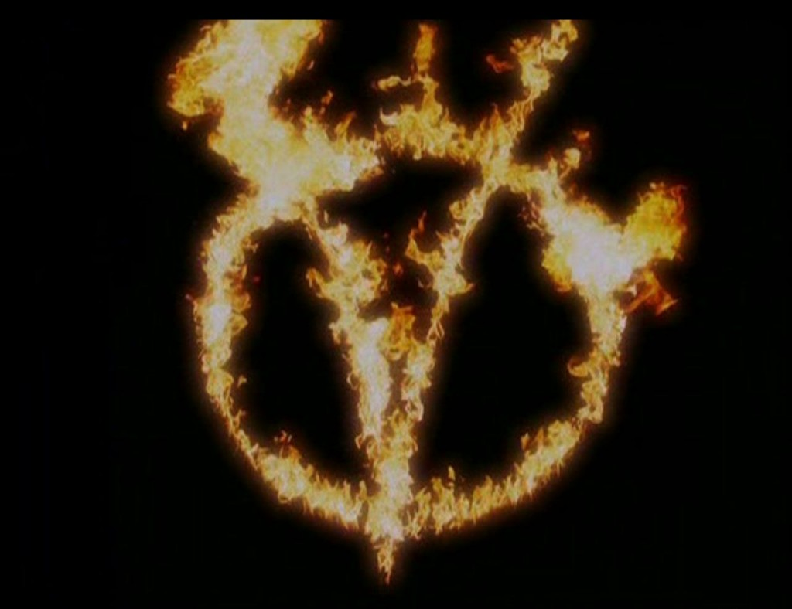
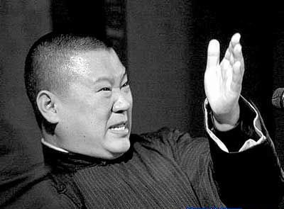
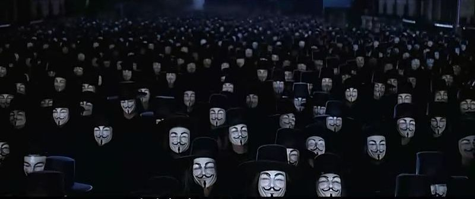

# 沉默的悲剧

**“被一些人欺压和羞辱后，你很难有机会讲出来；有可能你什么都没说、仅仅动了动嘴，就被以维护大局的名义送走，要么不明不白地做苦工，要么不明不白地成了病人。这种遭遇，光是想想，就足以让人感到愤怒和悲伤。我们是需要宣泄情绪的……”**

# 沉默的悲剧

## 文 / 乔淼（北京师范大学）

 “悲剧”和它的变体“杯具”在这个年代已经被用滥。世间诸事，忧多乐少，本来如此，悲剧比喜剧多，没什么值得惊奇。但有一类悲剧总是让我印象深刻，其剧情大抵如下：一个或“品学兼优”，或“孝顺父母”，至多“沉默寡言”的人——说不上好也说不上坏，最起码脑后没有反骨肚子里没有坏水——突然之间抄起家伙向旁人大肆挥舞，于是遍地修罗场。说到这类悲剧时，记性稍好的人也许想起马家爵和杨佳，容易忘事的也能想到近来诸多杀小孩的案例，其实还有些例子更加遥远的，例如文革和农民起义什么的……总之，例子如此之多，不需我再举。问题则只有一个：这些怎么看都不像是杀人魔王、冷血屠夫，甚至一贯是守法良民的人，为什么朝夕之间就杀人不眨眼了呢？ 一个相对正常的人在杀人时，可能的动机不外乎几种：图财，寻仇，因情生恨和泄愤。上述的杀人者们在下手时就没想到要给自己留后路，更不考虑要多少钱、怎么花，故而不是图财。说到寻仇，总要有直接的仇人在对面，还要有等量的仇恨可报；没有仇恨，也就没有报复。情杀当然更与此无关。排除了前三种原因，杀人的理由只剩下一个：发泄怨恨。 

 受到激惹而攻击，这是所有动物的本能，也看不出有什么道理可以限制它的发作，除非打算像人类这样发展出一个所谓的“文明社会”来。文明的发展可说是用各种禁忌限制本能冲动的过程：饮食、性交、暴力，莫不如此。换而言之，一条大河，原本自由奔放，时不时还会任性地改个道；后来被大堤和水坝拦住去路，只好乖乖沿着人工开凿的孔洞及河槽流走，顺便也就带动水轮机发出了电。没有堤坝就没有电；同理，若没有禁忌，我们至今也还是丛林里的猿猴，休想坐在电脑屏幕前敲打键盘、抒发“万物灵长”的优越感：最起码，要是每个人被激怒了都可以随便杀人，我们就很难有机会出生，也很难活到现在。 河道被拦截，水会越存越多，大坝上就有个定期开放的泄洪闸。同理，本能被压抑，人也会感到某种不适，就需要有个出口。以性能量为例。每个男人都有各种各样的性幻想，文明的禁忌则不允许这些幻想全部被实现，怎么办呢？必须有一个替代。在某些原始部落，男人们在劳动时会唱黄色歌曲，譬如在舂米的时候高唱性交，其本质是用舂米的动作模拟性交的过程（也就是说，一边手淫，一边赤裸裸地意淫）。现代的文明人更加幸运，有了《花花公子》和“东京热”这样的产品，他们的模拟更加直接一些。性是如此，攻击也不例外，人类发明了各种各样的产物来代替直接的杀戮和打斗，比如竞技体育、暴力电影和电子游戏……当然还有一种最直接、最有效的表达方式，就是我们的言说。 除去极端的情况，没有哪个心理咨询师（以下所说的咨询师不包括任何二把刀和冒牌货）会让你在咨询室里运动、看电影和玩游戏；但决不会有哪个心理咨询师不和你讲话、不允许你言说的。签署心理咨询的协议时，“言论自由”总是来访者所得的最大保证，甚至是唯一的保证：不能抽烟，不能饮酒，不能有暴力举动，不能得到身体接触，……但永远可以保持沉默，同时也有权在任何时候开口讲话。你怀揣愤怒走进咨询室，心理咨询师不会建议你“去报仇”或“去杀人”，但一定会鼓励你“说出来”。 攻击和杀戮的冲动通常源于两种情绪，其一是愤怒，其二是悲伤——因焦虑而杀人的，一般属于重性精神病患者，不在本文讨论之列。宣泄这两种情绪的需要，在极端的情况下，会引发杀人的冲动。而即使直接指向仇人的仇杀，大多数也是为了泄愤，为了“讨还公道”；既然杀戮不能改变已经发生的事实，死者不能复生，所谓的“公道”也就成了“一报还一报”式的心理平衡。故我们可以认为，无论经历怎样的创伤，人真正需要的都不是杀戮，而是宣泄心中的情绪。假如有一种方式能够帮助他们满足需要，就不会有杀戮出现。而“言说”正是一种有效的治疗手段，可以让人平息愤怒、走出悲伤。通过言说重新回顾过去的事件，就是对个人生活经验的重构；在这一过程中，被压抑的情绪会随当时场景的再现而表达出来，深藏的情结也有机会通过联想得到解释。压抑被解除或减轻，情绪得以宣泄，言说者的需要就得到了满足，也更容易理解和接纳已发生的事。而理解和接纳之后，杀戮也就变得不必要了。最后这一步，是诸如体育、暴力娱乐等替代手段所做不到的。 言说并非只有在咨询室里才能完成。对着咨询师讲故事要靠移情，实际上有点打折扣；最好的办法还是在咨询室之外，把你的话语直接讲给当事人听。对单相思许久的人说“我爱你”，对伤害了你的人说“你伤害了我，我很伤心、很生气”，对你的上司或父母说“这件事我有不同的看法，如何如何”……当然还有公共领域的言论自由。可惜在传统文化中，这样的表达是不被鼓励的。恋爱不能自由，要靠“父母之命，媒灼之言”；臣要忠于君，只能“死谏”，被打被杀纯属自找；儿女要服从父母，提出反对意见就是不孝；女人要从一而终，作男人的附庸，受到任何虐待都求告无门；民众当然更不能向官吏诉苦，“屈死不告状”……可想而知这是何等的压抑和痛苦。除了高高在上的皇帝，其他人的愤怒和悲伤都不能自由表达，有时甚至根本不能言说。经年累月，胸中的痛苦就会越来越多：先是以隐晦的方式表达，譬如民间的顺口溜、艺人的说书和相声，当这种隐晦也被禁止时，就渐渐地有了民怨沸腾，然而还是不能表达。终于有一天，人们放弃了争取言说的耐心，表达就将只剩下一个字： “杀”。 

 杀戮是看上去最彻底的解决方式。杀死所有的人，只剩下自己一个，就不会再有人招惹自己，就不会再有愤怒和悲伤。另一方面，杀戮却并不能真正宣泄情绪，也不能让人走出过去的阴影。盖因杀戮不是言说，只是言说的替代。而替代是不可能毫无副作用的，最大的副作用就是上瘾，就是沉溺其中，让人再也无法返回正常的现实之中。用酒浇愁的人会越喝越多，如刘伶，永远清醒不过来；用吸毒或性乱缓解焦虑的人，会越吸越多、越交越滥，如《所多玛的一百二十天》，至死方休。同理，杀戮也会让人上瘾，张献忠写“七杀碑”，把治下的民众杀个精光，又能如何？——然而，杀戮也是最后的手段，是愤怒和悲伤积累到极限时无可奈何的表达方式。此时的人已经失去了言说的耐心，也没有人能耐心地聆听了。 传统被斩断之后，有些自以为高人一等的人站出来说，这些人素质差、头脑混乱、格调低下，需要由我们来统治，让他们说什么就说什么，这样就天下太平了。于是有了号称最牛B、最强大、说一句话就顶别人一万句的人掌握大权，其时，一部分人被剥夺言说的权利，另一部分人看似有绝对的话语权、实际上却只能按照一个方向表达意见。结果如何？平日里乖乖听话的学生像恶狼一样抡起铜头皮带，相安无事的邻居忽而长出了间谍的耳朵和眼睛，“勤劳善良”的父老乡亲支起煮食人肉的大锅……很难说这不是另外一种杀戮的横行，只是这种杀戮没有像过去全国性的暴动那样、动摇暴君统治的基础罢了；暴君没有把全体民众逼入绝境、逼迫他们将杀戮指向他，而是直接指挥一部分人去杀戮另一部分。在那段日子里，有多少新的愤怒和悲伤产生？时至今日，其中又有几多得以言说和表达、得以真正释放？我想，这个比例不会太大。 几十年后的今天，我们拥有的话语空间稍稍大了一些，但本质上没有变。不鼓励言说的传统文化影响仍在，对言说内容的无视和态度的揣测也扭曲着它的力量。太多的人不去细究话语的对和错、逻辑的完整或缺失，而是执着于其表达形式、语气和动机，以后者而非前者判断其价值。暴君已死，也没有特定划分好的杀戮者和被杀戮者，但现实的混蛋性仍在：不仅仅体现为缺少道德和公信、生态污染、物欲盛行，也体现为限制和禁止受到创伤后的言说。譬如，被一些人欺压和羞辱后，你很难有机会讲出来；有可能你什么都没说、仅仅动了动嘴，就被以维护大局的名义送走，要么不明不白地做苦工，要么不明不白地成了病人。这种遭遇，光是想想，就足以让人感到愤怒和悲伤。我们是需要宣泄情绪的，可竞技体育、暴力电影和游戏之类替代手段，要么普及率不够，要么以三俗的名义被禁掉，于是言说就成了最后的渠道。然而走这条渠道需要的勇气，又是如此之大……当所需的勇气超越了杀人所需要的勇气，其代价又超越了忍气吞声所能得到的好处时，就很难说有几人能抵抗杀戮带来的快感的诱惑，不去举起屠刀、继续坚持寻找言说的机会。——那些抵抗了诱惑的人，是我们这个时代的勇者，也是我最为尊敬的人。 至于那些最终选择了杀戮的人，不论在以上的任何一个时代，我同情他们的遭遇，理解他们的无奈之举，但不觉得应该为他们叫好。他们杀戮的，即使是最直接的仇人，也丝毫无补于已经发生的事，只能发泄一点愤怒。他们在杀戮之前的长期沉默，固然有自己很好的理由；但不可否认，正是他们的沉默和杀戮，让现实变得更加糟糕，而不是更好。从这个意义上来说，他们比那些虽然满怀愤怒和悲伤，但拒绝杀人、只是自杀的人更懦弱，更不值得同情。 不在沉默中杀人，就在沉默中被杀。除了沉默，我们还有别的选择，比如，打破沉默。 

 有人说，语言就是力量。这话我深以为然。对社会而言，假如语言是可有可无、不痛不痒的，就不会有言论审查和要求言论自由的呼声。对个人来说，我们影响他人的主要手段正是语言。语言可以改变人的思想，也可以改变人的行动，暴君们的上台就是很好的例子，你也可以实现相反的过程。对强者无法使用暴力，但若把强者当作平等的人类看待，就没有理由说不出言语。那些满口“不应该给领导添麻烦”“不应该让别人感到困扰”“不应该在这个场合说话”的人，所遵从的并非事实上的禁忌，而是自己加诸自己的禁令——本质上算是恐惧症或者神经症一类的玩意。既然对权威面不改色、对弱者心平气和，可以称为真正的勇敢，那么能进一步讲出符合逻辑、符合人性的人话，影响到强者和弱者，也就可称为智慧。因而，不能表达自己的感受、不能说出自己的想法，既意味着少掉勇气，也意味着缺乏智慧。一个人假如身体孱弱且思想疲软，怎可能在这个混蛋的现实中不犬儒、不残忍、不丧失信心；这种人占大多数时，又怎能不让我们生存的环境越来越糟。王小波感慨“沉默的大多数”、感慨话语中的绝大部分是捐税，大抵也是这个意思。而这，正是文章开头所提到的此类悲剧越来越多的原因。 你也许会问，我们到底要怎么办？我无法告诉你什么该说，什么不该说；也无法告诉你应该用什么方式讲。作为一个心理咨询师，我只能给你一句平淡的鼓励，“把它说出来”。哪怕带着一点痰气也无所谓，最重要的是说出来。没有人甘愿嗓子眼里永远卡着痰，多咳嗽几声，之后的话语也就会趋于正常。毕竟，只有你能讲出自己的感受，只有你知道自己需要言说什么、需要怎么言说。不打破这沉默，悲剧就将无限制地继续。故这里的“说出来”三字，不特为教化谁，首先是为拯救在同一个世界中的我自己。 或可谓之“同一个世界，同一个梦想”吧。 

