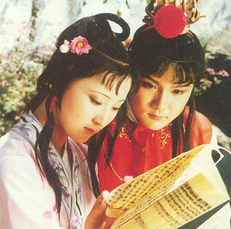
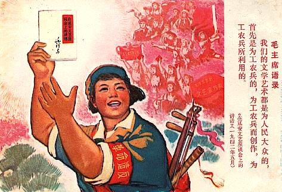

# 给不理性读者的非抒情诗

**普通读者与作者之间不可能有任何交集，各自都以各自为本位，根本是背道而驰的。要是承认一本书的意义在于安慰到阅读的人，那么就否定了作品对于其创造者的价值所在。而一旦否定了这原始环节的主人公，那“著作”被称为著作的根基也就不存在了。书失去了“书”的身份，还有什么价值可言。**

### 

### 

# 给不理性读者的非抒情诗

### 

## 文 / 阿执

### 

### 

只有身在严肃读者群体中，你才能讨论一本书的真正价值所在。什么是严肃读者群体，简单说来，就是不需要经由个人经验来领会一本著作中某些词句某些章节乃至著作整体的意思，而只是通过单纯的思维理解工作去消化他们从而与作者产生共鸣的读者群体。他们有很明显的群体标志，那就是每一个严肃的读者必定从开始进入到这个群体——这个行为可能是有意识的可能是意识的——直至其死亡，都不曾停止读书活动。 这个星球上几乎每个人都有读书经历，就因为这样，日积月累地，很容易被发现了这么一个现象：自主选择的图书中，爱情，励志，社交类销量往往高于历史，哲学，宗教类。这个很好解释，因为多数人读书是借由经验使书中内容与自己产生共鸣，满足自身想要被理解的欲望，因而在选择上必定流连于生活性更强的图书上（这是因为经验从生活中最易获得）。 

### 

### 

### 

很显然，这么一个庞大的群体不在上述的严肃读者群体之列。这种人群患有读书聒噪症，等到后来会失去读书的欲望（因为他们认为在人群中找共鸣远比在书籍中寻找来得有意思且简单得多）。他们会随着自己的经历去判定一本书的好坏，并且可能在一段时间以后厌倦了从前认为美好的那本。这个很好理解，因为情绪波动影响了读书者对书籍的领回。试想一个人在阅读《蒙马特遗书》时正巧赶上失恋期，并且对旧恋人念念不忘，这样一来他就可以在形式上捏造与作者相同的处境（都是被抛弃的），而当看到这么一句话：“我是不幸的，我把自己彻彻底底地奉献给一个不能领受我的爱与美的人！”，那时他根本以为要气绝。“天哪！这不是我正想说的吗？”书中讲到的那句话这时很自然地与他个人的经验结合起来，他的内心受到理解（事实上并没有人有要理解他的意思）。这就是人们常说的一本书对一个人的安慰作用，人们又常常把这个当作是一本书最重要的意义。另人感到悲伤的是，这种所谓的安慰意义竟然会在那位读者再次坠入爱河后被另外一本书替代掉，并将永远地被抹去。 荒唐，简直可笑！没有哪个作者在著述的时候是想当个变相的牧师。著述的企图——姑且先抛开现实利益不说——不外乎两种：一种是有宣泄的必要，一种是假定著作面世后有不特定的某些人知道并理解了自己所表达的想法（这里也有个奇怪的现象，就是作者在这么个假定没被证实前——也就是作品一即公开发行——作者本人的意识已经对假定作出了肯定的答复。）。 显然，普通读者与作者之间不可能有任何交集，各自都以各自为本位，根本是背道而驰的。要是承认一本书的意义在于安慰到阅读的人，那么就否定了作品对于其创造者的价值所在。而一旦否定了这原始环节的主人公，那“著作”被称为著作的根基也就不存在了。书失去了“书”的身份，还有什么价值可言。 现在回到文章开头的第一句话。严肃读者往往具备自行生产“智慧”的能力（可见不是“报名”就能加入这个群体的），因为智慧不可能从经验处得来，任何经验只会毁坏人理性思考的意志，经验只能帮助情绪叠出花纹和褶皱。“智慧的人类”完全是不智慧的人类捏造的漂亮话，这世上只有“智慧的人”，社会全体是不可能都拥有的智慧的，不然社会的进步将不会是一个进程，而是一个从无到有的飞跃然后结束发展。而严肃读者的阅读亦是一种对社会进步的贡献，首先，他能分辨作品的好坏，接着试图与作者衔接（这里他就成为了作者假定的“不特定”人中的一员），这个阶段是艰巨的，因为经验渗透到身体的每个环节，不可避免地要与经验正面冲突，这时候，思维的强力马达转动起来，在思考著作本身的同时恰到好处地分派了经验的任务，就好像经济学教科书里常出现的插图，起到辅助理解的作用。而这个过程使读者与作者相处达到史无前例的融洽，即从智慧产生了智慧（如果我们承认一本好书智慧的话）。 一个人的社会改造能力是极其微小的，但一旦带动了一个群体的智慧，那么他就可以说是社会改造的原始发起者。一个社会的不断进步从来不是靠经验获取的，智慧传递的不断循环才起着真正的推动作用。而这正是书的意义所在。 

### 

### 

### 

如果我在这里称普通读者为不理性读者的话，那么他们的非理性只可能使经验主义与唯情绪主义泛滥，那只会拖进步的后腿。 这也就是为什么这世间万物的发展都是在曲折中进行的根本原因。可见，鼓吹全民读书的言论无聊又有害。 

### 

### 

（采稿：乔淼 责编：乔淼）

### 

### 
