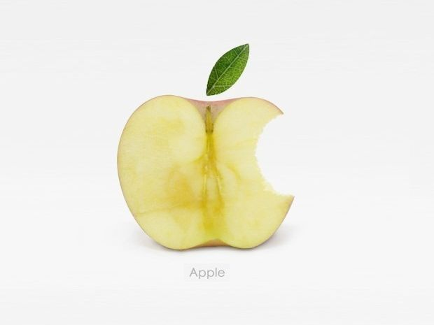

# 谈谈“英语思维”

**并不存在一种区别于“汉语思维”的、独有的“英语思维”，只有“正常”的思维方式和思维能力有可能通过正常的语言学习被习得。——会用一种语言说话、能下笔写出一种文字，不必然表明你会用这种语言进行思维，哪怕是你的母语：如果思维品质很差，缺乏抽象、概括、归纳、演绎之类的思维能力，照样会张嘴说不出人话、下笔写不出正常人能看懂的文章，其结果就是我们所见到的“妖怪”了。所以，借用某位前辈同行的话来说，就是“英语没学好，是因为你汉语也很差”。**

### 

### 

# 谈谈“英语思维”

### 

## 文 / 乔淼（北斗撰稿人）

### 

### 

做了十多年的英语学生，又做了几年英语教学工作，耳边最常听到的词莫过于什么“英语思维”。按照一般英语老师的理解，为了学好英语，应对英语考试，中国的学生需要摒弃自己原来的“汉语思维”，学会“英语思维”。但在我看来，对中国学生而言，所谓的“英语思维”无论在形式上还是实质上都不成立；换而言之，学习英语，或者说学习语言，我们需要的并不是如何放弃“汉语思维”、学会“英语思维”，而是学会“像正常人一样思考”。 要讨论这个问题，就必须先明确什么是思维。“思维”（旧译“思惟”）是一个心理学概念，译自英语的Thought，指的是人脑对现实事物概括的、间接的加工。什么叫做概括的、间接的加工呢？举一个简单的例子，你的面前摆着一个实际存在的苹果，从眼底视网膜感光细胞到大脑皮层视觉区的通路被激活，不同的视细胞和感受器分别加工了苹果的大小、形状、颜色等信息，再经过大脑的整合，形成一个完整的形象，这是直接的加工过程。看到这个完整的形象，你头脑中立刻跳出“苹果”这个词，甚至舌头仿佛尝到了它的味道，或者在面前一无所有的时候，你已经从大脑中“调”出若干有关大小、形状、颜色甚至味道的信息，并且在眼前“造”出了一个苹果的形象，这就是概括的或者间接的加工，这后一种认识事物的方式，就是思维过程。 

### 

### 

思维需要以语言，特别是内部语言作为载体。也就是说，一个人在思考问题的时候，他或她实际上是以某种人类语言与自己对话：无论是对当前感知到的事物的判断、对记忆中已有信息的调用，还是比较、分析的过程，都是内心“自言自语”的过程——有时候单纯的“默念”不能满足要求，还会自己说话出声，就是所谓的“出声思考”。通常地，一个人思维过程的载体总是自己的母语，即第一语言。所以对中国学生来说，“英语思维”在形式上就是不可实现的：我们思维的过程首先必须以第一语言，即汉语作为载体，即使涉及对英语材料的加工，也必须将感官接收到的英语材料“转化”为大脑能接受的汉语，然后才能进行思维的操作。 当我们用英语和他人交谈时，需要首先将听到的英语语句在头脑中翻译成汉语，分析翻译出的汉语的语义，而后生成相应要表达的汉语语义（而不是汉语句子），再翻译成英语通过发声器官讲出。上述加工过程并不能像一些英语教学者或学习者所认为的那样，直接抛弃作为思维载体的汉语而完全改用英语进行。通过对英语材料的熟练掌握和听说能力的训练，我们可以尽量缩短信息接收时英语-汉语的转换时间和信息发出时汉语-英语的生成时间，体现为交流和表达时的“反应”加快，能够跟上母语为英语的使用者的速度。但作为汉语母语的学习者，我们永远不可能跳过这两个转换步骤，直接以英语-英语的方式进行交流和表达。也就是说，经过足够的训练，我们对语言的熟练度达到一定水平，可以在很大程度上接近英语母语使用者的反应速度，但不能略去头脑中作为思维载体的语言转换和生成的过程。从这个意义上来说，“英语思维”实际上仍然是“汉语思维”，只是我们对英语的熟练度接近了母语，使得一部分思维过程达到了自动化水平。就好像熟练的驾驶员可以任意切换挡位、做出流畅的油门-离合器配合，而无需再有意思考其程序一样。“无他，惟手熟耳。” 除了上述这种形式上的“英语思维”，还有一种对“英语思维”的误读，就是错将其当作一种独特的“思维方式”，进而强调中国和英语国家“思维方式的差异”。在一些出国类考试的培训过程中，教师和学习者都容易陷入此一误区，认为考生对出题思路的理解有误、不能顺利解出题目是因为采用了“中国式思维”，而出题者所用的乃是“英国式思维”或者“美国式思维”（或者统称为“英语思维”），并要求考生学习这种所谓的“英语思维”。这种所谓的“思维方式的差异”，实际上并非真的是“思维方式”的差异。人类的大脑结构并不因为人种或生活地域的不同而体现出显著的器质性差异，这就决定了作为一种心理活动的“思维”不会有地域上或人种上的显著不同：无论是在中国或英国/美国，思维所涵盖的心理活动，如比较、分析、综合、概括、抽象、具体化、归纳和演绎，以及思维的主要种类如辐合思维/发散思维、动作思维/形象思维/言语思维，都是没有差别的；不能说中国人“会”抽象而英国人、美国人“不会”，也不能说白种人“有”归纳、演绎的能力而黑人“没有”。所以并不存在一种“人有我无”“人无我有”意义上的“中国式思维”或者“美国式思维”。 但是作为群体，中国人和美国人/英国人的“思维方式”又确实是存在差异的。这种差异体现在何处呢？我们说思维能力（Capacity，而不是Ability）对人类来说是高度同质化的，体现为一种Ability时的差异主要来自于后天因素，如成长环境、饮食、教育和文化等；前述的教师和学习者所认为的“思维方式的差异”即主要体现为不同文化情境、教育背景下的差异。最重要的差异首先是思维品质的差异。所谓“思维品质”，是指思维活动中人的智力和能力的体现，可以理解为“思维的个性”，主要包括深刻性、灵活性、独创性、敏捷性和批判性几个方面。思维品质较高的人更善于抓住事物的本质规律、全面分析问题、从多个角度尝试解决问题、善于独立思考、解决问题的速度较快……这些能力恰是GRE、托福、雅思等考试要求学生具备的。考虑到托福、雅思考试是针对非英语母语的考生，体现了一定的“区别对待”，在命题思路和题目难度上对所有国家的考生一视同仁的GRE就更能够反映出此种差异。严格地说，GRE考试主要不是考查学生的语言知识（语音、语法、词汇），而是考查学生是否具备了独立从事学术研究所必需的思维能力，对词汇量的要求尚在其次，——毋宁说GRE要求的20000左右的词汇量，正是受过高等教育的美国大学生平均的词汇水平，只是我们的六级水平与其相差太远罢了！事实上，即使将GRE考试的题干和选项全部翻译成中文，要达到100%的正确率也绝非易事。因此，这种后天的“思维方式差异”，应该主要来自于思维能力的差距。 笔者有两个经验性的观察体验能说明这个问题。一是国内的学校教育，无论是基础教育还是高等教育（甚至包括研究生教育），总体上缺乏思维训练的相关内容。语文课上，学生往往被要求对同样的内容做出同样的反应，例如，鲁迅的某句话必须有一个“标准解释”。数学课上，教师先教学生“前后左右”，后教“东南西北”，但却没有意识到为什么要按这个顺序呈现，当然也无法给学生相应的启发。大学课堂里，照本宣科、把PPT当字幕机也是常态，考试时划重点、背课本也是常态。另一是我们的学校教育中缺乏常识，或说存量知识的传递。历史课、政治课老师睁眼说谎（或者闭眼说谎），教给学生的东西不可能不掺杂大量偏见和伪学（更别说容忍与“正统”不同的见解）；语文教师号召学生背古诗、背课文，能教会学生阅读、引导学生阅读的并不多。至于理科的教学，除了教会学生解题，似乎也很难帮助学生形成某种“学科思想”，进而引导他们形成基本的科学常识体系。也就是说，除非有幸遇到凤毛麟角的好老师、大师的提点，否则要想在正常学校教育过程中训练出哪怕是正常人的思维能力，都不容易。 当然，思维能力的差距只是其中一方面。文化环境的差异也会对思维方式的偏好产生影响。比如说，中国人习惯以直觉性的、直观的方式认识世界，重视现实性，对实证的手段比较看轻。而西方人则恰恰相反，注重实证，重视逻辑。英语中有虚拟语气，以动词的？形式（Subjunctive Form）表达一种与现实相反的感觉，汉语中却没有对等的明确表达的方式。因此，“如果我当选总统”（If I were elected the president）以英语的形式表达出来就意义明确，以汉语的形式表达则很含糊，很难区分是现实的还是反现实的。Bloom在1981年进行的一项研究进一步说明了这个问题。他对中国被试和美国被试各自提出一系列三段论式的问题，比如“所有的圆都很大（大前提），这个小三角形是个圆（小前提），它是否会很大？”显然，如果严格按三段论方式进行逻辑推论，答案应该是“是”（反现实推论）；如果按现实的方式理解问题，因为“小三角形”不可能是“圆”，“小”和“大”又是反义词，答案应该就是“否”（现实推论）。结果98%的美国人按照逻辑的方式作了反现实思考，而只有6%的中国人如此。又如，中国人重视在一定的背景中认识对象（所谓“场依存”的认知风格），而西方人则更强调对象而忽视背景（“场独立”认知风格）。一项研究表明，亚洲被试更偏好背景化很强的人物摄影（人的比例较小，处在一个较大的背景里），美国被试则更偏好背景较弱的作品（人占据画面绝大部分，背景占的比例很小）；艺术作品也是如此。诸如此类，在成长中受到不同文化环境的影响，人们会对思维方式产生不同偏好，这也是很正常的。——当然，对思维方式的偏好不能、也不应该被放大为对思维方式的选择性忽略，尤其不应该被作为对某种特定思维产物的合理化借口，比如某种被称作“妖怪”的东西。 

### 

### 

### 

当然，也有有英语学得比较好的朋友质疑笔者，认为英语（或者任何一门第二语言）学得非常好的人，可以用英语代替汉语来思维；只要语言熟练度足够，“英语思维”是可能实现的。这种观点实际上混淆了作为载体的“内部语言”和作为心理操作的“思维”。所谓“内部语言”与“口头语言”“书面语言”相对，是指说话者在意识层面中生成或者浮现的语言内容（词或句），但没有通过发音器官/书写手段把它表现出来，相当于思想上的自言自语。对第二语言非常熟练的人，确实可以用第二语言生成内部语言，比如说，看到一件事物，首先想到的不是中文的而是英文的词句。但“思维”并非这么简单：它不特是生成内部语言，而是以内部语言作为载体对事物进行间接加工；这个加工过程部分是自动化甚至潜意识的，从而没必要也不可能完全用第二语言作为媒介。例如，看到一头牛和一块草地，个体可能首先以英语的内部语言生成了“bull”和“grass”两个词，而不是“牛”和“草地”；但假如该个体是以中文为母语，他的思维加工肯定是以一句中文“牛和草存在什么关系”作为媒介，而不是“What's the relationship between them?”——至少就经验的观察和实验证据两方面，笔者尚未见到这样的案例存在。 总而言之，并不存在一种区别于“汉语思维”的、独有的“英语思维”，只有“正常”的思维方式和思维能力有可能通过正常的语言学习被习得。——会用一种语言说话、能下笔写出一种文字，不必然表明你会用这种语言进行思维，哪怕是你的母语：如果思维品质很差，缺乏抽象、概括、归纳、演绎之类的思维能力，照样会张嘴说不出人话、下笔写不出正常人能看懂的文章，其结果就是我们所见到的“妖怪”了。所以，借用某位前辈同行的话来说，就是“英语没学好，是因为你汉语也很差”。 

### 

### 

（采编：陈轩 责编：陈轩）

### 

### 
