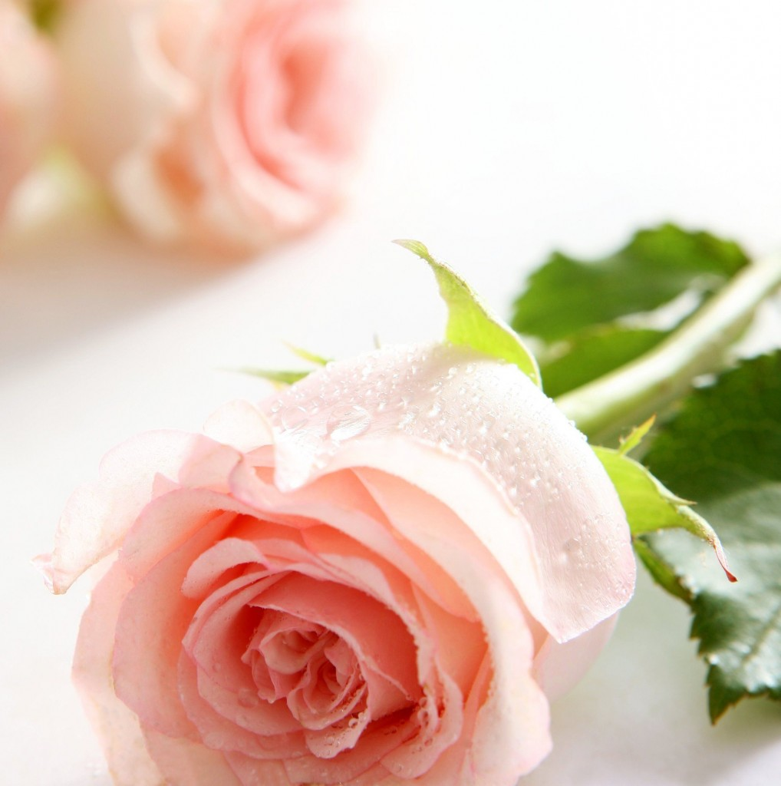
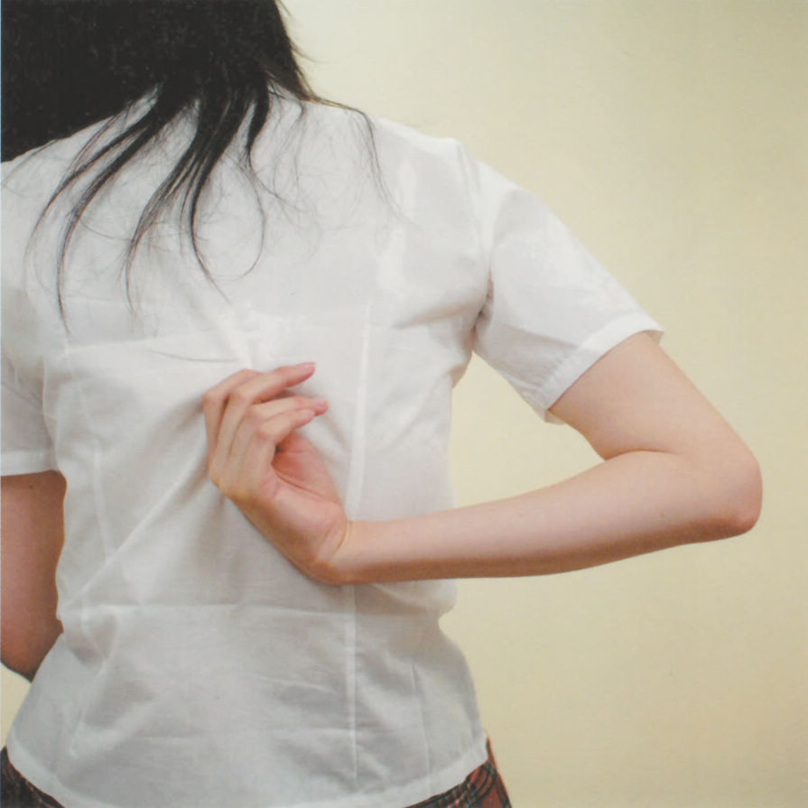

# Shall we talk

**她们是妻子，是母亲。你被迫把话语和记忆逼回到心里，自己跟自己对话。你不能再在QQ上留言：最近好吗？希望一切顺利。你不能想，不能言说，不能惦念。你们心照不宣的像一切都没有发生过，偶然遇到挽着丈夫的她，“这是我老同学”，你装模作样跟那个男人亲切握手寒暄，然后离开。她好，或者不好，都跟你没有关系了。**

### 

### 

# Shall we talk

### 

## 文 / 常遠（北斗特约撰稿人）

### 

### 

### 1

街头一如既往的拥挤喧闹，卖花小妹穿着俗艳的红色羽绒服在人群里穿梭，一束束玫瑰七倒八歪地躺在小桶里，就那么抱着。花红得有些失真，包裹着廉价的透明纸，显得俗气又难看。 未曾买过蓝色妖姬，但“戴安娜”清雅的粉色很是让人着迷。那个姑娘抱着花笑得一脸幸福的样子还在我的E盘里，但我早已不知她如今的模样，是否依旧把眼睛眯起来，肆意灿烂的笑。19岁的她。 

### 

### 

### 

突然想起，10年前。由于恋爱是“不合法的”，14号晚上，我兜里只有十块钱，裹着羽绒服，匆匆跳上一辆摩的，去她家。途中跳下车，就在这条街上，从卖花小妹手里5元钱买了一束玫瑰。在她家楼下，我把花胡乱塞进她手里，说情人节快乐。那时我们已经分手了。她笑着说你为什么只买一朵，我油嘴滑舌地说一心一意。那场景一点都不浪漫，而是狼狈。她很开心，因为第一次收到玫瑰。她是我的初恋，没告诉她的是，那时满脑子矫情和幻想的我，已经学会了刻意去制造所谓“完美故事”。她是我第一个女朋友，所以第一支玫瑰要送给她。日后回想起来，总归是完满无憾的。 但年轻怎么会没有遗憾呢。两个年轻人的模样已经模糊不清了，我只记得那种粗糙和慌乱的感觉。依然在敲打。14号晚上，14岁的我们。 年岁增长，简单的事却越来越复杂。10年间这条街并没有太大的变化，但人变了。如果我现在有个女朋友，5元钱的玫瑰很难让她开心了，我们会吃一顿精致的晚餐看一场浪漫的电影订一个舒适的大床房买一捧30支的玫瑰，但那种粗糙、慌乱的感觉，还在么？兜里的钱不是10元，而是100元，1000元了，那种好奇、新鲜、幸福的感觉，是否同样多出100倍呢？ 老妈说，你们这些孩子也真是奇怪，几年前你们要恋爱，管都管不住；现在让你们恋爱，催都催不动。 看到过一个说法，说人心不古啊，父辈那一代哪有什么暧昧来暧昧去谈一个伤两个的啊，两个素不相识的人，经他人介绍见面，相敬如宾地端坐着寒暄几句，向组织一汇报，就结婚了，照样幸福一辈子。越挑，心越乱。 可这样草率的决定造就了多少痛苦的婚姻谁人知道呢？那个年代，毛一挥手，适龄青年就浩浩荡荡下乡了。现在有人挥两下手，让你下乡10年，你去么？不再委屈、迁就，不再逆来顺受、任他人意志摆布，这自我意识的觉醒不是可喜的进步吗？ 

### 

### 2

汶林说，发展到这一步我犹豫了，因为早已习惯了一个人的感觉。 这就是传说中的单身症吧。 蜷缩在自己的安全区里，这里舒适、熟悉，没有不安。在偶尔的孤单寂寞和让人不安的未知之间，人们通常押安全的一方。常劝朋友，跟你暧昧的那个人你总归不讨厌吧？你就眼一闭头皮一硬开始爱，哪怕明天就失恋呢。失了再来。 打破舒适区的理论说起来很动听，但做起来难。何况，又有什么决定是容易的呢？ 我曾经是个外貌协会的偏执狂，女孩子一定要非常漂亮，一定要一见钟情。别人反驳时我就振振有辞：第一眼都没感觉以后怎么可能喜欢？培养起来的是习惯，唯独不是那个会灼伤、撕咬，让人疯狂、欲罢不能的情爱。 至今依然偏执于一见钟情，但在让人心动的容颜之外，找到了更重要的东西——沟通的无隙。 

### 

### 

### 

姐夫说，你实在不行就找个脑残妹吧，她长得好看爱打扮会撒娇，娇滴滴的瓷娃娃，抚摸着手都颤。最重要的是有智力快感，你条理清晰的讲解社会万象价值伦理，你告诉她政府有多操蛋，教她该如何绕过网络防火墙，丫一句话都插不上，只能无限崇拜的望着你。 以前，我会疯狂的列单子：长头发，眼睛要大，笑起来要好看，该大的大该小的小——排前列的都是跟外形相关，在此过滤系统下，要聪明，有自己想法，要喜欢阅读和思考，要有趣，兴趣爱好要广。我醉酒后狂妄的跟友人喊，我只要极品。 长大了，成熟了，要的却越来越简单。在两个人的关系中，沟通是第一要素。友人问，你到底想找个什么样的女人？我说，能听得懂我说话。这并非吹嘘自己有多么高深聪慧，而是说，我们处于同一话语体系之下，有着共同的语言。好奇，有趣，幽默，兴趣广泛，热爱生活。我不需要说了一句反讽的话再去跟木讷的表情解释，骂了一句政府再去跟她解释为什么骂政府是我们的责任；不必说了一个段子后扫兴地去看她面无表情的脸，滔滔不绝表达一些观点后看着她无限崇拜的眼神：亲爱的，你好有思想哦；不需要跟朋友商量各种新奇大胆的设想计划后听她怯怯地说：好羡慕你们活得那么丰富精彩……我要她比我更话痨，更有趣，更好奇，看见好玩的东西会兴奋地大喊大叫，她的兴趣比我还要广泛，脑子里装满了新奇的想象，随时准备接受新事物，新生活，我们不停地对话，聊天，走在路上不断地探讨、辩论，关于社会关于政府关于新闻关于政治关于道德关于价值观关于商业关于股票关于孩子的教育问题关于跟父母的关系关于性爱技巧关于娱乐八卦关于体坛动态关于旅游关于某乐队关于去学瑜伽还是霹雳舞关于某本新书某个作家关于某段历史关于林志玲的腿细还是苍井空的胸大…… 我说，要聪明。朋友说，你这个标准太傲慢了。我说我只想跟爱的人对话，舒适的、沟通成本较低的。这样够朴素吗？好奇，有趣，幽默，开放性心态，没有什么素质比它们更重要了。相反，Boring是对一个人最糟糕的评价。宁要一个有趣的黄月英，不要一个boring的貂蝉。 她们爱我。对，有人爱我。可我懂，只爱那个光鲜、容姿焕发的样子，精力充沛思维敏捷妙语连珠的样子。可没有人是战士。你是否会爱我鲜衣怒马的生活，又爱我疲惫脆弱倔强偏执的模样？我不是每时每刻都光鲜，都聪明，都会写出好看的文章，会幽默，会耍宝，会谈笑自若滴水不漏，会旁征博引，我会累，会丑，会弱，会跟朋友喝得大醉胡说八道，会在球场上跌得鼻青脸肿晒得像黑人一样，会突然有天就不想洗澡了会把臭袜子丢得到处都是，会赌气说出很脑残的话做很幼稚冲动的事，会嫉妒你跟别的男生亲近到发狂。有时候，我只是想把头靠在爱人怀里，说说话，仅此而已。 我爱过的姑娘，她喊我小鹿。我问为什么。她说你弱起来的时候，抱着你的头听你喃喃低诉，就像一只受伤的小鹿，在舔伤口。你有鹿一样的眼睛。 

### 

### 3

其实今天（情人节）是失恋暨单身一周年。我以为会悲伤，却只是淡淡的惆怅。这个叫做情人节的日子，会有很多人写属于自己的“风月文”。我不想写出什么让人眼前一亮的佳句名篇，只是想表达，自言自语。留给自己的文字。 “你好像对情感很有研究的样子，写的‘风月文’让人很有共鸣，你是如何做到的？” 我：久病成医。去爱吧。 其实自己心里常嘀咕，也许是之前辜负了那么些美到极致的姑娘，所以罚我一个人走几年孤单的日子，反思、蜕变，成为更好的人，更成熟、更懂得责任。 没有她们，我不会成为今天的样子。无论你们如今身在何方，是加州的阳光还是某个城市的海风，无论你们身在谁的怀抱，高大宽厚还是体贴聪明，无论你们戴着谁的戒指捧着谁的玫瑰披着谁的嫁衣，我都想说，我爱你。不带们。 爱情丢在了原来的地方，如今只有爱。在我轻狂不知事，竖起浑身的刺跟整个世界对抗的时候，在我漫长而令人绝望的叛逆期里，在那个狂傲、固执、尖锐、倔强的男孩子还不懂爱不懂得责任的时候，在那个脾气糟糕百般挑剔苛刻的男人还在粗糙成长的时候，你让我看到了爱情最好的模样。 时至今日，纵使命运的颠沛，世事的变迁、理想的无着，但那些依然存留在我心里的柔软，依然缠绕在我身上的乐观、勇气、执着，那依然对生活不曾褪色的热爱、好奇，对爱情的信仰，对人和世界的善意，都是因为你们，曾打开给我看的美。生活的美，人性的美，爱情的美。 

### 

### 4

婚讯频传的年龄到了。丁老师说，让我们躲到一个接不到爱人婚礼请帖的地方去吧。 上次悲伤的跟朋友说，我可能要和同龄的姑娘们永远擦肩了。86-88年生人算是同龄了吧，如今已浮动在23-25岁的适婚年龄。通常来说，姑娘婚龄要相对早2-3年，也就是说，三年内，同龄的姑娘们大多都要出嫁了，在26-28岁的年纪。不管是曾经爱过的被爱过的暧昧过的暗恋过的欲拒还迎情话撩人心最终没走到一起的姑娘们，都将嫁作他人妇。每每想到这个并不夸张的事实，我都要唏嘘不已。 是的，那头发如清汤挂面般柔顺的姑娘，胸大条顺的姑娘，那踢着夹脚拖鞋的姑娘，你四年间遇见过无数次但直至毕业都不知道名字的姑娘，那在艳闻谣言闲言碎嘴里风情万种的姑娘，被男生私底下封为“校花”“院花”的姑娘，你在图书馆四楼固定的位置常遇到并觊觎许久最终没勇气开口问电话的姑娘，你终于鼓起勇气约出来到湖边走一走表达爱意被其无情拒绝的姑娘，你在QQ里嘘寒问暖肆意谈人生谈理想诉烦恼比朋友更暧昧一些的学妹，你曾载在山地车后轮上高调骑过人群的姑娘，你站在女生宿舍楼下弹着吉它大声喊“我爱你”的学姐，你拉着手一起吃饭一起上自习一起逛街看电影的前女友，你相互关心默契聊天彼此了解却最终没有捅破那层纸的异性朋友，你拉着在校门外的旅馆里在彼此身体上写诗并震得床板响被隔壁抗议的情儿，要嫁作他人妇了。 大年初五。一个姐姐的初恋男友去找她，说你下来，我说几句话就走。那人已经有了美艳聪慧的娇妻和可爱的儿子，他说，时间怎么快呢，我们那时才二十岁如今已为人父母步入而立了，我们留下那么多的遗憾和诺言。我还没跟那段时光告别，它们杂乱的躺在那里。说着说着他哭了起来。她抱住他的头，五分钟。然后，他离开，回到他的家，他的世界里去。在那里，他是丈夫，是父亲，是撑起一片天的男人。 青春早已奔腾着一去不返。你回望，只有浪静风平。 

### 

### 

### 

我问她，你不会觉得他太任性了吗。她说，他是认真的，我懂他的伤。 她开始讲故事。我沉默，半响说不出话。 5年后，用文字里回忆爱过的她们都不再可以。她们是妻子，是母亲。你被迫把话语和记忆逼回到心里，自己跟自己对话。你不能再在QQ上留言：最近好吗？希望一切顺利。你不能想，不能言说，不能惦念。你们心照不宣的像一切都没有发生过，偶然遇到挽着丈夫的她，“这是我老同学”，你装模作样跟那个男人亲切握手寒暄，然后离开。她好，或者不好，都跟你没有关系了。 这个人，在你世界的版图里抹去了。你只能写小说，让她们叫A或者B，把故事情节安插得乱七八糟，防止熟人对号入座。 

### 

### 5

放荡不羁的人其实活得太较真。此话看似矛盾。你戏谑，你口无遮拦胡说八道，你洒脱，你狂放，是因为现实太疯狂太荒唐，你无法泰然以对的事情太多，放不下的太多，时间太无情，世事太多变，于是你为了减缓内心的挣扎，比世界更疯狂，更荒唐，更不循规则。 他们往往活得最认真，在乎的太多，触点更多，在心里跟自己过不去。 在买速冻水饺不知选哪个馅的时候，走在路上看到逸闻想跟人交换看法的时候，看到一本好书想跟人分享观点的时候，上映一部好电影想拉着人一起看的时候，我会想，有个女朋友该有多好。有时只是想跟人说说话，聊聊天，立即回头就能问“亲爱的，买猪肉香菇的还是牛肉大葱馅儿？”。我越来越独立，能够自己处理绝大多数事情，能够熟练的跟自己对话，一个人思考。但有那么一些时候，多么想听听别人的意见，哪怕是只言片语，我期待互动，想听到有人回应我，哪怕只是一句“听你的”。我是话痨，有时候，忘带了公交卡地铁上看到一个美女早饭吃的油条很赞快递竟然三天了还没寄到就想跟人唠叨几句，那些相谈甚欢的知心好友，人家凭什么陪你聊这些鸡毛蒜皮屁大的小事儿？只有爱人，是接收这些垃圾信息的最佳人选，不说话的时候甚至只是腻着，腻在一起，胡说八道，东扯西拉。 朋友越来越多，但正如帅帅说，你不觉得还是不一样么？兄弟再多，跟爱人还是不一样。有些话只想跟爱人说，有些事只想跟爱人一起做。可我们荒置了太多时间，23岁，24岁，25岁，在这最好最炫的年纪里，那爱情还要迟到多久？在我们做出任何选择的时候，在我们决定未来人生方向的关键几年，在我们考虑工作还是留学犹豫去北京还是上海投靠体制还是反抗体制的时候，在我们逐渐往“成品”过渡的阶段，没有爱人在身边，见证、分享我们的成长和悲喜，该是多么的遗憾。 可我仍拒绝妥协、迁就，固守那个“临界点”。我拒绝“可接受”“不讨厌”，拒绝平庸，拒绝“平平淡淡才是真”。难道爱情开始时的模样不都是疯狂和撕咬，在心里挠得痒痒么？一见钟情非君不可吗？是心动，奋不顾身吗？我一遍遍的问朋友，那些进入骨子里的浪漫，不依不挠追姑娘的豪情，都丢了吗？那是我如此珍视的东西。“我一夜未眠，我想和你在一起”，坐十几站公交车去唱歌把自己的声音刻进光盘里送给她，“我现在就要见到你，你不下来我就坐一夜”，鲜花情书甜言蜜语轰炸，在我偏执的世界里，这才是爱情开始时的模样。 而我亦相信，那个奋不顾身性情浪漫的少年一直住在我心里。 王菲和陈奕迅的声音一次次让我动容不已，我知道，自己内心依旧敏感，依然鲜活。朋友宇轩在新年祝福里说，“那失约而至的爱情必不枉枯等的时光”。真美。我们唯一能做的，也不过是在下一个人到来的时候，告诉她我们错过了太多的时光，有好多好多故事想说给她听。而我们一个人的时候，没有荒废青春，没有嗟叹度日，搭建了更完整的宇宙，成为了更好的人。我们鲜衣怒马纵酒高歌，走向前方。 我们也许不再是过去的我们，但爱情是，它永远值得等待、寻找、信仰。它年轻的模样，容颜娇美，光芒万丈。 

### 

### 

（编辑：黄理罡）
