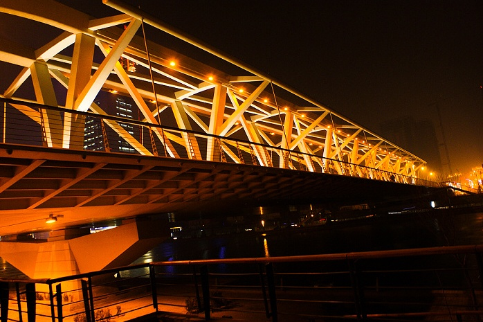

# 写在第二个异地的情人节

**那时我觉得我离你好远，想象不出电话那边你家的模样，甚至连记忆中你的容颜也随着我的体温一起模糊地消散在漆黑的冰冷深渊之中。烟抽了一根接一根，遇到正要收工回家的卖花小贩，买下一支玫瑰，在会师桥上投在坚硬的冰面上。我说，我给你买了一只花，丢在海河里，希望它能顺着水波，一路飘到海口。**

### 

### 

# 写在第二个异地的情人节

### 

## 文 / 张舒迟（北京大学）

### 

### 

由于我国传统最重要的节日必须和家人一起度过，而“咱与你隔南北千里姻缘”，一个在北京，一个在海口，再加上情人节基本都在春节的期间之内，所以我们俩至今还没一起经历过一个2月14日，今后几年应该也不会有机会。 记得去年此时，我们刚远程确定关系不久。那天我在天津探亲，你在海口的家中。我瑟瑟发抖地漫步在冰冻三尺的海河旁，望着并不能带来温暖的建筑物上五颜六色的霓虹灯和夜空中此起彼伏的焰火，一边给你打着电话。你的那边每隔几分钟就被剧烈的鞭炮声打断一阵。那时我觉得我离你好远，想象不出电话那边你家的模样，甚至连记忆中你的容颜也随着我的体温一起模糊地消散在漆黑的冰冷深渊之中。烟抽了一根接一根，遇到正要收工回家的卖花小贩，买下一只玫瑰，在会师桥上投在坚硬的冰面上。我说，我给你买了一只花，丢在海河里，希望它能顺着水波，一路飘到海口。 

### 

### 

后来我们一起来过这个地方。再后来我也去了海口，来到你的家里。有的地方去多少次依旧陌生，有的地方却一见如故，对于我海口就是后一种。我们坐着大船在漆黑的海面上，终于看到港口的灯火，甲板上的天空竟奇迹般地突然迅速明亮了起来，仿佛是被海岸蜿蜒的一串星火点燃了一样。拖着沉重的行李和疲惫的身躯，我们在船舷站着等下船，目睹了“黄龙汤”入海的惊悚一幕。你教我用海南话说“瓦五会拱海南维”。我们手牵手登陆，第一次同时站在这个海岛之上，相视而笑。接下来的十几天里，这座原先在地图上只和“遥远”联系在一起的城市变得如此熟悉，就仿佛我从小也在这里长大一样，就仿佛我一觉醒来，在北京坐上一辆公交车，开不久就能来到那边的街道和房屋之间。对于我，海口离北京，比天津还要近。 和你一起旅行，每个地方都在记忆里变得熟悉，似乎我都在那里生活过，有亲朋，有住处，不再是一个匆匆过客。 真的，这是一种奇妙的感觉。无论是曲阜的“万世师表”匾，是泰山的南天门，还是香港的维港夜色灯火，是中山大学珠江畔的老校门，当我们一起来到面前的时候，它们都褪去了我单独一人旅行时的那种高大、惊奇和遥不可及的感觉，变得仿佛学校的教学楼和西门鸡翅般熟悉和平常，触手可及。就像同一本书躺在书店的架子上和摆在自己的书柜里的感觉不同那样。 或许，只是因为，我把一种熟悉的生活和感觉带在身旁，带到四方了。 去年是我有生以来度过的最艰难的一个寒假。我恨不得从电话里你的声音把你变成一个一个分子，从空气中抓出来，再在这边拼成一个完整的你。恨不得把全世界的日历全部篡改，只为你回来的那天能够提早到来。恨不得每天去机场等待，奢望从素不相识的人群中生生找到一抹朝思夜想的淡蓝色。然而今年的此时，我却平静得多，踏实得多。因为我分明感觉到有什么东西，很充实，很牢固，跨越了从北京到海口三千公里的空旷，填满了中间相隔所有素不相识之人的虚无，一头紧拴着我，一头紧拴着你。 

### 

### 

### 

似乎你还和我一起生活在这间房子里。我能听到你拖鞋踏过地板的声响，听到你对着电脑嘿嘿傻笑声，听到你催我去买菜做饭，听到你点起一支烟的打火机。我也不由自主地在洗衣服之前想要问你“有没要洗的衣服”，催你不要总是上网快去看看书少抽点烟，打开冰箱倒可乐时再帮你也满上一杯，出门前对你说天气冷多穿点。鞋要摆整齐，衣服不要乱丢，天气干燥要多喝水，今天又头疼了吗？哎你快来看小刺猬这样好可爱！周末我们去爬山吧？这杯水必须都喝完！嗯，对。哎，你烧洗澡水了吗？ 我是怎么变成这个样子的，也是一件神奇的事情。 不久前还有朋友问，谈恋爱对你自由民主宪政人权的理想有什么样的影响？我竟一时语塞无言以对。生活不易，有理想有价值的生活尤难。对于我们来说，理想价值不只在觥筹交错的场合口若悬河地天花乱坠，更落实在每一天微不足道的细节当中，多读一章书，多看一部好电影，多听一门课和一次讲座，多背几个单词，多跑一次步，多攒点钱准备下次旅行，多联系一个老朋友，多结交一个新朋友，多了解关于这个世界的点滴，努力去过自己认为的值得一过的生活。我想，这就是我们的现实了，只是与理想并不分开。自然，一样要遭遇不顺心的事情，一样要处理日常繁琐，一样要忐忑各自和两人将来的发展，一样有拌嘴闹别扭的不愉快。只是可能我不再是那个深夜暴走的街头革命小青年了吧。但仍旧，对于我，自由民主和我的阿青，我们俩今天、明天乃至十年后二十年后的每日生活，乃是同一回事，正如曾经城市游击战争和一件切格瓦拉的T恤衫和一条破破烂烂的牛仔裤，于我乃是同一回事。 昨晚我做了一个很美的梦，梦见我已经死了，很安静地躺在一个白色的坟墓里。然而我还能看见，周围是一片缓缓起伏的草坪，有许多年轻人穿着白衬衫和牛仔裤，在这里看书、恋爱和弹吉他，唱歌。阳光是明媚的，一株巨大的木棉树在我们头顶上，盛开着硕大的，我从未见过的烈火般浓烈夺目的满树鲜花。青春真是奇妙，有时我感觉一切还都未开始，有时又感觉我已度过了整整一生。有你和我一起，我们似乎永远不会老去，又似乎已经相伴而眠，其中无限的熟悉、平淡和温暖已经出离在时间与空间之外，只包裹着你和我，再也不能斩断撕裂了。你是我的旅行箱，我是你的旅行箱，你拉着我，我拉着你，行走在陌生又熟识的异地，徜徉在无穷无尽，无始无终的人间世，到哪里都把“家”握在手心，带在身旁。 亲爱的，情人节快乐。今晚你又要踏上广州之行的道路，别忘了每天给我讲讲所见所闻。当你觉得孤单时，请想起在这座城市的每个角落，都有一个稍微年轻一点的我，留下过余温尚存的浅浅足迹。街角黄振龙凉茶摊前，啱啱睇到一个北佬仔喺呢度饮咗癍痧仲有金银花嘞！ 爱你。 

### 

### 

（编辑：黄理罡）
