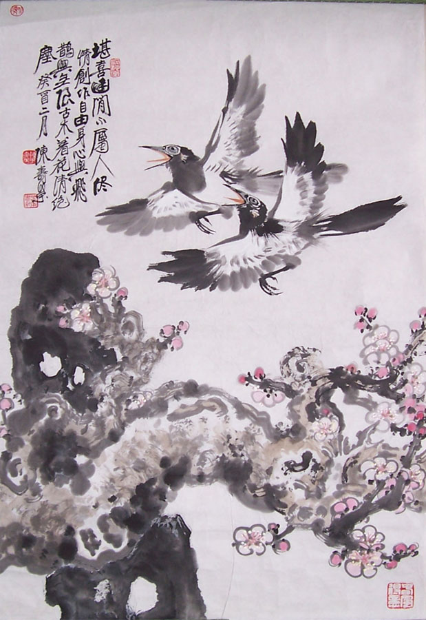
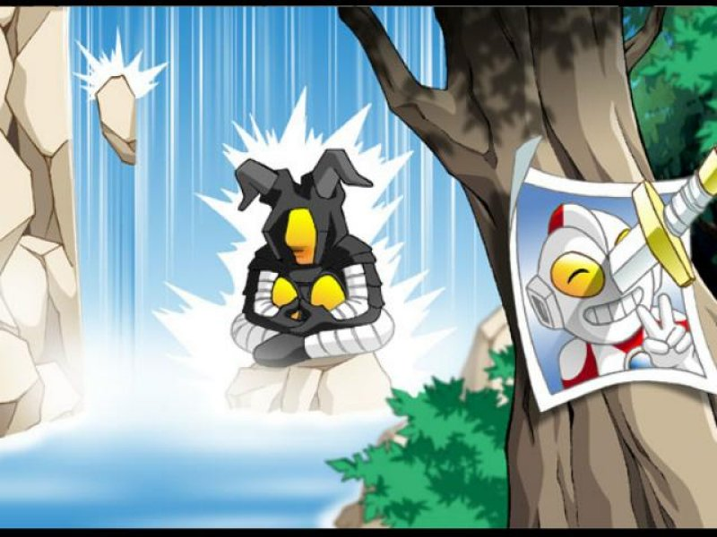
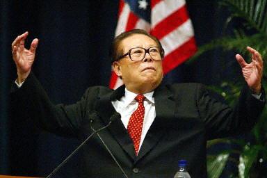

# 民主重要，还是情人节重要？

**我宁愿大家都去谈恋爱，宁愿大家有时候可以专心地“男默女泪”，情人节还只能吊在网上的话，那是一种悲哀，别告诉大家你是为了中国的民主牺牲了自己宝贵的节日，那是自欺欺人。把理想和现状分开，把爱情和政治分开，把网络和现实分开，因为这些本来就不同。**

### 

### 

# 民主重要，还是情人节重要？

### 

## 文 / 徐宪（华中科技大学）

### 

### 

其实过节的时候我偶尔还是有点想写东西的冲动，圣诞有，新年有，春节有，但是奇怪的是在这三个节日我最终还是没有写出什么东西。反倒是临近这个洋气的“圣瓦伦丁节”的时候，才真正开始认认真真地写点东西。 还记得很多年前，我的一位同学提到情人节时还一本正经地说：“中国人，过什么情人节呢？中国有自己的文化，要过就过七夕，怎么能过情人节呢？”直到今天我细细想明白，原来那时候，他是单身——兴许这才是这句话背后最重要的东西。假使他真的很坚持这种观点，但却不是单身，他的女友要跟他过一个浪漫的情人节，他还会坚持不过么？我觉得不会。 

### 

### 

### 

因为说白了，节日归节日——虽然是一个公共性的日期，然而，做的事情都是私事，既然是私事，两个人的事情，风花雪月的性质。如果女人说，嗯，我想过节，那男人还一本正经地说：“噢，不，抱歉，我是中国人”，或者再严肃一点，“噢，抱歉，我有我的底线”，或者再一本正经一点，“噢，抱歉，但是，你不能侵犯我的自由。”我想这女人会扇他一耳光。是的，每个人都有自己的“底线”，都有自己的“自由”，但是把这些拿到感情里面说事，实在是非常可笑的做法，爱情毕竟不是政治。 当然，日常生活中，大多数正常人的底线可能并不是本民族的文化，这些底线因人而异，可能在多数人生活里，自己内心的底线不一定会和自己的感情发生严重冲突，但是，小的摩擦却可能很常见。其实在我恋爱以后，我变得“男默女泪”很多——当然并没有发那种帖子，但是我居然也会看一些婚恋的节目。我还记得《非诚勿扰》里面有期，一个男生，其他条件都还可以，但是在自我介绍里面，他只讲了一件事——“我对刘德华如何如何崇拜”，甚至出现了这样的句子：“我希望能找一个跟我一样爱华仔的女生，一起生活。”他在现场高歌一曲《忘情水》，老实说，唱得不错。最后的结局恐怕大家也都猜得到，没有一位女嘉宾钟意他。 可想而知，如果这位先生的太太以后不小心贬低了刘德华，这段感情会发生什么结果？“我重要，还是刘德华重要？”把自己的内心禁区拿来说事，这等于告诉别人，你不要靠近我，靠得太近我会六亲不认——这种态度容易把人吓跑。是的，每个人有自己的禁区，自己的底线，自己的自由，但是这些，拿到私事中说只会显得苍白无力。 再推而广之，即便是一般的私交，在天朝，“政治控们”，无论左右，可能多多少少会有一些所谓“智力上的优越感”或者“道德上的优越感”。以像我一样右倾的同学为例，在餐桌上，听到某位长辈大吹特吹“美帝亡我之心不死”、“西方出台的新阴谋”、“美国中情局对华的十条禁令”等等“环球时报体”的段子，会不会感觉反胃呢？嗯，如果你的父母刚好是某位开国元勋的忠实粉丝呢？再严重一点，你的顶头上司最喜欢用“毛泽东思想”指导你的工作，你的未来岳父最向往那个“激情似火”的年代，你的老师很顽固，认为你走上了一条不归路…… “工作重要，还是自由重要？” “亲情重要，还是民主重要？” “爱情重要，还是法治重要？” …… 其实这些问题要远比“自由重要，还是民主重要？”这类国内学者们争得面红耳赤的问题深奥得多，也实在得多。同范围的东西，大约可以比较出个一二三四五六七，然而，真要让阎王和奥特曼打架，谁胜谁负，就只能问做裁判的当事人了。 

 我不得不怀疑，那些开口就是“我要自由，我要民主，我要上twitter看苍井空”的人，要是真的面临这样的抉择，还能够游刃有余地走下去吗？也许他们根本不会做决定，因为在不少人看来这本就是游戏一场，使自己能够和那些有背景有钱有女人长得帅的同龄人比起来有那么一点闪光点而已。如果只是游戏也就罢了，可偏偏那么多人还在幻想，要真的改变这个国家。 有的时候，可能不像这样针锋相对，但是偏偏是那些温情脉脉的否定，则使人更难抉择。不是吗？嗯，你的父母很理解你，他们也觉得“自由民主人权法制宪政”这些才是好东西，认为你够正义够勇敢，但是按照他们的意思，你得“能屈能伸”，加入体制，去分一杯羹。嗯，你的爱人很理解你，认为你有胆识有气魄，但是韶华易逝啊，还是顾家享受安宁日子的好，“忽见陌头杨柳色，悔教夫婿觅封侯”。嗯，你的朋友们都很欣赏你，喜欢跟你一起夸夸其谈，但是如果你没钱买房子，想让他倾囊相助，恐怕“管鲍之交”也只是书里的故事。而且，不是你谈一下“美国的民主”，你日后就一定能成管仲那样的人，投资在你身上，还不如去开个小店。你还是单身，姑娘们挑你，不会觉得你“胸怀大志，才气过人”，就算人家真是红拂女，你还真把自己当李靖啊。如果人家真有本事挑中一只潜力股，那眼光还不如去买股票。中国人编的故事，就喜欢骗那些自以为怀才不遇的男人——因为就是这些人最喜欢听故事。什么“会稽愚妇轻买臣，余亦辞家西入秦”，李白真是天真得可以，朱买臣发达没几年就因为张汤案被杀，这样看来，平心而论，他老婆抛弃他不是“有眼不识泰山”，而恰恰是英明决断啊。前两天网上传的一段话，其实就差不多这意思：“ 最讨厌青年男子说‘现在漂亮姑娘都太现实了’，大傻逼吧，你不现实你非找漂亮的？国际歌听多了都拿自己当世界的主人了吧？”乌有之乡的雨夹雪意淫自己革命成功以后，希望同伙们看在他的面子上，放过他那在南方系供职的前女友，我料想，民主教中一样存在这样喜欢幻想的人物。 当然也有例外，我们看到有些女孩子，如果条件不错，那么可以把那些开口就说“我最崇拜毛主席”的追求者甩到一边，然后在网上发个状态吐槽一番自己看不起傻逼。嗯，其实有资格吐槽的真正原因在于——她不愁嫁。嗯，如果你们什么都不愁，像韩寒那样，房子有车子有票子有女人也有，那么发发帖子骂骂政府也不错嘛，如果您更牛掰，达到了学者的水平，像秦晖老师一样倡导“维护共同底线”，像江平老师一样，呼吁“现代市场经济要以法治为基础”，嗯，一边批评体制，一边又过得至少衣食无忧，那选择也很好啊。 可是如果一个不留神，你成了敏感词呢？嗯，XX，您压力大么？不排除极少数人是真正的大智大勇之士，他们不在乎一时的名利和荣辱，只要是为了自己心中的信条，哪怕一死也在所不惜，反正落个千秋万世的声名——这个套路是中国最常见的“英雄模式”了。可是万一一个不当心，您不是那个关在大牢里面还能拿那么牛掰大奖的敏感词，而只是当年被碾轧过，某个永远不会被记住的人呢？坦白地说，你甘心吗？ “什么？为了名声？这太庸俗了！我们是为了心中的正义，我们即使默默无名，自由的旗帜上面也滴着我们的血……”好吧，指不定有人会这样说，那我们举些其他例子，假如你就这样去了，你的母亲，本来是一个受人尊敬的大学教授，就因为你这事，她老人家只得辛辛苦苦地熬剩下的几十年，连名字都成了“XXX”，尽管这名字可能能在网上被看到，尽管我一个陌生人只看到一个“丁”字就知道她是谁，似乎她注定是留名青史了，但是，你告诉我，知道这事后的一切，你当初会后悔吗？ 我们接受的教育，我们小学课本里，我们的电视里面，那些英雄母亲总是告诉我们，只要为了正义，牺牲她们在所不惜。但是我问你，你真的不后悔吗？有什么正义能有资格要求一个普通的母亲作出牺牲呢？如果以前的那个什么主义这么做是残忍的，那么以后的那个什么主义，即使如自由一样灿烂，似民主一样冠冕堂皇，他有资格吗？ 可悲可叹的是，不少人会分析，自由主义之所以在中国从未正式登场，就是因为它对人要求太少了。就像打仗的时候，一方将领振臂高呼：“为了新中国，为了XXX主义，冲啊！”另一方却说：“大家是自愿的，可以退出，我们不强迫你们。”哎，这样的两军对垒就让我想起了那个迂腐的宋襄公，对面却是组织严密的虎狼之师，胜败已定了。 我们只能安慰自己，历史的角力并不总是腥风血雨，有时候，也会有邪不压正，即使我们并不明白为什么少一些顾忌的邪恶势力反而会输。一些历史学家告诉我们，政府权力总是倾向于扩大的，有限政府在英国最初的出现本身就是一个很难解释的偶然事件。客观地说，人类的文明史里面，恰恰不文明的时间占大多数，我们习惯了看那些“邪不压正 ”的电影，但是我们未必能像电影主人公那么幸运，没有对现实清晰的把握，只凭自己一腔热情，可能连炮灰都没机会做——而那类幸运的主人公，往往身后都有一位乐观向上的浪漫主义导演，但要是摊上如罗曼·波兰斯基这样一个阴阴沉沉的老头子，Writer们在各种“欺实马 ”过后恐怕都要真的成了Ghosts。真实的政治进程，并不总是英雄在广场上振臂一呼，天下云集响应，更多的现实政治，是老谋深算的政客，即使三起三落，也要面不改色心不跳地给伟大领袖做“发自肺腑”的检讨，一旦时机到了，翻手为云覆手为雨，开启一个新的时代。反而是涉世未深的年轻人们，不知深浅，臧否起历史人物谈笑风生，然而，能不能做到同样的能屈能伸、韬光养晦？李强老师曾经转引过Peter Laslett的一段话：“政治乃至关重要之大事，绝不应轻易交付哲学家处理。政治事务的处置需要审慎、务实与坚毅，需要经验和智慧，而哲学家只能提供理性与原则。哲学指导下的政治很难成为成功的政治。”何况大多数青年离哲学家还远呢。 其实多数人也不是不知道这点，他们谈笑着政治人物的丑闻，不管是温家室还是刁近平，他们嘲讽着诸如“三权合作”这样的伟大领袖创新，他们模仿着“too simple”的语气，少数人也许会在马克思主义原理试卷上把老师批评一顿然后挂科（自己对号入座），运气好的，在历史试卷上借古讽今地嘲笑当朝的“文字狱”却也得了八十多分。其实他们也知道，其实更有可能，自己一辈子只是个名不见经传的小人物，从未想过当XX，也许最多幻想一下成了韩寒（HH）那样的人物，有钱有爱有地位，还有粉丝到处追，还能随性骂政府——嗯，骂得对，但是最担心的事情是，也许，骂了没用。 

 电视剧《康熙王朝》里面有个情节，我一直忘不了，大概是说两个王子犯了错，然后皇帝把一个狂骂了一顿，另一个只是安慰一下。于是那个被骂的暗地里高兴，知道自己的位子保住了，反而是那个没被骂的杯具了。我如果惹怒我老婆，她就骂我，我就老老实实地听着，挨骂就挨骂呗，咱爷们儿连骂都受不起吗？犯了错就得认，人家肯骂说明心里还有我，哪天连骂都懒得骂，那是根本就不在乎了。 我就在想，其实那些骂政府骂体制的朋友们，也包括我自己，不会是不关心这个体制，真要不关心了，努力肉身翻墙便是，何苦去骂呢？既然有心于此，那么就得明白，谈笑归谈笑，然而，若是在心里把政治简化得跟三国杀差不多，那么恐怕出再大力气，也只是满手杀的张飞去砍架了八卦的满血满手牌在司马懿保护下的小乔，得不偿失。 张飞说，我尽兴就行，哪管杀不杀得到呢？ 这本是一个骚动的节日，张飞们正在那里指点江山，分析着埃及民主化的前景，或者拿木瓜拉克的黯然离场与某国都的禁城作对比，然后觉得无聊了，咒一下天下的情侣，扬言拿根针去超市（这比捏方便面厉害多了），篡改几句古诗。就这样，游走在政治和娱乐的边缘。为什么要玩政治呢？你敢承认是因为自己没有妹子吗？ 这一点上，政治控们，无论左右具有共性，我不损我的右派同伙们了，说一个江湖之上打击左派愤青的一个段子，学者杨鹏有一次到“乌有之乡”举办的一个论坛演讲，听众是三四十个小青年。由于话不投机，他讲一句，底下有人反驳十句：楼主SB！演讲很难进行下去。杨鹏于是问： “在座的结了婚的请举手！” 无人举手。 “那么……有女朋友的请举手！” 稀稀拉拉地举起了两三只手。 “原来如此，我今天的演讲到此结束，等你们找到女朋友时我再来讲。” 这个段子不论真假，我想也是一个普遍现象。习惯了在网络上唇枪舌剑，最怕的就是在现实中宽以待人；在网络中见到的都是对国内外政治有所了解的朋友，就越容易觉得身边的朋友浅薄。也许你的同学同事什么都不懂，他们不懂自由是什么，不懂民主是何物，不懂这主义那主义，他们分享着被你鄙视的“男默女泪”的帖子，他们喜欢谈论“庸俗”的“成功学”，也许他们还热爱我们觉得恶心的“伟大领袖”，喜欢唐骏…… 但是他们可能活在现实中，他们明天不用在网上发牢骚，可以陪自己的女友，他们会跟人打交道，学会了左右逢源——嗯，你们可以看不起他们，但是如果最终万一他们成了社会的精英，而你们成了loser，那么你们就失去了想要的一切。不止是自由和民主，甚至还包括更好的工作岗位、一个你喜欢的女孩子、长辈们的赞许，等等。 我宁愿大家都去谈恋爱，宁愿大家有时候可以专心地“男默女泪”，情人节还只能掉在网上的话，那是一种悲哀，别告诉大家你是为了中国的民主牺牲了自己宝贵的节日，那是自欺欺人。把理想和现状分开，把爱情和政治分开，把网络和现实分开，因为这些本来就不同。一旦两者混杂，无法区分，“灵感离不开性感，才情与爱情齐飞”，那么结局未必像你想象的那样好。让理想主义者变得现实最好的法子是啥？恋爱！意识到自己是没房没车的穷逼，才能让人意识到，原来自己同样没权没势。 校内伪施派首领小宇哥的至理名言： “当你在校内和少女因政见舌战时，别人在和美少女舌吻。” 

### 

### 

### 

（编辑：黄理罡）
