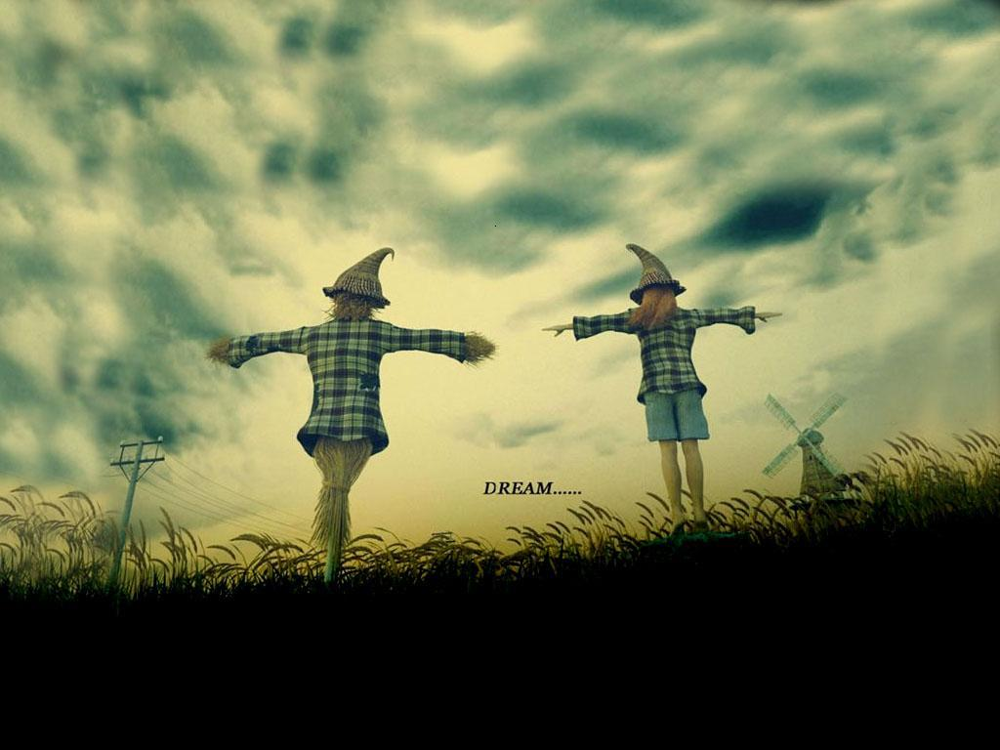
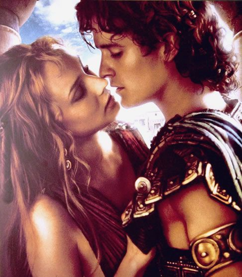
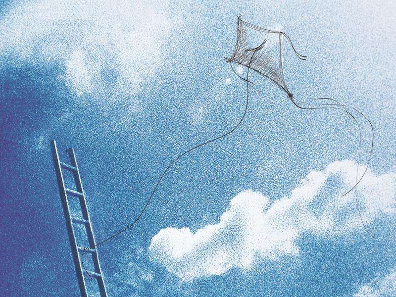
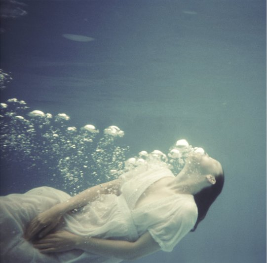

# 爱有时——致2011情人节

**爱情犹如一剂强力春药麻醉了全部感官，它让味蕾忘记了苦味，眼泪忘记了咸味。就算你学会了开漂亮女孩的玩笑，学会了听黄段子面不改色，学会了蛊惑学会了克己学会了制衡学会了空城，但是面对丘比特的铅箭你仍然毫无办法只得缴械投降，它只是不偏不倚，刚好射中你时光中蒙尘的心脏。**

### 

### 

# 爱有时

# ——致2011情人节

### 

## 文 / 回形针（苏州大学）

### 

### 

我若还能那样爱着谁的话 

到那时一定一定

要象带着芳香的风一样

不论时间流逝

只要永远永远地爱着就好了

### 

### 

### 

从什么时候开始就连谈论爱都变成了一种禁忌呢？当我坐下决定开始为这一年一度该死的节日写点儿什么时，我发现我重新患上了失语症。像我这么大的那些人，就算没恋爱过，至少也暗恋过。知道爱情是颗糖衣炮弹，像情花艳丽的花瓣背后生着刺舌的小钩，包藏祸心含有毒素。结出的果子酸甜苦辣歪瓜裂枣，如非吃饱了撑的实在不推荐食用。就像《奥德赛》开篇诗行中所描述的，他见过许多的城市，阅人无数，深谙人心，但却饱经磨难，心中苦楚。我们见到睡美人变成了老太婆，海的女儿变成了泡沫，湄公河畔情人桃色的肌肤增添了皱纹，树上的男爵乘上热气球飞走。世界各地的人都有不同的爱情。人们为爱情歌唱，人们因爱情起舞，人们通过诗赋和故事来抒发爱情。人们讲述关于爱情的神话和传说。人们渴望爱情，盼望爱情。人们为爱着迷，甚至为爱而死。但是，爱情和生活如果真的不可分割，为何我们只在这个日子才会谈论它？许多年前有一位圣人因为见证了不容于世的爱情而死于乱棒之下，而今天的我们是多么精明啊，我们像躲避霍乱一样躲避爱情，我们接受了各种简化论还原论生理解析论文化决定论，可以天亮说分手骑神马看浮云，只为了逃避直视情人的眼睛。 遇见一本书就像认识一个人，需要很多偶然和耐心。有些书你只看了电子版，有些书你在书店打个照面翻都不翻，有些书你连开头也懒得看，有些书你宁可站着在书店看完但不会把它带回家，有些书上了自家的架之后还没被看过，有些书你每次路过都提醒自己总有一天你会买下它……但是有多少篇章你能一字不落地背下，即使当初你是那么信誓旦旦地说着喜欢它。从网上下了阉割版的《纯真博物馆》，被剧情折腾得夜不能寐愤而入手纸本——我已经惰于将心动变成行动很久。拆掉塑封在台灯下面翻页的时候，一枚小书签按照惯例抖落在藏蓝的床单上。其实那是一枚贴纸，被做成两头圆滚滚的创可贴形状。苹果绿和浅橙相间的土耳其地砖图案，上面印着一句话——一个为了平息爱情伤痛的小希望。 在原书中，这种小希望是指，人们处于恋爱状态下不可言喻的紧张之中，会将一切偶然的因果联系作神秘解读，并将其称之为命运。如同男人掷铜板，女人数花瓣，占星家胡诌什么都能吃饭。因为在宇宙之中一切事物成为现实的可能性都是如此之小，我们在遇见所爱之人的瞬间，就会转变成一个虔诚的信徒。神啊，感谢您让我们在此相遇——就好像你随时可以为这个才出现在你生命中几个小时的人而死似的。生命的偶然性让我们恐惧，我们必须为不可理喻的爱情找一个借口，仿佛由于遇见对方，一切对我们而言已经如愿以偿。但是爱情那无从证明的特性又使我们持续地坐立不安黯然神伤，仿佛手心里抓着一只白兔在乱蹬脚掌。因为当我们最终发现相遇只是一个偶然，我们先前的一切假设就瞬间苍白，而爱情本身由于其难以掌控的特质亦失去其令人心悦诚服的力量。不过在那之前，我们相信上帝不掷骰子。或者说，虽然骰子会摇出不同的点数，我们却执意要摇到那表明终有一天我们会相爱的必然数字方才罢休。 可是，你是一个接受过良好教育的人，并且是一个深刻地掌握着自己命运的人，而且是一个成熟淡定的男人，你不能为爱情这种微不足道的小事乱了阵脚。在感受着巨大幸福的同时，你也因面对认真对待这种幸福而导致的危险而深深地恐惧。为了能继续自己美好和幸福的生活，你不应该爱上她。你要小心翼翼地维护自己理性冷静见多识广的形象，但你发现语言在爱情面前无法自制，错误百出，你一贯的舌灿莲花谈笑风生无处施展，你重新变成手心出汗目光偏移的单车少年，那时候你也真是年轻，还相信字典和圣诞老人，桃花岛和永无乡。你被阳光晒醒会翻个身，同桌的胳膊肘能让你走神。那时候你没看过铁皮鼓和猜火车，也不认识叔本华和洛丽塔。你手指上夹着转体1080度的蓝水笔，偶尔在春天面对马尾辫旁边的内衣肩带产生幻想，并且严肃地维持优等生道貌岸然的模样，没人知道你昨晚睡在网吧还是操场。你不愿再是鲜衣怒马狂言热血的少年，却仍然是负气叛逆任性骄傲的孩子。你再次看见了穿着青春战斗服在马拉松赛道上气喘嘘嘘的自己，为某个毫无意义的小动作而心慌意乱的自己，从来都无懈可击却瞬间解甲归田的自己。爱情犹如一剂强力春药麻醉了全部感官，它让味蕾忘记了苦味，眼泪忘记了咸味。就算你学会了开漂亮女孩的玩笑，学会了听黄段子面不改色，学会了蛊惑学会了克己学会了制衡学会了空城，但是面对丘比特的铅箭你仍然毫无办法只得缴械投降，它只是不偏不倚，刚好射中你时光中蒙尘的心脏。 

### 

漫长而枯燥的冰雪之夜，老人们感受到死亡的威胁，而情人们相拥而眠。

 但是你仍然必须负隅顽抗，尽管我们在悲屈和伪善之下，已经非常疲倦了。像不相信自己的眼睛一样，你不相信自己的心。我们早已习惯了在生活中以高超的演技诠释淡定和优雅，而爱情则显得太过朴实和裸露。爱是温柔的吗？它是太粗暴、太专横、太暴戾了，它像荆棘一样刺人，它赋予我们一种冲动，使我们渴望歌唱，飞翔，远行或者暴力。爱情唤醒了沉睡在我们身上的祖先的灵魂，那些灵魂来自一个位于文明之前的世界，据人类学家描述，彼时，高贵的野蛮人在丛林中奔跑，对抗恶毒热辣的阳光，猝不及防的暴雨，难以忍受的饥饿，漫长难捱的寒夜。一切都是崭新的，事物还没有名字，他们用惊喜的好奇的期待的眼光看着这个世界，并试着在脑中梳理分类。可是，像所有漫长的山岳和潺潺的流水都有独特的明媚，像金色的太阳与银色的月亮每一天都不甚相同，总有某个特别的人以肉眼不可见的魔力自千里之外款款而至姗姗来迟，攫取他们深藏不露柔软多汁的心房。他们的灵魂为之颤抖，生活从此翻覆。他们不懂语言，但他们懂得爱情。 恋人一旦出现，你整个人都将不再属于你自己。伟大的莎士比亚借罗密欧之口为我们描绘了爱情这一暴君的印象派肖像：“——啊，吵吵闹闹的相爱，亲亲热热的怨恨！啊，无中生有的一切！啊，沉重的轻浮，严肃的狂妄，整齐的混乱，铅铸的羽毛，光明的烟雾，寒冷的火焰，憔悴的健康，永远觉醒的睡眠，否定的存在！我感觉到的爱情正是这么一种东西，可是我并不喜爱这一种爱情。你不会笑我吗？——爱情是叹息吹起的一阵烟；恋人的眼中有它净化了的火星；恋人的眼泪是它激起的波涛。它又是最智慧的疯狂，哽喉的苦味，吃不到嘴的蜜糖。——丘比特的羽镞已经穿透我的胸膛，我不能借着他的羽翼高翔；他束缚住了我整个的灵魂，爱的重担压得我向下坠沉，跳不出烦恼去。——我怕也许是太早了；我仿佛觉得有一种不可知的命运，将要从我们今天晚上的狂欢开始它的恐怖的统治。”而朱丽叶的话更直接更纯朴：“把我的罗密欧给我。” 

### 

### 

天哪，要是恋爱中人都这么疯疯癫癫狂妄自大，这日子都没法过了。而且不止罗密欧与朱丽叶这对恋人，特里斯坦和伊索尔德，齐格弗里德和布仑希尔德，皮拉默斯和西斯贝，他们可都是玩命的啊。爱情是为一个人心有悸动无心正业，全程自动身不由己披星戴月风雨兼程悄立寒风。可能连一句完整的话都说不出来，可能因为想到不能打电话给对方而头一次感到了某种痛楚。可能因为对方的不在场而怀疑生活本身都不像是真的，虽然我们的世界因为网络和误解早已经支离破碎了。可能只有在迷迷糊糊的梦境中，情人才栩栩如生。可能因为孤独和烦躁无法入眠，你只有在黎明前的几个小时才能稍稍休息一会儿——昏沉地陷入沉睡之中，直到早晨的阳光像一把短刀，突然刺破你的眼皮。 知道了这些，你还敢碰一碰恋爱这条蛇给你递来的苹果吗？当然，这不是因为你胆小，你只是想猫吃鱼狗吃肉奥特曼打小怪兽而已，你是个凡人，你想要平安幸福地结婚生子，你不想碰轰轰烈烈的爱情，太伤身心。你时时刻刻提醒自己，你以为爱是那么简单的吗？你以为人心就像心电图那样一目了然？爱情太虚幻太飘渺太……真实了。我们都承受不起。爱情令人无法正视的浮光潋滟，会使孤独从生活那灰暗的底色中跳脱而出，呈现出赤裸而残忍的苍白。于是明哲保身的人们抛弃了初衷，对一些寡然的事情津津乐道。这或许是转移爱情痛苦的最好方式，可是生命从此却有一隅总在哭泣。就连爱人，也不过是个熟人。相谈甚欢相敬如宾，保住了淡如水长流，享受不到如蜜之亲密，为逃避火药而错过了火花。这不是爱情。 最可怕的是，你意识不到自己在说谎，你骗过了自己。你爱仅仅因为你认为你自己在爱。而你不爱却只是因为你告诫自己不要去爱。人们实在很难去相信心与心之间的沟通是一件可能的事情，甚至连试一试的胆量也无。错在我们在没见过海之前先认识了张爱玲，每当我们想真心倾诉，出于对我们即将使用的三流电视剧一般烂俗语言的厌恶，我们就把发自肺腑汹涌喷薄的真情实感咽了回去。而为了掩饰因为虚伪引发的扭捏，就必须在其上再涂装一层沉默，或者亲热。即使你的心拉响地震预警报告，鸡犬不宁地提醒你一切行将溃败，你的喉舌依然在欺骗你的大脑你的眼睛你的一切和你周围的一切。 

### 

你可知道兔子的哭泣方式？ 兔子不會哭泣 只會在寂寞中顫抖不止 最後停止呼息 

你可曾聽過魚哭泣的聲音？ 一隻無法聽聞 若聚集大量魚群的哭聲 將成海潮之聲 

你可曾見過蝴蝶之淚？ 蝴蝶之淚嚐起來又是何味？ 你的眼淚是什麼顏色？

### 

每天黄昏的时刻，乃是这一日之中最为漫长难挨的时刻，仿佛一切无端的悲哀郁闷愁苦都迎面向你奔来，一个左勾拳右勾拳外加一顿组合拳打到你灰头土脸生命疑似有危险。这个时候你真想抱头蹲地擂墙锤树郁闷地大哭一场，可是你知道你不能。因为没有一个人在哭所以你不能哭。你得笑，像大头娃娃或者小头爸爸一个人表演出双份快乐。你鄙视自己的样子，捂着出土文物一样的铠甲，手拿头盔的姿势像一个沿街乞讨的逃兵。一边扒拉着感情的残羹冷炙小恩小惠，一边对落在脚边的百元大钞心生疑窦视而不见。 在这样的时刻你会想起谁，你能够想起谁。那令人窒息的是名为孤独的原罪。那是孤独，可不是别的什么东西。那是孤独，你独自被拖拽出母体不得不面对的气压变化而嚎啕大哭，你第一次面对深水忘记了是如何在子宫中漂浮，你身体上隆起的喉结膨胀的双乳背叛了你的认知，你出门远行被陌生的枕头搅得辗转难眠。什么都不能改变，你是一个个体。就算试图用词语进行交流，就算渴求以肉体换取沟通，相聚永远是短暂的，分别之后下一秒，彼此仍然是不同的人。温情脉脉的相依，接近死亡的狂喜，都只是因为独自一人的时刻太过令人恐惧，才海市蜃楼一般宛若神迹。是以你将我在头脑中反复勾画成一个图腾的形状，将短暂的对视赋予恩赐的意义，咀嚼只言片语，就连沉默也粉饰得分外美丽。 其实我们都一样的孤独。因为我们从土中来，从土中去。 你在的时候，时间疾驰而去，你不在的时候，细节熔炼成奔涌的洪流反扑过来，要我加倍偿还从孤独手中短暂的逃离。 你无法得偿所愿的梦，乃是欺瞒真心所付出的代价。 只是当时已惘然，这并非一个好理由。所有的后果，不都是只能自负么。 

### 

 人类无法逃避的拷问，是后悔。时间对所有人都很公平，所有自鸣得意掩耳盗铃忍气吞声忍辱负重都会在时间的冲刷涤荡之下现出本来面目。审视再审视之后，内心深处绽放出一朵被滤净的欲望之花，这花却只有自己看得到。花的悲剧不是丑陋，而是无人欣赏。 多数人像星星一样围绕他人旋转——受制于人类条件的引力，步彼此的后尘，但命中注定永不交接。我们叫做玫瑰的这一种花，要是换了个名字，它的香味还是同样的芬芳，当时我们没说出口的感情，却再也没人能够证明那是爱了。 

### 

世界的意义其实很简单，

各种解说却冗长纷繁，

无非是爱与被爱，

人和神却依旧没有学会，

哎，他们一再把它违背，

永远不知悔改。

——爱默生

### 

可能你不知道对方爱你什么。或许对方也因你这种不可理喻的爱而感到困扰吧。少年维特的苦恼在于，试图将一切奉献给所爱之人，可是当这奉献被退回时，当他舍弃了别人给予他而他自己又不想要的头脑时，他就只剩下一颗心了。“我对自己的头脑不感兴趣，而你却对我的心不感兴趣。”所以他悲剧了。然而恋人所爱的，仅仅是你本来的样子，你最初的样子，爱情的手段可能很繁复，目的却是回归永恒的纯真。纯真本身，是保有对美好的憧憬和对可能性的期待，而爱，是百折不挠，百转千回，百无一用，百死无悔。它们同样执着纯洁饱含激情，甚至有些不着边际地理想主义，但是理想主义者，他们走了那么远。 或许我们都用过手段试图维护一段感情让它不过期，可是爱情本身却是不事雕琢的，它有点像鲜切花，养在清水瓶子里，到时间了，也就萎谢了。想要让它持久是不可能的，除非让它存活。像恋人和孩子那样，用沉重的心埋下种子，给它土壤，阳光，空气和水。所谓沉重的心，与成人世界的轻浮相对，是全权托付破釜沉舟毫不后悔一意孤行的将心换心。成年人早已学会不把鸡蛋放在一个篮子里，而绯红的面颊紧攥的双手交给我们的，却是整个世界。他们明亮的眼眸，能剥落时光覆盖在我们肩膀的粉尘，让我们发觉自己原来是笨拙的小飞象，是他们教会了我们飞翔。 情人身上被我们所爱之物，乃是仅属于发现者的，独一无二的宝藏。那人身上有着某种东西，总是意外而且突然地闪现，似已熟识却又从未得见，那是无法形容的纯真。古希腊人为此特别发明了一个词ΑΤΟ∏Ο——这个词现存的一切中文翻译都不能令我满意。梁文道管它叫“不可分类”。而我觉得这个词更贴近于乌有，太初，天然。应该是宇宙大爆炸之前混沌圆满的状态，如同一枚未破壳的卵，它就在那里，不偏不倚，自成一体，增一分则肥减一分则瘦，不拘一格，意态难描，恰如其分，轻轻松松就拿了第一名。 或许情人那些稚气的举动并不特别，但在对方眼里看来就简直是极美。仅仅是很美。令人目眩神迷。面对美，言语总是无力的。如穆齐尔所描述：“那时人们就像被一大块滑溜溜的食物噎住了似的，这块食物咳不上来也咽不下去。它太软，所以噎不死他们，它又太不软，所以它们又一句话都说不出来，那些“哦”和“啊”就是被噎住时发出的痛苦声音。人们不方便把手指伸进喉咙里去抓，而一种更好地把必须的话说出来的方法人们还没学过。拿这事开玩笑是不应该的，这种呼喊声表达的是一种非常痛苦的透不过气来的感觉。” 总之，能说得出的，都不是爱情，但爱情，必须被说出。这个世界里不乏丑陋和残缺，但我们仍将在痛苦中找到让我们爱得如此汹涌的东西。而被我们称之为现在的那些时刻。因为所爱之人的一个微笑，有时候能够给我们足够享用一个世纪的幸福。 情人节快乐，愿天下有情人得偿所愿！ 

### 

### 

### 

（编辑：黄理罡）

### 

### 
