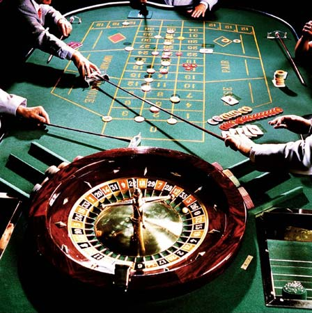

# 一个值得纪念的日子

**想想人的本性，只有两个最基本的公理，趋利与避害，或叫最求幸福，厌恶痛苦。只要利用好这两点就够了。相对来说，人们追求幸福的强度大于人们避免痛苦的强度。这是两个心理学家证明的。幸福是主观感受，可以用外在的客观加以操作或定义，尽管二者并不绝对等同。人们更倾向于看好的一面，承认好的，否定坏的。**

### 

### 

# 一个值得纪念的日子

### 

## 文 / 闫巩固（北京师范大学）

### 

### 

某天早上八点起来，打开电脑，想着昨天看的新闻所生的困惑，说是全国的房产总价值现在达到近百万亿，是GDP总和的3倍多。还有一包卖1000多元的天价烟，等等。突然冒出几个问题，问自己： 1、房地产为什么会在短短几年内发展成为国家的支柱产业？ 2、是什么原因让股票市场变得如此火爆，大跌大扬，极具戏剧性，同时也成为国家经济的晴雨表，一个促进发展的支柱命脉？ 3、下一个朝阳的行业是什么？ 头脑相当混乱，支离破碎的想法不断涌出。对于第一个问题，想到的是，以前房子是公有的，是集体奋斗的保障，像是对做出贡献者的一种福利，它只是人们的一个居住场所，没有交易价值。但现在，房子开始变成了商品。这种商品是特殊的，是每个人都需要的。这是衣食住行中最后一个商品化的。之所以能够成为支柱产业，在于它的价格高，同时是持续的高，是一个高刺激的诱因。它既满足了人们的安全需要，居住有其所，又有投机或投资价值。最关键的是价格和价格走势连接着每个人的心理利益和价值。价格高，总量大，受众多才能成为主题，支柱，才能成为人们争相参与，费劲全部精力抢夺或希望拥有的。 对于第二个问题，一直认为股票市场本身就是一个赌场，不过是国家操控的合法的赌场罢了。股市也是这三年又开始火爆起来的。它的特点是没有绝对意义上的上限，大小均可参与。特点是一对多的博弈，可以满足人的贪念，无成本的买卖（唯一的成本是自己的时间和已经拥有的筹码数量，以前人们不把自己的付出作为成本，因为人们认为只有去做才有回报，是应当的默认值）。股市的火爆一个方面源自于因炒股而英雄辈出，股神和暴富者层出不穷，不断出现。但这只是行为主义中的R变成了S。另一方面，源自人的贪欲。股市具有满足人们贪欲的最廉价特征。 

### 

 将这两个问题连在一起，发现他们都与人的贪欲满足有关。想到一个不争的事实，任何一个新行业的产生，都离不开让人看到利益的存在（真真切切），成本是完全自己可控制的，且与每个人有关的。准入条款与门槛低。房地产开始的时候没有现在火爆，原因是准入门槛太高，人们的积蓄不过几万，房子变成了一生的一个结果（玩意），人们不干。后来变得门槛低了，有了可能性，那就是政府开始房贷，房贷的门槛低到可以作假的程度，一切障碍去除了，潘多拉盒子中的魔鬼终于被放出来了。 人类是一个独特的物种，他的独特性在于超强的适应能力和创造力。适应力是让人接受，认同，顺应，创造力在于让人打破已有的规则，建立新规则。想想人的本性，只有两个最基本的公理，趋利与避害，或叫追求幸福，厌恶痛苦。只要利用好这两点就够了。相对来说，人们追求幸福的强度大于人们避免痛苦的强度。这是两个心理学家证明的。幸福是主观感受，可以用外在的客观加以操作或定义，尽管二者并不绝对等同。人们更倾向于看好的一面，承认好的，否定坏的。 回到第三个问题，下一个让人趋之若鹜的行业是什么？第一个反应是我还真不知道。但转念一想，看看房地产，再看看股票金融，哈哈，满足人们贪婪欲望，或让人能够感觉幸福，或只要能让人产生憧憬的任何东西。条件都是准入门槛低，尽量让人认为可以不劳而获，至少让人觉得可以投入少产出多。还有一条，它应当是尽量没有上限的。给人以希望。 任何一个游戏（行业），都少不了规则和玩家。但一个游戏要想兴旺火爆，流行起来，则还必须有受众和监管者。玩家（游戏者）中必须有英雄，出类拔萃者，一种小概率事件，且英雄辈出。受众则要多种多样，有粉丝或叫成瘾者，也有反对者。支持与反对二者的冲突越大，火爆度越高。监管者，或叫裁判，是一个重要角色，保证游戏的进行。他既是玩家的保护者，又是玩家的天敌。同时，它是一个公共角色，粉丝受众的谈资，娱乐的对象。它既要保持公平，同时制造丑闻。 制造希望，是前几年所说的愿景。希望可能破灭。幸福只在自己心中。 

### 

### 

### 

### 

（采编：乔淼 责编：乔淼）

### 

### 
