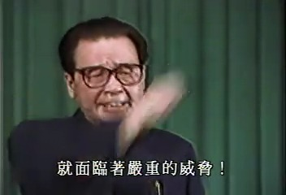
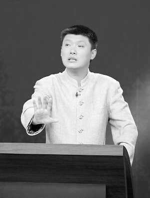
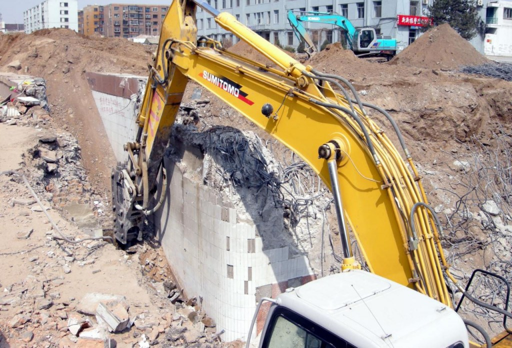

# 一个赶着80末班车人眼中的中国教育

**社会制度再优越，都会被每一个民蒙未启的臣民连同国家和民族的前途一并埋葬。我们真正的任务在于改变我们自己的一切--思想--这是一切新生的源头。**

# 一个赶着80末班车人眼中的中国教育

## 文 / 周菁（暨南大学）

  我出生于1989年，徘徊游移在印有“迷茫一代”的80后与盖有“脑残一代”的90后之间。 

### 1. 问渠那得清如许，惟有源头活水来

假使回顾中国的近代史，可以称作是蚍蜉撼大树，但蚍蜉却不断胜利的过程。文革时期所形成的文化断层或多或少对现在的信仰缺失有所影响，加之计划经济体制转型为市场经济，现在的中国可以看作“术不优，道不明，法不健”的状态。 术而不优，在于利益集团的无序斗争、政治经济体制的混乱和社会管理与保障的落后等，它表现为“宜粗不宜细”的各种粗放型政策，缺乏监管制约而难以撼动的权力以及资源的垄断导致分配不公。 道而不明，在于康梁孙文后国民再无理性、常识与平等观念的教化，它表现为浮夸的学风，教育的形式主义，大学官僚主义，80、90后信仰缺失，传统文化的没落等。 法而不健，在于法制体系的漏洞，缺乏对人本的关注，它表现为底层百姓的话语权缺失，高层领导为所欲为。 

 于是，社会对于体制的改革莫衷一是。但我以为，社会制度再优越，都会被每一个民蒙未启的臣民连同国家和民族的前途一并埋葬。我们真正的任务在于改变我们自己的一切--思想--这是一切新生的源头。 假使目的是改变思想，那么手段则是教育。 

### 

### 2. 我们的困惑，我们的迷茫

相形于美国60年代的“垮掉的一代”，也有人称现在的80后为“垮掉的一代”。我想，垮掉的也许是裤裆，物质生活如许，精神世界依旧匮乏。 在我看来，“迷茫的一代”也许更加生动贴切。很简单的一个办法，长期登陆大陆学生的网络聚集地人人网，关注周围的人在分享什么，帖子，歌曲，视频等等，尔后提炼出共性。长期以往，就会发现，其实大家都接二连三地抛出了同样的问题： 我究竟适合做什么？我到底喜欢做什么？为什么别人可以那么有本事如此辉煌我却默默无闻？工作，读研，留学，创业，我究竟应该何去何从？理想和现实的平衡点在哪里？生命的意义究竟是什么？存在的价值又体现在哪些方面？自由与责任又存在怎样的关系? 倘若迷茫得再深入一点，我想我所要抛出的问题则是： 我们为什么要通过竞争来受教育？难道教育只是为了通过几项考试，得到一份体面的工作？为什么我们在通过几项考试以后很快就把所学的内容忘精光了？ 换一个角度，鸡鸭鱼肉吃惯了，我们是不是需要偶尔换换口味，不从任何商业的角度去做一件事情，去做一些并非引人瞩目但于自身颇有意义的事情，不以生涯的发展为思维导向去选择，去做一件彻底自由拥有绝对主权的事情。 

### 

### 3. 教育不是听评书，那是什么？

 现在的教育只是教了我们思考什么，而不是怎样去思考。教育的根本目的应该立足于人本，重要在于世界观的树立和思想方法的形成，是要转变人。这个转变的过程，就好似一个树形图，它的两大根基是人文学科和理科的学习。然而，遗憾的是，我们往往在分科以后，理科生忽略了人文学科的学习，文科生不再重视逻辑思维的锻炼，这是教育的缺陷。 “内容是手段，过于求新鲜的内容，即所谓前沿知道并不一定有意义，例如，自由主义是新的，但它带来的灾难是这场经济危机的根本理论；相反，凯恩斯主义是旧的，却成了挽救危机的灵丹妙药。建立一个逻辑体系，对新的知识也能够用逻辑去看待。”相识的一个经济学教授如是说道。 在这个基础之上，人作为个体，才能够充分地去发现生活的精微面，完成自我探索的过程，找到自己存在的真正的价值。生命原本浩瀚广袤，飞鸟，鱼虫，花草，树木这些自然万物难道就不足以珍惜敬畏了吗？尼采所探讨的超人哲学想必也是基于“独立人”的角度出发的，这与教育的目的是有着相似之处。 接着才是社会公民。同在一片土地上，白种人，黄种人从人性上来看又能相差多少呢？既然如此，在完成了“独立人”的塑造后，才是根据不同环境不同社会背景所进行的“社会公民”的塑造。龙应台说，看一个城市的文明程度，就看它是如何对待它的精神病人，它对于残障者的服务做到什么地步，它对鳏寡孤独的照顾到什么程度。这是公民社会的体现形式，而这样的公民社会是由一个个“独立人”所集合而成。但每个地区情况不同，对于“社会公民”的要求也不尽相同。 于我看来，教育的目的在于先满足个人需求，培养思维方式，进而帮助个人找到生命存在的价值，才是培养社会公民，满足社会需求。 

### 4. 中国为什么只出了一个韩寒，出不了第二个陈景润？

本质决定了一切。中国当下教育依旧是“科举制度”，如同民本主义能够以“尊主安国”“惠民安国”“尊君爱民”三种形式表达，但核心还是君为贵。形变而质不变。 我们都明白，工厂里批量生产出来的产品并无创新可言。而中国大一统的教育，就是一群人听着一个人说话。统一的考试，统一的命题，统一的答案，严重禁锢了个人的思想。昨天拆教会学校，今天拆私立学校，早晚要拆掉你的骨架，拿走你的灵魂。 中国的发展史是一部拆迁史，除了客观存在的大张旗鼓的血拆，精神上的血拆更是拆得无声无息。 

 勒庞的《乌合之众》里面提到：“在改善或恶化群众的头脑方面，教育至少能发挥一部分作用。因而有必要说明，这种头脑是如何有当前的制度培养出来的，冷漠而中立的群众是如何变成了一支心怀不满的大军，随时打算听从一切乌托邦分子和能言善辩者的暗示。” 是的，在人口如此庞大的同质化社会群体里面，从博弈者的另一头来看，教育的作用理应是禁锢思想，恶化头脑，弱化辨别能力的。 于是困境便产生了，我们不妨从金字塔的最顶层开始往下看。国家权力机关掌握了太多的资源，各所大学为了生存不得不高举溜须拍马的旗帜。而这资源分配的过程中，是够公开透明，是否分配足够，也是不得而知。而我们时常听到的“项目”“课题”又与资源有着密不可分的联系。而笼罩在外面的光环，则是所谓的评估体系，211,985工程之类。实际上，不是所有东西都可以去量化统计的，一旦量化衡量了，谁能够保证大概率地精确呢？指标繁多，究竟以哪种指标来评判一个学校的好坏，才足以服众不给造假者钻空子的机会？ 再沿着金字塔看下去，学校的内部俨然如此。教职称制度下催生了多少“职称书”，除了签名送人以外，无外乎是老鼠用来做窝，蜘蛛用来织网。“各种部处都用想法或项目向学校争取一些资源，然后去评审和分配这些资源。部处的想法有多少，基层的腿就要跑多少，表就要填多少，报告就要打多少，话就要说多少，酒就得喝多少。这些想法是部门的业绩起点，没有业绩，他们存在的价值就没有了。”一位高校经济学教授在博客里如是说道。 “我也很想诲人不倦，做好大学教师的本职工作。但如果教师的工资再高一点，我也不会花很多精力在校外的项目上。”一位高校在职的教师无奈地叹气说道。 是的，当学术不再独立，受制于体制，受制于种种敏感的时候，创新从何而来，第二个陈景润又如何诞生？ 

### 

### 5. 是时候停住脚步思考一下了

胡适说，国家的耻辱不在于打败仗。打败仗固然是国耻，但真正的国耻是我们没有图书馆，没有博物馆，这些才是真正的国耻。 多一座学校，便少了一座监狱。思想的重要，由此可见。 欧洲文艺复兴时期，法国有沙龙，便于知识分子相互毫无禁忌地探讨，思维碰撞；德国一边是以武力拷打世界，一边也是以思想拷问上帝。二战以后，德国停下脚步思考，于是有了今天的发展。 中国在不断地跳跃式前进，甚至飞跃，但却少了很多互为因果的关键步骤--思考。若是将鸦片战争打开国门，甲午中日战争，世界大战，内战，新中国成立等等事件排列开来，你会发现实在太拥挤，思考的时间几乎没有。 

 从小就耳熟能详的一首歌是这样唱到的：“中华民族到了最危险的时候，每个人被迫着发出最后的吼声，起来！起来！起来！”这实在是太危急，危急得没有时间去思考我们遗失已久的传统文化，没有时间去思考自己存在所承担的内容，没有时间去思考骨子里面的基因究竟如何去适应外部环境的变化。 国粹主义，民主主义，民本主义，无论祖宗的基业如何，社会制度怎样，这些都是外部客观的东西。真正产生影响的，应该是骨子里面的思想。作为“独立人”如此，作为由“独立人”所组成的国家，难道会有本质上的变化么？ 我们往往斥责“权力垄断”+“市场垄断”的贪污模式，然后又非议大学里学生组织过于官僚化，但究其原因，不如沉下来思考一下我们在7-12岁所接受的教育究竟是怎样的。万事万物都是一点一滴水到渠成的，横空出世只是小概率事件。 我们需要改变的，是思想。精神没有出路，生命就会堕落，国家则难以真正崛起。 

