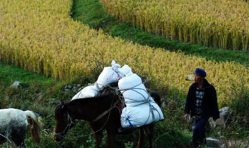
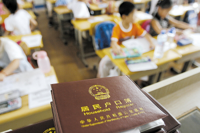

# 一样的黄金时代，不一样的人生

**一个好男人，一个优秀的男人，最后却要回到农村做一个农民，唯一的理由是他是一个农民本身。而一个混蛋傻大个儿最后却可以在城市有一席之地，与陈清扬一起敦20年前的伟大友谊，而原因仅仅是它是个城里人罢了。** **一样的黄金时代，不一样的人生，户籍制度，你叫我情何以堪？** ** **

# 一样的黄金时代，不一样的人生

## 文 / 陈尉

 不知是不是巧合，我在近期看了两本小说——路遥的《人生》和王小波的《黄金时代》。也许是由于篇幅原因，两本我都是意犹未尽，所以不免多想，这一多想就把两本书拉到了一起，虽有风马牛不相及的意味，但是我却很有感触。 

 正如王二自己说的，二十一岁正是自己的黄金时代，在一个异常性压抑而且毁灭人性的年代，他尽情地享受着性爱这一时代奢侈品，甚至有了爱情的味道。自由、奔放、敢于冒险，从头到尾的混蛋气，这就是王二黄金时代的印记，也是我喜欢这个人物的原因。 从小说开始就进入了引人入胜的关于陈清扬是不是破鞋的讨论，基本上注定了他混蛋一世的人生，果不然，后面的故事没有最混蛋只有更混蛋，有时候我会觉得这个人很荒诞、有流氓习气。可以说，王二在自己的黄金时代混蛋而快乐、荒诞而潇洒的活着。 而另一个故事（《人生》）的主人公——高加林的故事其实也是发生在他的黄金时代的：高中毕业没有考上大学，在村里当了三年的民办教师，怎么算这个时候的高加林也就二十一岁上下吧。这与《黄金时代》里的王二的年龄是完全吻合的，也就权当这是个巧合的。 高加林是在一个雷雨交加的夜晚犹豫出场的，从一开始他就不快乐，而从故事的地点——农村就几乎可以断定高的命运和结局，我就是根据他的农民身份猜出了他那略显悲壮的宿命般的人生的。当然我并不是歧视农民，因为我就是一个农民，我祖祖辈辈都是。一个你们的人生就应该以土地为依托，农民的黄金时代就应该与祖国美好的山川大地一起度过，你的文化、你的才华以及你的能力都是多余的，因为这是农村——农民连刷牙都不应该，不需要这些。 因此，我老早就猜测这个高加林的结局是一个农民：从哪里来的就要回到哪里去，这是无法改变的；高加林来自农村就回到乡土，王二来自城市就回到城市，这本身就没什么不对。我唯一失算的是高加林比我想象中还有悲惨，他的黄金时代，他的人生可以说比王二要苦很多，也许这就是城乡二元的区别所在吧。 

 如果说高加林短暂的城市生活是寻梦的话，王二那被他写的有点美好的插队生活却可以算是一次旅行。在这里我无意搞任何浪漫，因为那对高加林来说显得不公平，甚至会让人觉得矫情：无论是黄金的时代还是人生都是残酷的、无情的，浪漫无法书写更无法涵盖全部。无论从哪个意义上来说，上山下乡和农民进城都不是一个轻松的话题，更无法浪漫，因为这是一个时代一个群体一个民族的大茶几，上面有各式各样、也许闻所未闻的各种杯具。他们叫不同的名字，来自不同的地方，但是每个人身上都有一个共同的标签，那就是共和国的大悲剧。各种运动、各种上山下乡都不是领导人一句简单的口号可以涵盖的，实践起来就是群体命运的被改变和人生的沦落。王二们失去了很多，他们在乡下浪费了青春和汗水，但是像王二这般苦中作乐的又有多少呢？坚持下来的人当然结局是可喜的，他们会看到阳光、会回到城市，但是又有多少人坚持下来了呢？高加林这个人 一点也不可恨，从头到尾我就没有恨他，尽管他始乱终弃，他抛弃了爱人最后发现自己是时代的弃儿，他是值得同情的，在人生之前，他是那样的卑微，在命运面前，他是那样无助与绝望。他最后回到了农村，默默地做一个农民，这不是报应，这是暴力：时代的暴力、民族的暴力、命运的暴力。 黄金时代本应该有黄金一般美好的人生，但是王二和高加林其实都是在过着狗屎一样的人生。如果说王二逃到山上，天天写材料是虚度光阴的话，高加林在城里那短暂的工作却算是给国家奉献了一个农民微博的力量。尽管高加林工作努力、出色，他有在城市工作的实力、能力、热情和意愿，但是他必须回去，因为他是一个农民，城市不需要他。我认为高加林用他的行动抽了户籍制度一个大耳光，谁说这些工作只有城市人可以做，谁说农民就干不了这些所谓的城市人的工作？说可以证明户籍制度是合理的？ 户籍制度可能在这两个故事里很无辜，而我这样联想也许显得幼稚，但是谁说这两个人的命运就跟户籍没有关系呢？ 高加林，高中毕业没有考上大学，当了三年民办教师被下了，只有做一个农民。这看似正常，龙生龙，凤生凤，老鼠的孩子会打洞，作为农民的儿子高加林回归大地很正常也很自然。一直被当年的包分配迷惑，殊不知要是没有考上就要被分配到老家种田，为什么？仅仅是因为户籍。农村的孩子早已与自己的户籍绑定，每个人都是飘在空中的风筝，而大学就是那根线，没考上大学自然就是断了线的风筝，唯有接受自己面朝黄土的命运。 王二，响应毛爷爷的号召上山下乡当了知青。他的黄金时代是美好的，至少被描述的很美。他自由散漫、无组织无纪律，带个女人就上山了，多美浪的故事啊。反正王二的知青生活是我见过的最自由、最丰富、最性福的知青生活。二十年后，他和陈清扬再次相遇，这一次阵地从山上换到了城市的宾馆。阵地变迁这轻轻的一笔却道不尽多少历史的变迁和人世的沧桑。为什么王二就回到了城市而没有留在山上呢？因为他不属于那里，他的根（户籍）在城市。 高加林与王二有些相同点：首先，他们年龄相仿，都在各自的黄金时代；其次，他们的文笔都不错，高加林写的报告让人感动，而王二的交代材料人人喜欢看；第三，他们的故事都与女人有关，只是王二的故事是与一个女人而且更大胆、更直白、更暴露。 高加林和王二也有区别：高加林是个老实、有能力、有上进心的人；而王二则是个混蛋，流氓习气。因而，我更喜欢高加林一点。 一个好男人，一个优秀的男人，最后却要回到农村做一个农民，唯一的理由是他是一个农民本身。而一个混蛋傻大个儿最后却可以在城市有一席之地，与陈清扬一起敦20年前的伟大友谊，而原因仅仅是它是个城里人罢了。 一样的黄金时代，不一样的人生，户籍制度，你叫我情何以堪？ 

