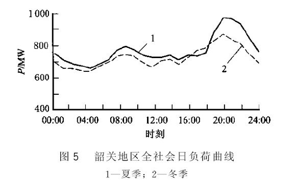
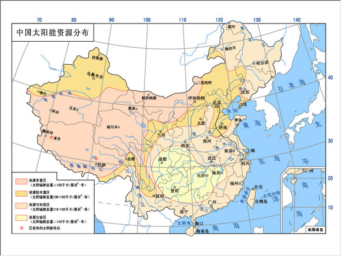
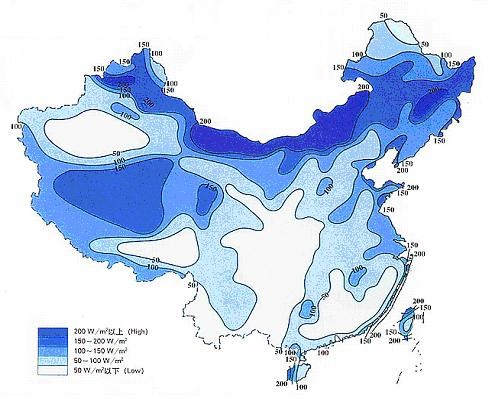
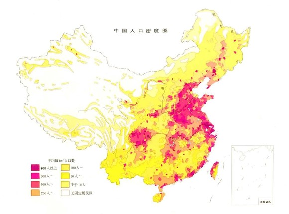
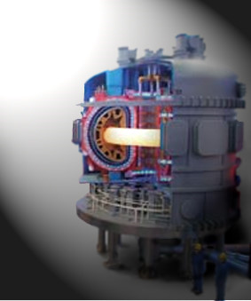

# 为什么我们要支持核电？

 **核能的明天是美好的，甚至可以断言核能的明天是人类未来的一部分，然而正如几百年前英国的纺织工人砸掉纺织机一样，我们一而再再而三的犯着这样的错误。所以，换个角度去看核电，不要忙着否定它，总有一天核电会证明自己无与伦比的地位。**  

# 为什么我们要支持核电？

## 文 / 张韧刚（北斗撰稿人）

  前几天在网上看到德国的绿党在福岛核电站事件之后大打反核牌，居然在大选中获得优势，这让我哭笑不得，脑子第一个想起的就是工业革命时砸掉纺织机的英国工人。所以我想我得站出来写点什么东西，让大家明白，核电没什么恐怖的。 在这个地球上，三大主要电力来源如下：66.1%的火电。然后是16.1%水利发电，最后是15.7%的核电。剩下的部分是其他发电方式，比如风能，太阳能，地热和潮汐。在中国这一比例大概是80%火电，1%核电。而从全球范围来看核电比例最高的是法国75%左右。然而世界上最多的火力发电几乎每一个国家都有。为什么会这样？ 

#### 火电——最无奈的选择

实际上人类社会对电力的需求并不是简简单单的有能源可以用作发电就可以。作为电力部门（厂网分离之后这个名字实际上不准确，我这里把全国的供电问题看做一个问题来解决。），其实最头疼的事情还不是发电，而是“调峰”。由于整个社会大规模消耗的电力基本是不可能被储存的，所以基本上是用电的时候负荷就更重，这个时候就需要更大的发电功率。这里我们以北京为例：北京地区电力负荷最大时可达1666.1万千瓦，最大负荷平均值为1101.8万千瓦，而争议颇多的三峡工程的总装机容量有多大呢？1820万千瓦。要比北京市的整个电力需求还要高。 但是如果我们深入一些就会发现其实这是一个很麻烦的问题，首先，北京电网的最大负荷可达1666.1万千瓦，而它的最小负荷平均值为625.6万千瓦。负载非常不均衡，由于电力不可储存，所以调节峰值就非常麻烦。三峡工程不可能每天都保证最大出力，在枯水期三峡工程的负荷可能连一半都达不到。所以需要大量的其他能源进行补充。 那么如果用火电呢？在中国一个比较典型的火电发电机组就可以达到30万千瓦左右。这样算下来大概需要50个这样的发电机组，按照一个电厂2台机组来算，大概需要20-30个火电厂才够，如果按照一年800亿千瓦时的总用电量计算，大概需要2900万吨煤。 

 而这还是每年的，我们再来看每天的数据。这是韶关地区典型的日负荷峰值图，这副图告诉我们，每天的20：00左右，会出现全天最高的用电负荷。而这比每天凌晨4：00左右的最低用电量高出接近一倍。但是电网在所有时间里都必须保持供电的问题，所以对于电力部门来讲，有时候不是没有能源，而是在需要的时候没有，而在不需要的时候又有太多。实际上整个社会各种电站的装机容量总量是远大于社会对能源的需求的，而国家电网这样的公司就按照不同的价格从不同的电厂那里买来电，然后放在电网上保证电力供应的平衡。 而水电，火电，核电，风电在不同的时间有不同的价格，这个价格是这样构成的，一部分是按照历史数据，天气因素来计算一个大致需要的量，然后签长期协议，另外一部分是由电网和某些电厂签订调峰的协议，当出现预料之外的供电问题的时候由这些电站提供额外的电力（这一部分电价超级贵。） 之所以火电在整个发电中占据如此高的比例，并不是因为火电本身便宜，或者环保，而是因为调峰比较容易，峰值出现时，火电厂可以很快的增加发电功率保证输出稳定。而在低谷时可以关掉一部分机组来节省能源。虽然水电在丰水期也可以做到类似的调控，但是在枯水期，大部分水电站本身处在库容不足的状态下，不可能提供大规模的电力。更不用说有些水电站还负责灌溉供水。 于是很多地方在电网建设不成熟的状态下，为了保证供电稳定，只好大规模建设火电来调峰。你知道国内火力发电占总发电量的多少吗？80%以上。这意味着每年消耗16亿吨煤。 再来说核电和火电的排放问题，核电产生的核废料主要是一些半衰期很长，具有一定放射性的重金属元素，一个核电站大概每年会产生几吨这样的核废料，总共大概几个立方米。虽然没有办法处理，但是核废料都没有直接排放到环境中，而是被储存了起来。而火电会产生几万吨的碳排放，这些碳以气态二氧化碳的形式直接排放到大气中，根本无法回收，正因为这些温室气体的排放，导致了近几十年全球范围内严重的温室效应。这里说的还只是二氧化碳，对于某些环保设施运行不当的电厂而言，还有氮氧化物，二氧化硫，粉尘的排放。 所以对于火电而言，人们的选择是很无奈的，一方面是最好的调峰灵活性，一方面是无奈的污染。 

#### 清洁能源——想说爱你不容易

也许有人会说，除了火电，水电之外我们还有风电和太阳能。 

 关于太阳能，我们还是以每日的曲线为准。韶关的那副图告诉我们，每天的20：00左右，会出现全天最高的用电负荷，这个时候我们是没有太阳能可以用的。然后我们来看全国的太阳能分布情况。大部分太阳能集中在地广人稀的西部地区。 

 然后来看风电。 

 然后我们来看一下中国人口的分布情况。 

 结论一目了然：实际上人口密度较高的地方，往往是自然环境比较温和的地区，这些地区无论是太阳能还是风能，丰度都不高。利用起来比较困难。 人口密度极高的华北地区，我们还要考虑另外一个问题，风能和太阳能占地面积巨大。在人口密集的地区大规模建设风电和太阳能所带来的经济收益很低，同样的占地面积，发展其他行业的收益要高的多。而把这些风电厂，太阳能发电站建在遥远的地区，则需要大量的电网建设投入，而且利用这些能源本身就会对电网调峰造成进一步的压力。更何况，风能和太阳能还有季节性问题。比如冬季用电高峰的时候，不管是风能还是太阳能都不能提供足够的负荷。 所以，清洁能源对于我们来说，是一个非常美好的理想，但是这些美好，很大程度上是停留在理论层面上的，当面对实际的社会供电问题的时候，清洁能源的各种局限，让他很难成为主力。 

#### 未来的核电

 目前核能的安全性一直被广泛的质疑，当然这和大众对核能的不了解有关，但现在的核能也的确有核废料无法处理的问题，这些半衰期长达上千年的放射性元素必须找个地方储存起来，一旦泄露就会导致巨大的环境灾难。 但是我们对核能的利用还处在很原始很基础的阶段。未来的我们看待我们现在使用核能的方式可能就像我们现在看几十年前的蒸汽机一样。它巨大，原始，而且有诸多弊病。 实际上核能本身来自于物质与能量的转换，就是著名的质能转换方程E=mc^2。这种转换主要有两种方式一种是裂变，一种是聚变。现在使用的方式大部分是重元素的裂变，通过中子轰击不太稳定的重元素来诱发裂变，放出能量和中子。裂变的产物多数是不稳定的重元素，这也是为什么我们在裂变过程之中产生如此多的核废料的原因。 而如果我们使用核聚变来发电的话，它的产物就相当清洁了。 比如使用氢的两种同位素，氘和氚聚变产生氦-4。氦-4是完全没有放射性的稳定元素，常温下是无色无味无毒的单原子气体，由于氦气是惰性气体，常温下几乎不和任何其他任何元素反应，而且对人类完全无害。潜水员们甚至直接把氦气加入气瓶中作为呼吸用的气体。 然而更美好的还不至于此，而且聚变和裂变一样，可以产生巨大的能量，甚至还要比裂变产生的能量更高。由于用来做反应物的重氢基本都可以从海水之中直接提取所以这种能源几乎是用之不竭的，按照计算，每公升海水之中提取出来的重氢如果用于发电，那么产生的能源比同体积的汽油还要高。想想整个海洋里都是烧不完的汽油，这是一种什么样的梦想啊。 但是核聚变本身需要的温度远比核裂变高，所以要控制核聚变是一件很困难的事情，美国的国家点火装置装置已经开始试验，而更早以前，通过磁力约束等离子体的 Tokamak（托卡马克）装置早就在苏联和中国运行。中国在可控核聚变的研究上还处于世界领先地位，以EAST（先进超导托卡马克实验装置）为代表的几个托卡马克装置已经成功运行过若干次。而ITER（国际热核聚变实验反应堆）也将在未来不久开始试运行，它的目标是产出的能量将大于输入能量十倍以上。基本上在未来30-40年之后，核能所能提供的能量将超过地球上现在使用的所有能源。而且要比现在所用的所有能源都更清洁更高效。 

#### 民众为何反对核电？

福岛事故一出，整个世界都一副谈核色变的样子。于是各国都开始怀疑自己的核电计划，甚至德国等一些地方的绿党借助这次核危机获得了政治上的优势。虽然当下的民意如此，但是我还是认为我们在可以预见的未来将不得不依赖核能。 我在这里贸然的预测一下，绿党的反核能理念不会坚持很久。原因很简单，国民要求政府提供廉价的，持续的电力，但是他们并不知道电力从何而来。这里给出一组数据：世界范围内，的三大主要电力来源如下：66.1%的化石燃料，这里化石燃料基本就是火电。然后是16.1%水利发电，最后是15.7%的核电。民众们对核电的认识往往来源于巨大的事件，比如切尔诺贝利，三里岛，和现在的福岛核电事故。因为大家都觉得核电很危险，所以给它贴上了很糟糕的标签。而实际上没有核电的话我们会面临更严重的问题。尤其是欧洲的那些绿党，他们打着反核电的旗号来招揽选票，但是实际上火电带来的环境危害远比核电大，而清洁能源本身又有严重的局限性。当然这些在选票面前他们不会去思考这些问题。 因为反对核电的民众只是打算反对核电。而能源从何而来的问题并不是由他们来解决。我们来换个思路想问题：在中国我们有便宜而高效的电动自行车你愿意因为它可能带来的严重的重金属污染而放弃使用电动车吗？看看大街小巷就知道，大部分民众已经做出了自己的选择。但是为什么民意会反对核电？因为你自己的交通问题是你自己的问题，而电力是公共事务，大家的想法很简单：我们不要核电，我们不要核辐射，但是怎么发电，这不是我们的事情，政府会有办法的。 这种态度让现在核电处在一个非常尴尬的境地，一方面是巨大的能源需求，一方面是不负责任的抗议声。核能的明天是美好的，甚至可以断言核能的明天是人类未来的一部分，然而正如几百年前英国的纺织工人砸掉纺织机一样，我们一而再再而三的犯着这样的错误。所以，换个角度去看核电，不要忙着否定它，总有一天核电会证明自己无与伦比的地位。  

（采编：陈轩 责编：陈轩）

 
