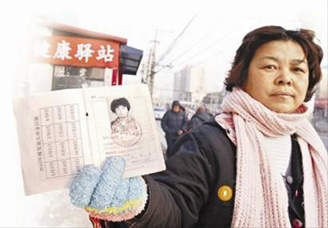
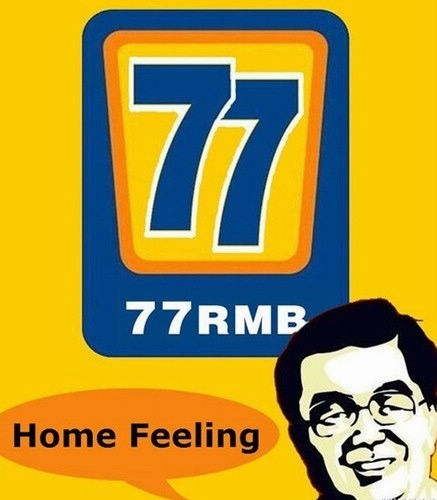

# 为什么看似理性的逻辑可以蕴含极端的危险

**当我们要求民众更具理性的时候，我们实际上正在要求一个群体作出完全一致的推断，因为除了极为基本的判断意外，所谓的理性思考仍然必须站在感性认识的基础上。假如我们考虑国家机器运行的难易，那么，这种“理性思考”就必然倾向于对民众的盲目性加以批评，而站在个体利益的角度，则“理性思考”必然倾向于对国家机器的批评。因此，所谓的“理性判断”本身就蕴含了一个价值批判，就是民众在没有足够的事实的情形下，不享有言论的自由。**

### 

### 

# 为什么看似理性的逻辑可以蕴含极端的危险

### 

## 文/路加（上海交通大学）

### 

### 

**一、关于民众的非理性是否应该被批评？** 当我们拨开“77元事件”的迷雾之后，我们总要回头看一看，这件事情究竟教会我们什么。 固然，那些认为网络的声音不够理性的说法本身是包含道理的，但问题却是，这种非理性行为究竟是应该以何种方式去引导呢？ 似乎看起来，民众的非理性明明是可以避免的，完全是由于他们的不小心，不愿意思考，甚至是“受人蛊惑”。但是，这种说法真的靠谱吗？或者说，依靠口头的呼吁真的有助于该问题的解决吗？ 许多人宁可相信这种方式是行之有效的，也不愿意相信真实的历史和经验，仿佛理性思考能够解决一切问题，而经验主义从未在自己的头脑中出现过一样。然而，残酷的事实却是，确实的经验甚至比所谓的理性更能说明问题：无数次的群体事件证明的不但是群众的盲目、易受蛊惑，而且证明了，这种非理性滋生的土壤是剥削、压迫、贫穷、欺骗和对自由的禁锢，越是在这些可怕的品质凸显的社会里，民众就越是容易被蛊惑、被煽动，但是，这种劣质的群体特点既不能通过有效的说理和不留情面的批评加以解决，而只能通过消除这些根源的问题以解决。 只要回顾一下历次事件不断积累，导致民众非理性怀疑一切的整个过程，一切就一目了然，“77元事件”本来就并非是个例，然而，它和社会背景却根本无法分割，盲目怀疑也无法和国家电视台首先的欺骗行为分割开，因为这本来便为一件事情，而不是我们认为割裂的“两回事情”，甚至，根本没有任何证据可以显示，这种非理性的猜疑，是受了别人的煽动，甚至这种行为更可能是群体的无序而自发的怀疑行为，它既无组织也无预谋，否则，这样的事情应当在短时间内脱离它本身而被指向某些目标。认为有人故意煽动的说法本身就是非理性的：它不是建立在确实的证据上，而是一个基于阴谋论的偏执推断。然而，国家电视台的行为却是证据确凿的欺骗，因为它企图为国家的治理者造成一种错误的民情，并且，“77元住户”越是真实存在，这种欺骗就越是真实，因为它出于某种难堪的原因，早就已经公开承认过中国保障住房面临的窘境，无论这种欺骗是自愿为之，或是受人指使，这种欺骗不似那个“受人煽动和蛊惑”，乃是证据确实的推断。 

 更恐怖的是，当我们要求民众更具理性的时候，我们实际上正在要求一个群体作出完全一致的推断，因为除了极为基本的判断意外，所谓的理性思考仍然必须站在感性认识的基础上。假如我们考虑国家机器运行的难易，那么，这种“理性思考”就必然倾向于对民众的盲目性加以批评，而站在个体利益的角度，则“理性思考”必然倾向于对国家机器的批评。因此，所谓的“理性判断”本身就蕴含了一个价值批判，就是民众在没有足够的事实的情形下，不享有言论的自由。然而，民众并非是国家机器，即使作为一个群体，它本身却没有强大的力量去掌握证据，然而，正是民众的猜疑，使得那些处于公共事件中的疑点能够得到更完整更详细的解答，正如我们在“77元事件”中所看到的。 

### 

**二、理性的言论是言论自由的必要前提吗？是判断群众言论是否值得道德批判的标准吗？是我们个人发表言论时自我约束的必要前提吗？** 我对前两个问题持否定的答案，对最后一个问题持肯定的答案。 首先，言论自由是不能以理性作为前提的，也不能以言论对错作为前提。因为言论自由的本质并不如某些人所述，是为了让言论自由竞争，驱恶扬善，实际上，导致的言论自由在多数国家并未造成似乎必然的大混乱的原因，并不是民众能够自我分辨善恶的言论，而是因为在多数情形下，人和人之间意见的不一致从一开始就已经否定了恶的言论产生实际恶果的可能性。因为同样的一句话，不同的人可能是怀着完全不同的目的表示赞同的，当它要转化为行为的时候，这种分歧立刻就显示出来，而真正的恶根本不需要通过言论自由才能成为行动。要求言论自由唯一的目的，就是限制任何人或者组织，因为听到和自己不同的，甚至可能冒犯自己引起不悦，甚至造成恐惧的言论，就对言论的发表者加以迫害，这建立在一个更大的前提下，就是即使是坏人，也不能够经由未经合适认可的程序，甚至不经过任何程序而受到惩罚。它不是为了保证正确的意见被听到，而是为了保证人和人在人格上是平等的（而不是依据带有颜色的道德标准而受到伤害）。谁最容易加害别人呢？永远都只会是那些占有大量资源，拥有高度的动员能力的团体，甚至是占有大量社会资源的个人。于是，这些人或者组织在言论自由之下，虽然有大量社会资源，却不占社会的多数，便被限制在一个笼子里。 至于民众的言论是否值得道德批判，本身就是一个伪命题。因为这种批评的对象根本就是子虚乌有。正如我刚才提及，民众的言论在相同的字句下本身就是带有各种不同的含义的，那么这种所谓的道德审判本身的对象究竟是什么？然而，这种命题在集体主义传统的国家特别容易被确信真实的一个重要原因是，我们总是以为，在一个集体中，人们的意见总是必须一致的，不但在整体上要一致，在细节上也要一致。 对于“77元事件”，无论是整体的一致，或者是细节的一致，实际上都不存在，因为每个人都有不同的批评角度，假如我们忽略了这个”可以被确认的事实“本身包含了多少谎言和令人不安的事实，我们就会发现，这种审判民众言论的行为看起来有多么可笑。堂吉诃德可以攻击一个想象中的风车，但他绝没有办法在自己的骑枪都遗失的情况下，和那壮丽的磨房大战三百回合。 

### 

### 

然而，正如前述某种行为或观点的偏执一般，如果有人主张个人的言论不应当自省的话，这种主张同样是如此的可笑。实际上，我们每一个人都有义务对自己的言论进行自省，我们也无法放弃理性思考这种强大的工具。因为如果没有这种工具，我们将有可能为言论自由付出巨大的代价：这正是我前文所述中始终隐含，却没有明示的，在极端的情形下，个人言论的不负责任，将会让我们为了自由付出巨大的代价，尽管这种情况的发生，往往需要种种巧合和条件。 在结尾的时候，我想回到”77元事件“上来，因为在这个事件中我们可以看到的实在太多：为什么，当国家电视台承认保障性住房的窘境的同时，又要不遗余力的去显示我们的保障性住房似乎没有出现问题？为什么一个明明是事实的事件，最后却会因为怀疑和猜忌而无法令人相信，以至于当事人，假如是一个极为传统的居民，甚至会感到难堪的拿出低保证来证明事情的真实性？问题的根源是什么？而我们究竟应该怎样着手解决这样的问题？我们是无视它？还是正视它？甚至，当我们企图还原事情真相的时候，我们确知的事实，是否真的就是真实的？我必须思考这样的问题。但同时，我们也必须避免唯理主义的陷阱：这个世界不但无法被割裂，还有很多问题，是我们只有用心去思考，才会思考到症结所在。
