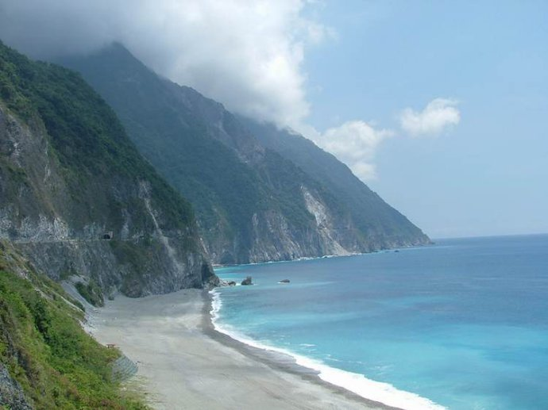
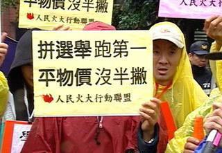

# 乱谈 In Taiwan

**前段时间发生了的大陆游览车在苏花公路因滑坡失踪的悲剧，然而这场悲剧却引发了一些对“认同感”突发奇想。因为网站上有文章指出，由于依据台湾现行的两岸关系条例，中国大陆地区人民和台湾地区人民，都属于中华民国人民，所以大陆在台湾的罹难者同样可以据此申请国家赔偿，只要最后认定这场悲剧是“人祸”。此时我恍然大悟原来我还是中华民国人民，呵呵。**

### 

### 

# 乱谈 In Taiwan

## 文 / 匿名（上海交通大学）

### 

### 

### 财富与心态

前几天和一同学去采购过冬的棉被，也许他是杀价的能手吧，随即就和卖家讨价还价起来。店员很快就知道我们是大陆过来的，原因是台湾人买东西很少杀价，而这个店员又在大陆待过，因此知道我们的“风俗”。 也是两天前的周六，清大隔壁的交大正在举办园游会，当我们在一个卖筷子饼（一种像筷子的饼干）的摊位前等人的时候，那个女生（卖者），跑上前来让我们品尝。于是我们各吃了一根，哪知道那个女生不断给我们一根又一根的饼干，让我们很不好意思。于是我同学掏出钱来买了两盒，每盒10块RMB，有大约12根这样的饼干。更奇怪的是，那个女生急忙解释说，给你们吃并不是让我们买。我们两人都快吃掉了一盒，买了两盒，同学感叹，这样做生意怎么赚钱。 其实在台湾，碰到这样类似的例子很多，有些老板的热情会让你有这样的感觉：他们疯了么？他们不要赚钱了？这样的感觉是在大陆不曾有的，买卖双方不应该是拼得你死我活么？ 

### 

### 收入与物价

也许以下的文字能解决上述问题。 上周五走在新竹的街头，看到一家小小的服装店在玻璃上打出招聘启事，标明月薪28000台币，约合人民币6000。而今天台湾雅虎网的一则新闻显示，大陆大学毕业生的平均月工资是12000台币，也就是说，不足服装店小工的一半。 那么物价呢？来台湾之前我曾以为台湾的物价会很贵，结果并不是这样。台湾贵的主要是手机话费和书籍，以及一切和知识产权相关的东西。商场里品牌较知名的衣服和大陆差不多价格，有些甚至便宜，而街边的店里蛮好的衣服也不贵。耐克匡威等鞋子也都比大陆便宜。生活用品方面，洗发水和洗面奶，一模一样的东西，比大陆便宜，虽然写着产地是中国。学校里吃饭，一餐的价格在10到15块RMB，这比在交大要贵，但品质却还不错，算是物有所值。而且新竹算是全台湾消费很高的地方，据说南部还要便宜。交通方面，客运到台北需一个小时，车费是100台币，人民币20块，相当合理。地铁按距离4到11RMB不等。出租车稍贵，起步价20RMB。至于学费，清大一个学生告诉我她的学费是一年35000台币，也就是人民币7000块，对于我们来说也完全可接受。最令我可气的是，在交大，破烂的洗衣机洗一次衣服都要3RMB，而在清大，洗衣机还能按衣物种类（如鲜艳衣物，细致衣物之分）有不同模式，而且一次2RMB，旁边的烘干机一次1RMB。也就是说，在上海交大用破烂的洗衣机洗衣服所花的钱，在台湾可以连洗带烘干。 以上差不多总结了在台湾的基本消费，不难发现台湾的基本生活费用中，许多都比大陆要低，而随便找一工作，收入是大陆的好几倍。所以在台湾生活的压力要比在大陆小很多，双休日许多店家都选择关门，因为他们不需要过于劳累地去赚那几个辛苦钱，休息对于他们来说更为重要。对于生活，他们根本不需要拼死拼活，完全可以放慢节奏享受，他们也有权利去热情去豁达。 

### 

### 公民意识与认同感

最近温总理多次高调提出要政治改革，且不去管领导们的事，就从公民意识上看，大陆的人们由于权利的受限，公民意识也极为淡薄。台湾的CPI若是涨了一点点，民众就开始叫苦连天，说政府还让不让我们活了。与此同时，当中国大陆物价大涨的时候，某网站新闻上还能登出标题是“专家指出中国CPI最高可以承受5%”这样的文章，相比之下是天壤之别。 

### 

### 

### 

前段时间发生了的大陆游览车在苏花公路因滑坡失踪的悲剧，然而这场悲剧却引发了一些对“认同感”突发奇想。因为网站上有文章指出，由于依据台湾现行的两岸关系条例，中国大陆地区人民和台湾地区人民，都属于中华民国人民，所以大陆在台湾的罹难者同样可以据此申请国家赔偿，只要最后认定这场悲剧是“人祸”。此时我恍然大悟原来我还是中华民国人民，呵呵，然后某论坛上出现了如下搞笑的评论： 

### 

以后大陆那边，因为路没铺好导致跌倒，也可以来跟我们要国赔了

外蒙古(蒙古共和国)的人来旅游发生意外也可以国赔吗???

既然认定台湾是中国的一省要申请国赔去跟中共要吧（很可爱的评论）

到现在才把台湾当成国家了是吧，等到钱拿到立刻翻脸不认人了

中国省来了????????

敢问中国政府有赔偿台湾毒奶粉的损失吗？

=V= 原来中华民国有十三亿人不用缴税!

搞不好下次给他钱要他诅咒毛泽东也愿意XD（这个更可爱）

### 

再回头看我们这边，自幼接受的宣传和教育让我们坚定不移地认同“台湾是我们的”这一概念，并且对一切有台DU倾向的言论和人物一概仇视。在台湾有一个词叫“同理心”，等同于“换位思考”。其实当我们站在对方的角度去认真思考，许多不能接受的观点其实是可以接受的。由于台湾一直没被解放，所以台湾人也不曾向我们的政府缴过税。而我们成功进入联合国后，中华民国被迫退出，这一事件宣告世界只承认一个中国，那么台湾又算什么？所以罗大佑曾用一首《亚细亚孤儿》描摹台湾的国际处境。孤儿，听着很凄惨吧，他们应该认同谁呢？的确很疑惑，也很令人深思。

### 

（编辑：陈轩）

### 

### 
