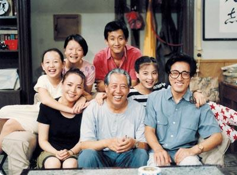
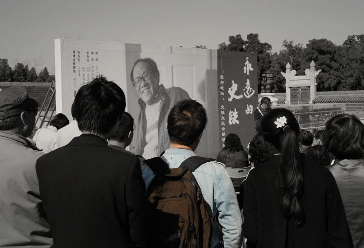

# 从司马南说开去

**相比于科学，很多人都不太清楚经济学政治学社会学也都是发展了几百上前年的科学，虽不比生物物理化学等理学学科申奥难懂，但即便是最简单的原理，也是需要颇费头脑和时间来弄懂的。但可能是相比于纯理学科的尖端，经济政治社会等学科太贴近于人们的生活，甚至已经成了每个人基本的权利，所以似乎太多人都有权也都能在这些领域发表发表意见。** ibeidou.org ibeidou.org

# 从司马南说开去

ibeidou.org

## 文 / 马军（厦门大学）

ibeidou.org ibeidou.org 真是不知道司马南为何说这么几句话，搞得自己晚节不保，被众网友们唾骂。 小的还是非常羡慕司马南的，当初气功横行，邻居街坊就有不少人放弃了秧歌改练气功。可能因为小时候长的可爱招人喜欢，不少长辈纷纷表示愿意免费给我度气发功，烦的不行。当初司马大师从天而降，一举击溃了这些伪科学，顺势成为专家大师，不仅出没于各大电视台，而且还在当时火的一塌糊涂的情景喜剧《我爱我家》里成功破除了伪科学。若不是05年的时候石原慎太郎怂了，司马南还将成为秘密武器参加举世瞩目的中日大辩论。好像武侠小说中不少大师都有个欧阳令狐什么的复姓（当然，偶像剧里也有复姓如端木上官的），再加上司马南滔滔不绝的口才和仙风道骨的风格，着实很难让人不崇拜。  ibeidou.org

ibeidou.org 但是现在来看，原来仙风道骨到了极致，便是道貌岸然了。 可能是现在专家太多了，搏出位越来越难了。先是有“吃什么都不如吃绿豆”的专家，后来又有了“八刀是因为弹钢琴”的专家，据说现在还有“不宜空腹吃早餐”的专家。当专家纷纷变成砖家，大有长江后浪推前浪，一代新人换旧人的趋势的时候，老专家司马南开始坐不住了。当初反伪科学的阵营里已经有了海归博士方舟子，自己那点儿东西十年前该说的已经说完了，正好最近民主之风吹得甚紧，司马南脱下科学外衣，传上了民主的斗篷。现是出版《民主胡同》，后又网上批判艾未未，现在又听说要全国巡开民主讲座。感觉像是收起罗盘司南，不再看手相面，开始电脑算命。 我本身就是个教师，尊重知识，更是尊重在自己领域有一定造诣的专家，也反感对自己听不懂的东西一贯批判嘲讽的现象。但是现在专家成了砖家，除了民众不懂之外，专家们太喜欢“跨界”演讲，也是很大的一个原因。两弹一星头号元勋物理泰斗钱学森，就是因为一篇论述光合作用的生物文章直接推动了“大跃进”时期“放卫星”现象的出现，成为了因为“跨界”造成中国科学界的最大乌龙。现在中国人学了几十年的数理化，相信清水变油的人越来越少，再加上方舟子松鼠会等反伪科学的个人和团体的努力，伪科学越来越少。所以骗子们纷纷转投养生界、经济学界和政治社会学界开始忽悠敛财。这时候，就需要另一批真正的学者专家开始辟谣和澄清。司马南就是这么跳进来的，只可惜姿势不是很正确，脸先着地了。 之前就有过不少的感慨，相比于科学，很多人都不太清楚经济学政治学社会学也都是发展了几百上前年的科学，虽不比生物物理化学等理学学科申奥难懂，但即便是最简单的原理，也是需要颇费头脑和时间来弄懂的。但可能是相比于纯理学科的尖端，经济政治社会等学科太贴近于人们的生活，甚至已经成了每个人基本的权利，所以似乎太多人都有权也都能在这些领域发表发表意见。这当然是每个人的权利，但是烦请司马大师这样的专家自重一点，多看看这方面的书，要是因为无知，不小心被我们尴尬的认成了无耻，都随不起那么仙风道骨的复姓。 ibeidou.org

ibeidou.org 对了，司马大师的姓改的的确比本名霸气多了。当然，当初不如一步到位，直接改成司马懿，下雨阴天的时候还能在户外拿张黑桃五转转，要是能招下闪电来，还能间接证明富兰克林当初是对的。 ibeidou.org ibeidou.org

（采编：陈轩 责编：陈轩）

ibeidou.org ibeidou.org
