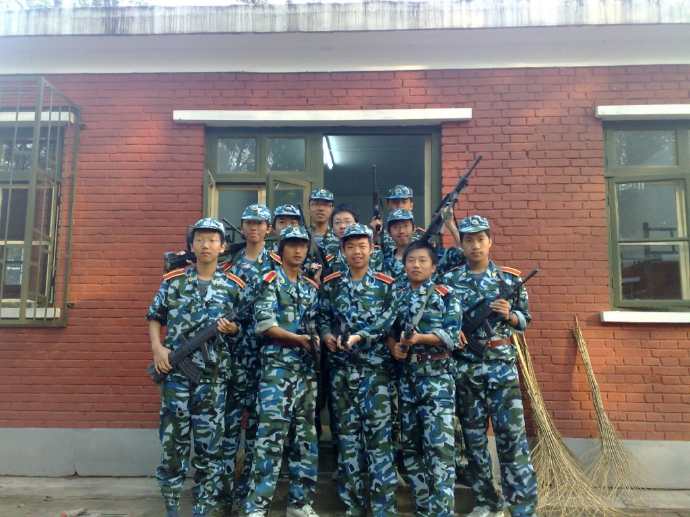
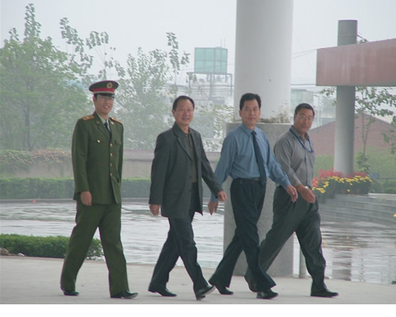
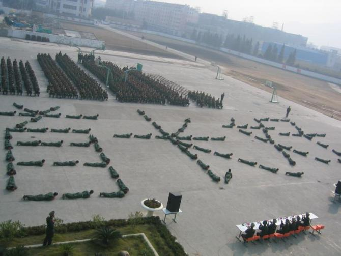

# 关于军训中的“热烈欢迎各位领导”风波

**“当极具说服力的新观念出现时，信仰开始动摇，旧有的教育哲学不再令人满意，司法系统手忙脚乱地填补层出不穷的新漏洞。军训本身的意义一次遭受质疑，它不能老是依靠拿不到毕业文凭的威胁继续下去。”**

# 关于军训中的“热烈欢迎各位领导”风波

## 文 / 刘漪文（北京大学）

 军训的倒数第二天，突然有朋友发短信给我：“听说你们那边发生学生骚动，没事儿吧？” 当时的反应是摸不着头脑：大家都是乖乖地训练了一天，没出什么问题呀。后来才从别人口中得知，是我们9连10连被命令加班加点在太阳下排练拼出“热烈欢迎各位领导”的字样，惹怒了其他连的同学，甚至发出了“拯救9连10连”的呼吁。 都说北大的军训是北大的自由精神与军人的绝对服从的正面冲突。但是作为一个要在中国长期生活的积极向上的青年，还是要拿大学文凭的，还是要乖乖通过军训的。于是，这成了理想与现实的一次对决，而这场对决对骄傲的我们而言是一场残忍的教训。 冲击在军训最开始并不明显。有人说这时候的军训动力其实是一种价值转移。确实，当命令仅限于踢好正步整理好内务之类未触及原则的命令时，大家都是抱着角色扮演的心态：“既然穿着一身军装，来到军营，姑且就当一回惟命是从的军人吧。”把被子叠成豆腐块儿，得分；学会防身术，得分；在大太阳下一动不动站30分钟，得分。再加上几个连之间建立的竞争关系，推动了各连内部的团结与互相监督。服从命令成为了一种游戏，于是大家都相安无事度过了军训前半段时光。 但是当时间慢慢推移，我们连队接到了在结业典礼上拼字的任务。“拼字”就是把每个人当做一个小点来使用，数百个点就汇成了几个字，以供领导欣赏。这本身就是把人物化的过程。更让人难以接受的是，拼出的还是“热烈欢迎各位领导”这样谄媚的字眼。这时候已经成为一种人格的侮辱了。 但是为什么我们还会顺从地唱着歌，迈着整齐的步伐，走到各自的位子，摆出“热烈欢迎各位领导”的字眼呢？有的人说，是为了不拖大家后腿，毕竟若反抗，整个连都会受罚。也有的人说，毕竟军训就该服从命令，不管这命令是什么。还有的人说，组织这场表演的九连长也是迫不得已，如果我们不好好做，他就会受罚。总而言之，在惩罚的威胁下，服从比反抗更加理智，于是大家选择了服从。 但是这服从背后还是有反抗。当我们最后表演的时候，身后的其他连的同学都发出了嘘声。我们在排练完之后也曾yy过拼个“热烈欢迎各位傻逼”来。但大家没有正面抗议过，这让我们觉得自己更加窝囊。 

 为什么会存在让我们变得这么窝囊的军训呢？ 最最官方的说法，自然是培养爱国主义精神。但是军训的时候，我经常在无人的板凳上看到GRE红宝书，在校内上看到敏感的状态。在个人流动能力迅速增强的今天，我们的生存对国家的依赖已经不那么明显，“国家”在我们心中就像一个旅馆，择优而栖，地位不再像在上一辈心中这么神圣。国家的光环成了为了维系权力而构建的谎言。军训之后，各种反抗情绪反而日益高涨。大家把军训的辛苦都归咎到权力，归咎到领导身上。 但这事情明显是演员不高兴，观众不乐意。人家领导天天忙着参加各种会议会见各界人士，还要百忙之中抽空来看你们这些业余群众演员拼字，换谁都不开心呀。 当然也有人说，军训磨练了个人的意志，确实如此，但是若只凭这一点来证明军训的合理性，那么体罚也可以因为磨练个人的抗击打能力而受到提倡。 也可以这么说，军训让我们认识了很多好朋友。这个我举双手赞成，在精神上对抗领导，行动上服从领导的统一战线上，我和好多姐妹都成了共患难的战友。 想起一部电影《Cube》来，片中的人物被关在一个布满机关的大魔方里。被困的人中包括一个设计了这个魔方的外壳的建筑师。原来是某些领导下了建造魔方的命令后，步骤被一一分解传递到下层，而正当下层花费数十年辛勤打造这个魔方时，下命令的领导层已经消失了，建造魔方的意义无人知晓，只剩下下层，面对这样一个庞然大物不知所措，惶恐地猜测这个魔方的用途。 

 现在摆在我们眼前的是一个叫做“军训”的巨大魔方。当然，还有其他魔方，比如说“马原课”，比如说“毛邓三”。当然，还有更大的魔方，比如说“军队”，比如说“国家”。 当极具说服力的新观念出现时，信仰开始动摇，旧有的教育哲学不再令人满意，司法系统手忙脚乱地填补层出不穷的新漏洞。军训本身的意义一次遭受质疑，它不能老是依靠拿不到毕业文凭的威胁继续下去。
