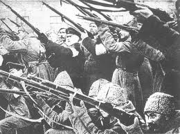
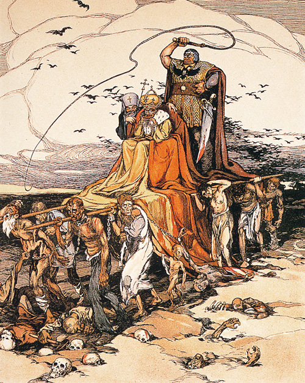
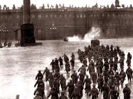

# 写给帝国的悼词

**“事实上，庶民们并不是贪婪嗜血的魔鬼，他们早就用散步抗议道他们也是人也需要尊严和饭碗，倘若统治者们善待人们的呼声推动改良，那么他们断没有人头落地的那天，可是，迎接散步的人们的是子弹和马刀，那么就怨不得其后忍无可忍的庶民们拿起屠刀挥向他们的子孙，因为是你们先用子弹刺刀屠杀了他们的父亲兄弟。”**

# 

# 写给帝国的悼词

## 文/刘宇翔（上海财经大学）

1896年5月14日，俄罗斯帝国首都莫斯科，满城彩旗招展热闹非凡，官宦权贵云集。这一天是尼古拉二世举行盛大加冕仪式的日子。这场世纪庆典用了14个月的筹备时间，费用高达1.1亿卢布，出席盛典的各国皇室成员和政府代表等贵宾超过7000名。高贵的沙皇似乎希望用它来彰显罗曼诺夫王朝的显赫与沙皇帝国的大国崛起。然而，拥挤不堪的广场上发生了一场意想不到的踩踏事件，1389人的罹难鲜血撒满广场给庆典蒙上了阴影。然而，沙皇陛下似乎对窗外的哭嚎声不以为然，幅圆辽阔的帝国上亿子民，区区一千人的死亡并不算什么，以至于这个酷爱写日记的皇帝在当天的日记里对此事只是一笔带过，放佛此事不过如丰盛的餐桌上不经意间打碎了一个盘子一般，仅此而已。 当时，清廷重臣李鸿章大人也参加了庆典，当他听说俄国的官员已经向沙皇禀告了此事时，他惊讶地说道：“如此事情怎么能让皇帝知道担忧呢，我掌管直隶期间发生过瘟疫死了几十万人也没向我们的皇帝报告免得打扰了他，我们做臣子的难道不应该让皇帝尽量担忧吗？“（大意如此）似乎，在中堂大人眼里，这一千多个冤魂的价值还不如沙皇日记里轻轻的一笔更重要。 所以，15年后，步履蹒跚的清帝国早于沙皇帝国垮台就是情理之中的事情了，因为，沙皇好歹还知道灾难，而清帝国忠诚的臣子们断然不会让自己的皇帝知道帝国大大小小的灾难。 红色帝国垮台后，迷茫的俄国人似乎急于洗刷红色记忆而寻找逝去的美好开始缅怀那位末代皇帝重塑帝国记忆和激励大国旧梦重燃。在人们重构的记忆中，尼古拉二世似乎是一位好父亲不算太坏的皇帝虔诚的教徒，而他一家的被枪杀更是很有悲壮的殉道者的玫瑰色彩，他面对枪口时的从容仿佛就是俄罗斯民族优雅不屈的贵族风范。和任何事物一样，没了危险性，那么，人们自然欣赏它的强悍与高贵，哪怕歌颂他的人里可能就有广场上一千多人里的后裔或者沙皇下令枪杀的散步民众中的后代。 人们总是把廉价的泪水留给了显赫的受难者而忘掉了没有名字的受害者。 然而，那1389的亡灵和1905年1月9日被屠杀的一千多亡灵也不会忘记这位俄国人民的父亲冷漠嗜血的一面。是的，相比较其他沙皇，尼古拉二世算不上特别残暴和冷血，他统治下的俄国也不算是最黑暗的，他还重用过斯托雷平和维特伯爵等大臣搞过改革，经济还一度高速增长，他还解放农奴还试图理清土地改革虽然不怎么成功但好歹行动过。后世安全地坐在咖啡馆闲谈的人们大可以认为他是一个好人，只是能力不行，运气不好，他所做的一切都是为了国家，只可惜不小心让万恶的列宁们钻了空子。 这和后人缅怀法国国王路易十六的说辞差不多。那个有尊严地死在断头台上的国王以及其后嗜血残暴的革命，都形成了鲜明的对比。人们记住了皇帝国王们的悲剧，记住了革命的鲜血，唯独忘了在此之前漫长专制统治下人们流尽的鲜血与眼泪。 

 某种程度上说，尼古拉二世和路易十六都是在还债，替他们的父辈祖辈们还债。相比他们的祖先，他们是不算太残忍，就拿路易十六来说，他统治下已经很少再签发空白札令将人不经审判就投入监狱，巴士底狱也没几个囚犯，农民的日子也过得比他祖父那时的好多了，可为什么人头落地的不是他们的父亲而是好人的他们？ 痛陈革命残暴的人们大概也去过路易十四十五时期关押囚犯的黑牢地窖也大概没有体会过父亲兄弟被征发去打一场皇帝们的战争而死于他乡尸骨无存的悲痛，也没体会过帝国无能统治下的辛酸。在皇帝国王的父皇们的统治下，法国和俄国的平民们为皇帝们的大国崛起迷梦赔进了鲜血与财富，以血汗和尸骨堆砌了大国崛起，皇帝们享受了鲜花与掌声，而把仇恨的种子深深地种进了人们的心里。那怨恨总有一天生根发芽长成嗜血的参天大树制造出残暴的断头台，不能砍下他们的脑袋就会砍下他们子孙的脑袋。 血债血还父债子还，这，是命运女神给予世人不可抗拒的血仇定数。它虽然血腥，但你还是无法安抚那些衣衫滥缕的贫民忘掉血债伏下身子继续做牛做马，试图以更多的鲜血与汗水感化骑在他们头上的老爷们，良心发现，推动改良减轻压在他们头上的重负。 事实上，庶民们并不是贪婪嗜血的魔鬼，他们早就用散步抗议道他们也是人也需要尊严和饭碗，倘若统治者们善待人们的呼声推动改良，那么他们断没有人头落地的那天，可是，迎接散步的人们的是子弹和马刀，那么就怨不得其后忍无可忍的庶民们拿起屠刀挥向他们的子孙，因为是你们先用子弹刺刀屠杀了他们的父亲兄弟。 以其指责革命庶民们的愚昧嗜血不如指责是谁让他们变得如此愚昧嗜血。帝国残暴统治下把人变成如此，那么他们必然以同样的方式对付帝国的老爷们。 

 沙皇陛下是个好人，但如果好人就能当皇帝，那么全俄国起码有上万人比他更善良，可治国需要贤良的人更需要好的管理。终其一生，好人尼古拉二世和路易十六有效地约束过他们的臣子不为非作歹了吗？我永远无法忘记《双城记》里一段故事－侯爵大人的马车飞驰而过撞死了一个庶民孩子，他的车夫似乎不以为然地想继续赶路，而被愤怒的庶民们包围车子动不了，群情激愤下，侯爵老爷不耐烦地丢下几个金币声称死者家属拿钱滚蛋不要阻碍他赶路。最后，庶民们屈服了，老爷的马车扬长而去，而目送马车远去的庶民们怨恨喷火的眼神，这股揪心的怨恨化成了刺杀侯爵的匕首也化成了要侯爵家族断子绝孙的断头台。 那些今天耀武扬威的统治者，请回头看看你们身后那些怨恨的眼神吧！庶民们迫于你们的子弹和刺刀不得不臣服于你们，但不代表他们颤抖的磕头下不是怨恨残忍的眼神，假以时日，你们或你们的后代必将为你们今天狂妄的推土机子弹网络长城付出代价。 而这，是任何帝国的老爷们逃不掉的宿命。
