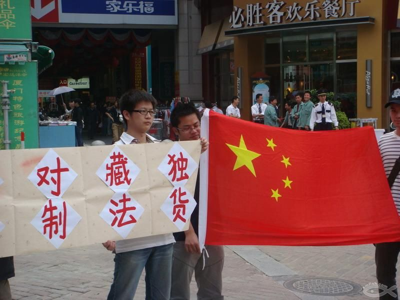
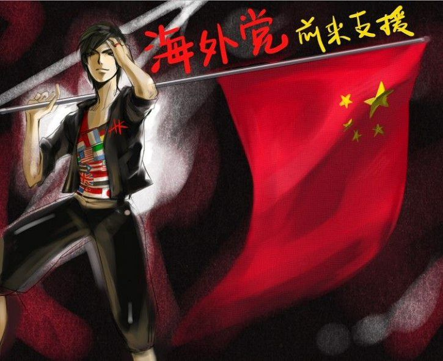
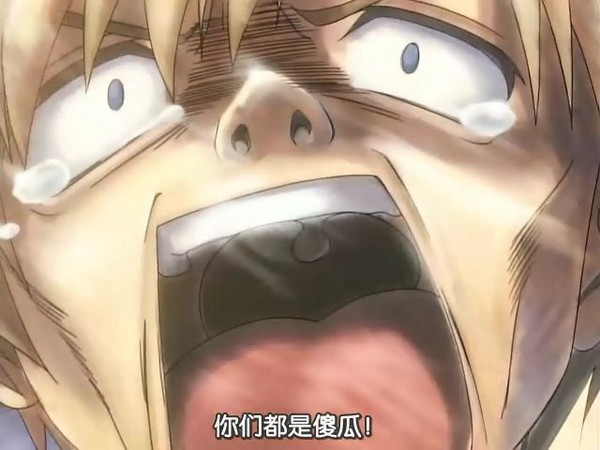

# 别把“愤青”当时尚

**韩国犯贱了，不顶不是中国人，日本野心又来了，不顶不是中国人，法国佬要见我们中国唯一诺尔贝奖得主了，不顶不是中国人，美国要给我们亲妈卖武器了，不顶不是中国人……顶顶顶，一直顶着就不怕早泄吗。** ** ** ** **

# 别把“愤青”当时尚

## 文 / 王光裕（东华大学）

 早上边吃着早饭边上着校内，然后就看到一篇分享的文章，标题大致叫做：“韩寒《我的祖国》——一篇国内被禁国外很火的文章”，有点窝火，就发了个状态： 用“一篇国内被禁国外很火的文章”这类标题的貌似右右与“是中国人就分享”的爱国傻愤有何区别？有的人以政治为兴趣为谈资这本质上跟男默女泪党是一回事。 看到好些回复，觉得或许没表达清楚，所以又想说几句…… 如今我们生活的这个世界，我们生活的这个周遭，时尚是件奢侈的事，买了个多贵的包，理了个多贵的头，泡了个多贵的妞，这些，大致都是人们口中的时尚，成人们的时尚。 稍微年纪轻点的，比如大学生，昨天去了他的演唱会，今天逛了新开张的品牌专卖店，tomorrow偶要去friends的party啦，这些，好时尚喔。 他们不关心这世界有一种充满了dictator的国家，他们不关心这个国家有一种充满了罪恶的机器，他们想知道这个星期的星座运势，他们想知道这一季的流行色，他们想知道现在哪款手机最炫，哪种包包最靓，哪个明星又有了哪个小三。 常上校内的大概都会发现，那些被阅读最多、分享最多、评论最多的文章，其实，真的都很蛋疼。于是有人总结了所谓的校内八大俗，“生活常识化妆技，十二星座小秘密；不看后悔成功录，论文大全雅思题。恋爱金句传送门，男默女泪蛋疼文；读到哪句心痛了？不顶不是中国人。” 一开始最让我反感的，就是那句“不顶不是中国人”，总想愤愤地说上一句，我还就不想做中国人了怎么样！我们的穿有没有自由保障？不许内涵文化衫；我们的吃有没有健康保障？百毒中国真营养；我们的住有没有安全保障？地震不塌也被拆；我们的行有没有安全保障？宝马车下血泪行。给我一个死心塌地要做中国人的理由吧！please~ 韩国犯贱了，不顶不是中国人，日本野心又来了，不顶不是中国人，法国佬要见我们中国唯一诺尔贝奖得主了，不顶不是中国人，美国要给我们亲妈卖武器了，不顶不是中国人……顶顶顶，一直顶着就不怕早泄吗。 

 那个时候，我觉得这帮人太不可理喻了，被机器当狗使而不自知，民族情绪的激化向来是转移内压的最有效途径，培养孩子强烈的爱国热情是最卑鄙的维稳手段。 后来，我释然了。还真是早泄之辈。 感谢所谓的69圣战。 圣战开始的时候，我强烈地反感，你们在反什么？你们的目的是什么？“脑残不死圣战不休”？为什么你们要反脑残？为什么国家那么多大事可以圣战一下而你们无动于衷比如当时因调查某年的那次8级土地震动是不是因为房子系豆腐衍生物所造的谭叔叔二审维持5年宅男生涯？ 然后，圣战high了那么一天，后来呢？噢，看世界杯的看世界杯去了，关心星座走势的关心走势去了，找鸡养鸭的也都忙活自己的生活去了，总之，哗，一场喧闹就这么结束了。谁还关心69圣战呢？都关心69式去了吧。谁改变了？nobody。擦，还是个传唱大街小巷的韩国组合的歌。 

 其实，对于圣战，本没有什么好反感的，爱祖国有什么不好，我只是受不了为什么那么多人平时都不知道国为何物，怎么此刻忽然爱起国来了？国都要感动了，帝又要流泪了。不过话说回来，身边有些人，本就很关心，此刻真正地实践下爱国，那也倒无妨，虽然我觉得凑在这群人中只会为虎作伥。 后来，想通了。其实只要告诉大家，最近最火的事情是B，B可是相当的时尚啊，大家都在做B，如果你不做B，你就会因为B被时代淘汰，你就是个缺少B的非主流。 是不是有人想说你太鄙视群众的智慧啦，群众的眼睛可是雪亮的噢。好吧，如果真是这样，中国现在会姓共？多少年过去了，当年那个文化什么大什么革什么命不是这样吗？如今圣战不是这样吗？甚至最近人人都去看《盗梦空间》不也是一样吗？明明那么多人没看懂（有些人真看懂的忽略此段后半部），却都装的很懂的样子，然后在豆瓣上打上一个五颗星、在校内或开心上发表一个状态一表对该片的崇敬，顺便表达下，嗯，我看过了噢，你看过了吗，我看懂了噢，你看懂了吗，最后再很骄傲地推荐一下：这是部好片子噢。于是就觉得自己好像能跟韩寒老罗并肩了，因为他们也推荐了。 又过了段时间，在一些事情之后，我开始审视校内上的这个所谓草泥马圈子，我发现了同样的问题，有些人在那里告诉别人爱国家与爱朝廷是两件事但自己也混乱不堪，告诉别人无视真相的同时自己也有意筛选信息，告诉别人民主自由的时候自己流露出的也是对异见的不包容…… 而常常一现的所谓出自韩寒之笔的文章，所谓国内被禁国外很火的文章，虽然内容大都还是尚可的，对得起“韩寒”对得起“被禁”，但这实在是一件很蛋疼的事。进而发现，其实发表这类文章的楼主，同时发表的文章必然包括校内八大俗。 说到这里又想提及校内几个很火的人，比如周旭昆，为什么此人会火，不过是把傻逼当时尚罢了。而对于校内遍布的伪娘、无间我也毫无兴趣毫无好感。 渐渐地我明白了，原来在很多时候，愤青无关觉醒，无关爱国，无关左右，只是种时尚。仅此而已。 

