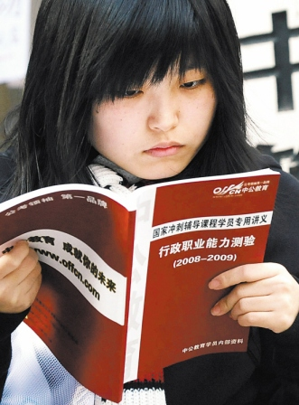
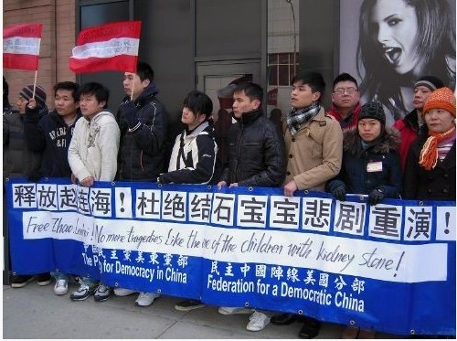

# 劝君慎谈“自由平等”

**你突然发现，在一个举国侈谈“自由”、“平等”的国度，一个举国叱骂当权者的国度，一个举国叫嚣“李刚去死”的国度，却也是一个举国挤破脑袋考公务员，举国盼望嫁给富二代、官二代的国度，全中国人民一边呼唤“自由”、“平等”，一边竭尽全力为自己不自由，不平等而努力。事不关己时，自然可以骂一骂，等事关己利，骂变显得迂腐，而“用”则显得实在。中国人的实用主义可谓登峰造极。**

# 劝君慎谈“自由平等”

# 

## 文 / 张亮（北京大学）

 ** ** 有人问我，如果可能，是愿意做一个家学渊深的史官，在皇家图书馆中皓首穷经，以毕生之力，成一家之言，还是做一个唐朝时候的诗人，即便是“岛寒郊瘦”，写诗像贾岛这么寒酸，孟郊这么瘦骨嶙峋（他们做诗跟做人比较相似），也要在竹林之间对诗，在曲水流觞之间饮酒，不改其乐。但是我统统摇摇头，我明白，当今中国，此种做法都会被耻笑，被认为不务正业，没有“用”。 我刚到北京时候，来见一个十年没见的高中同学，她说的第一句话就是：“来什么北京啊，成都多好，北京的日子不是人过的。”第二句话则是：“既来之，则安之。你学什么啊，历史？学了有啥用啊，能买到房子吗，能娶的起老婆吗？”言下之意，我是投错了胎，压错了宝，成了没有用的人。 我开始在网上写东西时，也有很多朋友表示赞同，甚至以为王国维先生关于文化“无用之用”的表率堂堂正正，有益于世道人心。但是见面之后，往往委婉曲折的告诉我，我这样不求功利的在网上发表，还不如抓住机会炒作一下，或者写些动漫的剧本，据说一个动漫的剧本，半个月功夫，就可以赚好几万，比我辛苦的码字写小说，真是天壤之别。 我自然不能用王国维先生“无用之用”的说法来搪塞。因为连王国维先生及其代表的国学也已经变成“无用”的代表。中国人的特点是，事不关己时，可以为高贵者肃然起敬，甚至掉几滴“同情”之泪。一旦事关己利，便仿佛“君子国”里两面一心的“君子”，唱起不同的论调来。正如我父亲每常教育我，娶老婆绝对不能找农村的，我便反面嘲笑他，你自己当初不也是凤凰男，却也干起了“过河拆桥”的事情？我父亲通常的咆哮是：“你这整个就是一乌托邦，有什么用！”全然不顾从前教育我要“独立”或者“自由”。 

 于是，你突然发现，在一个举国侈谈“自由”、“平等”的国度，一个举国叱骂当权者的国度，一个举国叫嚣“李刚去死”的国度，却也是一个举国挤破脑袋考公务员，举国盼望嫁给富二代、官二代的国度，全中国人民一边呼唤“自由”、“平等”，一边竭尽全力为自己不自由，不平等而努力。事不关己时，自然可以骂一骂，等事关己利，骂变显得迂腐，而“用”则显得实在。中国人的实用主义可谓登峰造极。 这种情况下，你自然不能侈谈什么自由，或者独立，假如你们所崇拜的“自由”或者“平等”只是几套房子，几辆车子，几个准备用身体换车子换房子的小妞，一切都是空谈。假如你认为这种自由、平等的生活就是你们所要的，那么法国大革命里无数参加街垒战斗而送命的人是无用的，一辈子穷困潦倒，靠贵妇人包养才得以继续学术生命的卢梭是可耻的，标榜特立独行，裤衩背心儿在西装革履，义正词严的作协作家们中间穿行的王小波是荒谬的，更不用提在瓦尔登湖边劈柴、盖屋、写作的美国人梭罗，堂堂哈佛大学毕业生，一辈子颠沛流离，生前寂寞，住在自己盖的小木屋里，老婆都没有，是十足的迂腐。但是如果我告诉你，这些人物的言行，大都是“自由”的象征，假如这种没有房子没有车子没有票子没有码字的自由摆在中国人面前，中国人还能感激涕零，山呼万岁，我想，不用我们去呐喊谁谁谁给我们自由，我们已经自由了大半吧。 有一个现象是，外地来京的孩子比北京的孩子浮躁。外地来北大的孩子比来其他学校的孩子浮躁，他们觉得自己最应该在短期内解决房子问题。同样是北京人，我在城中村的房东就天天算计多压榨我一点房租，却又有家境优郁者，能够真正抛弃家庭的歧见，想过一种自己想要的文学和艺术，然而相对清贫的生活。中国知识分子往往把过多的希望寄托寄托在草根身上，甚至纷纷以“反智的书生”自居，以为“唤醒”或者“启蒙”底层人民的“自由”的向往，便可达致自由。殊不知，法国大革命到而今，卢梭们所唤起的只是拜金主义和物质主义，外加一张自由主义的皮。从前，有个叫王小波的作家，一边写黄色小说，嘲笑这个国家的体制，一边大力辩解“我从不搞破鞋”，他的不安分的老婆则一语道破：“人民有低俗的权利”，暴露了其实“我们不属于人民”的某种精英心态。以草根的姿态反对精英的精英，却忘记了，贫穷往往并不意味着高尚，反而意味着更加强大的市侩，登峰造极的实用。 

 我自然想到春秋时期大富翁陶朱公的典故，他的二儿子犯了罪要杀头，他三儿子带了大笔的钱去行贿打通关节，大儿子死活不同意，说爸，我身为老大，为老二救命这种事儿，你却让老三去做，是瞧不起我，我没脸活下去了。就要自尽。陶朱公没办法，只有让老大带了钱去。老大小时候在困难环境中长大，非常节俭，一块钱能掰成两块来用，这次上下打点，他把老爸带的金银珠宝剩下一大半，欢天喜地回去报告：“爸，我光荣完成任务，行贿完毕，而且还剩下大半钱。”陶朱公一听，大哭起来，说我老二完了。老大自然惊问其故，陶朱公道，本来，我之所以让老三去，不让你去，因为老三从小是纨绔子弟，大手大脚，不懂得爱惜钱，而你从小穷怕了，千方百计要抠门儿，关键时刻，自然不能物尽其力，这就是天意啊。果然，不多久，传来了陶朱公二儿子被杀的消息。 陶朱公的大儿子虽然艰苦朴素，却往往在关键时刻把钱看的太重，三儿子虽然养尊处优，却能轻财好施。假设有良好的教育，培养高贵的德行，必然是比守财奴的大儿子能成大器。 因此，也就可以理解，为什么我把更多的希望，寄托在受过教育的富二代、富三代身上。面对魏玛大公爵时，歌德脱帽致敬，贝多芬昂首挺胸，盛气凌人，甚至指责歌德谄媚权贵。但是真正理解歌德和贝多芬的，不可能是车间里的工人，田地里的农民，恰恰是那些优游卒岁的贵族。你总不能要求产生芙蓉姐姐和凤姐的大众网络，也产生莎士比亚和陀思妥耶夫斯基吧。 

 卢梭说，人生而自由，而无往不在枷锁中，假设要追求真正的自由，应该拥有打破枷锁的勇气和力量吧。
