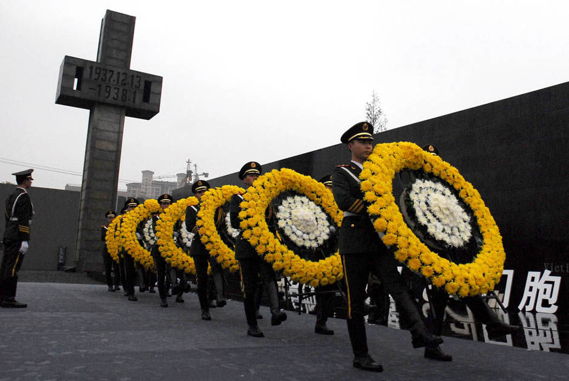
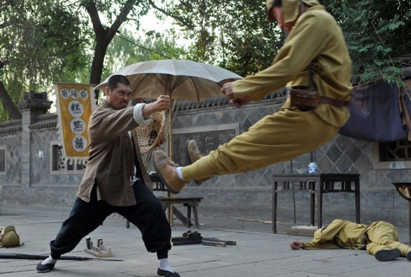
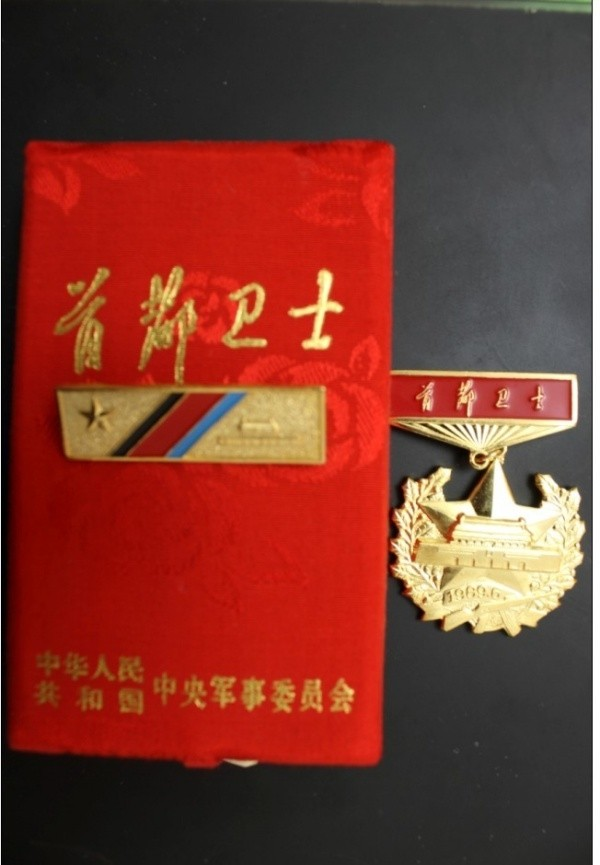

# 南京大屠杀VS扬州十日

**对于满族和蒙古族的后裔，我们的政策一向是亲之，爱之。而对于日本，则是有深仇大恨般，无不目眦俱裂。我们的基因也打上了仇日的烙印，论痛苦，满清给当时汉民族与日本相比自不遑多让，可是为什么会有这么大的区别呢？ **

### 

### 

# 南京大屠杀VS扬州十日

### 

## 文 / joachimbene（上海海事大学）

### 

### 

屠城杀降这档子事，我们的老祖宗可是行家。远至秦汉时，白起坑杀赵卒四十万于长平，项羽杀降卒二十万于新安。近至元朝，马蹄所到之处伴随着总是头颅滚滚。满清则是制造了扬州十日，八十万的孤魂从此告别人间。可是提起大屠杀，我们满脑子想起的似乎只有南京大屠杀，对于以前的记忆，反而是充耳不闻，要么就讳忌莫深。 

### 

### 

### 

这一点在我们的态度上可以看得出来，对于满族和蒙古族的后裔，我们的政策一向是亲之，爱之。而对于日本，则是有深仇大恨般，无不目眦俱裂。我们的基因也打上了仇日的烙印，论痛苦，满清给当时汉民族与日本相比自不遑多让，可是为什么会有这么大的区别呢？ 就近的历史给人留下的印象。我们所关注的历史，只是我们当代的历史，或者说是一种发生在当下的历史。对于现在，或多或少我们有着一些微薄的记忆。毕竟有一些留下的战争画面和些许的纪录片可以给我们留下更直观的历史。但是对于遥远的古代，那痛楚只是隔靴搔痒，对于我们没有一丝感觉。一位44年出生，算到现在也是我们的爷爷奶奶辈了，他们的父母就经历了日本侵略中华这段历史（如果他们的父母遭遇日军欺凌，这种仇恨感就更加强烈）。我们对历史的感知，也许可能一部分来源于我们的爷爷奶奶传承于他们父母辈的记忆。但是我们又从哪里去追溯那段满清扬州十日那段悲壮的历史？除了文献上的些许资料外，留给我们的还有什么，我们还可以看什么？更何况乾隆皇帝在收集四库全书的时候，已经把这些不利于他们统治的资料扔进了秦始皇的大坑里。我们现在所能看到的《扬州十日记》，更是取道于日本，如果不是流传于国外，我们也许直到现在也是一无所知。历史的数字总是冰冷的记忆，而那些还温着的血总是刺痛我们的神经。冷却了，难道就再也不用再提？时间是把流水箭，清朝把所有人都带上了小辫，一切人便披上了顺民的外衣。 大范围的影视宣传。放眼望去，充斥我们现在荧屏的很大一部分都是被抗日题材的连续剧所包围着。而这些抗日题材的剧集中，又以坏得让人恶心的日本人为主要描述对象，而稍微有点良心的日本人则是被那些很坏的日本人所杀害。我并不否认这就是历史，作为军国主义的一个重要特点就是以集体意志代替个人意志，而个人则是执行集体意志的产品。更何况伟大的社会学实验证明了，在集体意志的保护伞下，更容易滋生恶的基因。即使明辨善恶，但依旧去执行恶果。这就是我们在荧屏上接触的历史，人有一种重复记忆的机能，我们对日本的印象便被固定成这样一种情形：日本侵略者在中国土地上烧伤抢掠，无恶不作，干尽丧尽天良之能事，其行为已经到了人尽可诛的境地。而对于清朝，我们的荧屏则是客气的多，还珠格格，雍正王朝这档子事。我们在其中看到的只是一些皇宫趣事，和明君廉政爱民之行为。所谓的战争场面，则集中描绘了主人公的英雄主义色彩。而那些让人不忍细看的屠城、奸淫、杀戮之场面，在我们的荧屏上集体失声。我们的历史一向是被阉割的历史，我们的荧屏也是一个发育不健全的孩子。片面的过分宣传，追求单方面自己想要的结果已是中国荧屏的通病。其实早期的满朝统治者在中国干的勾当，并不比日本人好多少。 

### 

### 

### 

转移国内压力需要。社会学里面有一个安全阀理论，通过潜在的社会冲突来维持一个群体。不得不说现在的中国社会并不是处在一个良性发展的轨道上，基尼系数的上升，CPI的无限度上扬，和这种两头大中间小的杠铃社会结构无不暗示着中国现在正处于一个高风险社会。面对着国家系统内部的种种冲突，一个很好的处理方法就是寻找一个替罪羊似的安全阀。国内一部分人士总是寻找着一个又一个可能的假想敌，对于近在咫尺，又和中国有着很微妙关系的日本就成了最好的对象。于是乎总有一些民族愤青们活跃在各种舞台，整天宣扬着民族之间的仇恨情绪。总是转移着国内的视线，仿佛一竿子坏事，总有日本人插手的阴谋论一说。而我们社会最大的压力呢，仿佛在一顿胡搅蛮缠中暂时稍微不见了踪影。 所谓的面子工程。以社会主义为建国之本的中国人民，本来不应该信什么怪力乱神之说。但是对于放在日本的那几块死人牌位，却一直挂着不放，每每到一定时候总成国家之间角力的砝码。这干涉了中国文化的一个核心问题——面子问题。本来人死了，一切的权力义务应该就此消除，中国自古就有人死债烂一说。况且人死了，哪怕是罪大恶极，总得让人家祭拜一下吧。关键在我们看来是日本选的地方不对，以一种民族英雄的姿态拜祭这些亡灵，这就极其伤害了中华民族的面子。而我们对于自己集团内部的集体杀戮分子，却选择了另外一种姿态。我们可以称赞多尔衮为一代枭雄，成吉思汗为一代天骄，项羽则成了所有失意英雄的代表。岂不荒唐哉！打个不恰当的比喻如果我是被关羽杀害的将领的后代，我是不是应该整天缠着关羽的后人说：把那个神像给我移下来。或曰“以德报怨则何如”，子曰“何以报德，以直抱怨，以德报德”。孔子这里所说的直是一种不失偏颇，符合法律的公允姿态，即使那次东京大审判有点不符合我们的意愿。难道对于那些丑恶的人我们非得挫骨扬灰才能书写我们的小肚鸡肠么？ 在这里，我想问大家一个问题。如果历史不小心发生了错乱，开始时候是大和民族征服了中国，其间发生了南京大屠杀。而满族作为掌握了先进武器的新兴民族打跑了大和民族，其间伴随着扬州十日，嘉定三屠。我们又该怎样去看这档子事情，我们会不会看待他们为“国家统一的维护者呢？” 

### 

### 

### 

我们看待别人的态度，决定了我们对于我们自己的视野。所以佛印视东坡为佛，盖其心中有佛之意。在这里我不是推崇什么宽容和饶恕，我只是想我们问问自己为什么仇恨日本，那样满族则何如，蒙古族则何如，债只集于一人之身而已。 

### 

### 

（采编自北斗投稿邮箱 责编：黄理罡 ）

### 

### 
