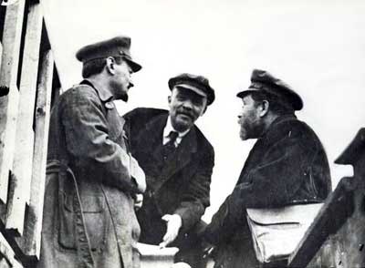
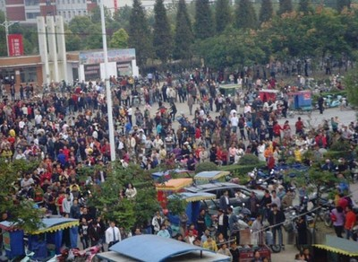

# 告不告别革命，可不是由知识分子说了算的

**“人们总有个误解，就是——‘把知识分子的情绪等同于社会情绪’。以为知识分子淡定了，社会就淡定了。但事实是——知识分子淡定了，社会就差不多到临界点了——因为知识分子都有为民请命的冲动，一旦他们不这样做了，就说明他们要么被收买要么被打压得太厉害，而这，正是社会溃败的标志。”**

# 告不告别革命，可不是由知识分子说了算的

## 文 / 刘宇翔 (上海财经大学)

 1917年1月，即震撼世界的大“雪崩”发生前不久，时年才46岁的列宁还不无悲凉地写道：我们这些“老人”“也许看不到”未来革命的时候了，但愿现在的“青年们”能够“幸运地”参加未来的革命吧！然而只过了40天，列宁便被意外的惊喜激动得不能自己：革命爆发了，而且转瞬间便胜利了。（本段节选自《农村公社、改革与革命》，P299） 

 那时候，列宁还身处在瑞士。 同样，中国的辛亥革命爆发时，孙中山也在国外，并且此前同样对革命前景忧心忡忡。 然而，历史给所有人开了个残酷的玩笑——虽然，残酷的是玩笑的后半段。 其实，此文早就想写了，2009年7月末的一个傍晚，我在北京万圣书园的一楼偶然间发现了《农村公社、改革与革命》一书，定价16.50元，却标价18块，去过万圣的人都知道一楼是卖打折书的，怎么会有书标价得比原价贵？更何况此书印刷粗陋纸资泛黄更盗版书没什么区别，还是1996年出版的，早该扔入废纸篓了。只是，当我翻了几页之后就确定——这是本极其牛逼的书，不买将会引憾终生。果然，买回来后，它就是我有生以来读得最认真的一本书，标满了记号写了不少批注，反反复复读了好几遍，并好几次有冲动为它写点什么，但就我个人而言，眼下，我似乎还缺少底气与功力，正好，今天你们又为革命争吵起来，就很应景儿地推荐这本书。 那本书的作者是：秦晖与金雁夫妇，你们懂的。 真不知道该怎么写下去了，我更愿意和你们喝喝茶放松放松面对面地扯淡，而不愿意撰文，但要我亮出立场的话，我还是说实话吧——我不喜欢“革命”这东西，如果可以，变革或改良才是我希望看到的，我不希望在有生之年看到大动荡，因为我深知在这个国家，打开潘多拉之盒就没什么好结果。 你可以说因为我是个小官僚资产阶级出身的，还是个小衙内，怕群众清算我的家产。无所谓。起码哥现在是彻底的无产阶级，还当过工人。 关于革命这东西，论述它的著作汗牛充栋，要真写严谨的文章，参考文献怎么着也得有汉娜阿伦特啊，秦晖啊，裴宜理啊，查尔斯蒂利啊，林茨啊，韦伯啊，马克思啊，普罗马诺夫啊，等等等。但今天哥不打算装逼，纯粹是推荐一本书，认真看完了你们就知道哥想说什么了。 只是，有一点要清楚的是——有些东西，不是我们不想要就不会来的，越是怕就越可能发生。知识分子可以“告别革命”不做煽动者，但一定要站对队伍，要扛住社会良知、正义的底线，不能对国民的苦难视而不见听而不闻一门心思在书斋里撰文反对革命，否则民间的悲情与愤怒就得不到理性的约束一遇到星火就燎原，到那时，想控制就控制不住了。 比如，瓮安事件，是知识分子煽动的嘛？不是，是草根精英们不满地方政府通过社会网络逐步升级的，还有石首事件也是。这些事件都充分表明民间的不满情绪正越来越浓厚，虽然可能是局部的，但谁能知道就不会扩散呢？这些事件后，网络舆论都大部分支持“反抗者”却没有人像韩书瑞等人一样理性分析社会网络与群体事件的关系，全都是宏大叙事，这很危险。 

 不知道各位觉察到没有——这些年有些知识分子喊话喊错了对象——“告别革命，要变革和改良”，不应该是像老百姓们喊的，大家无权无兵没什么大能耐是属于被压榨的对象，你冲着他们喊干嘛？要喊就要冲着朝廷喊——要他们清醒点，水能载舟亦能覆舟要善待老百姓，抓住还能改良和变革的机会，顺应浩浩时代浪潮不要倒行逆施，否则就一切都完蛋了。 可以说，只要朝廷做得好，那就没有倾覆的那天，但要是朝廷为非作歹，那么，就是所有知识分子都“告别革命”也无济于事，甚至，到时候，革命群众就要清算这些朝廷的喉舌与爪牙了——君不见，现在网络上把专家称为“砖家”，把茅于轼张维迎等等改革的智囊都大骂其18代祖宗了嘛？更可怕的是——我们要改革要尊重合法的私有产权，这一点也没错，可问题是中国庞大的“国有资产”呢？中国辽阔的耕地山林呢？眼下朝廷一边打着“国有资产增值“的旗号肆意地滥用垄断的手段从民间榨取财富，另一边朝廷官员们滥用不受约束的权力化公为私，国有资产、土地的改革势在必行，可这不公平的分家你让老百姓们情何以堪？很多人早就不分清分皂白一竿子打死所有人反对一切的国企改革了——正如斯托雷平改革时一样，不公平不正义的分家，不但让原本呼唤改革的知识分子成了老百姓眼中的”走狗帮凶“还使得老百姓们藐视一切的私有产权。改革进入深水区，一定要以斯托雷平改革的失败为前车之鉴啊。 同志们啊，这是可怕的信号啊，你们还不清醒嘛？中国知识分子难做人，一边要呼唤改革呼唤制约权力，另一边又要警惕民粹主义，两边都不讨好，会不会有一天被视作“蝙蝠”呢？ 正如俄国以斯托雷平改革为界限，知识界迅雷不及掩耳之势打蒙了——要改革是嘛？我朝廷的改革真他妈的“彻底”，要保守是嘛，我朝廷把一切权力都收归国家了。原本呼唤的改革的，在失去“公社土地”的农民眼里就成了可恶的爪牙；原来要求要求走斯拉夫路线的成了沙皇的“黑帮”。正如秦晖在P304里写的“知识分子的形象也由公道与正义的化身逐渐变成了与老爷类似的人”，于是，一场比激进的比赛开始了——知识分子是淡定是找不到方向了，要么流亡国外更激进，要么投靠沙皇，要么躲进书斋玩神学与斯拉夫传统文化了，要么闭嘴了，可民间却越来越激进——没人再听知识分子扯淡了，人家磨刀霍霍向猪羊准备自己干了。 人们总有个误解，就是——“把知识分子的情绪等同于社会情绪”。以为知识分子淡定了，社会就淡定了。但事实是——知识分子淡定了，社会就差不多到临界点了——因为知识分子都有为民请命的冲动，一旦他们不这样做了，就说明他们要么被收买要么被打压得太厉害，而这，正是社会溃败的标志。万马齐喑的社会是最可怕的——在正常的社会里，知识分子就是社会的温度计，不要以为打碎了社会的温度计就降低了温度，也不要以为温度计坏了失灵了就降低了温度——可怕的是，温度计失灵了测不准了，人们就意味降温了，殊不知，火都烧到了眉毛了。 我知道，时局败坏，要知识分子深入社会，参与事件，成为理性的谏言者，沟通朝廷与民间的中间人，善意地平息过激行为等等，眼下，都是不可能的了。人家连“谈做人”都容忍不了，更不用说那些看上去要搞“群众运动”实则努力控制局势不过激的人了——朝廷可不愿意出一个一呼百应的有社会影响力的“良心”，穷凶极恶的，它不怕，怕的就是有感召力有良知有行动有影响力的人——而一个社会连这样的人都没有，那么就等着地狱的怒火不受控制烧毁一切吧。 不要天真地以为经济发展能解决一切问题——斯托雷平改革就是前车之鉴；亨廷顿的书就是反例；东南亚拉美各国就是活生生的例子。要真正告别革命就勇于担当，就需要一批批人出于自己的良知勇气甘愿默默无名被囚禁在大牢甘愿受尽妻离子散家破人亡甘愿就算是误解被大骂也要深入社会做真正实事的人，而不是躲入书斋放冷箭更不是煽动者，这样的人要有殉道者般虔诚的精神，就如同至今还在大牢里的那几个人——你们懂的。 眼下，时局还算太平，但未雨绸缪该怎么做的，你们自己想想，口舌之争没什么意思。我不知道你们明不明白我的意思，或许我表达不清晰，但该说的我都说了，我接着玩我的神学去。
