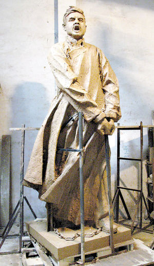
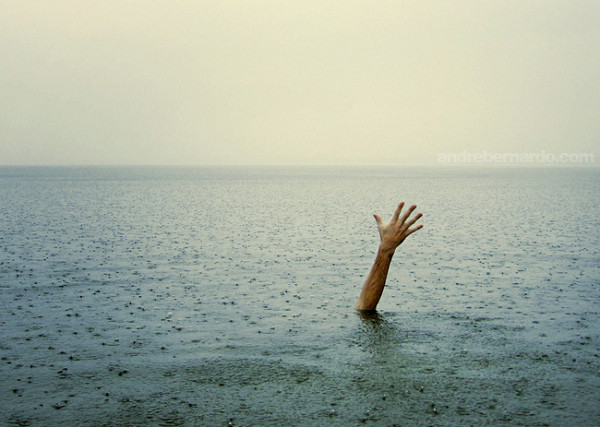

# 对不起，本姑娘真的怕死

**“生命结束就是空，‘生命轮回说’那套小孩子的把戏已经无用，‘永垂不朽’是意淫过度的冠冕堂皇，‘党会记住您，人民会记住您，少先队员会记住您’有个妹用，无论你是共产主义战士、自由主义死忠还是打酱油的无党派人士，至此为止你的生命就要终结了，化成一把灰被扬在已经被污染的空气中，或者扬在波涛汹涌的海水里污染别人。”**

** **

** **

** **

** **

# 对不起，本姑娘真的怕死

## 文/王丹妹（复旦大学）  
  

  
小时候，有人为我们准备了各种各样关于牺牲的故事。

黄继光、邱少云、江姐、董存瑞、刘胡兰、杨开慧……怎么就一个一个，全都壮烈牺牲了？

就连小姑娘们最爱玩的跳橡皮筋游戏也要配上爱国抗日小英雄《王二小》这样的儿歌。我最近经常回味这个淹没在记忆中的场景：我一边全神贯注地跳着橡皮筋，一边跟旁边的小姑娘们念经似的地唱着“敌人把二小挑在枪尖，摔死在大石头的旁边”，这是一种怎样的风景？

那些故事不仅要辅以刻画牺牲者大义凛然的表情和施刑者猥琐邪恶的姿态的图片，还经常对死亡和刑罚的残酷加以描述。我至今仍然记得江姐手指插竹签事件。那段看似简单的文字描写给我幼小的心灵留下了无限阴影，从那时起我开始拥有一种超群的“通感”能力。任何关于残害肢体的暴力行为的描述和再现，我都仿佛能够真真切切地感觉到那伤害正施加在我的身上。我会浑身冷汗，严重的时候曾经发抖不止。

那时我还经常被各种各样关于日本鬼子的噩梦纠缠。我经常梦到日本鬼子再次入侵东三省，战火连天，硝烟弥漫，周围是南京大屠杀般的场景。我很多次梦到我被机枪扫射，刺刀贯穿。

很多次我从梦里惊醒，沉浸在对被杀的恐惧之中。后来，大概在8岁的时候，我开始在噩梦惊醒时睁着眼睛对着天花板思考关于死亡的问题。

死亡，真是一件可怕的事情。

死亡意味着再也不能见到家人朋友，再也不能吃到好吃的零食，再也不能看《足球小将》和《灌篮高手》，再也不能见到喜欢的男生……

而更可怕的是，我感到一种非常深刻而凛冽的虚空感。那时的我完全不能够解释和把握这种感觉，只是隐约地意识到，生命的消逝是一件无比可怕的事情，它可以吞噬所有美好的事物，也让曾经存在的一切化为乌有，不留痕迹。而对于一个孩子，拥有意味着存在，自己在别人生命中的印记就是存在的意义。  
但是，我不敢告诉任何人，我害怕死亡。因为我害怕在日本鬼子手下“被牺牲”，害怕被插竹签，害怕坐老虎板凳，害怕变成小萝卜头，所以经常做这样的噩梦。  
后来，我找到了一个安慰自己灵魂的说辞：此生之后是来生。人在死亡之后是有轮回的，或者在死亡之后还有灵魂这种东西存在，它超脱你的肉体让你能够继续观察这个世界，虽然不能够对这个世界产生任何作用和影响，但是你还是以“某种”形式存在着。王菲唱得好：每个人皈依自己的宗教。就这样，我莫名其妙地进入宗教的领地。

因为那时的我，还完全没有能够理解生命意义的智慧，和直面孤独与死亡的勇气。

在我的心里，什么是孤独？

高中的时候，我记得是一个例行的升旗仪式上，不知为何身边的同学开始讨论大陆与台湾的问题。导火线大概是，有一位高年级的学长在自己的校服后面写下了“还我宝岛台湾”几个铿锵有力的大字。周围的同学在国歌声响起之前纷纷开始表明决心，我当时不知深浅故作深沉地讲了一句：“我觉得，这是一个挺复杂的问题……”立刻被一位女同学用正义的眼神“秒杀”了。她大声说：“一个不爱国的人，我不能和她做朋友！”

我当时甚为惊恐，因为这位女同学是掌握班级生杀大权的班干部，她觉得我不爱国所以不能和我做朋友，我不就是“汉奸”一般的存在？

虽然我一直对此事耿耿于怀，但是这位女同学之后也没有对我采取什么实际行动，态度上也没有太大的变化。我想，她大概早把我这“狼心狗肺”的言论给忘记了吧。毕竟，她还有大好前程需要赶赴。

几年过去，西藏314事件发生以后，我和一个常年未见的长辈一起吃饭。席间二人默默无语，于是他便问我是否知道这个事件，我点头。那时我正在补课读王力雄，心里千头万绪。他突然问我如何看待这个事件，我又特没记性地拽出那句“首先，我觉得这个问题很复杂……”他似乎没太多耐心听我的纠结犹豫，急着要我表态：“你支持藏独吗？”我立刻被这个“帽子”吓了一跳，也被他这种简单粗暴的讨论问题方式深深震惊了。

虽然我没经历过三十年前的岁月，但是我总是隐隐觉得那时候人们就喜欢用这样的问题来判断一个人。表态，站队。就是这种剽悍的价值观和方法论，让许多高贵的头颅再也没能抬起，让许多家庭永远失去了信任就此破碎，怎家破人亡四个字能够形容？

然而在我们的历史教科书上，还有一段类似这样的文字：拨乱反正后，人们心情愉悦地走回工作岗位……

我每每阅读到这里，总是对着“心情愉悦”四个字久久发呆。那时心头有万般柔情，用“终究悲哀的2010语”概括就是：MLGB，愉悦你妹！

终于有一天，我鼓起勇气对一个人说：“我怕死，更怕疼痛和凌辱。如果那些酷刑施加在我身上，我要么咬舌自尽，否则难保不会把秘密和盘托出。”所以你看，我在这里还是有些不诚实，究竟在那种情况下我是否有勇气选择死亡，还完全是个未知数，我却还要装出一副可能大概也许maybe的姿态，来表明概率显示我也有舍生取义的基因，隐藏在茫茫而未知的人性中。毕竟，孟子是考试必背，也是作文必备。

后来，我和几个人提到这个想法，纷纷得到类似的回应。

在这个隐秘的心事纠缠了我十几年后，我终于能够站在阳光下无畏地审视自己的这个想法。

趋利避害，是人的本性。人们对死亡、酷刑、疼痛、孤独、丧失尊严的恐惧是与生俱来的，是再正常不过的。即使有一个巨大的国家机器，通过各种教科书、课外读物、影视作品、音乐歌曲来渲染慷慨就义的光荣与高尚，也无法将这些“软弱”和“自私”的本性，从人性中剔除。

我不需要别人向我灌输恐惧，让我因为捕风捉影的恐惧而错拿武器。

因为，牺牲与否永远是最个人最自由的选择，这是交付最宝贵生命的抉择，没人能用道德、正义、公共利益等任何道貌岸然的理由来强迫别人做出决定。因为，生命结束就是空，“生命轮回说”那套小孩子的把戏已经无用，“永垂不朽”是意淫过度的冠冕堂皇，“党会记住您，人民会记住您，少先队员会记住您”有个妹用，无论你是共产主义战士、自由主义死忠还是打酱油的无党派人士，至此为止你的生命就要终结了，化成一把灰被扬在已经被污染的空气中，或者扬在波涛汹涌的海水里污染别人。

如果未来的“房价”能够允许我在死后拥有一小块墓碑，我会在上面刻下：这是一个没有学会宽容的人。

对于我来说，宽容是这个世界上最美好的品质，而我将终我一生去努力追求永远不能到达的宽容彼岸。

因为我讨厌暴力和战争，我苦恼于自己对别人的不宽容，别人对世界的不宽容。

这个世界充满了纵容，却始终缺少宽容。

我害怕死亡，我热爱我独一无二的生命，不愿意将她交付于拙劣的洗脑，连绵的炮火，战争的仇恨，甚至病痛和意外。

然而在此之外，一定有我愿意为之牺牲最宝贵生命的存在。或许是爱，或许是自由。但是在这一切即将降临或已经来临的时候，任何人都别想用道貌岸然的“牺牲论”来左右我的决定。

因为，对不起，本姑娘真的很怕死。

** **
