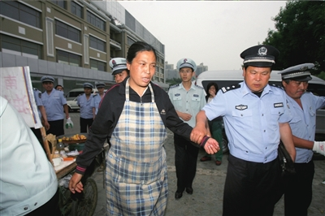
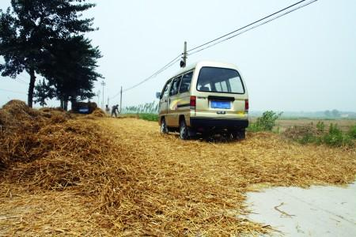
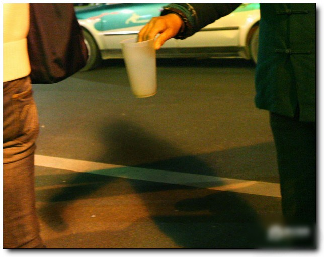

# 小人物

**他们管食品安全不积极，管环境污染不积极，榨取社会最底层的血汗，却不遗余力。他们与邻国处理领土纠纷时和和气气，拆人民的家园良田祖坟时就热火朝天，甚至推土机乃至枪杆子当道。**

** **

# 小人物

## 文/董云峰（《北斗》特约撰稿人）

 今天想说的是两个小人物，一对北漂夫妇，五道口小摊贩，我很早对你提过的。 我还没有从黄金周的疲惫中恢复过来，明日又得加晚班。此刻，并无灵感或头绪。尽管我在第一封引子中给自己留了后路——“尽可能”每日一封，我不想随便踏上这条后路。而且我相信，只会越写越开阔，越写越敏感，越写越心安。 所以啊，亲爱的小红宝，你就别纵容我啦，知道你疼我，这正是我坚持下去的理由。 回到主题。如果你在五道口上班，或是清晨从五道口易初莲花超市附近经过，你可能知道这对卖肉夹馍的夫妇。他们三十岁出头，男人长得像刀郎，比刀郎要帅，戴着和刀郎一样的帽子；妻子一看就是贤淑能干的传统女人。 从去年7月中旬到五道口上班至今，我十有八九带着他们的肉夹馍进入办公室。面饼、鸡蛋、牛肉加青菜，现做现卖，物美价廉，只售3元；更难得的是，他们是少见的让顾客自己找钱的小贩，几乎不碰纸币，我很快成为常客。 一年多来的每个清晨，在步入阴森的科技园之前，我总习惯去他们那里买肉夹馍，即便偶尔已经带了面包和牛奶。总能见着他们微笑，那种温暖、干练与清洁，与你在城市里遇到的绝大部分小贩都不一样。 只有一个时候除外——早8点左右，负责五道口城铁站和易初莲花一带“治安”的城管要上班了，每到这个时候，这对夫妇的神经就一下子绷紧起来，脸上的笑容变得僵硬，成为一种充满恐惧与无奈的苦笑。他们的三轮车停靠在公交站旁的路口，是五道口人流最集中的地方之一，因而生意很好。 所幸，从这个路口往西走一百多米，过马路就是科技园，属于另一票城管的领地。那边的城管一般9点上班，并且管理相对宽松。于是，8点左右的时候，一旦发现城管的身影，即使相隔数百米，这边的摊贩都会立即行动起来，到科技园那边避难，俨然是老鹰捉小鸡的游戏。 

 一旦被城管抓到，很可能是罚款数百上千元，或者三轮车被扣押，甚至连器具也会被没收。 在城管眼中，他们是非法摊贩。你可以变得合法，只要你愿意每月上交两三千块钱。交钱之后，城管同志会颁给你一面海报横幅，上面写着“北京早餐”、“营养早餐”或“放心早餐”等字样，还有一家企业的名字——“北京首钢饮食有限责任公司”。首钢饮食是首钢集团旗下企业，首钢集团隶属北京国资委，北京国资委是北京市政府直属正局级特设机构。 几个月前，这对以卖肉夹馍为生的夫妇一度选择“从良”，他们交了数千元钱，随后三轮车车身摆脱裸奔，贴上了“北京早餐”的海报。当我问起时，男人调侃地说：“经常躲躲藏藏的，心脏病都要吓出来了，干脆交了钱省事。”在那段时间里，赶着上8点班的我，再也看不到他们一面急着做馍、一面紧张放哨的辛酸场景。 然而，刚满一个月，他们恢复了“非法”的摊贩生涯。“一个月下来发现根本挣不了钱，没办法啊。”他们哀叹道。 如果不冒着“非法”的危险，你就无法赚钱，甚至难以糊口。实际上，根本就没有所谓的“合法”，只要你坚持向城管“进贡”，你就是合法商贩；一旦“断供”，你一夜之间就非法了。官逼民反。 他们管食品安全不积极，管环境污染不积极，榨取社会最底层的血汗，却不遗余力。他们与邻国处理领土纠纷时和和气气，拆人民的家园良田祖坟时就热火朝天，甚至推土机乃至枪杆子当道。 这对夫妇来自中原。他们有个可爱的女儿，在家乡读小学，暑假会来北京玩。今年春运，他们起大早排队买火车票，结果连硬座也没买着，于是只好开着自己的小面包车回家。来回耗了近两千元的费用，其中大部分是公路收费。 

 这个黄金周，这对夫妇仍然每天出现在这里，因为同样没放假的，还有易初莲花超市员工和附近写字楼的保安人员，他们也是常客。党媒不会报道这些坚守一线的劳动者。 据微博网友孙庆金介绍，孟加拉国经济学教授、穷人银行家尤努斯，为解决乞丐问题，向国内的乞丐发放无息贷款，每个乞丐都可以获得9美元的贷款，用以在街头摆小摊以解脱贫困。有6万多名乞丐获益，成为了有尊严的小业主。尤努斯说：对穷人的赠款是害了穷人，有偿才是真正帮助穷人。 这位朋友评价道，中国相逆而行，用城管逼迫有尊严的摊贩转型为潦倒的乞丐。 

 而我真正想说的是，如果不能相互同情，相互温暖，并努力抱团抗争，我们永远都是可怜的小人物，随时会被强权者及其喽罗碾死。 公民社会里没有小人物。 （作者按：此文乃给宝宝的1000封信之3） 
