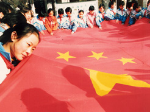

# 异域的祖国

**“身处西方的世界的非西方人，往往都还是会感受到或多或少的偏见，尤其当你的国籍是一个被大多数西方国家看不起，到哪里都需要签证的国家时，这种偏见往往就是一种蔑视和歧视，这样的例子太多太多不胜枚举。在面对一个强势群体时，大概没有多少人还会忍心去附和他们的话语权，我们也应该为弱势的一方争取些许尊严，哪怕微不足道，哪怕也产生不了多少意义，更何况，这是我们的祖国。”** ** ** ** **

# 异域的祖国

## 文/榕晨（rouen business school）

我们这一代的年轻人，在网络上经历过最多的一个公共议题大概就是有关国家主义争论。极端地说，就是所谓“脑残愤青”与“卖国贼”争锋。在海外的华人世界里，这种分野往往更加明显和极端，一个人在一个完全陌生的环境里才会更深刻地感受到自己的文化与国籍归属的意义，这种归属总会给你带来无尽的摩擦，然后逼着你在强化或者抛弃这种归属中做出选择。但是总体上来说，海外的华人往往都要比国内的民众对祖国怀有更强烈的情感，零八年的奥运圣火海外传递时的盛况便是一例。 在来法国不过三个多月的时间了，平平淡淡的日子并没有太大的波澜，但我已慢慢感受出自己对国家主义议题态度的转变。写几个小例子，不知道和我一样在外留学的朋友有无类似的经历和类似的感受。 有一次我在公共厨房做饭，一小群土耳其学生也进来做饭。我们聊着聊着其中一个土耳其的女生问起中国的经济状况如何。我本能反应地便从中国经济的高增速和已经成为世界第二大经济体谈起（这些话我当然不可能主动去炫耀，只有被问起才会说），没想到我刚把这两句说完一个土耳其人便开始说：“不过你们的产品质量太差了！每次都是一下子就坏。”无语以对，听到这句话我的第一反应是不爽，作为一个中国人我在想的是：我们的产品质量差让美国人法国人说说也就算了，你们土耳其的产品又能好到哪去？当然这种话我不会说出口，批评总是别人的资格并且往往都是有理有据，中国的产品或许确实不行。但是，那一句批评我一辈子都不会忘记，这是平生第一次在外国人面前感受到一丝丝屈辱，自己国家的产品被一个经济远不如自己的小国民众瞧不起，确实是一种屈辱，我并没有愤怒。 有一次我是在自己的宿舍里帮一个日本学生处理电脑问题，这位日本学生有着或许是日本民族典型的并不那么诚心诚意的礼貌和热情，从和他的多次交往中我也早感受的到他强烈的民族优越感以及对中国的些许成见。突然有人敲门，来的是我的法国朋友和卢旺达朋友，他们在得知那个日本学生的国籍之后仿佛就来了电，打听起有关日本各式各样问题，聊起京都，聊起丰田车（卢旺达的同学说他们国家的小车里丰田牌的占了大半），聊起《火影忍者》（这部日本动画在法国年轻人中的流行程度不亚于在中国），不断间夹着对日本的诸多的溢美之辞，是的，他们也曾在我面前赞美过中国，但从未如此恳切和具体。可以想象日本同学喜悦地满脸红光的场景以及我当时坐在一旁一语不发的心情，这样的比照委实让人难堪，更何况，是发生在与一个和中国素有芥蒂被诸多中国年轻人视若仇雠的国度。 日本和中国的国际形象不可同日而语，这也是众所皆知事实，我早也知道，但是这样的亲身经历，确实还是让人很不是滋味，我并不仇恨日本，但更不愿赞美这个国家。 某一次上课的时候，身边坐着一个中国女孩，因为那堂课的法国老师语速太快，她和我一样听的一头雾水。忽然她低下头半自言自语道：不行不行，我一定要好好努力了，我是一个中国人，不能丢人。那一刻，其实我感到无比震惊和诧异，都这个年代了，竟然还会有人以一个国家民族的荣誉感作为鞭策自己努力的动力。后来她给我讲了，说法国人老是觉得西藏不是中国的，还拿这个事儿开涮，让她觉得实在无法接受，她要为中国人争气。像她这样的女孩子，在国内可能从来不会参合任何有关西藏问题的讨论，也可能全然不知藏独的来龙去脉，但是一到了国外，当她突然发现一个陌生的族群总是在自觉或不自觉地贬低自己的祖国时，她一定会愈加坚定对自己国家的守护，在任何分歧上都天然地站到自己国家的立场之上。 

 对于我而言，情境也大抵类似，在国内我也没和别人少讲过为什么西藏要独立。来法国三个月多月时间，相反地，我已经不下四五次试图给西方人解释西藏为什么不应该独立（法国几乎所有人都认为西藏应该独立，只不过他们不会当着面把话讲的太赤裸）。当然我不会采用诸如“西藏自古以来就是中国的一部分”诸如此类让人反感的表述（西藏本来就非自古以来是中国的一部分），我大概讲的也是王力雄的那一套观点，西藏发展需要北京的支持之类。由于我的法语口语水平不行讲的不清不楚，法国人也不耐心听，我后来干脆用法语写了一篇思路比较清晰的关于西藏问题的长日志贴到FACEBOOK上，人气所限，也没有什么人看。但我确实无比地想扭转法国人对西藏问题的成见，北京在西藏并非只有镇压，西藏人并非都仇恨北京。 当然还有其他许多有关中国的问题，计划生育贫富差距人民币汇率，每每和法国人谈到，我也越来越站在中国的角度解释问题，为政府的策略开脱或者辩护。我常说的一句话是：这些问题我们也一直在试图解决，但是你知道，并不那么容易，这需要时间。 这些并非是护短更非粉饰，而更多是一种近似本能的反应，或者仅仅只是出于平衡舆论的本能。身处西方的世界的非西方人，往往都还是会感受到或多或少的偏见，尤其当你的国籍是一个被大多数西方国家看不起，到哪里都需要签证的国家时，这种偏见往往就是一种蔑视和歧视，这样的例子太多太多不胜枚举。在面对一个强势群体时，大概没有多少人还会忍心去附和他们的话语权，我们也应该为弱势的一方争取些许尊严，哪怕微不足道，哪怕也产生不了多少意义，更何况，这是我们的祖国。 大历史学家唐德刚先生给别人写的回忆录，也包括他晚年对自己人生的一些回忆文章在国内的知识界遭到不少微词，说这个美国籍的华人太大中华情节，对美国那一套吹毛求疵贬的很低，却闭口不谈国内的疾苦乱象。其实，如果你去看看唐德刚的人生履历，还是很容易理解出对他的那份大中华情节的甚至对此感同身受：二十二岁就漂洋过海扎根美利坚一呆就是六十一年，他在异乡的土地上见证过“美国移民官吏之横暴，白种流氓歧视华人之无理，以及华裔苦力猪狗不如之惨状”，也见证过改革开放之后中国的经济崛起和复兴，那些备受歧视的回忆和强国的梦想，历史的屈辱与光荣轮转，实在很难不在他老人家的内心里激荡出一股强烈的民族主义情节。时至今日，华人在欧美的生存状况大概要远远好于几十年前，但是白种人的偏见一直都没有消失过。所以我相信，或多或少，海外的华人身上多多少少都还是带有唐德刚的这种情节。 当然，中国人在要求别人的尊重时，自己也应该好好尊重自己的民族。否则，在外的华人作为一个整体，终究都是被看不起的，终究得不到别人真正的尊重。
