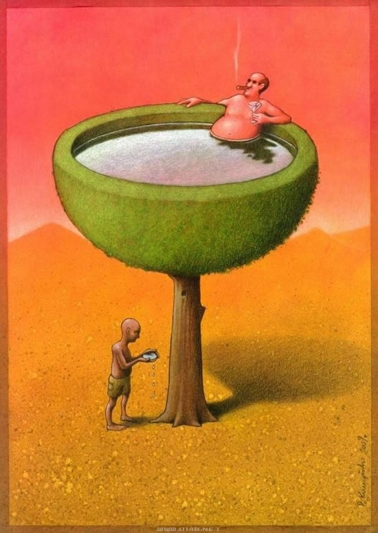
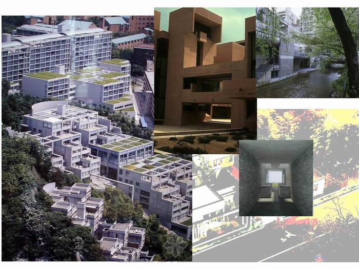

# 当低碳是一种流行，请远离伪环保

**我看见211或者985高校的工科男们为了某建筑大赛通宵达旦研究清水混泥土这种环保材料，忽然对这个非常“诗意”的词语心生佩服。在我这个没有受过工科教育的文科生看来，那不就是我家包工头叔公老早就在和谐农村使用的材料么，不过我们叫做土垒墙。** ibeidou.org ibeidou.org

# 当低碳是一种流行，请远离伪环保

ibeidou.org

## 文/ 林静（华侨大学）

ibeidou.org ibeidou.org 哥本哈根会议13天的谈判，换来没有法律和低碳效益的协议。却带来哥本哈根一路飘红的旅游业，还有流行起来的“低碳”“环保”“绿色”等相关口号。 神马是低碳生活？据说是就是“夏天关空调、冬天不供暖、坚决不开车、拒绝穿皮衣、少吃“减排”、热吻不超时、甚至还有不许放屁……”这个听起来真是又时尚又玄乎，不禁让人畅想到山顶洞人，人类所有的进化与科技都白忙活了，敢问你的心里有没有涌起一丝痛楚和伤感？ ibeidou.org

ibeidou.org 当“低碳”成为一种无比装逼的生活方式。我的身边有一位“小资小清新”看着其他人呼哧呼哧地在健身房跑步机上挥汗如雨的勤奋劲儿，认为他们在增加碳排放量，实在是罪过罪过。为了达到低碳目的，她每天都去城郊的公园跑步，只不过她是开车去的。不知道开车的碳排放量和跑步机的排放量是谁高谁低？ 如今“低碳”也可以成为一种行为艺术，某新闻报道深圳地铁一号线车厢内有13名美女大学生在众目睽睽之下，脱下衣裤，载歌载舞。据说这些美女大学生脱衣裤、秀美腿，旨在宣传“低碳”。而我发挥所有联想都难以将这些与低碳的真正意义联系起来。 当然低碳最给力的是不是这些。低碳就是一种营销口号，在这个高尚的外衣下，商品暴利已经绿色化了。君不见，家乐福沃尔玛的“有机”专用货架上的蔬菜水果的价格总是比其他货架上同类产品高出几倍的价格。君不见，L开头的奢侈品牌推出价格昂贵的环保包，可惜价格上我看不见任何节约的概念，除了望洋兴叹没有其他。还有爱马仕用并不环保的丝绸和小牛皮材料手工制作的环保包，售价8000元人民币。还有一个让中国的小清新们无比追捧的家居品牌宜家也学着的王婆卖瓜：“为了减少木材的使用和减轻产品的重量，并且通过纸的回收，起到环保的作用。使用蜂窝板技术，更经济更环保”。于是乎，使用“蜂窝板”这种成本低廉且容易被湿气腐蚀边烂材料的家具冠冕堂皇的标上了高价。 可惜如今我不能免俗，我以拎着一个价值昂贵的伪环保的环保袋外出买菜为荣，我也知道我已经远离了环保的初衷。但是我还想摇旗呐喊揭竿而起，逃离这个伪环保的世界。 我看见211或者985高校的工科男们为了某建筑大赛通宵达旦研究清水混泥土这种环保材料，忽然对这个非常“诗意”的词语心生佩服。在我这个没有受过工科教育的文科生看来，那不就是我家包工头叔公老早就在和谐农村使用的材料么，不过我们叫做土垒墙。我家的包工头叔公，不是建筑师叔公，他超前的在中国农村地区引领了低碳生活的时尚。看来我家包工头叔公是低碳生活的最佳模范啊。后来我了解了那位清水混泥土的倡导者，岛国那边的著名建筑师安藤忠雄，发现他和我的包工头叔公一样从未受过正规科班的建筑教育。也估计是这样一个没有接受一些装逼教材熏陶的建筑师，才更加朴质的贴近“低碳”这种朴质又高尚的生活观。他所倡导的建筑中的光和风，不就是中国看风水的地理老师们天天挂在嘴边的通风和采光么。我希望这个中国也可以出一些安藤忠雄，而不是天天被一些负有盛名的专家引领着伪环保的生活。 ibeidou.org

ibeidou.org 环保不是一两个人的事，真正改变地球的生态环境，要发动所有人的力量，亲力亲为。 用低碳的名义，作一场环保的秀绝对是一种伪环保。所以，从今天起，若想身体力行支持环保，请远离伪环保。 ibeidou.org ibeidou.org

（采编自北斗投稿邮箱 责编：陈轩）

ibeidou.org ibeidou.org
